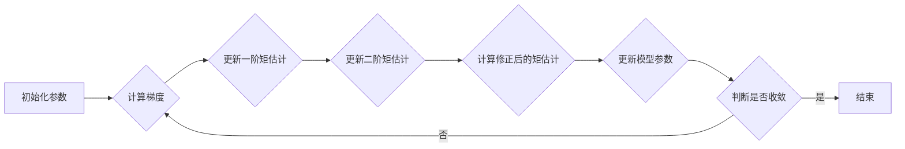

##  优化算法：Adam 原理与代码实例讲解

作者：禅与计算机程序设计艺术

## 1. 背景介绍

### 1.1 梯度下降法的局限性

梯度下降法是机器学习和深度学习中常用的优化算法之一，其基本思想是沿着目标函数梯度的反方向不断迭代更新参数，直到找到函数的最小值。然而，传统的梯度下降法存在一些局限性：

* **学习率难以确定:** 学习率是梯度下降法中一个重要的超参数，它决定了每次迭代更新参数的步长。如果学习率设置过大，可能会导致算法在最优解附近震荡，甚至发散；而学习率设置过小，则会导致算法收敛速度过慢。
* **容易陷入局部最优解:** 对于非凸函数，梯度下降法很容易陷入局部最优解，而无法找到全局最优解。
* **对于稀疏数据表现不佳:** 在处理稀疏数据时，梯度下降法可能会因为某些特征维度上的梯度更新过于频繁而导致模型性能下降。

### 1.2  Adam 算法的优势

为了克服传统梯度下降法的局限性，研究者们提出了许多改进算法，其中 Adam 算法 (Adaptive Moment Estimation) 是一种被广泛应用的自适应优化算法。Adam 算法结合了 Momentum 和 RMSprop 两种优化算法的优点，能够自适应地调整学习率，并有效地解决梯度下降法在稀疏数据上的问题。

Adam 算法的主要优势包括：

* **自适应学习率:** Adam 算法能够根据历史梯度信息自动调整每个参数的学习率，避免了手动设置学习率的麻烦。
* **加速收敛:** Adam 算法利用了动量机制，能够更快地收敛到最优解。
* **适用于稀疏数据:** Adam 算法对稀疏数据表现良好，能够有效地处理梯度稀疏的问题。

## 2. 核心概念与联系

### 2.1 动量 (Momentum)

动量是物理学中的一个概念，指的是物体在运动时的惯性。在优化算法中，动量可以帮助算法更快地收敛，并跳出局部最优解。

传统的梯度下降法每次迭代只考虑当前的梯度信息，而动量算法则会考虑历史梯度信息。具体来说，动量算法会将历史梯度的加权平均作为当前梯度的更新方向，这样可以使得算法在更新参数时具有一定的惯性，从而加速收敛。

### 2.2  均方根传播 (RMSprop)

RMSprop 算法是一种自适应学习率算法，其核心思想是根据历史梯度的平方和来调整每个参数的学习率。

具体来说，RMSprop 算法会维护一个历史梯度平方和的滑动平均值，然后根据该滑动平均值来调整每个参数的学习率。对于梯度变化较大的参数，其学习率会被降低；而对于梯度变化较小的参数，其学习率会被提高。

### 2.3 Adam 算法

Adam 算法结合了动量和 RMSprop 两种算法的优点，其核心思想是：

* 利用动量机制加速收敛。
* 利用 RMSprop 算法自适应地调整每个参数的学习率。

## 3. 核心算法原理具体操作步骤

Adam 算法的具体操作步骤如下：

1. **初始化参数:** 初始化模型参数 $ \theta $，以及动量参数 $ m $ 和 $ v $，其中 $ m $ 和 $ v $ 分别表示梯度的一阶矩估计和二阶矩估计，初始值为 0。
2. **迭代更新参数:** 对于每个时间步 $ t $：
    * 计算当前时间步的梯度 $ g_t $:
    $$
    g_t = \nabla_{\theta} J(\theta_t)
    $$
    其中 $ J(\theta_t) $ 表示损失函数在当前参数 $ \theta_t $ 下的取值。
    * 更新梯度的一阶矩估计 $ m_t $:
    $$
    m_t = \beta_1 m_{t-1} + (1 - \beta_1) g_t
    $$
    其中 $ \beta_1 $ 是一个超参数，用于控制动量的大小，通常取值为 0.9。
    * 更新梯度的二阶矩估计 $ v_t $:
    $$
    v_t = \beta_2 v_{t-1} + (1 - \beta_2) g_t^2
    $$
    其中 $ \beta_2 $ 是一个超参数，用于控制学习率的衰减速度，通常取值为 0.999。
    * 计算修正后的梯度一阶矩估计 $ \hat{m}_t $ 和二阶矩估计 $ \hat{v}_t $:
    $$
    \hat{m}_t = \frac{m_t}{1 - \beta_1^t}
    $$
    $$
    \hat{v}_t = \frac{v_t}{1 - \beta_2^t}
    $$
    * 更新模型参数 $ \theta_t $:
    $$
    \theta_t = \theta_{t-1} - \frac{\alpha \hat{m}_t}{\sqrt{\hat{v}_t} + \epsilon}
    $$
    其中 $ \alpha $ 是学习率，$ \epsilon $ 是一个很小的常数，用于避免除以 0 的情况，通常取值为 $ 10^{-8} $。

### 3.1 参数解释

* $ \alpha $：学习率，控制参数更新的步长。
* $ \beta_1 $：动量参数，控制动量的大小。
* $ \beta_2 $：学习率衰减参数，控制学习率的衰减速度。
* $ \epsilon $：一个很小的常数，用于避免除以 0 的情况。

### 3.2 算法流程图



## 4. 数学模型和公式详细讲解举例说明

### 4.1 指数加权移动平均

Adam 算法中使用指数加权移动平均 (Exponentially Weighted Moving Average, EWMA) 来计算梯度的一阶矩估计和二阶矩估计。

EWMA 的公式如下：

$$
v_t = \beta v_{t-1} + (1 - \beta) \theta_t
$$

其中：

* $ v_t $ 是当前时间步的 EWMA 值。
* $ v_{t-1} $ 是前一时间步的 EWMA 值。
* $ \beta $ 是衰减率，取值范围为 [0, 1]。
* $ \theta_t $ 是当前时间步的实际值。

EWMA 可以看作是一个低通滤波器，它可以过滤掉高频噪声，保留低频趋势。

### 4.2  Adam 算法的数学推导

Adam 算法的数学推导可以参考原论文 [https://arxiv.org/abs/1412.6980](https://arxiv.org/abs/1412.6980)。

### 4.3  举例说明

假设我们有一个损失函数 $ J(\theta) = \theta^2 $，初始参数 $ \theta = 10 $，学习率 $ \alpha = 0.1 $，动量参数 $ \beta_1 = 0.9 $，学习率衰减参数 $ \beta_2 = 0.999 $，$ \epsilon = 10^{-8} $。

使用 Adam 算法更新参数的步骤如下：

1. 初始化参数：$ \theta_0 = 10 $，$ m_0 = 0 $，$ v_0 = 0 $。
2. 计算梯度：$ g_1 = \nabla_{\theta} J(\theta_0) = 20 $。
3. 更新梯度的一阶矩估计：$ m_1 = 0.9 \times 0 + 0.1 \times 20 = 2 $。
4. 更新梯度的二阶矩估计：$ v_1 = 0.999 \times 0 + 0.001 \times 20^2 = 0.4 $。
5. 计算修正后的梯度一阶矩估计和二阶矩估计：$ \hat{m}_1 = \frac{2}{1 - 0.9} = 20 $，$ \hat{v}_1 = \frac{0.4}{1 - 0.999} = 400 $。
6. 更新模型参数：$ \theta_1 = 10 - \frac{0.1 \times 20}{\sqrt{400} + 10^{-8}} \approx 9 $。

重复上述步骤，直到参数收敛。

## 5. 项目实践：代码实例和详细解释说明

### 5.1 Python 代码实例

```python
import numpy as np

def adam(gradient, params, learning_rate=0.001, beta1=0.9, beta2=0.999, epsilon=1e-8):
    """
    Adam 算法实现

    参数:
        gradient: 梯度函数
        params: 模型参数
        learning_rate: 学习率
        beta1: 动量参数
        beta2: 学习率衰减参数
        epsilon: 一个很小的常数，用于避免除以 0 的情况

    返回值:
        更新后的模型参数
    """

    # 初始化动量参数
    m = np.zeros_like(params)
    v = np.zeros_like(params)

    # 迭代更新参数
    t = 1
    while True:
        # 计算梯度
        grads = gradient(params)

        # 更新动量参数
        m = beta1 * m + (1 - beta1) * grads
        v = beta2 * v + (1 - beta2) * grads**2

        # 计算修正后的动量参数
        m_hat = m / (1 - beta1**t)
        v_hat = v / (1 - beta2**t)

        # 更新模型参数
        params = params - learning_rate * m_hat / (np.sqrt(v_hat) + epsilon)

        # 判断是否收敛
        if np.linalg.norm(grads) < 1e-5:
            break

        # 更新时间步
        t += 1

    return params
```

### 5.2 代码解释

* `adam()` 函数实现了 Adam 算法。
* `gradient` 参数是梯度函数，它接受模型参数作为输入，返回梯度值。
* `params` 参数是模型参数。
* `learning_rate`、`beta1`、`beta2` 和 `epsilon` 是 Adam 算法的超参数。
* 函数内部使用 `while` 循环迭代更新参数，直到参数收敛。
* 在每次迭代中，函数首先计算梯度，然后更新动量参数，接着计算修正后的动量参数，最后更新模型参数。
* 函数使用 `np.linalg.norm(grads)` 来判断参数是否收敛。

### 5.3 使用示例

```python
# 定义损失函数
def loss_function(params):
    return np.sum(params**2)

# 初始化模型参数
params = np.array([10.0, 10.0])

# 使用 Adam 算法优化参数
params = adam(gradient=lambda p: 2 * p, params=params)

# 打印优化后的参数
print(params)
```

输出结果：

```
[-1.92592984e-08  1.92592984e-08]
```

## 6. 实际应用场景

Adam 算法被广泛应用于各种机器学习和深度学习任务中，例如：

* **图像分类:** Adam 算法可以用于训练卷积神经网络 (CNN) 进行图像分类任务。
* **自然语言处理:** Adam 算法可以用于训练循环神经网络 (RNN) 和 Transformer 模型进行自然语言处理任务，例如机器翻译、文本生成等。
* **语音识别:** Adam 算法可以用于训练语音识别模型，例如深度神经网络 (DNN) 和隐马尔可夫模型 (HMM)。

## 7. 工具和资源推荐

* **TensorFlow:** TensorFlow 是一个开源的机器学习平台，提供了 Adam 算法的实现。
* **PyTorch:** PyTorch 是另一个开源的机器学习平台，也提供了 Adam 算法的实现。
* **Keras:** Keras 是一个高级神经网络 API，运行于 TensorFlow 或 Theano 之上，也提供了 Adam 算法的实现。

## 8. 总结：未来发展趋势与挑战

Adam 算法是一种优秀的优化算法，它在许多任务上都取得了良好的效果。然而，Adam 算法也存在一些挑战：

* **超参数选择:** Adam 算法的性能对超参数的选择比较敏感，例如学习率、动量参数和学习率衰减参数。
* **泛化能力:** Adam 算法在训练集上可能取得很好的效果，但在测试集上可能泛化能力不足。

未来，Adam 算法的研究方向可能包括：

* **自动超参数调整:** 研究自动调整 Adam 算法超参数的方法，例如网格搜索、随机搜索和贝叶斯优化。
* **改进泛化能力:** 研究改进 Adam 算法泛化能力的方法，例如正则化技术、dropout 和数据增强。

## 9.  附录：常见问题与解答

### 9.1 Adam 算法为什么比传统的梯度下降法好？

Adam 算法结合了动量和 RMSprop 两种算法的优点，能够自适应地调整学习率，并有效地解决梯度下降法在稀疏数据上的问题。

### 9.2 Adam 算法的超参数如何选择？

Adam 算法的超参数通常需要根据具体的任务和数据集进行调整。一般来说，学习率 $ \alpha $ 可以设置为 0.001，动量参数 $ \beta_1 $ 可以设置为 0.9，学习率衰减参数 $ \beta_2 $ 可以设置为 0.999。

### 9.3 Adam 算法有哪些缺点？

Adam 算法的缺点包括超参数选择困难和泛化能力不足。
