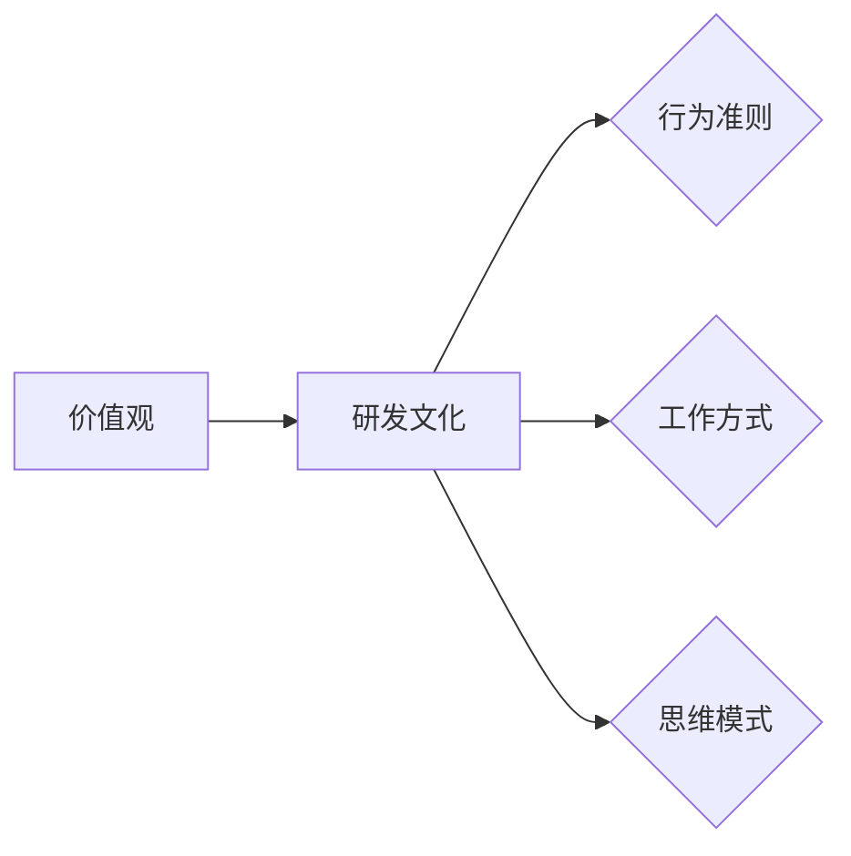

# 团队研发文化和价值观建设与传承

作者：禅与计算机程序设计艺术

## 1. 背景介绍

### 1.1 软件研发团队的现状与挑战

在当今信息化时代，软件研发已经成为推动社会发展的重要力量。软件研发团队作为软件开发的主体，其研发效率和产品质量直接影响着企业的核心竞争力。然而，随着软件规模的不断扩大、技术复杂度的提升以及市场竞争的加剧，软件研发团队正面临着前所未有的挑战：

* **团队协作难度加大:** 随着团队规模的扩大，成员之间的沟通成本、协作效率以及知识共享等方面都面临着更大的挑战。
* **技术更新迭代迅速:** 新技术、新工具、新平台层出不穷，团队需要不断学习和适应，才能保持技术领先优势。
* **市场需求变化莫测:** 软件产品需要快速响应市场需求变化，团队需要具备敏捷开发、快速迭代的能力。
* **人才竞争日益激烈:** 优秀软件人才成为企业争夺的焦点，如何吸引、培养和留住人才是团队建设的关键。

### 1.2 研发文化和价值观的重要性

面对上述挑战，仅仅依靠传统的管理手段和技术手段已经难以满足要求。构建优秀的研发文化和价值观，已经成为软件研发团队提升自身竞争力的重要途径。优秀的研发文化和价值观能够：

* **增强团队凝聚力:** 共同的价值观和目标能够将团队成员团结在一起，形成强大的向心力和战斗力。
* **提高团队效率:** 良好的沟通机制、协作方式以及知识共享平台能够有效提升团队的研发效率。
* **促进技术创新:** 开放、包容、鼓励创新的文化氛围能够激发团队成员的创造力和积极性。
* **吸引和留住人才:** 优秀的研发文化和价值观是吸引和留住优秀人才的重要因素。

## 2. 核心概念与联系

### 2.1 研发文化的定义与内涵

研发文化是指在软件研发过程中形成的，并为团队成员所认同和遵守的价值观念、行为准则、工作方式和思维模式的总和。它涵盖了团队的方方面面，包括但不限于：

* **价值观:** 团队成员共同认可和追求的价值理念，例如：客户第一、质量至上、团队合作、拥抱变化等。
* **行为准则:** 团队成员在工作中需要遵守的行为规范，例如：代码规范、沟通规范、会议规范等。
* **工作方式:** 团队成员之间进行协作和沟通的方式，例如：敏捷开发、代码评审、持续集成等。
* **思维模式:** 团队成员在解决问题、进行决策时所采用的思维方式，例如：批判性思维、系统性思维、设计思维等。

### 2.2 价值观的定义与作用

价值观是个人或组织认为重要的，并用来指导行为和决策的信念和原则。在软件研发团队中，价值观的作用主要体现在以下几个方面：

* **指引方向:** 价值观是团队的灵魂和方向盘，它指引着团队成员朝着共同的目标前进。
* **凝聚力量:** 共同的价值观能够将团队成员团结在一起，形成强大的凝聚力和战斗力。
* **塑造行为:** 价值观是团队成员行为的准则，它引导着团队成员做出正确的选择和行为。
* **提升效率:** 符合团队价值观的做事方式能够提升团队的效率，减少内耗。

### 2.3 研发文化与价值观的关系

研发文化和价值观是相辅相成、密不可分的。价值观是研发文化的核心和灵魂，研发文化是价值观的具体体现和实践。二者的关系可以用下图表示：



## 3. 核心算法原理具体操作步骤

### 3.1 研发文化建设的步骤

构建优秀的研发文化是一个系统工程，需要经过长期的积累和沉淀。一般来说，研发文化建设可以分为以下几个步骤：

1. **现状调研与分析:** 通过问卷调查、访谈等方式，了解团队成员的价值观、行为习惯以及对现有研发文化的评价。
2. **价值观提炼与明确:**  根据调研结果，结合企业文化和行业特点，提炼出团队的核心价值观，并以简洁明了的语言进行阐述。
3. **文化落地与实践:** 将核心价值观融入到团队的日常工作中，制定相应的行为规范、工作流程以及激励机制，并通过各种形式进行宣传和推广。
4. **评估与改进:** 定期对研发文化建设的效果进行评估，并根据评估结果进行改进和完善。

### 3.2 价值观落地的具体方法

价值观落地是研发文化建设的关键环节。以下是一些常用的价值观落地方案：

* **融入制度流程:** 将核心价值观融入到团队的各项规章制度、工作流程以及绩效考核体系中，并严格执行。
* **强化日常行为:**  在日常工作中，通过各种形式强化团队成员对核心价值观的理解和践行，例如：晨会分享、案例分析、团队建设活动等。
* **树立榜样示范:**  树立一批践行核心价值观的优秀典型，并进行宣传和表彰，以点带面，形成良好的氛围。
* **营造文化氛围:**  通过办公环境布置、团队文化衫、内部刊物等方式，营造积极向上、充满活力的团队文化氛围。

### 3.3 传承与发展

研发文化建设是一个持续改进的过程，需要不断地传承和发展。以下是一些传承和发展研发文化的有效方法：

* **新员工 onboarding:**  在新员工入职培训中，将团队的研发文化和价值观作为重要内容进行讲解，帮助新员工快速融入团队。
* **知识沉淀与分享:**  鼓励团队成员将自己的经验教训、最佳实践以及技术洞察进行总结和分享，形成团队的知识库。
* **持续改进与创新:**  定期对研发文化建设的效果进行评估，并根据评估结果进行改进和完善，不断提升团队的研发效率和产品质量。


## 4. 数学模型和公式详细讲解举例说明

在研发文化建设中，可以使用一些数学模型和公式来辅助决策和评估。

### 4.1  团队健康度模型

团队健康度是指团队成员之间相互协作、共同努力、实现目标的能力。可以使用以下模型来评估团队的健康度：

```
团队健康度 = f(沟通效率, 协作能力, 目标一致性, 心理安全感)
```

其中：

* **沟通效率:** 指团队成员之间信息传递的效率和质量。
* **协作能力:** 指团队成员之间相互配合、共同完成任务的能力。
* **目标一致性:** 指团队成员对团队目标的理解和认同程度。
* **心理安全感:**  指团队成员能够自由地表达自己的想法和意见，而不用担心受到惩罚或报复。

### 4.2  价值观认同度模型

价值观认同度是指团队成员对团队核心价值观的理解和认同程度。可以使用以下模型来评估团队成员的价值观认同度：

```
价值观认同度 = Σ(个人价值观 * 权重) / n
```

其中：

* **个人价值观:** 指团队成员个人的价值观。
* **权重:** 指不同价值观的相对重要程度。
* **n:**  指团队成员的数量。


## 5. 项目实践：代码实例和详细解释说明

### 5.1  代码规范

代码规范是研发文化的重要组成部分，它可以提高代码的可读性、可维护性和可重用性。以下是一个 Python 代码规范的示例：

```python
# -*- coding: utf-8 -*-

"""
This module provides a function to calculate the sum of two numbers.
"""

def add(x, y):
    """
    Calculate the sum of two numbers.

    Args:
        x: The first number.
        y: The second number.

    Returns:
        The sum of x and y.
    """

    return x + y
```

### 5.2  代码评审

代码评审是指在代码合并到主分支之前，由其他团队成员对代码进行审查，以发现潜在的错误和缺陷，并提出改进建议。以下是一个代码评审的示例：

```
Reviewer: John Doe

Date: 2023-05-23

Overall Impression:

The code is well-written and easy to understand. However, there are a few minor issues that need to be addressed.

Specific Comments:

* Line 10: The variable name `result` is not descriptive. Consider using a more meaningful name, such as `sum_of_numbers`.
* Line 15: The function should have a docstring that describes what it does.
* Line 20: The code should be properly formatted according to the team's coding style guide.

Recommendations:

* Rename the variable `result` to `sum_of_numbers`.
* Add a docstring to the function.
* Format the code according to the team's coding style guide.
```


## 6. 工具和资源推荐

### 6.1  沟通工具

* **Slack:**  一款团队协作工具，提供实时消息、文件共享、语音和视频会议等功能。
* **Microsoft Teams:**  微软公司推出的一款团队协作工具，提供类似于 Slack 的功能。
* **Zoom:**  一款视频会议工具，提供高清视频、音频和屏幕共享功能。

### 6.2  项目管理工具

* **Jira:**  一款敏捷项目管理工具，提供问题跟踪、任务管理、进度跟踪等功能。
* **Trello:**  一款轻量级的项目管理工具，使用看板的方式来管理任务。
* **Asana:**  一款项目管理工具，提供任务管理、项目进度跟踪、团队协作等功能。

### 6.3  代码托管平台

* **GitHub:**  全球最大的代码托管平台，提供 Git 版本控制、代码仓库、问题跟踪等功能。
* **GitLab:**  一款开源的代码托管平台，提供类似于 GitHub 的功能。
* **Bitbucket:**  Atlassian 公司推出的一款代码托管平台，提供 Git 和 Mercurial 版本控制、代码仓库、问题跟踪等功能。

## 7. 总结：未来发展趋势与挑战

### 7.1  未来发展趋势

* **更加注重员工体验:** 随着 Z 世代员工的崛起，企业越来越注重员工体验，研发文化建设也需要更加人性化、个性化。
* **更加强调数据驱动:** 随着数据分析技术的不断发展，研发文化建设也需要更加数据驱动，通过数据来评估文化建设的效果，并进行改进。
* **更加注重跨部门协作:** 随着软件开发模式的不断演进，跨部门协作越来越重要，研发文化建设也需要更加注重跨部门沟通和协作。

### 7.2  面临的挑战

* **如何保持文化的活力:** 随着时间的推移，研发文化可能会逐渐僵化，如何保持文化的活力是一个挑战。
* **如何应对多元化的团队:** 随着团队规模的扩大和全球化的发展，团队成员的背景越来越多元化，如何构建包容性的研发文化是一个挑战。
* **如何量化评估文化建设的效果:** 研发文化建设的效果难以量化评估，如何找到有效的评估方法是一个挑战。

## 8. 附录：常见问题与解答

### 8.1  如何评估研发文化的成熟度？

可以使用一些成熟度模型来评估研发文化的成熟度，例如：

* **卡耐基梅隆大学软件工程研究所（SEI）的软件能力成熟度模型（CMM）**
* **敏捷联盟的敏捷成熟度模型（AMM）**

### 8.2  如何处理研发文化与企业文化之间的冲突？

研发文化应该是企业文化的一部分，但有时候两者之间可能会存在冲突。在处理这种冲突时，需要：

* **充分沟通，寻求共识:**  与企业文化负责人进行充分沟通，了解企业文化的核心理念和目标，并尝试找到研发文化与企业文化之间的共同点。
* **灵活变通，求同存异:**  在不违背企业文化核心原则的前提下，可以根据研发团队的特点进行适当的调整和变通。
* **循序渐进，逐步融合:**  不要试图一夜之间改变研发文化，而应该采取循序渐进的方式，逐步将研发文化融入到企业文化中。
