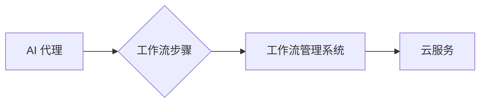

# 基于云服务的AI代理工作流部署策略

作者：禅与计算机程序设计艺术

## 1. 背景介绍

### 1.1 AI代理和工作流的兴起

近年来，人工智能（AI）取得了显著的进步，并在各个领域得到广泛应用。AI 代理作为能够感知环境、做出决策并采取行动的智能实体，正在改变着我们与技术互动的方式。同时，工作流作为一种将复杂任务分解成一系列步骤的有效方法，在自动化和优化业务流程方面发挥着至关重要的作用。

将 AI 代理集成到工作流中，为自动化、智能化和效率提升带来了前所未有的机遇。通过利用 AI 代理的认知能力，工作流可以变得更加灵活、自适应和智能，从而实现更有效的决策、更快的执行和更优化的结果。

### 1.2 云服务为AI代理工作流带来的机遇

云计算的出现为 AI 代理工作流的部署和管理提供了强大的基础设施和丰富的资源。云服务提供可扩展的计算能力、灵活的存储选项和广泛的 AI 服务，使得企业能够轻松构建、部署和扩展 AI 代理工作流，而无需承担高昂的硬件成本和维护负担。

### 1.3 本文目标

本文旨在探讨基于云服务的 AI 代理工作流部署策略，深入分析其核心概念、算法原理、实践方法和未来趋势，为企业和开发者提供全面的指导和参考。

## 2. 核心概念与联系

### 2.1 AI 代理

AI 代理是指能够感知环境、做出决策并采取行动的智能实体。它们通常包含以下关键组件：

* **感知组件:**  负责收集和解释来自环境的信息，例如传感器数据、用户输入或网络数据。
* **决策组件:**  根据感知到的信息和预定义的目标，选择最佳行动方案。
* **行动组件:**  执行决策组件选择的行动，例如发送指令、更新数据库或与其他代理交互。

### 2.2 工作流

工作流是指将复杂任务分解成一系列步骤的自动化流程。每个步骤都定义了特定的输入、输出和执行规则，并按顺序连接以完成整个任务。工作流管理系统（WfMS）用于定义、部署、监控和管理工作流实例。

### 2.3 云服务

云服务是指通过互联网按需提供计算资源（例如服务器、存储、数据库、网络、软件和分析）的模型。云服务提供商（CSP）负责管理底层基础设施，而用户只需为其使用的资源付费。

### 2.4 AI 代理工作流

AI 代理工作流是指将 AI 代理集成到工作流中，以增强其自动化、智能化和效率。在 AI 代理工作流中，AI 代理可以作为工作流步骤的执行者，也可以作为独立的实体与工作流交互，提供智能决策支持或自动化特定任务。

### 2.5 核心概念之间的联系

下图展示了 AI 代理、工作流和云服务之间的关系：

* AI 代理可以作为工作流步骤的执行者，通过调用云服务提供的 API