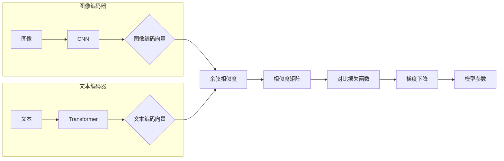
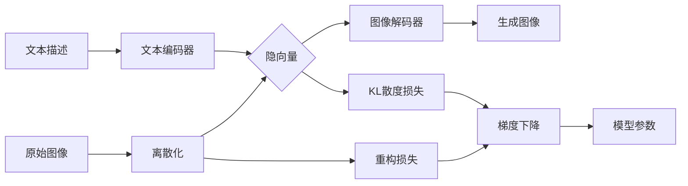

# 多模态大模型：技术原理与实战 多模态大模型的部署

作者：禅与计算机程序设计艺术

## 1. 背景介绍

### 1.1 从单模态到多模态：人工智能的新纪元

人工智能发展至今，经历了从符号推理到统计学习，再到深度学习的变革。早期的人工智能系统主要依赖于专家知识和规则，难以处理复杂多变的现实世界问题。而深度学习的出现，使得机器能够从海量数据中自动学习特征，并在图像识别、语音识别、自然语言处理等领域取得了突破性进展。

然而，传统的深度学习模型大多是单模态的，即只能处理一种类型的数据，例如图像或文本。这限制了人工智能系统对现实世界更全面、更深入的理解。现实世界的信息往往是多模态的，例如一张图片可以包含图像、文字、声音等多种信息。为了让人工智能更好地理解和处理现实世界的信息，多模态学习应运而生。

### 1.2 多模态学习：人工智能的下一个浪潮

多模态学习旨在通过整合多种模态的信息来提升人工智能系统的感知、理解和生成能力。近年来，随着深度学习技术的快速发展以及大数据的积累，多模态学习取得了显著的进步，并涌现出一系列具有代表性的多模态大模型，例如：

* **CLIP (Contrastive Language-Image Pre-training):** 由OpenAI提出，通过对比学习将图像和文本映射到同一语义空间，实现了图像和文本之间的跨模态检索和生成。
* **DALL-E (Discrete VAE with Learned Embeddings):** 同样由OpenAI提出，可以根据文本描述生成高质量的图像，展现了多模态模型强大的生成能力。
* **MUM (Multimodal Unified Model):** 由Google提出，可以理解和生成多种模态的信息，例如文本、图像、视频和音频，并在跨语言信息检索、问答系统等领域具有广泛的应用前景。

### 1.3 多模态大模型的应用：赋能各行各业

多模态大模型的出现，为人工智能应用开辟了更广阔的空间，其影响力将渗透到各行各业，例如：

* **电商:** 多模态推荐系统可以根据用户的浏览历史、搜索记录、图片偏好等多模态信息，为用户推荐更精准的商品。
* **医疗:** 多模态诊断系统可以结合患者的病历、影像学数据、基因信息等多模态信息，辅助医生进行更准确的诊断和治疗方案制定。
* **教育:** 多模态教育平台可以根据学生的学习风格、知识水平、情绪状态等多模态信息，提供个性化的学习内容和推荐。
* **娱乐:** 多模态游戏可以提供更沉浸式的游戏体验，例如根据玩家的表情、动作、语言等多模态信息，调整游戏难度和剧情发展。

## 2. 核心概念与联系

### 2.1 模态 (Modality)

模态是指信息的表示方式或形式。常见的信息模态包括：

* **文本 (Text):** 使用自然语言表达的信息，例如新闻报道、小说、评论等。
* **图像 (Image):** 使用像素矩阵表示的视觉信息，例如照片、绘画、图表等。
* **视频 (Video):** 由一系列图像帧组成的动态视觉信息，例如电影、电视剧、短视频等。
* **音频 (Audio):** 使用声波表示的听觉信息，例如音乐、语音、环境音等。
* **传感器数据 (Sensor Data):** 由各种传感器采集的物理世界信息，例如温度、湿度、位置、速度等。

### 2.2 多模态表示学习 (Multimodal Representation Learning)

多模态表示学习旨在将不同模态的信息映射到同一语义空间，使得不同模态的信息能够相互比较和融合。常用的多模态表示学习方法包括：

* **联合表示学习 (Joint Representation Learning):** 将不同模态的信息同时输入到一个模型中，学习一个能够表示所有模态信息的联合表示。
* **跨模态映射 (Cross-modal Mapping):** 学习一个从一种模态到另一种模态的映射函数，例如将图像映射到文本描述，或将文本描述映射到图像。
* **模态注意力机制 (Modality Attention Mechanism):** 根据任务需求，动态地关注不同模态的信息，例如在图像问答任务中，模型可以根据问题关注图像中的特定区域。

### 2.3 多模态融合 (Multimodal Fusion)

多模态融合是指将不同模态的表示信息整合到一起，以获得更全面、更准确的表示。常用的多模态融合方法包括：

* **早期融合 (Early Fusion):** 在特征提取阶段就将不同模态的信息融合在一起。
* **晚期融合 (Late Fusion):** 分别提取不同模态的特征，然后在决策阶段将特征融合在一起。
* **混合融合 (Hybrid Fusion):** 结合早期融合和晚期融合的优点，在不同阶段进行多层次的融合。

## 3. 核心算法原理具体操作步骤

### 3.1  CLIP (Contrastive Language-Image Pre-training)

#### 3.1.1 算法原理

CLIP的核心思想是利用对比学习，将图像和文本映射到同一语义空间。具体来说，CLIP使用两个编码器分别对图像和文本进行编码，然后通过对比损失函数，使得语义相似的图像和文本的编码向量距离更近，而语义不同的图像和文本的编码向量距离更远。

#### 3.1.2 操作步骤

1. **数据准备:** 收集大量的图像-文本对数据，作为训练数据。
2. **模型构建:** 构建两个编码器，分别用于编码图像和文本。图像编码器可以使用卷积神经网络 (CNN)，文本编码器可以使用 Transformer 网络。
3. **对比学习:** 将图像和文本分别输入到对应的编码器中，得到图像编码向量和文本编码向量。计算每个图像编码向量与所有文本编码向量之间的余弦相似度，得到一个相似度矩阵。
4. **损失函数:** 使用对比损失函数，使得相似度矩阵中对角线上的元素 (即语义相似的图像和文本的相似度) 更大，而其他元素 (即语义不同的图像和文本的相似度) 更小。
5. **模型训练:** 使用梯度下降法，最小化损失函数，训练模型参数。

#### 3.1.3  Mermaid 流程图



### 3.2 DALL-E (Discrete VAE with Learned Embeddings)

#### 3.2.1 算法原理

DALL-E是一种基于离散变分自编码器 (Discrete VAE) 的图像生成模型，它可以根据文本描述生成高质量的图像。DALL-E 使用一个文本编码器将文本描述编码成一个隐向量，然后使用一个图像解码器将隐向量解码成图像。

#### 3.2.2 操作步骤

1. **数据准备:** 收集大量的图像-文本对数据，作为训练数据。
2. **模型构建:** 构建一个文本编码器和一个图像解码器。文本编码器可以使用 Transformer 网络，图像解码器可以使用解码器网络，例如 PixelCNN。
3. **离散隐变量:** 将图像编码成一个离散的隐向量，可以使用 VQ-VAE (Vector Quantized Variational Autoencoder) 算法。
4. **损失函数:** 使用重构损失函数和 KL 散度损失函数，使得生成的图像与原始图像尽可能相似，并且隐变量的分布尽可能接近先验分布。
5. **模型训练:** 使用梯度下降法，最小化损失函数，训练模型参数。

#### 3.2.3 Mermaid 流程图



## 4. 数学模型和公式详细讲解举例说明

### 4.1 CLIP 的对比损失函数

CLIP 使用的对比损失函数如下：

$$
L = \sum_{(i,j)} [y_{ij} \cdot max(0, \tau - sim(z_i, w_j)) + (1-y_{ij}) \cdot max(0, sim(z_i, w_j) - \tau)]
$$

其中：

* $z_i$ 表示第 $i$ 个图像的编码向量。
* $w_j$ 表示第 $j$ 个文本的编码向量。
* $y_{ij}$ 表示第 $i$ 个图像和第 $j$ 个文本是否语义相似，如果相似则为 1，否则为 0。
* $sim(z_i, w_j)$ 表示 $z_i$ 和 $w_j$ 之间的余弦相似度。
* $\tau$ 是一个超参数，表示相似度的阈值。

该损失函数的目标是：

* 对于语义相似的图像和文本 ($y_{ij}=1$)，最小化它们的编码向量之间的距离，使得它们的相似度大于 $\tau$。
* 对于语义不同的图像和文本 ($y_{ij}=0$)，最大化它们的编码向量之间的距离，使得它们的相似度小于 $\tau$。

### 4.2 DALL-E 的重构损失函数

DALL-E 使用的重构损失函数如下：

$$
L_{rec} = ||x - \hat{x}||^2
$$

其中：

* $x$ 表示原始图像。
* $\hat{x}$ 表示生成的图像。

该损失函数的目标是最小化生成图像和原始图像之间的像素级别的差异。

### 4.3 DALL-E 的 KL 散度损失函数

DALL-E 使用的 KL 散度损失函数如下：

$$
L_{KL} = D_{KL}[q(z|x) || p(z)]
$$

其中：

* $q(z|x)$ 表示给定原始图像 $x$ 时，隐变量 $z$ 的后验分布。
* $p(z)$ 表示隐变量 $z$ 的先验分布。

该损失函数的目标是最小化后验分布和先验分布之间的 KL 散度，使得隐变量的分布尽可能接近先验分布。

## 5. 项目实践：代码实例和详细解释说明

### 5.1 使用 CLIP 进行图像检索

以下代码演示了如何使用 CLIP 进行图像检索：

```python
import torch
from PIL import Image
from transformers import CLIPProcessor, CLIPModel

# 加载 CLIP 模型和处理器
model_name = "openai/clip-vit-base-patch32"
processor = CLIPProcessor.from_pretrained(model_name)
model = CLIPModel.from_pretrained(model_name)

# 加载图像和文本
image = Image.open("image.jpg")
text = "一只可爱的猫咪"

# 预处理图像和文本
inputs = processor(text=[text], images=[image], return_tensors="pt")

# 获取图像和文本的编码向量
with torch.no_grad():
    outputs = model(**inputs)
image_embeds = outputs.image_embeds
text_embeds = outputs.text_embeds

# 计算图像和文本的相似度
similarity = image_embeds @ text_embeds.T

# 打印相似度
print(similarity)
```

### 5.2 使用 DALL-E 生成图像

以下代码演示了如何使用 DALL-E 生成图像：

```python
import torch
from transformers import DALL_E

# 加载 DALL-E 模型
model_name = "openai/dalle-2-base"
dalle = DALL_E.from_pretrained(model_name)

# 设置文本描述
text = "一只戴着帽子的猫咪，骑着一辆自行车"

# 生成图像
with torch.no_grad():
    images = dalle(text)

# 保存图像
images[0].save("generated_image.png")
```

## 6. 实际应用场景

### 6.1  电商领域的多模态商品推荐

传统的电商推荐系统通常只考虑用户的历史购买记录、浏览记录等信息，而忽略了商品的图片、描述等多模态信息。多模态商品推荐系统可以整合商品的多种模态信息，为用户提供更精准的推荐结果。

例如，可以使用 CLIP 模型将商品的图片和描述映射到同一语义空间，然后根据用户历史交互数据，学习用户对不同语义特征的偏好，从而推荐更符合用户需求的商品。

### 6.2 医疗领域的多模态疾病诊断

多模态疾病诊断系统可以整合患者的病历、影像学数据、基因信息等多种模态信息，辅助医生进行更准确的疾病诊断。

例如，可以使用多模态融合模型，将患者的病历信息、CT 影像、基因检测结果等信息融合在一起，预测患者患某种疾病的概率，辅助医生进行诊断。

## 7. 工具和资源推荐

### 7.1  Hugging Face Transformers 库

Hugging Face Transformers 库是一个开源的自然语言处理库，它提供了大量的预训练模型，包括 CLIP、DALL-E 等多模态模型。

**官方网站:** https://huggingface.co/transformers/

### 7.2  OpenAI API

OpenAI API 提供了对 DALL-E 等多模态模型的访问接口，用户可以通过 API 调用模型进行图像生成等任务。

**官方网站:** https://beta.openai.com/docs/api-reference

## 8. 总结：未来发展趋势与挑战

### 8.1 未来发展趋势

* **更大规模、更强的多模态模型:** 随着计算能力的提升和数据量的增加，未来将会出现更大规模、更强的多模态模型，能够处理更复杂的任务，并取得更好的性能。
* **多模态模型的轻量化和高效化:** 为了将多模态模型应用到更多的场景中，需要对模型进行轻量化和高效化研究，降低模型的计算复杂度和内存占用。
* **多模态模型的可解释性和可信性:** 为了让多模态模型的决策结果更加可靠，需要对模型的可解释性和可信性进行研究，解释模型的决策依据，并提高模型的鲁棒性。

### 8.2 面临挑战

* **多模态数据的高质量获取和标注:** 多模态模型的训练需要大量的多模态数据，而高质量的多模态数据的获取和标注仍然是一项挑战。
* **不同模态信息之间的语义鸿沟:** 不同模态信息之间存在语义鸿沟，如何有效地将不同模态信息映射到同一语义空间仍然是一个难题。
* **多模态模型的评价指标:** 目前还没有统一的多模态模型评价指标，如何评估多模态模型的性能仍然是一个开放性问题。

## 9. 附录：常见问题与解答

### 9.1 什么是多模态大模型？

多模态大模型是指能够处理和理解多种模态信息（例如文本、图像、视频、音频等）的人工智能模型。

### 9.2 多模态大模型有哪些应用场景？

多模态大模型的应用场景非常广泛，包括但不限于：

* 电商：多模态商品推荐
* 医疗：多模态疾病诊断
* 教育：个性化学习推荐
* 娱乐：沉浸式游戏体验
* 安全：多模态身份验证

### 9.3 如何构建多模态大模型？

构建多模态大模型需要以下步骤：

1. 数据准备：收集大量的多模态数据，并进行清洗和预处理。
2. 模型设计：设计多模态模型的架构，例如选择合适的编码器、解码器和融合模块。
3. 模型训练：使用大规模数据集对模型进行训练，并优化模型参数。
4. 模型评估：使用测试集评估模型的性能，并进行模型调优。

### 9.4 多模态大模型的发展趋势是什么？

多模态大模型的发展趋势包括：

* 更大规模、更强的多模态模型
* 多模态模型的轻量化和高效化
* 多模态模型的可解释性和可信性
