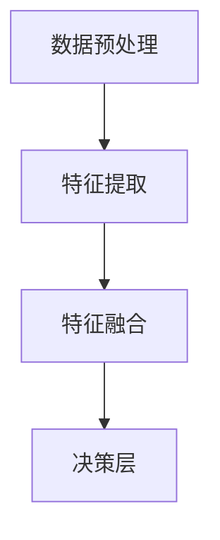

# 多模态大模型：技术原理与实战 方法论介绍

作者：禅与计算机程序设计艺术

## 1. 背景介绍

### 1.1 多模态大模型的兴起

随着人工智能技术的飞速发展，单一模态的模型已经无法满足复杂应用场景的需求。多模态大模型应运而生，通过整合不同类型的数据（如文本、图像、音频等），实现更加智能和全面的分析与决策能力。

### 1.2 什么是多模态大模型

多模态大模型（Multimodal Large Models）是指能够同时处理和理解多种类型数据的模型。这些模型通过融合不同模态的数据，提升了信息的全面性和准确性，广泛应用于自然语言处理、计算机视觉、语音识别等领域。

### 1.3 多模态大模型的重要性

多模态大模型的出现不仅提升了各个领域的技术水平，还推动了跨领域应用的发展。例如，在自动驾驶中，车辆需要同时处理视觉、雷达、激光雷达等多种传感器数据；在医疗诊断中，医生需要结合患者的病历、影像、基因等多方面信息进行综合判断。

## 2. 核心概念与联系

### 2.1 模态的定义与分类

模态（Modality）是指信息的表现形式，常见的模态包括文本、图像、音频、视频等。不同模态的数据具有不同的特征和处理方法。

### 2.2 多模态融合的基本方法

多模态融合是指将不同模态的数据进行整合，以获得更加全面的信息。常见的多模态融合方法包括：

- **早期融合（Early Fusion）**：在数据输入阶段进行融合，将不同模态的数据直接拼接在一起。
- **中期融合（Middle Fusion）**：在特征提取阶段进行融合，通过共享特征表示实现多模态数据的融合。
- **晚期融合（Late Fusion）**：在决策阶段进行融合，将不同模态的数据分别处理后再进行整合。

### 2.3 多模态大模型的架构

多模态大模型的架构通常包括以下几个部分：

- **数据预处理**：对不同模态的数据进行预处理，如文本的分词和编码，图像的归一化等。
- **特征提取**：使用深度学习模型提取不同模态的数据特征。
- **特征融合**：将不同模态的特征进行融合，生成统一的特征表示。
- **决策层**：根据融合后的特征进行分类、回归等任务。



## 3. 核心算法原理具体操作步骤

### 3.1 数据预处理

#### 3.1.1 文本数据预处理

文本数据的预处理通常包括分词、去停用词、词干提取、编码等步骤。例如，可以使用BERT等预训练模型对文本进行编码，生成上下文相关的词向量。

```python
from transformers import BertTokenizer, BertModel

tokenizer = BertTokenizer.from_pretrained('bert-base-uncased')
model = BertModel.from_pretrained('bert-base-uncased')

text = "This is an example sentence."
inputs = tokenizer(text, return_tensors='pt')
outputs = model(**inputs)
```

#### 3.1.2 图像数据预处理

图像数据的预处理通常包括归一化、尺寸调整、数据增强等步骤。例如，可以使用OpenCV或PIL库对图像进行处理。

```python
import cv2

image = cv2.imread('example.jpg')
image = cv2.resize(image, (224, 224))
image = image / 255.0
```

### 3.2 特征提取

#### 3.2.1 文本特征提取

文本特征提取可以使用预训练的语言模型，如BERT、GPT等。这些模型能够生成上下文相关的词向量，捕捉文本中的语义信息。

#### 3.2.2 图像特征提取

图像特征提取可以使用预训练的卷积神经网络（CNN），如ResNet、VGG等。这些模型能够提取图像中的高层次特征表示。

### 3.3 特征融合

特征融合是多模态大模型的核心步骤，常见的方法包括：

- **拼接融合**：将不同模态的特征向量直接拼接在一起。
- **加权融合**：对不同模态的特征向量进行加权平均。
- **注意力机制**：使用注意力机制对不同模态的特征进行加权，提升重要特征的权重。

### 3.4 决策层

决策层根据融合后的特征进行分类、回归等任务。常见的模型包括全连接神经网络、支持向量机、决策树等。

## 4. 数学模型和公式详细讲解举例说明

### 4.1 文本特征提取的数学模型

文本特征提取常用的模型是Transformer，Transformer的核心是自注意力机制（Self-Attention）。自注意力机制的计算公式如下：

$$
\text{Attention}(Q, K, V) = \text{softmax}\left(\frac{QK^T}{\sqrt{d_k}}\right)V
$$

其中，$Q$、$K$、$V$分别表示查询向量、键向量和值向量，$d_k$表示键向量的维度。

### 4.2 图像特征提取的数学模型

图像特征提取常用的模型是卷积神经网络（CNN），CNN的核心是卷积操作。卷积操作的计算公式如下：

$$
y[i, j] = \sum_{m}\sum_{n} x[i+m, j+n] \cdot w[m, n]
$$

其中，$x$表示输入图像，$w$表示卷积核，$y$表示输出特征图。

### 4.3 特征融合的数学模型

特征融合可以使用加权平均的方法，其计算公式如下：

$$
F = \alpha_1 F_1 + \alpha_2 F_2 + \cdots + \alpha_n F_n
$$

其中，$F_i$表示第$i$个模态的特征向量，$\alpha_i$表示对应的权重。

## 5. 项目实践：代码实例和详细解释说明

### 5.1 数据预处理

```python
import cv2
from transformers import BertTokenizer, BertModel

# 文本预处理
tokenizer = BertTokenizer.from_pretrained('bert-base-uncased')
text = "This is an example sentence."
inputs = tokenizer(text, return_tensors='pt')

# 图像预处理
image = cv2.imread('example.jpg')
image = cv2.resize(image, (224, 224))
image = image / 255.0
```

### 5.2 特征提取

```python
import torch
import torchvision.models as models

# 文本特征提取
model = BertModel.from_pretrained('bert-base-uncased')
text_features = model(**inputs).last_hidden_state

# 图像特征提取
resnet = models.resnet50(pretrained=True)
image = torch.tensor(image).unsqueeze(0).permute(0, 3, 1, 2).float()
image_features = resnet(image)
```

### 5.3 特征融合

```python
import torch.nn.functional as F

# 拼接融合
fused_features = torch.cat((text_features, image_features), dim=1)

# 加权融合
alpha = 0.5
fused_features = alpha * text_features + (1 - alpha) * image_features

# 注意力机制
attention_weights = F.softmax(fused_features, dim=1)
fused_features = attention_weights * fused_features
```

### 5.4 决策层

```python
import torch.nn as nn

class MultimodalClassifier(nn.Module):
    def __init__(self, input_dim, num_classes):
        super(MultimodalClassifier, self).__init__()
        self.fc = nn.Linear(input_dim, num_classes)

    def forward(self, x):
        return self.fc(x)

# 决策层
classifier = MultimodalClassifier(input_dim=fused_features.shape[1], num_classes=10)
output = classifier(fused_features)
```

## 6. 实际应用场景

### 6.1 自动驾驶

在自动驾驶中，车辆需要同时处理来自摄像头、雷达、激光雷达等多种传感器的数据。多模态大模型可以整合这些数据，提高环境感知和决策的准确性。

### 6.2 医疗诊断

在医疗诊断中，医生需要结合患者的病历、影像、基因等多方面信息进行综合判断。多模态大模型