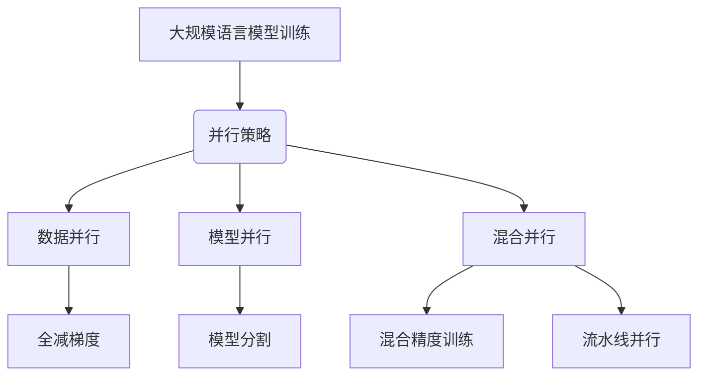

# 大规模语言模型从理论到实践：分布式训练的集群架构

## 1. 背景介绍

### 1.1 大规模语言模型的兴起

近年来,大规模语言模型(Large Language Models, LLMs)在自然语言处理(NLP)领域掀起了一场革命。这些庞大的神经网络模型通过在海量文本数据上进行预训练,展现出令人惊叹的语言理解和生成能力,在各种NLP任务中取得了突破性的进展。

GPT(Generative Pre-trained Transformer)、BERT(Bidirectional Encoder Representations from Transformers)、XLNet、T5等一系列里程碑式的语言模型不断刷新着参数规模的记录,最新的PaLM模型甚至达到了惊人的5400亿参数。这些模型不仅在学术界引起了广泛关注,同时也在工业界得到了广泛应用,为智能助手、机器翻译、内容生成等领域带来了革命性的变革。

### 1.2 训练挑战与分布式解决方案

然而,训练如此庞大的语言模型面临着巨大的计算挑战。单机训练资源有限,难以满足模型训练的海量计算需求。此外,训练数据集的规模也在不断扩大,单机存储和IO带宽往往无法支撑高效的数据读取。

为了解决这一难题,分布式训练架构应运而生。通过将模型分割到多个计算节点进行并行训练,可以极大提升计算能力和内存容量。同时,利用分布式存储和高速网络,可以实现高效的数据读取和模型同步,从而支撑大规模模型的高效训练。

本文将全面探讨大规模语言模型分布式训练的理论和实践,阐述其核心概念、算法原理、系统架构以及实际应用,为读者提供一个完整而深入的指引。

## 2. 核心概念与联系

在深入探讨分布式训练架构之前,我们需要先了解一些基础概念。

### 2.1 数据并行与模型并行

训练大规模神经网络模型时,常见的并行策略有两种:数据并行(Data Parallelism)和模型并行(Model Parallelism)。

**数据并行**是指在多个计算节点上复制完整模型,每个节点处理不同的数据子集进行并行训练。通过在各节点之间进行模型权重同步,最终汇总得到全局模型。数据并行的优势在于实现简单,可以线性扩展计算能力,但需要每个节点具备足够的内存容纳完整模型。

**模型并行**则是将模型划分到多个计算节点,每个节点只保存一部分模型参数。在前向和反向传播时,需要在节点间传递激活值(Activations)和梯度,实现了内存的有效利用。但模型并行带来了额外的通信开销,并且实现复杂,需要精心设计模型分割策略。

对于参数规模达到数十亿或更高的大型模型,通常需要结合数据并行和模型并行的混合并行策略,在提高计算能力的同时有效利用有限的内存资源。

### 2.2 全减梯度

在数据并行训练中,每个节点都会基于本地数据子集计算出局部梯度,需要将这些梯度求和得到全局梯度,再基于全局梯度更新模型权重。这一过程被称为全减梯度(All-Reduce Gradients)。

全减梯度操作涉及大量的点对点数据传输,是分布式训练中的主要通信开销。因此,优化全减梯度的效率对于加速大规模模型训练至关重要。常见的全减梯度算法包括环形All-Reduce、Double Binary Tree、Bucket All-Reduce等,它们通过精心设计的通信模式和数据传输路径,来降低总体通信时间。

### 2.3 混合精度训练

在分布式训练中,还需要注意计算精度和内存利用率之间的平衡。通常使用32位浮点数(FP32)进行训练可以获得最高精度,但会消耗大量内存。相比之下,16位浮点数(FP16)可以节省一半内存,但精度会有所降低。

为了兼顾精度和内存利用率,混合精度训练(Mixed Precision Training)应运而生。它在正向传播时使用FP16进行加速,而在反向传播时,先将FP16梯度转换为FP32,再进行权重更新,从而实现了加速和精度的平衡。

此外,张量核心(Tensor Cores)等专用硬件可以进一步加速FP16和INT8等低精度运算,使得混合精度训练在实践中变得越来越普遍。

### 2.4 流水线并行

除了数据并行和模型并行之外,流水线并行(Pipeline Parallelism)也是一种常见的大规模模型训练策略。它将模型划分为多个阶段,每个阶段由一个计算节点负责执行。在前向传播时,各节点按顺序传递激活值;而在反向传播时,则按相反顺序传递梯度。

通过流水线并行,可以有效克服模型并行通信开销的瓶颈,实现更高效的大规模模型训练。但它也带来了一些新的挑战,如负载不均衡、内存管理复杂性等,需要精心设计解决方案。

### 2.5 Mermaid 流程图

下面的 Mermaid 流程图总结了上述核心概念之间的关系:

## 3. 核心算法原理与具体操作步骤

在了解核心概念之后,我们将深入探讨分布式训练的核心算法原理和具体操作步骤。

### 3.1 数据并行训练

数据并行训练的基本思路是,将训练数据均匀划分为多个子集,每个计算节点加载一个子集进行并行训练。在每个小批次(mini-batch)迭代结束后,各节点将本地梯度通过全减操作汇总,得到全局梯度,并基于全局梯度更新模型权重。算法步骤如下:

1. 初始化:所有节点加载完整模型,并从参数服务器获取初始化权重。
2. 前向传播:每个节点基于本地数据子集计算前向激活值。
3. 反向传播:每个节点计算本地梯度。
4. 全减梯度:所有节点执行全减操作,汇总得到全局梯度。
5. 权重更新:每个节点基于全局梯度更新本地模型权重。
6. 重复2-5,直至训练结束。

### 3.2 模型并行训练

与数据并行不同,模型并行将模型划分到多个计算节点,每个节点只保存一部分模型参数。在前向传播时,需要在节点间传递激活值;而在反向传播时,则需要传递梯度。具体步骤如下:

1. 初始化:根据模型分割策略,将模型划分到各个节点。
2. 前向传播:
   a. 第一个节点基于输入计算本地激活值。
   b. 将激活值传递给下一个节点。
   c.重复b,直至最后一个节点完成前向计算。
3. 反向传播:
   a. 最后一个节点计算本地梯度。
   b. 将梯度传递给上一个节点。
   c. 重复b,直至第一个节点完成反向计算。
4. 权重更新:每个节点更新本地模型权重。
5. 重复2-4,直至训练结束。

### 3.3 混合并行训练

对于超大规模模型,单一的数据并行或模型并行往往无法满足要求,需要采用混合并行策略。混合并行结合了数据并行和模型并行的优点,可以实现更高效的大规模模型训练。算法步骤如下:

1. 初始化:根据混合并行策略,将模型划分到多个节点组。每个节点组内执行数据并行,组与组之间执行模型并行。
2. 前向传播:
   a. 每个节点组内并行执行前向计算。
   b. 将激活值传递给下一个节点组。
3. 反向传播:
   a. 最后一个节点组计算本地梯度。
   b. 将梯度传递给上一个节点组。
   c. 重复b,直至第一个节点组完成反向计算。
4. 全减梯度:每个节点组内执行全减操作,汇总得到组内全局梯度。
5. 权重更新:每个节点基于组内全局梯度更新本地模型权重。
6. 重复2-5,直至训练结束。

### 3.4 流水线并行训练

流水线并行将模型划分为多个阶段,每个计算节点负责执行一个阶段。在前向传播时,各节点按顺序传递激活值;而在反向传播时,则按相反顺序传递梯度。算法步骤如下:

1. 初始化:根据流水线分割策略,将模型划分为多个阶段,每个节点负责一个阶段。
2. 前向传播:
   a. 第一个节点基于输入计算本地激活值。
   b. 将激活值传递给下一个节点。
   c. 重复b,直至最后一个节点完成前向计算。
3. 反向传播:
   a. 最后一个节点计算本地梯度。
   b. 将梯度传递给上一个节点。
   c. 重复b,直至第一个节点完成反向计算。
4. 权重更新:每个节点更新本地模型权重。
5. 重复2-4,直至训练结束。

需要注意的是,流水线并行通常与数据并行或模型并行相结合,以实现更高效的大规模模型训练。

## 4. 数学模型和公式详细讲解举例说明

在上一节中,我们介绍了分布式训练的核心算法原理。现在,让我们通过数学模型和公式,进一步深入探讨其中的细节。

### 4.1 数据并行训练

在数据并行训练中,我们将训练数据集 $\mathcal{D}$ 划分为 $N$ 个子集 $\{\mathcal{D}_1, \mathcal{D}_2, \ldots, \mathcal{D}_N\}$,每个计算节点加载一个子集进行训练。假设我们的目标是最小化损失函数 $\mathcal{L}(\theta)$,其中 $\theta$ 表示模型参数。

在每个小批次迭代中,第 $i$ 个节点计算本地梯度:

$$\nabla_{\theta} \mathcal{L}_i(\theta) = \frac{1}{|\mathcal{D}_i|} \sum_{x \in \mathcal{D}_i} \nabla_{\theta} \mathcal{L}(x, \theta)$$

其中 $|\mathcal{D}_i|$ 表示子集 $\mathcal{D}_i$ 的大小。

然后,所有节点执行全减操作,将本地梯度汇总得到全局梯度:

$$\nabla_{\theta} \mathcal{L}(\theta) = \frac{1}{N} \sum_{i=1}^{N} \nabla_{\theta} \mathcal{L}_i(\theta)$$

基于全局梯度,每个节点更新本地模型参数:

$$\theta \leftarrow \theta - \eta \nabla_{\theta} \mathcal{L}(\theta)$$

其中 $\eta$ 是学习率。

通过上述步骤,我们可以看出,数据并行训练实际上是在模拟单机训练,只不过将计算分散到多个节点上进行加速。

### 4.2 模型并行训练

在模型并行训练中,我们将模型划分为 $K$ 个部分 $\{f_1, f_2, \ldots, f_K\}$,每个计算节点负责计算其中一部分。假设输入为 $x$,我们可以表示前向传播过程为:

$$f(x) = f_K \circ f_{K-1} \circ \ldots \circ f_1(x)$$

其中 $\circ$ 表示函数复合运算。

在反向传播时,我们需要计算每个部分的局部梯度,并在节点间传递梯度。例如,对于第 $k$ 个部分,我们有:

$$\nabla_{\theta_k} \mathcal{L}(\theta) = \frac{\partial \mathc