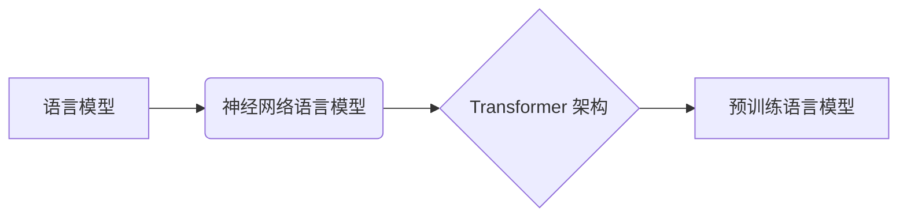
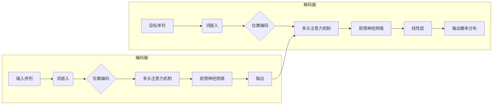

# 大规模语言模型从理论到实践 实践思考

作者：禅与计算机程序设计艺术

## 1. 背景介绍

### 1.1 大规模语言模型的兴起

近年来，随着深度学习技术的快速发展以及互联网海量数据的积累，自然语言处理领域取得了突破性进展，其中最引人瞩目的便是**大规模语言模型（Large Language Model, LLM）**的出现。这些模型通常包含数亿甚至数千亿个参数，能够理解和生成人类级别的自然语言文本，并在各种自然语言处理任务中展现出惊人的性能。

### 1.2  大规模语言模型的应用

大规模语言模型的应用范围非常广泛，涵盖了从简单的文本生成到复杂的问答系统等多个领域，例如：

* **机器翻译：** 将一种语言的文本自动翻译成另一种语言。
* **文本摘要：** 自动提取文本的关键信息，生成简洁的摘要。
* **问答系统：**  根据用户的问题，从海量数据中找到最相关的答案。
* **对话生成：**  模拟人类对话，生成自然流畅的对话文本。
* **代码生成：** 根据自然语言描述生成代码。

### 1.3 本文的出发点

虽然大规模语言模型取得了令人瞩目的成就，但其发展仍然面临着许多挑战，例如训练成本高昂、可解释性差、容易生成有偏见或不道德的内容等。因此，本文旨在探讨大规模语言模型从理论到实践的关键问题，并结合实际案例分析，为读者提供有关大规模语言模型的深入理解和实践指导。

## 2. 核心概念与联系

### 2.1  语言模型

**语言模型**是一种统计模型，用于估计一段文本序列出现的概率。简单来说，语言模型可以预测下一个词语出现的可能性，例如：在句子“我喜欢吃__”中，语言模型可以预测“苹果”、“香蕉”等词语出现的概率较高。

### 2.2  神经网络语言模型

**神经网络语言模型**使用神经网络来构建语言模型，相比传统的统计语言模型，神经网络语言模型能够更好地捕捉语言的复杂结构和语义信息。

### 2.3  Transformer 架构

**Transformer**是一种基于自注意力机制的神经网络架构，它在自然语言处理领域取得了巨大成功，成为了许多大规模语言模型的基础架构。Transformer 架构的核心是**自注意力机制**，它允许模型关注输入序列中不同位置的信息，从而更好地理解上下文语义。

### 2.4  预训练语言模型

**预训练语言模型**是在大规模文本数据上进行预先训练的语言模型，例如 GPT-3、BERT 等。预训练语言模型可以学习到丰富的语言知识和语义信息，在下游任务中可以作为特征提取器或微调的基础模型，从而提高下游任务的性能。

### 2.5  核心概念之间的联系

下图展示了上述核心概念之间的联系：



## 3. 核心算法原理具体操作步骤

### 3.1 Transformer 架构详解

Transformer 架构主要由编码器和解码器两部分组成，如下图所示：



#### 3.1.1 编码器

编码器部分负责将输入序列编码成一个上下文向量，它由多个相同的层堆叠而成，每一层包含以下两个子层：

* **多头注意力机制（Multi-Head Attention）：**  允许模型关注输入序列中不同位置的信息，从而更好地理解上下文语义。
* **前馈神经网络（Feedforward Neural Network）：** 对每个词向量进行非线性变换，提取更高级的语义信息。

#### 3.1.2 解码器

解码器部分负责根据编码器生成的上下文向量以及已生成的词语，预测下一个词语的概率分布。解码器也由多个相同的层堆叠而成，每一层除了包含编码器中的两个子层外，还包含一个**掩码多头注意力机制（Masked Multi-Head Attention）**，用于防止模型在预测当前词语时，关注到后面的词语信息。

### 3.2  自注意力机制

自注意力机制是 Transformer 架构的核心，它允许模型关注输入序列中不同位置的信息，从而更好地理解上下文语义。自注意力机制的计算过程可以概括为以下三个步骤：

1. **计算查询向量、键向量和值向量：**  对于输入序列中的每个词向量，分别乘以三个不同的矩阵，得到对应的查询向量、键向量和值向量。
2. **计算注意力权重：**  计算每个词语的查询向量与所有词语的键向量之间的点积，然后进行 softmax 操作，得到每个词语对其他所有词语的注意力权重。
3. **加权求和：**  将所有词语的值向量按照注意力权重进行加权求和，得到每个词语的上下文向量。

## 4. 数学模型和公式详细讲解举例说明

### 4.1  自注意力机制的数学公式

自注意力机制的数学公式如下：

$$
\text{Attention}(Q, K, V) = \text{softmax}(\frac{QK^T}{\sqrt{d_k}})V
$$

其中：

* $Q$ 表示查询矩阵，维度为 $[n, d_k]$，$n$ 表示序列长度，$d_k$ 表示查询向量、键向量和值向量的维度。
* $K$ 表示键矩阵，维度为 $[n, d_k]$。
* $V$ 表示值矩阵，维度为 $[n, d_v]$，$d_v$ 表示值向量的维度。

### 4.2  举例说明

假设输入序列为 “我喜欢吃苹果”，经过词嵌入后得到如下词向量矩阵：

$$
X = 
\begin{bmatrix}
x_1 \\
x_2 \\
x_3 \\
x_4 
\end{bmatrix}
$$

其中，$x_1$ 表示“我”的词向量，$x_2$ 表示“喜欢”的词向量，以此类推。

首先，计算查询矩阵、键矩阵和值矩阵：

$$
Q = XW_Q \\
K = XW_K \\
V = XW_V
$$

其中，$W_Q$、$W_K$ 和 $W_V$ 分别表示查询矩阵、键矩阵和值矩阵的权重参数。

然后，计算注意力权重：

$$
A = \text{softmax}(\frac{QK^T}{\sqrt{d_k}}) = 
\begin{bmatrix}
a_{11} & a_{12} & a_{13} & a_{14} \\
a_{21} & a_{22} & a_{23} & a_{24} \\
a_{31} & a_{32} & a_{33} & a_{34} \\
a_{41} & a_{42} & a_{43} & a_{44} 
\end{bmatrix}
$$

其中，$a_{ij}$ 表示词语 $i$ 对词语 $j$ 的注意力权重。

最后，加权求和得到每个词语的上下文向量：

$$
Z = AV = 
\begin{bmatrix}
z_1 \\
z_2 \\
z_3 \\
z_4 
\end{bmatrix}
$$

其中，$z_i$ 表示词语 $i$ 的上下文向量。

## 5. 项目实践：代码实例和详细解释说明

### 5.1  使用 TensorFlow 实现 Transformer 模型

```python
import tensorflow as tf

def scaled_dot_product_attention(q, k, v, mask):
  """计算缩放点积注意力。"""
  matmul_qk = tf.matmul(q, k, transpose_b=True)  # (..., seq_len_q, seq_len_k)

  # 缩放 matmul_qk
  dk = tf.cast(tf.shape(k)[-1], tf.float32)
  scaled_attention_logits = matmul_qk / tf.math.sqrt(dk)

  # 将 mask 添加到缩放的张量中。
  if mask is not None:
    scaled_attention_logits += (mask * -1e9)  

  # softmax 在最后一个轴（seq_len_k）上进行，因此分数
  # 在同一个查询位置求和为 1。
  attention_weights = tf.nn.softmax(scaled_attention_logits, axis=-1)  # (..., seq_len_q, seq_len_k)

  output = tf.matmul(attention_weights, v)  