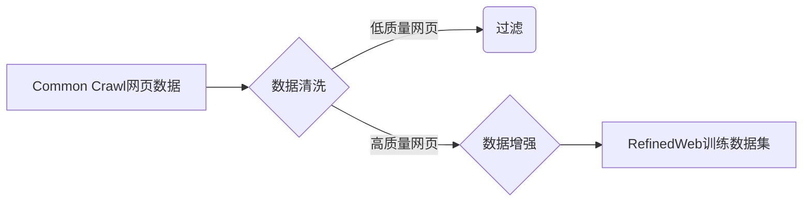

# 大语言模型原理与工程实践：RefinedWeb

作者：禅与计算机程序设计艺术

## 1. 背景介绍

### 1.1 大语言模型的兴起

近年来，自然语言处理领域取得了突破性进展，其中最引人注目的莫过于大语言模型（Large Language Models, LLMs）的兴起。LLMs是基于深度学习技术构建的具有数千亿参数的巨型神经网络，能够理解和生成人类语言，并在各种NLP任务中展现出惊人的能力，例如：

* 文本生成：创作故事、诗歌、新闻报道等
* 机器翻译：实现不同语言之间的自动翻译
* 问答系统：回答用户提出的各种问题
* 代码生成：自动生成代码，提高软件开发效率

### 1.2 RefinedWeb：构建高质量数据集的挑战

LLMs的成功离不开海量高质量训练数据的支撑。然而，构建这样的数据集面临着诸多挑战：

* **数据规模庞大:**  训练LLMs需要TB甚至PB级别的文本数据，收集、清洗和处理如此庞大的数据需要巨大的成本和时间。
* **数据质量参差不齐:**  互联网上的文本数据质量参差不齐，包含大量噪声、错误和偏见，直接用于训练LLMs会导致模型性能下降。
* **数据稀疏性:**  某些特定领域或任务的训练数据非常稀缺，例如专业领域的科技文献、特定语言的语料库等，限制了LLMs在这些领域的应用。

### 1.3 RefinedWeb：一种基于网页数据的LLM训练方法

为了解决上述挑战，Google AI团队提出了一种名为RefinedWeb的LLM训练方法。RefinedWeb利用互联网上丰富的网页数据，通过一系列数据清洗、过滤和增强技术，构建高质量的训练数据集，用于训练性能更强大的LLMs。

## 2. RefinedWeb核心概念与联系

### 2.1 数据源：Common Crawl

RefinedWeb使用Common Crawl作为其主要数据来源。Common Crawl是一个非营利性组织，致力于每月抓取和存档互联网上的公开网页数据，并免费提供给公众使用。Common Crawl的数据规模庞大，包含数十亿个网页，为训练LLMs提供了丰富的语料资源。

### 2.2 数据清洗：过滤低质量网页

互联网上的网页质量参差不齐，包含大量低质量网页，例如：

* **垃圾网页:**  包含无意义内容、重复内容或恶意代码的网页
* **模板化网页:**  结构和内容高度相似，信息量低的网页
* **非文本网页:**  主要包含图片、视频等非文本内容的网页

为了提高训练数据的质量，RefinedWeb采用了一系列技术过滤低质量网页：

* **基于规则的过滤:**  根据网页内容、URL、HTML标签等特征，制定规则过滤垃圾网页和模板化网页。
* **基于机器学习的过滤:**  训练分类器识别低质量网页，并将其从数据集中移除。
* **基于用户行为的过滤:**  利用用户浏览历史、点击率等数据，识别用户不感兴趣或认为质量低的网页。

### 2.3 数据增强：提升数据多样性和信息量

除了过滤低质量网页，RefinedWeb还采用了一些数据增强技术，进一步提升训练数据的质量：

* **文档去重:**  识别和移除重复的网页内容，避免模型过度拟合重复信息。
* **文本摘要:**  提取网页中的关键信息，生成简洁的文本摘要，提高训练效率和模型对长文本的理解能力。
* **数据增强:**  通过同义词替换、随机插入或删除词语等方法，对原始文本进行改写，增加数据的多样性和模型的鲁棒性。

### 2.4 RefinedWeb数据处理流程

下图展示了RefinedWeb的数据处理流程：



## 3. RefinedWeb核心算法原理具体操作步骤

### 3.1 网页内容提取

RefinedWeb使用Apache Tika库从网页中提取文本内容。Tika库支持解析各种文档格式，包括HTML、PDF、DOC等，并能够自动识别文档编码格式，提取纯文本内容。

### 3.2 基于规则的过滤

RefinedWeb使用一系列规则过滤低质量网页，例如：

* **网页长度:**  过滤长度过短或过长的网页，例如少于100个字符或超过10,000个字符的网页。
* **链接密度:**  过滤链接密度过高的网页，例如链接数量超过单词数量的网页。
* **代码比例:**  过滤代码比例过高的网页，例如HTML代码长度超过文本内容长度的网页。

### 3.3 基于机器学习的过滤

RefinedWeb使用机器学习模型识别低质量网页。模型训练数据来自人工标注的网页数据集，包含高质量网页和低质量网页的样本。模型特征包括网页内容、URL、HTML标签等。

### 3.4 文档去重

RefinedWeb使用Simhash算法进行文档去重。Simhash算法将文档转换成一个64位的指纹，通过比较指纹之间的汉明距离判断文档是否相似。

### 3.5 文本摘要

RefinedWeb使用TextRank算法生成文本摘要。TextRank算法是一种基于图的排序算法，用于识别文本中的关键句子。

### 3.6 数据增强

RefinedWeb使用多种数据增强技术，例如：

* **同义词替换:**  使用WordNet等词典，将文本中的词语替换成其同义词。
* **随机插入:**  从词表中随机选择词语，插入到文本中的随机位置。
* **随机删除:**  随机删除文本中的词语。

## 4. 数学模型和公式详细讲解举例说明

### 4.1 Simhash算法

Simhash算法将文档转换成一个64位的指纹，通过比较指纹之间的汉明距离判断文档是否相似。

**算法步骤：**

1. 对文档进行分词，得到词语列表。
2. 对每个词语计算其哈希值，得到一个64位的二进制向量。
3. 对所有词语的二进制向量进行加权求和，得到一个64位的向量。
4. 对向量进行降维，将每个维度上的值转换成0或1，得到一个64位的指纹。

**公式：**

$$
Simhash(d) = \left[ \sum_{i=1}^{n} w_i \cdot h(t_i) \right] > 0
$$

其中：

* $d$ 表示文档
* $n$ 表示文档中词语的数量
* $t_i$ 表示第 $i$ 个词语
* $w_i$ 表示第 $i$ 个词语的权重
* $h(t_i)$ 表示词语 $t_i$ 的哈希值

**示例：**

假设有两个文档：

* 文档1： "The cat sat on the mat."
* 文档2： "The quick brown fox jumps over the lazy dog."

对这两个文档分别计算其Simhash指纹，然后计算指纹之间的汉明距离。如果汉明距离小于等于3，则认为这两个文档相似。

### 4.2 TextRank算法

TextRank算法是一种基于图的排序算法，用于识别文本中的关键句子。

**算法步骤：**

1. 对文本进行分句，得到句子列表。
2. 构建句子相似度图，图中的节点表示句子，边表示句子之间的相似度。
3. 对句子相似度图应用PageRank算法，计算每个句子的得分。
4. 选择得分最高的句子作为文本摘要。

**公式：**

$$
S(V_i) = (1 - d) + d \sum_{V_j \in In(V_i)} \frac{Sim(V_j, V_i)}{\sum_{V_k \in Out(V_j)} Sim(V_j, V_k)} \cdot S(V_j)
$$

其中：

* $S(V_i)$ 表示句子 $V_i$ 的得分
* $d$ 表示阻尼系数，通常设置为0.85
* $In(V_i)$ 表示指向句子 $V_i$ 的句子集合
* $Out(V_j)$ 表示句子 $V_j$ 指向的句子集合
* $Sim(V_j, V_i)$ 表示句子 $V_j$ 和 $V_i$ 之间的相似度

**示例：**

假设有一段文本：

> "The cat sat on the mat. The dog slept on the floor. The bird sang in the tree."

对这段文本应用TextRank算法，计算每个句子的得分，并选择得分最高的句子作为文本摘要。

## 5. 项目实践：代码实例和详细解释说明

### 5.1 使用Python实现网页内容提取

```python
import requests
from bs4 import BeautifulSoup

def extract_content(url):
    """
    提取网页内容

    Args:
        url: 网页URL

    Returns:
        网页内容
    """
    response = requests.get(url)
    soup = BeautifulSoup(response.content, 'html.parser')
    # 移除script、style标签
    for s in soup(['script', 'style']):
        s.extract()
    # 获取所有文本内容
    text = soup.get_text()
    # 去除多余的空格和换行符
    text = ' '.join(text.split())
    return text
```

### 5.2 使用Python实现Simhash算法

```python
import mmh3

def simhash(text, bits=64):
    """
    计算文本的Simhash指纹

    Args:
        text: 文本
        bits: 指纹长度

    Returns:
        Simhash指纹
    """
    words = text.split()
    sh = [0] * bits
    for word in words:
        h = mmh3.hash(word)
        for i in range(bits):
            if (h >> i) & 1:
                sh[i] += 1
            else:
                sh[i] -= 1
    fingerprint = 0
    for i in range(bits):
        if sh[i] > 0:
            fingerprint |= (1 << i)
    return fingerprint
```

### 5.3 使用Python实现TextRank算法

```python
import networkx as nx

def textrank(sentences, d=0.85, max_iter=100):
    """
    使用TextRank算法提取文本摘要

    Args:
        sentences: 句子列表
        d: 阻尼系数
        max_iter: 最大迭代次数

    Returns:
        摘要句子列表
    """
    # 构建句子相似度图
    graph = nx.Graph()
    for i in range(len(sentences)):
        for j in range(i + 1, len(sentences)):
            similarity = calculate_similarity(sentences[i], sentences[j])
            if similarity > 0:
                graph.add_edge(i, j, weight=similarity)
    # 应用PageRank算法
    scores = nx.pagerank(graph, alpha=d, max_iter=max_iter)
    # 排序并选择得分最高的句子
    ranked_sentences = sorted(((scores[i], s) for i, s in enumerate(sentences)), reverse=True)
    return [s for _, s in ranked_sentences]
```

## 6. 实际应用场景

RefinedWeb构建的高质量数据集可以应用于各种LLMs的训练，例如：

* **文本生成:**  训练更强大的文本生成模型，用于创作更具创意和逻辑性的故事、诗歌、新闻报道等。
* **机器翻译:**  提高机器翻译模型的准确性和流畅度，实现更高质量的跨语言交流。
* **问答系统:**  构建更智能的问答系统，能够更准确地理解用户意图，并提供更精准的答案。
* **代码生成:**  训练更智能的代码生成模型，自动生成更高质量的代码，提高软件开发效率。

## 7. 工具和资源推荐

* **Common Crawl:**  https://commoncrawl.org/
* **Apache Tika:**  https://tika.apache.org/
* **NetworkX:**  https://networkx.org/

## 8. 总结：未来发展趋势与挑战

RefinedWeb是一种有效的LLM训练数据构建方法，通过一系列数据清洗、过滤和增强技术，从海量网页数据中提取高质量的训练数据，推动了LLMs的发展。未来，LLMs将继续朝着更大规模、更强能力的方向发展，RefinedWeb也将不断改进其数据处理技术，以适应LLMs不断增长的数据需求。

## 9. 附录：常见问题与解答

**Q: RefinedWeb数据集是否公开可用？**

A: 目前，RefinedWeb数据集尚未公开发布。

**Q: RefinedWeb数据集的规模有多大？**

A: RefinedWeb数据集的规模仍在不断扩大，目前已包含数十亿个网页。

**Q: RefinedWeb数据集是否包含中文网页？**

A: 是的，RefinedWeb数据集包含来自全球各个国家和地区的网页，包括中文网页。

**Q: 如何使用RefinedWeb数据集训练LLMs？**

A: 训练LLMs需要专业的知识和技术，建议参考相关文献和教程。
