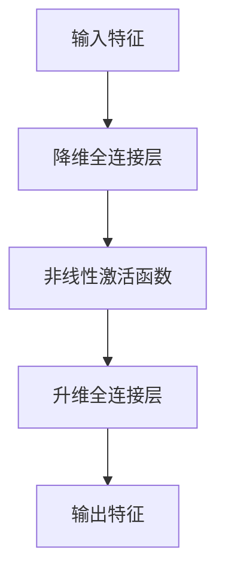

# 大语言模型应用指南：Adapter高效微调

作者：禅与计算机程序设计艺术

## 1. 背景介绍

### 1.1 大语言模型的崛起

近年来，随着深度学习技术的不断发展，特别是Transformer架构的引入，大语言模型（LLMs）如BERT、GPT-3等在自然语言处理（NLP）领域取得了显著的进展。这些模型通过训练海量的数据，展现出了强大的语言理解和生成能力，广泛应用于机器翻译、文本生成、问答系统等任务。

### 1.2 微调的必要性

尽管大语言模型在通用任务上表现优异，但在特定领域或任务中，直接使用预训练模型可能无法达到最佳效果。因此，微调（Fine-tuning）技术应运而生，通过在特定任务的数据集上进一步训练预训练模型，使其在该任务上表现更佳。然而，微调大模型需要大量的计算资源和时间，这在实际应用中往往成为瓶颈。

### 1.3 Adapter技术的引入

为了解决大模型微调过程中计算资源消耗过大的问题，Adapter技术被提出。Adapter是一种轻量级的模块，通过在预训练模型的各层之间插入适配器模块，实现对模型的高效微调。这种方法不仅显著减少了计算资源的消耗，还能在多任务学习中共享底层模型，提高模型的泛化能力。

## 2. 核心概念与联系

### 2.1 Adapter的基本概念

Adapter是一种模块化的微调方法，通过在预训练模型的各层之间插入小型的适配器模块，使得在微调过程中只需训练这些适配器模块，而无需调整整个模型的参数。这种方法能够大幅减少微调所需的计算资源，同时保留预训练模型的强大能力。

### 2.2 Adapter与传统微调的区别

传统的微调方法需要调整预训练模型的大部分参数，这不仅耗时耗力，还容易导致过拟合。相比之下，Adapter方法只需训练少量的新增参数，既能有效地适应新任务，又能避免过度调整模型参数导致的性能下降。

### 2.3 Adapter与多任务学习的结合

Adapter技术在多任务学习中的应用尤为突出。通过在不同任务中插入不同的适配器模块，可以实现任务间的参数共享，既提高了模型的泛化能力，又减少了训练时间和资源消耗。

## 3. 核心算法原理具体操作步骤

### 3.1 Adapter模块的结构设计

Adapter模块通常由两层全连接层组成，第一层将输入的特征降维，第二层再将其升维回原来的维度。通过这种结构设计，Adapter模块能够在保持模型原有能力的同时，适应新任务的特征。



### 3.2 Adapter模块的插入位置

Adapter模块通常插入到预训练模型的每一层Transformer之中，具体位置可以是注意力层之后、全连接层之前，或者两者之间。通过这种插入方式，Adapter模块能够有效地调整模型的特征表示，使其适应新任务。

### 3.3 Adapter模块的训练策略

在微调过程中，只需训练Adapter模块的参数，而保持预训练模型的其他参数不变。这种训练策略不仅减少了计算资源的消耗，还能避免过拟合问题。

## 4. 数学模型和公式详细讲解举例说明

### 4.1 Adapter模块的数学表示

设输入特征为 $X \in \mathbb{R}^{d}$，Adapter模块的降维全连接层参数为 $W_1 \in \mathbb{R}^{d \times r}$，升维全连接层参数为 $W_2 \in \mathbb{R}^{r \times d}$，其中 $r$ 为降维后的维度。则Adapter模块的输出特征 $Y$ 可以表示为：

$$
Y = W_2 \cdot \sigma(W_1 \cdot X)
$$

其中，$\sigma$ 表示非线性激活函数，如ReLU。

### 4.2 Adapter模块的损失函数

在微调过程中，Adapter模块的损失函数与传统微调方法相同，通常选择交叉熵损失函数进行优化。设模型的输出为 $\hat{y}$，真实标签为 $y$，则损失函数 $L$ 表示为：

$$
L = -\sum_{i=1}^{N} y_i \log(\hat{y}_i)
$$

其中，$N$ 为样本数量。

### 4.3 Adapter模块的梯度更新

在训练过程中，通过反向传播算法计算损失函数对Adapter模块参数的梯度，并使用梯度下降法进行参数更新。设学习率为 $\eta$，则参数 $W_1$ 和 $W_2$ 的更新规则为：

$$
W_1 \leftarrow W_1 - \eta \frac{\partial L}{\partial W_1}
$$

$$
W_2 \leftarrow W_2 - \eta \frac{\partial L}{\partial W_2}
$$

## 5. 项目实践：代码实例和详细解释说明

### 5.1 环境配置

在开始项目实践之前，需要配置好开发环境。推荐使用Python语言，并安装以下必要的库：

```bash
pip install transformers torch
```

### 5.2 加载预训练模型

首先，加载预训练的大语言模型，如BERT或GPT-3。以下代码以BERT为例：

```python
from transformers import BertModel, BertTokenizer

model_name = 'bert-base-uncased'
tokenizer = BertTokenizer.from_pretrained(model_name)
model = BertModel.from_pretrained(model_name)
```

### 5.3 定义Adapter模块

接下来，定义Adapter模块。以下代码展示了一个简单的Adapter模块实现：

```python
import torch.nn as nn

class Adapter(nn.Module):
    def __init__(self, input_dim, adapter_dim):
        super(Adapter, self).__init__()
        self.linear1 = nn.Linear(input_dim, adapter_dim)
        self.activation = nn.ReLU()
        self.linear2 = nn.Linear(adapter_dim, input_dim)
    
    def forward(self, x):
        return self.linear2(self.activation(self.linear1(x)))

# 示例参数
input_dim = 768  # BERT的隐藏层维度
adapter_dim = 64  # Adapter降维后的维度
adapter = Adapter(input_dim, adapter_dim)
```

### 5.4 插入Adapter模块

将Adapter模块插入到预训练模型的各层之间。以下代码展示了如何在BERT模型的每一层之间插入Adapter模块：

```python
class BertWithAdapters(nn.Module):
    def __init__(self, model, adapter):
        super(BertWithAdapters, self).__init__()
        self.bert = model
        self.adapters = nn.ModuleList([adapter for _ in range(model.config.num_hidden_layers)])
    
    def forward(self, input_ids, attention_mask=None, token_type_ids=None):
        outputs = self.bert(input_ids, attention_mask=attention_mask, token_type_ids=token_type_ids)
        sequence_output = outputs[0]
        
        for i, adapter in enumerate(self.adapters):
            sequence_output = adapter(sequence_output)
        
        return sequence_output

# 创建带Adapter的BERT模型
model_with_adapters = BertWithAdapters(model, adapter)
```

### 5.5 微调模型

在特定任务的数据集上微调带有Adapter模块的预训练模型。以下代码展示了如何在分类任务上微调模型：

```python
from transformers import AdamW, get_linear_schedule_with_warmup
from torch.utils.data import DataLoader, Dataset

class CustomDataset(Dataset):
    def __init__(self, texts, labels, tokenizer, max_len):
        self.texts = texts
        self.labels = labels
        self.tokenizer = tokenizer
        self.max_len = max_len
    
    def __len__(self):
        return len(self.texts)
    
    def __getitem__(self, idx):
        text = self.texts[idx]
        label = self.labels[idx]
        encoding = self.tokenizer.encode_plus(
            text,
            add_special_tokens=True,
            max_length=self.max_len,
            return_token_type_ids=False,
            padding='max_length',
            return_attention_mask=True,
            return_tensors='pt',
        )
        return {
            'input_ids': encoding['input_ids'].flatten(),
            'attention_mask': encoding['attention_mask'].flatten(),
            'label': torch.tensor(label, dtype=torch.long)
        }

# 示例数据
texts = ["example sentence 1", "example sentence 2"]
labels = [0, 1]
max_len = 32

dataset = CustomDataset(texts, labels, tokenizer, max_len)
dataloader = DataLoader(dataset, batch_size=2)

# 设置优化器和学习率调度器
optimizer = AdamW(model_with_adapters.parameters