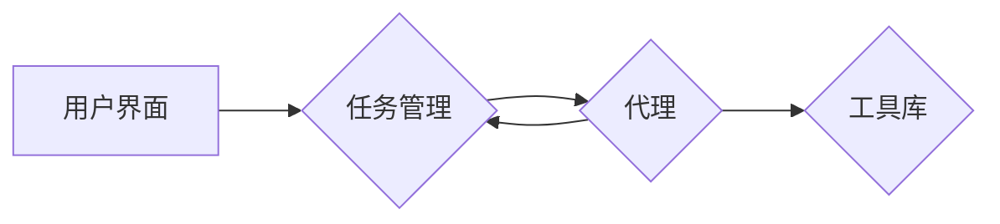

# 大语言模型应用指南：AutoGPT

作者：禅与计算机程序设计艺术

## 1. 背景介绍

### 1.1 人工智能的新纪元：大语言模型的崛起

近年来，人工智能领域取得了突破性进展，其中最引人注目的莫过于**大语言模型（Large Language Models, LLMs）**的崛起。LLMs是基于深度学习的模型，经过海量文本数据的训练，能够理解和生成自然语言，并在各种任务中展现出惊人的能力，例如：

* **文本生成**: 写诗歌、剧本、小说等各种类型的文本。
* **代码生成**: 根据自然语言描述生成代码。
* **机器翻译**: 将一种语言翻译成另一种语言。
* **问答系统**: 回答用户提出的各种问题。
* **对话系统**: 与用户进行自然流畅的对话。

LLMs的出现标志着人工智能进入了一个全新的发展阶段，为人类社会带来了前所未有的机遇和挑战。

### 1.2  从GPT到AutoGPT：迈向自主的人工智能

**GPT（Generative Pre-trained Transformer）**系列模型是LLMs的典型代表，由OpenAI开发，其强大的文本生成能力令人惊叹。然而，传统的LLMs通常需要人工提供明确的指令或提示才能完成任务，缺乏自主性和灵活性。

为了克服这一局限性，**AutoGPT**应运而生。AutoGPT是一种实验性的开源应用程序，它利用GPT-4等强大的LLMs来自动完成用户设定的目标。与传统的LLMs不同，AutoGPT能够将多个子任务分解，并根据上下文自动生成后续指令，无需人工干预，从而实现更高的自主性和效率。

### 1.3 本文目标：深入浅出，全面解析AutoGPT

本文旨在为广大读者提供一份全面深入的AutoGPT指南，涵盖其核心概念、工作原理、应用场景、优缺点以及未来发展趋势等方面。无论您是人工智能领域的专业人士，还是对AutoGPT充满好奇的初学者，本文都将为您提供宝贵的 insights 和 practical guidance。

## 2. 核心概念与联系

### 2.1  AutoGPT：像人类一样思考和行动

AutoGPT的核心思想是**让LLMs像人类一样思考和行动**。为了实现这一目标，AutoGPT引入了以下关键概念：

* **目标 (Goal):** 用户为AutoGPT设定的最终目标，例如“写一篇关于人工智能的文章”。
* **任务 (Task):**  为了完成目标，AutoGPT需要将其分解成一系列具体的任务，例如“收集相关资料”、“撰写文章大纲”、“生成文章内容”等。
* **代理 (Agent):** AutoGPT的核心组件，负责执行任务，并根据任务执行结果和上下文信息，自动生成后续指令。
* **工具 (Tools):** AutoGPT可以调用各种外部工具来辅助完成任务，例如搜索引擎、代码编辑器、文件系统等。
* **记忆 (Memory):**  AutoGPT利用内存来存储历史信息，例如已完成的任务、生成的文本、遇到的问题等，以便在后续决策中参考。

### 2.2  AutoGPT工作流程：循环迭代，逐步逼近目标

AutoGPT的工作流程可以概括为以下几个步骤：

1. **用户设定目标:** 用户向AutoGPT提供一个清晰明确的目标。
2. **任务分解:** AutoGPT将目标分解成一系列可执行的任务。
3. **执行任务:** 代理执行任务，并调用相应的工具。
4. **评估结果:**  代理评估任务执行结果，并将其存储到内存中。
5. **生成指令:** 根据任务执行结果和上下文信息，代理自动生成后续指令。
6. **循环迭代:** 重复步骤3-5，直到目标达成。

### 2.3  核心概念之间的联系：协同合作，实现自主智能

AutoGPT的各个核心概念之间紧密相连，协同合作，共同实现了自主智能：

* **目标**是AutoGPT的行动指南，指引着整个工作流程的方向。
* **任务**是目标的具体体现，将目标分解成可执行的步骤。
* **代理**是AutoGPT的大脑，负责思考、决策和行动。
* **工具**是AutoGPT的双手，帮助代理完成各种任务。
* **记忆**是AutoGPT的经验库，为代理提供决策依据。

## 3. 核心算法原理具体操作步骤

### 3.1 架构总览

AutoGPT的架构可以分为四个主要部分：

1. **用户界面:** 用户与AutoGPT交互的接口，用于输入目标、查看进度和结果等。
2. **任务管理:** 负责将目标分解成任务，并管理任务队列。
3. **代理:** 负责执行任务，并根据上下文生成后续指令。
4. **工具库:** 提供各种外部工具的接口，例如搜索引擎、代码编辑器等。



### 3.2 任务管理

任务管理模块负责将用户设定的目标分解成一系列可执行的任务，并管理任务队列。其主要功能包括：

* **任务分解:** 将目标分解成多个子任务，例如将“写一篇关于人工智能的文章”分解成“收集相关资料”、“撰写文章大纲”、“生成文章内容”等。
* **任务优先级:** 根据任务的重要性和紧急程度，确定任务的执行顺序。
* **任务调度:** 将任务分配给空闲的代理执行。

### 3.3 代理

代理是AutoGPT的核心组件，负责执行任务，并根据上下文生成后续指令。其主要功能包括：

* **指令解析:** 理解用户或其他代理发送的指令。
* **任务执行:** 调用工具库中的工具执行任务。
* **结果评估:** 评估任务执行结果，并将其存储到内存中。
* **指令生成:** 根据任务执行结果和上下文信息，自动生成后续指令。

代理通常使用深度学习模型来实现，例如GPT-4。

### 3.4 工具库

工具库提供各种外部工具的接口，例如：

* **搜索引擎:** 用于搜索信息。
* **代码编辑器:** 用于编写和执行代码。
* **文件系统:** 用于读写文件。

代理可以调用工具库中的工具来完成各种任务。


## 4. 数学模型和公式详细讲解举例说明

### 4.1  概率语言模型：AutoGPT的基石

AutoGPT的核心是基于**概率语言模型（Probabilistic Language Model, PLM）**，其目标是学习一个能够预测下一个词出现的概率的模型。

给定一个词序列 $w_1, w_2, ..., w_t$，PLM可以计算出下一个词 $w_{t+1}$ 出现的概率：

$$P(w_{t+1} | w_1, w_2, ..., w_t)$$

### 4.2  Transformer：AutoGPT的强大引擎

AutoGPT通常使用**Transformer**架构来实现PLM。Transformer是一种基于自注意力机制的神经网络结构，其优点是可以并行计算，并且能够捕捉长距离依赖关系。

### 4.3  举例说明：文本生成

假设我们想要使用AutoGPT生成一段关于人工智能的文本，目标是“写一段关于人工智能的介绍”。

1. **任务分解:** AutoGPT将目标分解成以下任务：
    * 生成第一句话：“人工智能是...”
    * 生成第二句话：“它可以用于...”
    * 生成第三句话：“例如...”
2. **指令生成:** 
    * 对于第一个任务，代理生成指令：“写一个关于人工智能的定义”。
    * 对于第二个任务，代理生成指令：“列举人工智能的应用领域”。
    * 对于第三个任务，代理生成指令：“给出一个人工智能应用的具体例子”。
3. **任务执行:** 代理调用PLM，根据指令生成相应的文本。
4. **结果评估:** 代理评估生成的文本是否符合语法规范、语义连贯等要求。
5. **循环迭代:** 重复步骤2-4，直到生成一段完整的文本。


## 5. 项目实践：代码实例和详细解释说明

### 5.1  安装 AutoGPT

```bash
pip install autogpt
```

### 5.2  配置 AutoGPT

在开始使用 AutoGPT 之前，您需要设置 OpenAI API 密钥和其他配置选项。您可以创建一个名为 `.env` 的文件，并将您的配置添加到其中。

```
OPENAI_API_KEY=YOUR_OPENAI_API_KEY
```

### 5.3  运行 AutoGPT

```bash
python -m autogpt
```

### 5.4  代码实例：使用 AutoGPT 创建待办事项列表

以下是如何使用 AutoGPT 创建待办事项列表的示例：

```python
from autogpt import AutoGPT

# 初始化 AutoGPT
autogpt = AutoGPT()

# 设置目标
autogpt.set_goal("创建一个待办事项列表")

# 运行 AutoGPT
autogpt.run()
```

## 6. 实际应用场景

AutoGPT 拥有广泛的应用场景，包括：

* **自动化内容创作:**  自动生成文章、博客、社交媒体帖子等各种类型的文本内容。
* **代码生成:**  根据自然语言描述自动生成代码，例如网站、应用程序、脚本等。
* **数据分析:** 自动化数据分析流程，例如数据清洗、特征工程、模型训练等。
* **客户服务:**  构建智能客服系统，自动回答用户问题，提供技术支持等。
* **教育:**  创建个性化的学习计划，提供智能辅导等。


## 7. 总结：未来发展趋势与挑战

### 7.1  未来发展趋势

* **更强大的LLMs:** 随着计算能力的提升和训练数据的增加，LLMs将会变得更加强大，能够处理更加复杂的任务。
* **更丰富的工具库:** AutoGPT将会集成更多种类的工具，例如图像生成工具、视频编辑工具等，进一步扩展其应用场景。
* **更强的可解释性:**  研究人员将致力于提高AutoGPT的可解释性，使其决策过程更加透明易懂。

### 7.2  挑战

* **安全性:**  AutoGPT的强大能力也带来了一定的安全风险，例如被恶意利用生成虚假信息、进行网络攻击等。
* **伦理问题:** AutoGPT的应用可能会引发一系列伦理问题，例如算法歧视、隐私泄露等。
* **可控性:**  如何确保AutoGPT的行为符合人类的预期，避免其做出 harmful 的决策，是一个重要的研究方向。

## 8. 附录：常见问题与解答

### 8.1  什么是 AutoGPT？

AutoGPT 是一种实验性的开源应用程序，它利用 GPT-4 等强大的 LLM 来自动完成用户设定的目标。

### 8.2  如何安装 AutoGPT？

您可以使用 `pip install autogpt` 命令安装 AutoGPT。

### 8.3  如何使用 AutoGPT？

您需要设置 OpenAI API 密钥和其他配置选项，然后使用 `python -m autogpt` 命令运行 AutoGPT。

### 8.4  AutoGPT 的应用场景有哪些？

AutoGPT 拥有广泛的应用场景，包括自动化内容创作、代码生成、数据分析、客户服务等。
