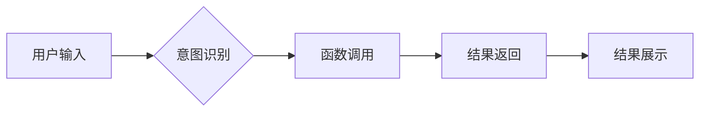

##  大语言模型应用指南：function calling

**作者：禅与计算机程序设计艺术**

## 1. 背景介绍

### 1.1 大语言模型的兴起与能力边界

近年来，以 Transformer 架构为代表的深度学习技术取得了突破性进展，推动了自然语言处理（NLP）领域步入了一个全新的时代。其中，大语言模型（Large Language Models，LLMs）凭借其强大的文本生成、理解、翻译等能力，成为了人工智能领域最受关注的技术方向之一。

从 GPT-3 到 ChatGPT，再到更强大的 GPT-4，大语言模型展现出了惊人的能力：

* **海量知识储备**: 能够存储和理解来自互联网的海量文本数据，涵盖各个领域和学科。
* **强大的语言生成能力**:  能够生成流畅、自然、富有逻辑的文本，甚至可以进行诗歌创作、剧本编写等。
* **多任务学习**:  能够在多个 NLP 任务上表现出色，例如文本分类、问答系统、机器翻译等。

然而，尽管大语言模型取得了巨大进步，但其仍然存在一些局限性：

* **缺乏常识推理**:  难以像人类一样进行基于常识的推理和判断。
* **难以处理复杂逻辑**:  在处理复杂逻辑和推理问题时，容易出现错误或不一致。
* **缺乏与外部世界交互**:  通常只能处理文本信息，难以与现实世界进行交互。

### 1.2  Function Calling：突破语言模型能力边界

为了解决上述问题，研究者们一直在探索如何拓展大语言模型的能力边界，使其能够更好地理解和处理复杂任务。其中，**Function Calling** 是一种新兴的技术，它为大语言模型提供了一种与外部世界交互、调用外部工具和 API 的能力，从而极大地扩展了其应用范围。

简单来说，Function Calling 允许开发者将预定义的函数与大语言模型集成，当模型识别到用户意图需要调用某个函数时，它会自动生成调用该函数所需的代码或参数，并将结果返回给用户。

### 1.3  Function Calling 的优势和应用前景

相比于传统的 API 调用方式，Function Calling 具有以下优势：

* **更自然的用户体验**:  用户可以使用自然语言与模型交互，无需学习复杂的 API 文档和语法。
* **更强大的功能**:  模型可以调用外部工具和 API，从而实现更复杂的功能。
* **更高的可扩展性**:  开发者可以轻松地添加新的函数，扩展模型的能力。

Function Calling 的出现为大语言模型的应用开辟了更广阔的领域，例如：

* **智能助手**:  可以调用各种 API，帮助用户完成订票、预订酒店、查询天气等任务。
* **代码生成**:  可以根据用户的自然语言描述生成代码，提高开发效率。
* **数据分析**:  可以调用数据分析工具，帮助用户分析数据、生成报告等。

## 2. 核心概念与联系

### 2.1 Function Calling 的基本流程

Function Calling 的基本流程可以概括为以下几个步骤：

1. **用户输入**: 用户使用自然语言表达其意图，例如“帮我预订一张明天从北京到上海的机票”。
2. **意图识别**: 大语言模型识别用户的意图，例如“预订机票”。
3. **函数调用**:  模型根据用户意图，选择合适的函数进行调用，并生成调用函数所需的代码或参数。
4. **结果返回**:  函数执行完成后，将结果返回给模型。
5. **结果展示**:  模型将结果以自然语言的形式展示给用户。

### 2.2  Function Calling 的关键技术

实现 Function Calling 的关键技术包括：

* **意图识别**:  准确识别用户的意图是成功调用函数的关键。
* **函数定义**:  开发者需要定义函数的名称、参数、返回值等信息，以便模型能够正确调用函数。
* **代码生成**:  模型需要能够根据函数定义生成调用函数的代码或参数。
* **结果解析**:  模型需要能够解析函数返回的结果，并将其转换成用户能够理解的自然语言。

### 2.3  Function Calling 与其他技术的联系

Function Calling 与其他技术有着密切的联系，例如：

* **自然语言理解 (NLU)**:  Function Calling 依赖于 NLU 技术来理解用户的意图。
* **代码生成**:  Function Calling 需要代码生成技术来生成调用函数的代码。
* **API 设计**:  Function Calling 的函数定义与 API 设计密切相关。

## 3. 核心算法原理具体操作步骤

### 3.1 基于提示学习的 Function Calling

基于提示学习（Prompt Learning）是实现 Function Calling 的一种常见方法。其核心思想是将函数调用转换为文本生成任务，通过设计合适的提示模板，引导模型生成调用函数所需的代码或参数。

具体操作步骤如下：

1. **定义函数签名**:  使用特定的语法定义函数的名称、参数、返回值等信息。例如：

```python
def book_flight(departure_city: str, arrival_city: str, date: str) -> str:
  """
  预订机票。

  Args:
    departure_city: 出发城市。
    arrival_city: 到达城市。
    date: 出发日期。

  Returns:
    预订结果。
  """
  # ...
```

2. **构建提示模板**:  将函数签名嵌入到提示模板中，例如：

```
用户：帮我预订一张明天从北京到上海的机票。

```python
def book_flight(departure_city: str, arrival_city: str, date: str) -> str:
  """
  预订机票。

  Args:
    departure_city: 出发城市。
    arrival_city: 到达城市。
    date: 出发日期。

  Returns:
    预订结果。
  """
  # ...

```python
book_flight(departure_city='北京', arrival_city='上海', date='明天')
```
```

3. **模型预测**:  将提示模板输入到大语言模型中，模型会根据提示生成调用函数的代码。

4. **代码执行**:  执行模型生成的代码，调用相应的函数。

5. **结果返回**:  将函数返回的结果返回给用户。

### 3.2 基于微调的 Function Calling

除了基于提示学习的方法，还可以通过微调（Fine-tuning）大语言模型来实现 Function Calling。

具体操作步骤如下：

1. **构建训练数据集**:  收集用户使用自然语言表达意图以及调用函数的代码对，例如：

```
{
  "text": "帮我预订一张明天从北京到上海的机票。",
  "code": "book_flight(departure_city='北京', arrival_city='上海', date='明天')"
},
{
  "text": "查询一下今天北京的天气。",
  "code": "get_weather(city='北京', date='今天')"
}
```

2. **微调大语言模型**:  使用构建的训练数据集微调大语言模型，使其能够根据用户输入生成调用函数的代码。

3. **模型预测**:  将用户输入到大语言模型中，模型会生成调用函数的代码。

4. **代码执行**:  执行模型生成的代码，调用相应的函数。

5. **结果返回**:  将函数返回的结果返回给用户。

## 4. 数学模型和公式详细讲解举例说明

### 4.1  概率语言模型

大语言模型通常基于概率语言模型（Probability Language Model，PLM）构建，PLM 的目标是学习一个能够估计单词序列概率的模型。

给定一个单词序列 $w_1, w_2, ..., w_n$，PLM 可以计算该序列出现的概率：

$$
P(w_1, w_2, ..., w_n) = \prod_{i=1}^{n} P(w_i | w_1, w_2, ..., w_{i-1})
$$

其中，$P(w_i | w_1, w_2, ..., w_{i-1})$ 表示在给定前 $i-1$ 个单词的情况下，第 $i$ 个单词出现的概率。

### 4.2  Transformer 架构

Transformer 是一种基于自注意力机制（Self-Attention）的神经网络架构，它在自然语言处理领域取得了巨大成功。

Transformer 架构的核心组件包括：

* **编码器 (Encoder)**:  用于将输入序列编码成向量表示。
* **解码器 (Decoder)**:  用于将编码器输出的向量解码成目标序列。
* **自注意力机制**:  用于计算序列中每个单词与其他单词之间的关系。

### 4.3  Function Calling 中的数学原理

在 Function Calling 中，大语言模型需要学习将自然语言映射到函数调用。这可以看作是一个条件概率问题：

$$
P(code | text)
$$

其中，$text$ 表示用户输入的自然语言，$code$ 表示调用函数的代码。

基于提示学习的方法通过设计合适的提示模板，将函数调用转换为文本生成任务，从而利用大语言模型强大的文本生成能力来生成代码。

基于微调的方法则通过构建训练数据集，直接优化模型在给定用户输入的情况下生成正确代码的概率。

## 5. 项目实践：代码实例和详细解释说明

### 5.1 使用 Python 实现简单的 Function Calling

以下代码演示了如何使用 Python 实现一个简单的 Function Calling 示例：

```python
from typing import Callable

class FunctionCaller:
  def __init__(self, functions: dict):
    self.functions = functions

  def call(self, function_name: str, **kwargs):
    function = self.functions.get(function_name)
    if function is None:
      raise ValueError(f"Invalid function name: {function_name}")
    return function(**kwargs)

# 定义函数
def get_weather(city: str, date: str) -> str:
  """
  获取天气信息。

  Args:
    city: 城市名称。
    date: 日期。

  Returns:
    天气信息。
  """
  # ...
  return f"{date} {city} 的天气是..."

# 创建 FunctionCaller 实例
function_caller = FunctionCaller(functions={"get_weather": get_weather})

# 调用函数
result = function_caller.call(function_name="get_weather", city="北京", date="今天")

# 打印结果
print(result)
```

**代码解释:**

1. `FunctionCaller` 类用于管理函数，它包含一个 `functions` 字典，用于存储函数名和函数的映射关系。
2. `call` 方法用于调用函数，它接收函数名和参数，并从 `functions` 字典中查找对应的函数进行调用。
3. `get_weather` 函数用于获取天气信息，它接收城市和日期作为参数。
4. 创建 `FunctionCaller` 实例，并将 `get_weather` 函数添加到 `functions` 字典中。
5. 调用 `call` 方法，传入函数名 `get_weather` 以及参数 `city` 和 `date`。
6. 打印函数返回的结果。

### 5.2 使用 LangChain 集成 Function Calling

LangChain 是一个用于开发 LLM 应用的开源 Python 库，它提供了一套简单易用的 API，可以方便地将 Function Calling 集成到 LLM 应用中。

以下代码演示了如何使用 LangChain 集成 Function Calling：

```python
from langchain.agents import Tool, AgentExecutor
from langchain.llms import OpenAI
from langchain.chains import LLMMathChain

# 定义函数
def get_weather(city: str, date: str) -> str:
  """
  获取天气信息。

  Args:
    city: 城市名称。
    date: 日期。

  Returns:
    天气信息。
  """
  # ...
  return f"{date} {city} 的天气是..."

# 创建工具
tools = [
  Tool(
    name="get_weather",
    func=get_weather,
    description="获取天气信息，参数：city，date"
  ),
]

# 创建代理
llm = OpenAI(temperature=0)
agent = AgentExecutor.from_agent_and_tools(
  agent=llm,
  tools=tools,
  verbose=True
)

# 执行任务
result = agent.run("帮我查一下今天北京的天气")

# 打印结果
print(result)
```

**代码解释:**

1. 导入所需的库。
2. 定义 `get_weather` 函数。
3. 使用 `Tool` 类创建工具，指定工具的名称、函数和描述。
4. 创建 `OpenAI` 对象作为 LLM。
5. 使用 `AgentExecutor.from_agent_and_tools` 方法创建代理，传入 LLM 和工具列表。
6. 调用代理的 `run` 方法执行任务，传入用户输入。
7. 打印代理返回的结果。

## 6. 实际应用场景

### 6.1  智能助手

Function Calling 可以让智能助手更加强大，例如：

* **预订服务**: 用户可以使用自然语言表达其需求，例如“帮我预订一张明天从北京到上海的机票”，智能助手可以调用相应的 API 完成预订。
* **信息查询**: 用户可以使用自然语言查询信息，例如“今天北京的天气怎么样？”，智能助手可以调用天气 API 获取天气信息并返回给用户。
* **日程管理**: 用户可以使用自然语言管理日程，例如“帮我安排一个明天上午 9 点的会议”，智能助手可以调用日历 API 添加日程。

### 6.2 代码生成

Function Calling 可以帮助开发者更高效地生成代码，例如：

* **代码补全**:  根据用户的输入，模型可以自动补全代码，例如函数名、参数等。
* **代码生成**:  根据用户的自然语言描述，模型可以生成相应的代码，例如创建函数、编写 SQL 查询语句等。
* **代码调试**:  模型可以帮助开发者调试代码，例如识别代码中的错误、提供修复建议等。

### 6.3 数据分析

Function Calling 可以帮助用户更方便地进行数据分析，例如：

* **数据查询**:  用户可以使用自然语言查询数据，例如“统计一下过去一个月网站的访问量”，模型可以调用数据库 API 查询数据并返回给用户。
* **数据可视化**:  用户可以使用自然语言生成图表，例如“绘制一张过去一年销售额的变化趋势图”，模型可以调用数据可视化工具生成图表。
* **数据分析**:  用户可以使用自然语言进行数据分析，例如“分析一下哪些因素会影响用户的购买决策”，模型可以调用数据分析工具进行分析并返回结果。

## 7. 总结：未来发展趋势与挑战

### 7.1 未来发展趋势

* **更强大的模型**:  随着模型规模的不断扩大，模型的理解和生成能力将进一步提升，Function Calling 的效果也将更加出色。
* **更丰富的工具**:  Function Calling 的应用依赖于丰富的工具和 API，未来将出现更多支持 Function Calling 的工具和平台。
* **更广泛的应用**:  Function Calling 将应用于更多领域，例如机器人控制、物联网等。

### 7.2 面临挑战

* **安全性**:  Function Calling 允许模型调用外部代码，这可能会带来安全风险，例如代码注入攻击等。
* **可解释性**:  Function Calling 的决策过程比较复杂，难以解释，这可能会影响用户对模型的信任。
* **数据依赖**:  Function Calling 的效果依赖于高质量的训练数据，如何构建大规模、高质量的训练数据集是一个挑战。

## 8. 附录：常见问题与解答

### 8.1  什么是 Function Calling？

Function Calling 是一种允许大语言模型调用外部函数的技术，它可以让模型与外部世界进行交互，实现更复杂的功能。

### 8.2  Function Calling 的优势有哪些？

* 更自然的用户体验
* 更强大的功能
* 更高的可扩展性

### 8.3  如何实现 Function Calling？

实现 Function Calling 的方法主要有两种：

* 基于提示学习
* 基于微调

### 8.4  Function Calling 的应用场景有哪些？

* 智能助手
* 代码生成
* 数据分析

### 8.5  Function Calling 面临哪些挑战？

* 安全性
* 可解释性
* 数据依赖

## 9.  Mermaid流程图


