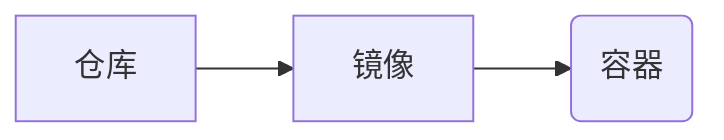

## 1. 背景介绍

### 1.1 软件开发的挑战

在传统的软件开发流程中，开发者常常会遇到"在我的机器上明明可以运行！"的窘境。这种问题通常源于开发环境、测试环境和生产环境之间的差异，例如操作系统版本、依赖库版本等。这些差异会导致应用程序在不同环境中表现不一致，给部署和维护带来巨大挑战。

### 1.2 容器技术的兴起

为了解决这些问题，容器技术应运而生。容器技术可以将应用程序及其所有依赖项（包括库、配置文件等）打包到一个独立的、可执行的镜像中。这个镜像可以在任何支持该容器技术的平台上运行，从而保证应用程序在不同环境中行为一致。

### 1.3 容器的优势

容器技术相较于传统虚拟化技术，具有以下优势：

* **轻量级**: 容器镜像通常比虚拟机镜像小得多，启动速度更快，资源消耗更低。
* **可移植性**: 容器可以在任何支持该容器技术的平台上运行，无需担心环境差异。
* **易于部署**: 使用容器可以快速部署和扩展应用程序，简化运维工作。
* **隔离性**: 容器提供应用程序级别的隔离，不同容器之间互不干扰。


## 2. 核心概念与联系

### 2.1 镜像 (Image)

镜像是一个只读模板，用于创建容器。它包含应用程序代码、运行时环境、库文件、配置文件等所有必要组件。

### 2.2 容器 (Container)

容器是镜像的运行实例。可以将容器看作一个轻量级的虚拟机，它拥有自己的文件系统、进程空间和网络接口。

### 2.3 仓库 (Registry)

仓库用于存储和分发镜像。常见的容器仓库有 Docker Hub、阿里云容器镜像服务等。

### 2.4 关系图




## 3. 核心算法原理具体操作步骤

### 3.1 Docker 镜像构建流程

1.  **编写 Dockerfile**: Dockerfile 是一个文本文件，包含构建镜像的指令。
2.  **执行 `docker build` 命令**: Docker 客户端读取 Dockerfile 并执行其中的指令，最终构建出镜像。

### 3.2 Docker 容器运行流程

1.  **拉取镜像**: 从仓库中拉取镜像到本地。
2.  **创建容器**: 使用镜像创建容器实例。
3.  **启动容器**: 启动容器，运行应用程序。

## 4. 数学模型和公式详细讲解举例说明

容器技术本身并不涉及复杂的数学模型和公式，其核心在于 Linux 内核提供的 namespace 和 cgroups 技术。

### 4.1 Namespace

Namespace 用于隔离进程的系统资源，例如 PID、网络、用户、挂载点等。每个容器都运行在自己的 namespace 中，与其他容器隔离。

### 4.2 Cgroups

Cgroups 用于限制进程对系统资源的使用，例如 CPU、内存、磁盘 I/O 等。可以通过 cgroups 限制容器的资源使用量。

## 5. 项目实践：代码实例和详细解释说明

### 5.1 创建一个简单的 Web 应用

```python
# app.py
from flask import Flask

app = Flask(__name__)

@app.route('/')
def hello_world():
    return 'Hello, World!'

if __name__ == '__main__':
    app.run(host='0.0.0.0', port=5000)
```

### 5.2 编写 Dockerfile

```dockerfile
FROM python:3.9-slim-buster

WORKDIR /app

COPY requirements.txt .
RUN pip install -r requirements.txt

COPY . .

CMD ["python", "app.py"]
```

### 5.3 构建镜像

```bash
docker build -t my-web-app .
```

### 5.4 运行容器

```bash
docker run -d -p 5000:5000 my-web-app
```

## 6. 实际应用场景

### 6.1 微服务架构

容器技术非常适合构建微服务架构，每个微服务可以打包成一个独立的容器，独立部署和扩展。

### 6.2 CI/CD

容器技术可以与 CI/CD 流程无缝集成，实现应用程序的自动化构建、测试和部署。

### 6.3 云原生应用

容器是云原生应用的重要组成部分，可以充分利用云计算平台的弹性和可扩展性。

## 7. 工具和资源推荐

### 7.1 Docker

Docker 是最流行的容器引擎之一，提供了完整的容器生命周期管理工具。

### 7.2 Kubernetes

Kubernetes 是一个开源的容器编排系统，用于自动化部署、扩展和管理容器化应用程序。

### 7.3 Docker Hub

Docker Hub 是一个公共的 Docker 镜像仓库，可以找到各种常用软件的镜像。

## 8. 总结：未来发展趋势与挑战

### 8.1 未来发展趋势

*   **无服务器计算**: 容器技术将进一步与无服务器计算平台融合，简化应用程序的部署和管理。
*   **边缘计算**: 容器技术可以将应用程序部署到边缘设备，实现更快的响应速度和更低的延迟。
*   **安全**: 容器安全将越来越受到重视，各种安全工具和最佳实践将不断涌现。

### 8.2 面临的挑战

*   **复杂性**: 容器技术本身比较复杂，需要一定的学习成本。
*   **安全性**: 容器安全是一个重要问题，需要采取措施防止容器逃逸等安全风险。
*   **生态系统**: 容器生态系统发展迅速，各种工具和平台层出不穷，需要不断学习和更新知识。

## 9. 附录：常见问题与解答

### 9.1 容器和虚拟机的区别是什么？

容器和虚拟机都是虚拟化技术，但它们在实现方式和应用场景上有所不同。容器是操作系统级别的虚拟化，共享宿主机的内核；而虚拟机是硬件级别的虚拟化，拥有自己的内核。容器更加轻量级、启动速度更快、资源消耗更低，适合部署微服务等应用；而虚拟机隔离性更好、安全性更高，适合运行对资源要求较高的应用。

### 9.2 如何选择合适的容器编排工具？

目前主流的容器编排工具有 Kubernetes、Docker Swarm 和 Apache Mesos。Kubernetes 功能强大、生态完善，适合大型应用的部署；Docker Swarm 简单易用，适合小型应用的部署；Apache Mesos 功能丰富，适合构建分布式系统。选择合适的工具需要根据具体的应用场景和需求进行评估。
