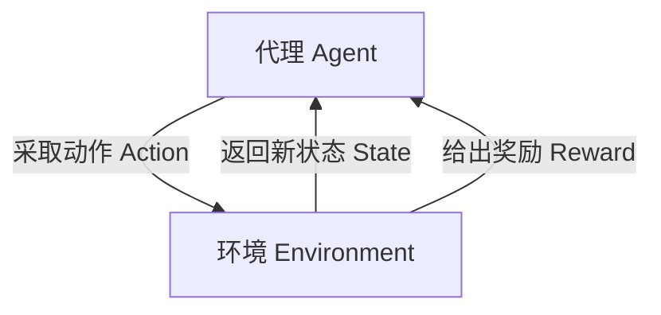

# 强化学习：在无人驾驶中的应用

作者：禅与计算机程序设计艺术

## 1. 背景介绍

### 1.1 无人驾驶技术的兴起

无人驾驶技术已经成为现代科技的前沿领域之一。随着人工智能和机器学习的迅猛发展，无人驾驶汽车的实现不再是科幻小说中的情节，而是逐渐成为现实。无人驾驶技术的应用不仅能够提高交通效率，减少交通事故，还能够显著降低能源消耗和环境污染。

### 1.2 强化学习的基本概念

强化学习（Reinforcement Learning, RL）是一种机器学习方法，它通过与环境的交互来学习如何采取行动以最大化累积奖励。与监督学习不同，强化学习不需要预先标注的数据，而是通过试错和奖励机制来优化策略。RL 在解决复杂决策问题方面表现出色，特别适用于无人驾驶这种动态、多变的环境。

### 1.3 强化学习在无人驾驶中的重要性

在无人驾驶领域，车辆需要在复杂的道路环境中实时做出决策，例如避让行人、变道、停车等。这些任务需要车辆具备高度的自主性和智能性。强化学习通过模拟和实际环境中的不断学习和优化，可以使无人驾驶汽车在各种复杂场景中表现出色。

## 2. 核心概念与联系

### 2.1 强化学习的基本组件

强化学习系统通常由以下几个核心组件组成：

#### 2.1.1 代理（Agent）

代理是执行动作的主体。在无人驾驶中，代理就是无人驾驶汽车。

#### 2.1.2 环境（Environment）

环境是代理所处的外部世界。在无人驾驶中，环境包括道路、交通信号、其他车辆和行人等。

#### 2.1.3 状态（State）

状态是对环境的描述。在无人驾驶中，状态可以包括车辆的速度、位置、周围障碍物的位置等。

#### 2.1.4 动作（Action）

动作是代理对环境采取的操作。在无人驾驶中，动作可以是加速、刹车、转向等。

#### 2.1.5 奖励（Reward）

奖励是对代理所采取动作的反馈。在无人驾驶中，奖励可以是到达目的地、避免碰撞等。

### 2.2 强化学习的工作流程

强化学习的工作流程可以用以下图示来表示：



### 2.3 强化学习与无人驾驶的联系

在无人驾驶中，强化学习可以通过不断地与环境交互，学习到最优的驾驶策略。具体来说，车辆可以通过模拟训练和实际道路测试，不断优化其驾驶策略，以应对各种复杂的交通状况。

## 3. 核心算法原理具体操作步骤

### 3.1 Q-Learning 算法

Q-Learning 是一种经典的强化学习算法，适用于离散状态和动作空间。其基本思想是通过更新状态-动作值函数（Q 函数）来找到最优策略。

#### 3.1.1 Q 函数的定义

Q 函数 $Q(s, a)$ 表示在状态 $s$ 下采取动作 $a$ 所能获得的期望累计奖励。

#### 3.1.2 Q 函数的更新公式

$$
Q(s, a) \leftarrow Q(s, a) + \alpha [r + \gamma \max_{a'} Q(s', a') - Q(s, a)]
$$

其中，$\alpha$ 是学习率，$r$ 是即时奖励，$\gamma$ 是折扣因子，$s'$ 是执行动作 $a$ 后的新状态，$a'$ 是新状态下的最优动作。

#### 3.1.3 Q-Learning 算法步骤

1. 初始化 Q 函数。
2. 重复以下步骤直到收敛：
   - 在状态 $s$ 下选择动作 $a$（根据 ε-greedy 策略）。
   - 执行动作 $a$，观察新的状态 $s'$ 和奖励 $r$。
   - 更新 Q 函数。
   - 将状态 $s$ 更新为 $s'$。

### 3.2 深度 Q 网络（DQN）

深度 Q 网络（Deep Q-Network, DQN）是 Q-Learning 的扩展，适用于连续状态空间。DQN 使用神经网络来近似 Q 函数。

#### 3.2.1 DQN 的基本结构

DQN 由一个深度神经网络组成，输入为状态 $s$，输出为各个动作的 Q 值。

#### 3.2.2 DQN 的训练方法

1. 使用经验回放（Experience Replay）技术，将代理的经验存储在记忆库中。
2. 使用小批量随机梯度下降（Mini-batch Stochastic Gradient Descent）从记忆库中抽取样本进行训练。
3. 使用目标网络（Target Network）来稳定训练过程。

### 3.3 策略梯度方法

策略梯度方法直接对策略进行优化，适用于连续动作空间。

#### 3.3.1 策略梯度的基本思想

策略梯度方法通过最大化期望累计奖励来优化策略 $\pi(a|s)$。

#### 3.3.2 策略梯度的更新公式

$$
\nabla J(\theta) = \mathbb{E}_{\pi_\theta} \left[ \nabla_\theta \log \pi_\theta(a|s) Q^{\pi_\theta}(s, a) \right]
$$

其中，$\theta$ 是策略的参数，$J(\theta)$ 是期望累计奖励。

## 4. 数学模型和公式详细讲解举例说明

### 4.1 马尔可夫决策过程（MDP）

马尔可夫决策过程（Markov Decision Process, MDP）是强化学习的数学模型。MDP 由五元组 $(S, A, P, R, \gamma)$ 组成：

- $S$：状态空间。
- $A$：动作空间。
- $P$：状态转移概率函数，$P(s'|s, a)$ 表示在状态 $s$ 下采取动作 $a$ 转移到状态 $s'$ 的概率。
- $R$：奖励函数，$R(s, a)$ 表示在状态 $s$ 下采取动作 $a$ 所获得的奖励。
- $\gamma$：折扣因子，$0 \leq \gamma \leq 1$。

### 4.2 值函数和 Bellman 方程

值函数 $V(s)$ 表示在状态 $s$ 下的期望累计奖励。动作值函数 $Q(s, a)$ 表示在状态 $s$ 下采取动作 $a$ 的期望累计奖励。

#### 4.2.1 Bellman 最优方程

值函数和动作值函数满足 Bellman 最优方程：

$$
V^*(s) = \max_a \left[ R(s, a) + \gamma \sum_{s'} P(s'|s, a) V^*(s') \right]
$$

$$
Q^*(s, a) = R(s, a) + \gamma \sum_{s'} P(s'|s, a) \max_{a'} Q^*(s', a')
$$

### 4.3 案例分析

假设我们有一个简单的无人驾驶场景，车辆需要从起点到达终点，中间有若干障碍物。我们可以使用 Q-Learning 来解决这个问题。

#### 4.3.1 环境设置

- 状态空间 $S$：车辆在网格中的位置。
- 动作空间 $A$：上下左右移动。
- 奖励函数 $R$：到达终点奖励 +100，撞上障碍物奖励 -100，每移动一步奖励 -1。

#### 4.3.2 Q-Learning 算法应用

1. 初始化 Q 函数为零。
2. 在起点开始，选择动作（根据 ε-greedy 策略）。
3. 执行动作，观察新的状态和奖励。
4. 更新 Q 函数。
5. 重复步骤 2-4，直到车辆到达终点或撞上障碍物。

## 5. 项目实践：代码实例和详细解释说明

### 5.1 环境搭建

我们将使用 Python 和 OpenAI Gym 来搭建一个简单的无人驾驶模拟环境。

```python
import gym
import numpy as np

# 创建环境
env = gym.make('CartPole-v1')

# 参数初始化
state_size = env.observation_space.shape[0]
action_size = env.action_space.n
q_table = np.zeros((state_size, action_size))
learning_rate = 0.1
discount_rate = 0.99
epsilon = 1.0
epsilon_decay = 0.995
min_epsilon = 0.01
episodes = 1000
