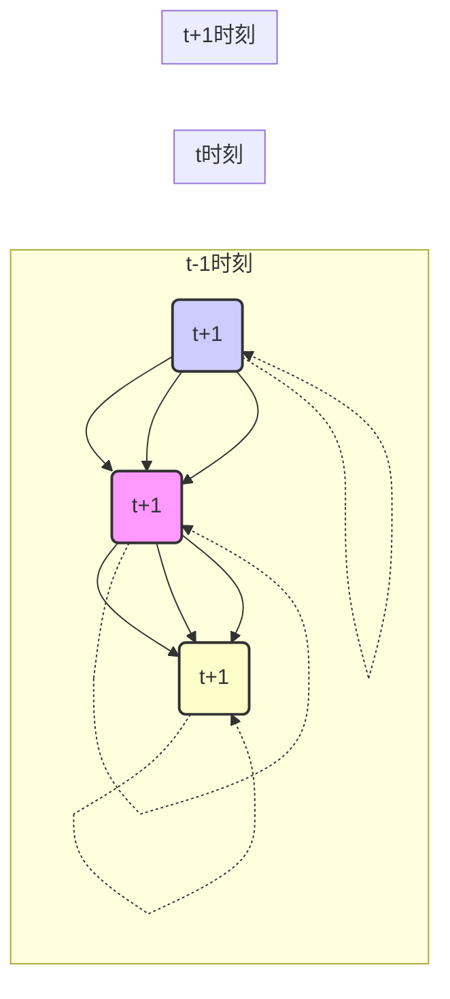

## 1. 背景介绍

### 1.1 人工智能与深度学习的简史

人工智能(AI) 的目标是让机器能够像人类一样思考、学习和解决问题。自 20 世纪 50 年代诞生以来，人工智能经历了多次浪潮，其中深度学习的兴起标志着人工智能进入了新的发展阶段。深度学习利用多层神经网络对数据进行学习和表示，在图像识别、语音识别、自然语言处理等领域取得了突破性进展。

### 1.2 循环神经网络的诞生与发展

传统的深度学习模型，例如卷积神经网络(CNN)，主要用于处理图像等具有空间结构的数据。然而，对于文本、语音、时间序列等具有时间依赖性的数据，CNN 无法有效地捕捉数据之间的时序关系。为了解决这个问题，循环神经网络(RNN)应运而生。RNN 通过引入循环连接，使得网络能够记忆历史信息，从而更好地处理序列数据。

### 1.3 RNN 的应用领域

RNN 在自然语言处理、语音识别、机器翻译、时间序列分析等领域有着广泛的应用，例如：

- **机器翻译：** 将一种语言的句子翻译成另一种语言的句子。
- **情感分析：** 分析文本中表达的情感，例如正面、负面或中性。
- **语音识别：** 将语音信号转换为文本。
- **时间序列预测：** 预测未来时间点的值，例如股票价格、天气预报等。

## 2. 核心概念与联系

### 2.1 神经网络基础

在深入了解 RNN 之前，我们需要先了解一些神经网络的基础知识。神经网络是由多个神经元组成的网络结构，每个神经元接收来自其他神经元的输入，并通过激活函数进行非线性变换，最终输出结果。神经网络通过调整神经元之间的连接权重来学习数据的模式和规律。

### 2.2 循环神经网络的结构

RNN 的核心在于其循环连接，使得网络能够记忆历史信息。典型的 RNN 结构如下图所示：



其中：

-  $x(t)$ 表示 $t$ 时刻的输入。
- $h(t)$ 表示 $t$ 时刻的隐藏状态，它包含了网络对过去信息的记忆。
- $o(t)$ 表示 $t$ 时刻的输出。

RNN 的每个时间步都执行相同的操作，即根据当前输入和上一时刻的隐藏状态计算当前时刻的隐藏状态和输出。

### 2.3 RNN 的类型

根据输入和输出序列的长度关系，RNN 可以分为以下几种类型：

- **一对一 (One-to-one)：** 每个输入对应一个输出，例如图像分类。
- **一对多 (One-to-many)：** 一个输入对应多个输出，例如图像描述生成。
- **多对一 (Many-to-one)：** 多个输入对应一个输出，例如情感分析。
- **多对多 (Many-to-many)：** 多个输入对应多个输出，例如机器翻译。

## 3. 核心算法原理具体操作步骤

### 3.1 前向传播

RNN 的前向传播过程可以概括为以下步骤：

1. 初始化隐藏状态 $h(0)$。
2. 对于每个时间步 $t$：
    - 计算当前时刻的隐藏状态：$h(t) = f(W_{xh}x(t) + W_{hh}h(t-1) + b_h)$，其中 $f$ 为激活函数，$W_{xh}$、$W_{hh}$ 和 $b_h$ 为可学习的参数。
    - 计算当前时刻的输出：$o(t) = g(W_{ho}h(t) + b_o)$，其中 $g$ 为输出层的激活函数，$W_{ho}$ 和 $b_o$ 为可学习的参数。

### 3.2 反向传播

RNN 的训练过程使用反向传播算法来更新网络参数。反向传播算法的目的是最小化网络的损失函数，损失函数用于衡量网络预测值与真实值之间的差异。

RNN 的反向传播算法称为**时间反向传播 (Backpropagation Through Time, BPTT)**，其基本思想是将 RNN 展开成一个深度前馈神经网络，然后应用标准的反向传播算法。

### 3.3 梯度消失与梯度爆炸

在训练 RNN 时，经常会遇到梯度消失或梯度爆炸的问题。梯度消失指的是在反向传播过程中，梯度随着时间步的增加而逐渐减小，导致网络难以学习到长期依赖关系。梯度爆炸指的是梯度随着时间步的增加而指数级增长，导致网络训练不稳定。

为了解决梯度消失和梯度爆炸问题，研究者们提出了多种改进方法，例如：

- **梯度裁剪 (Gradient Clipping)：** 限制梯度的最大值。
- **长短期记忆网络 (Long Short-Term Memory, LSTM)：** 通过引入门控机制来控制信息的流动，从而更好地捕捉长期依赖关系。
- **门控循环单元 (Gated Recurrent Unit, GRU)：** LSTM 的简化版本，参数更少，训练更快。

## 4. 数学模型和公式详细讲解举例说明

### 4.1 隐藏状态更新公式

RNN 的隐藏状态更新公式如下：

$$
h(t) = f(W_{xh}x(t) + W_{hh}h(t-1) + b_h)
$$

其中：

- $h(t)$ 表示 $t$ 时刻的隐藏状态。
- $f$ 为激活函数，常用的激活函数有 sigmoid、tanh 和 ReLU 等。
- $W_{xh}$ 表示输入到隐藏状态的权重矩阵。
- $x(t)$ 表示 $t$ 时刻的输入。
- $W_{hh}$ 表示隐藏状态到隐藏状态的权重矩阵。
- $h(t-1)$ 表示 $t-1$ 时刻的隐藏状态。
- $b_h$ 表示隐藏状态的偏置向量。

### 4.2 输出计算公式

RNN 的输出计算公式如下：

$$
o(t) = g(W_{ho}h(t) + b_o)
$$

其中：

- $o(t)$ 表示 $t$ 时刻的输出。
- $g$ 为输出层的激活函数，例如 softmax 函数用于多分类问题。
- $W_{ho}$ 表示隐藏状态到输出的权重矩阵。
- $h(t)$ 表示 $t$ 时刻的隐藏状态。
- $b_o$ 表示输出的偏置向量。

### 4.3 损失函数

RNN 的训练目标是最小化损失函数，常用的损失函数有交叉熵损失函数和均方误差损失函数等。

#### 4.3.1 交叉熵损失函数

交叉熵损失函数用于多分类问题，其公式如下：

$$
L = -\frac{1}{N}\sum_{i=1}^{N}\sum_{j=1}^{C}y_{ij}\log(p_{ij})
$$

其中：

- $N$ 表示样本数量。
- $C$ 表示类别数量。
- $y_{ij}$ 表示第 $i$ 个样本属于第 $j$ 类的真实标签，取值为 0 或 1。
- $p_{ij}$ 表示网络预测第 $i$ 个样本属于第 $j$ 类的概率。

#### 4.3.2 均方误差损失函数

均方误差损失函数用于回归问题，其公式如下：

$$
L = \frac{1}{N}\sum_{i=1}^{N}(y_i - \hat{y}_i)^2
$$

其中：

- $N$ 表示样本数量。
- $y_i$ 表示第 $i$ 个样本的真实值。
- $\hat{y}_i$ 表示网络预测第 $i$ 个样本的值。

### 4.4 举例说明

假设我们要训练一个 RNN 模型来预测一句话的情感是正面还是负面。

- 输入：一句话，例如 "I love this movie!"。
- 输出：情感类别，例如 "positive" 或 "negative"。

我们可以将每个单词转换为一个向量表示，例如使用词嵌入技术。然后将每个单词向量依次输入 RNN 网络，最后将最后一个时间步的隐藏状态输入到一个全连接层，并使用 softmax 函数计算每个情感类别的概率。

## 5. 项目实践：代码实例和详细解释说明

### 5.1 使用 Python 和 TensorFlow 构建 RNN 模型

```python
import tensorflow as tf

# 定义 RNN 模型
class RNNModel(tf.keras.Model):
    def __init__(self, vocab_size, embedding_dim, hidden_units, num_classes):
        super(RNNModel, self).__init__()
        self.embedding = tf.keras.layers.Embedding(vocab_size, embedding_dim)
        self.rnn = tf.keras.layers.SimpleRNN(hidden_units, return_sequences=False)
        self.fc = tf.keras.layers.Dense(num_classes)

    def call(self, x):
        x = self.embedding(x)
        x = self.rnn(x)
        x = self.fc(x)
        return x

# 定义超参数
vocab_size = 10000
embedding_dim = 128
hidden_units = 64
num_classes = 2

# 创建模型实例
model = RNNModel(vocab_size, embedding_dim, hidden_units, num_classes)

# 定义优化器和损失函数
optimizer = tf.keras.optimizers.Adam()
loss_fn = tf.keras.losses.CategoricalCrossentropy(from_logits=True)

# 定义训练步骤
def train_step(x, y):
    with tf.GradientTape() as tape:
        logits = model(x)
        loss = loss_fn(y, logits)
    gradients = tape.gradient(loss, model.trainable_variables)
    optimizer.apply_gradients(zip(gradients, model.trainable_variables))
    return loss

# 训练模型
epochs = 10
batch_size = 32

for epoch in range(epochs):
    for batch in range(num_batches):
        # 获取训练数据
        x_batch, y_batch = get_batch(batch_size)

        # 训练模型
        loss = train_step(x_batch, y_batch)

        # 打印训练进度
        print(f"Epoch: {epoch+1}, Batch: {batch+1}, Loss: {loss.numpy()}")

# 评估模型
loss, accuracy = model.evaluate(x_test, y_test, verbose=0)
print(f"Loss: {loss.numpy()}, Accuracy: {accuracy.numpy()}")
```

### 5.2 代码解释

- `RNNModel` 类定义了 RNN 模型的结构，包括词嵌入层、RNN 层和全连接层。
- `train_step` 函数定义了模型的训练步骤，包括计算损失、梯度和更新模型参数。
- 在训练循环中，我们迭代训练数据，并调用 `train_step` 函数训练模型。
- 最后，我们使用测试数据评估模型的性能。

## 6. 实际应用场景

### 6.1 自然语言处理

- **文本分类：** 情感分析、主题分类、垃圾邮件检测等。
- **机器翻译：** 将一种语言的文本翻译成另一种语言的文本。
- **文本生成：** 自动生成文本，例如诗歌、代码等。
- **问答系统：** 回答用户提出的问题。

### 6.2 语音识别

- **语音转文本：** 将语音信号转换为文本。
- **语音识别：** 识别语音中的单词和句子。
- **语音合成：** 将文本转换为语音信号。

### 6.3 时间序列分析

- **股票预测：** 预测股票价格的走势。
- **天气预报：** 预测未来的天气情况。
- **异常检测：** 检测时间序列数据中的异常点。

## 7. 工具和资源推荐

### 7.1 深度学习框架

- **TensorFlow：** Google 开源的深度学习框架，提供了丰富的 API 和工具。
- **PyTorch：** Facebook 开源的深度学习框架，以其灵活性和易用性著称。
- **Keras：** 高级神经网络 API，可以运行在 TensorFlow、Theano 和 CNTK 之上。

### 7.2 数据集

- **IMDB 电影评论数据集：** 用于情感分析的经典数据集。
- **WikiText 数据集：** 用于语言建模的大规模文本数据集。
- **UCI 机器学习库：** 包含各种机器学习数据集，包括时间序列数据。

### 7.3 学习资源

- **斯坦福大学 CS231n 卷积神经网络课程：** 深入讲解深度学习和卷积神经网络的经典课程。
- **吴恩达深度学习课程：** 由深度学习领域专家吴恩达教授的在线课程。
- **TensorFlow 官方文档：** 提供 TensorFlow 的详细文档和教程。

## 8. 总结：未来发展趋势与挑战

### 8.1 未来发展趋势

- **更深、更复杂的 RNN 模型：** 研究者们正在探索更深、更复杂的 RNN 模型，以提高模型的性能。
- **结合注意力机制：** 注意力机制可以帮助 RNN 模型更好地关注输入序列中的重要信息。
- **与其他深度学习模型结合：** 将 RNN 与其他深度学习模型结合，例如 CNN 和 Transformer，可以构建更强大的模型。

### 8.2 面临的挑战

- **计算复杂度高：** RNN 模型的训练和推理过程计算复杂度较高，尤其是在处理长序列数据时。
- **难以捕捉长期依赖关系：** 传统的 RNN 模型难以捕捉长期依赖关系，需要使用 LSTM 或 GRU 等改进方法。
- **数据需求量大：** 训练 RNN 模型需要大量的标注数据。

## 9. 附录：常见问题与解答

### 9.1 什么是循环神经网络？

循环神经网络(RNN)是一种特殊类型的神经网络，它通过引入循环连接，使得网络能够记忆历史信息，从而更好地处理序列数据。

### 9.2 RNN 有哪些应用？

RNN 在自然语言处理、语音识别、机器翻译、时间序列分析等领域有着广泛的应用。

### 9.3 RNN 有哪些类型？

根据输入和输出序列的长度关系，RNN 可以分为一对一、一对多、多对一和多对多四种类型。

### 9.4 RNN 训练过程中会遇到哪些问题？

RNN 训练过程中经常会遇到梯度消失或梯度爆炸的问题。

### 9.5 如何解决 RNN 训练过程中的问题？

为了解决梯度消失和梯度爆炸问题，可以使用梯度裁剪、LSTM、GRU 等方法。
