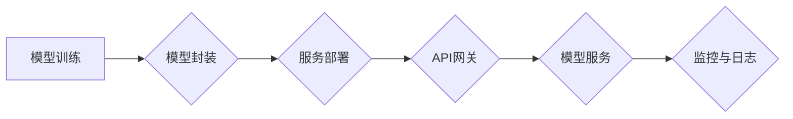

## 1. 背景介绍

### 1.1 人工智能应用落地的迫切需求

近年来，人工智能（AI）技术取得了突飞猛进的发展，在各个领域展现出巨大的应用潜力。然而，如何将AI模型从实验室研究成果转化为实际生产环境中的应用，成为了摆在众多企业和开发者面前的一大挑战。传统的AI模型开发流程通常止步于模型训练和评估阶段，缺乏将模型部署到生产环境并对外提供服务的有效手段。

### 1.2 模型服务化的兴起

为了解决AI应用落地难题，模型服务化应运而生。模型服务化是指将训练好的AI模型封装成可独立部署、可扩展、可调用的服务，通过标准化的接口（API）对外提供预测能力。这种服务化的方式使得AI模型能够像其他软件服务一样，被方便地集成到各种应用系统中，极大地简化了AI应用的开发和部署流程。

### 1.3 API设计的重要性

API（Application Programming Interface，应用程序编程接口）是模型服务化中至关重要的一个环节。API设计的好坏直接影响到模型服务的易用性、可扩展性和安全性。一个设计良好的API应该简洁易懂、功能完备、安全可靠，并且能够满足不同用户和应用场景的需求。

## 2. 核心概念与联系

### 2.1 模型服务化的核心组件

模型服务化通常涉及以下几个核心组件：

* **模型训练**: 使用历史数据训练出具备预测能力的AI模型。
* **模型封装**: 将训练好的模型封装成可独立运行的服务。
* **服务部署**: 将模型服务部署到生产环境中，对外提供服务。
* **API网关**: 负责接收API请求，并将请求路由到相应的模型服务进行处理。
* **监控与日志**: 对模型服务的运行状态进行监控，并记录相关的日志信息。

### 2.2 模型服务化与云原生技术的结合

随着云计算技术的快速发展，越来越多的企业选择将模型服务部署到云平台上。云原生技术，如容器化、微服务、服务网格等，为模型服务化提供了强大的技术支撑，使得模型服务的部署、管理和扩展更加便捷高效。

### 2.3 模型服务化的优势

* **简化AI应用开发**: 开发者无需关注模型部署和运维的细节，只需调用API即可使用模型的能力。
* **提高模型可重用性**: 模型服务可以被多个应用系统共享使用，避免重复开发。
* **提升模型迭代效率**: 模型更新后只需更新服务即可，无需修改应用系统代码。
* **增强模型安全性**: 模型服务可以通过API网关进行访问控制和安全认证。

## 3. 核心算法原理具体操作步骤

### 3.1 模型封装

模型封装是模型服务化的第一步，其目的是将训练好的模型转化为可独立运行的服务。常用的模型封装工具有：

* **TensorFlow Serving**: 由Google开源，支持TensorFlow模型的部署。
* **TorchServe**: 由PyTorch社区维护，支持PyTorch模型的部署。
* **MLflow**: 由Databricks开源，支持多种机器学习框架的模型管理和部署。

### 3.2 服务部署

模型服务部署的方式主要有以下几种：

* **容器化部署**: 将模型服务打包成Docker镜像，然后部署到Kubernetes等容器编排平台上。
* **Serverless部署**: 将模型服务部署到AWS Lambda、Azure Functions等Serverless平台上，根据实际请求量自动进行弹性伸缩。
* **边缘部署**: 将模型服务部署到靠近数据源的边缘设备上，以降低延迟和网络带宽消耗。

### 3.3 API设计

API设计是模型服务化的关键环节，需要遵循以下原则：

* **简洁易懂**: API接口应该简洁明了，易于理解和使用。
* **功能完备**: API接口应该提供模型服务的所有必要功能。
* **安全可靠**: API接口应该进行身份验证和授权，以确保模型服务的安全性。
* **可扩展性**: API接口应该易于扩展，以满足未来新的需求。

## 4. 数学模型和公式详细讲解举例说明

### 4.1 线性回归模型

线性回归模型是一种常用的机器学习模型，用于预测一个连续的目标变量。其数学模型如下：

$$
y = \beta_0 + \beta_1 x_1 + \beta_2 x_2 + ... + \beta_n x_n + \epsilon
$$

其中，$y$ 是目标变量，$x_1, x_2, ..., x_n$ 是特征变量，$\beta_0, \beta_1, \beta_2, ..., \beta_n$ 是模型参数，$\epsilon$ 是误差项。

**举例说明**:

假设我们要预测房价，可以使用线性回归模型，将房屋面积、卧室数量、浴室数量等特征变量作为输入，预测房价。

### 4.2 逻辑回归模型

逻辑回归模型是一种用于预测二分类目标变量的机器学习模型。其数学模型如下：

$$
p = \frac{1}{1 + e^{-(\beta_0 + \beta_1 x_1 + \beta_2 x_2 + ... + \beta_n x_n)}}
$$

其中，$p$ 是目标变量为正类的概率，$x_1, x_2, ..., x_n$ 是特征变量，$\beta_0, \beta_1, \beta_2, ..., \beta_n$ 是模型参数。

**举例说明**:

假设我们要预测用户是否会点击广告，可以使用逻辑回归模型，将用户的年龄、性别、兴趣爱好等特征变量作为输入，预测用户点击广告的概率。

## 5. 项目实践：代码实例和详细解释说明

### 5.1 使用Flask构建简单的模型服务

```python
from flask import Flask, request, jsonify
import pickle

# 加载模型
with open('model.pkl', 'rb') as f:
    model = pickle.load(f)

# 创建Flask应用
app = Flask(__name__)

# 定义API接口
@app.route('/predict', methods=['POST'])
def predict():
    # 获取请求数据
    data = request.get_json()

    # 进行预测
    prediction = model.predict(data['features'])

    # 返回预测结果
    return jsonify({'prediction': prediction.tolist()})

# 启动服务
if __name__ == '__main__':
    app.run(debug=True)
```

**代码解释**:

* 首先，我们使用`pickle`库加载训练好的模型。
* 然后，我们创建了一个Flask应用，并定义了一个`/predict` API接口。
* 当收到POST请求时，该接口会从请求数据中获取特征变量，并使用加载的模型进行预测。
* 最后，将预测结果以JSON格式返回给客户端。

### 5.2 使用Docker容器化部署模型服务

```dockerfile
FROM python:3.8

# 安装依赖库
COPY requirements.txt .
RUN pip install -r requirements.txt

# 复制模型文件和代码
COPY model.pkl .
COPY app.py .

# 暴露端口
EXPOSE 5000

# 启动服务
CMD ["python", "app.py"]
```

**Dockerfile解释**:

* 我们使用`python:3.8`作为基础镜像。
* 然后，我们安装了所需的依赖库，并复制了模型文件和代码。
* 接下来，我们暴露了5000端口，以便外部访问模型服务。
* 最后，我们使用`CMD`命令指定了容器启动时执行的命令，即运行`app.py`文件启动Flask应用。

## 6. 实际应用场景

### 6.1 金融风控

模型服务化可以用于构建实时风控系统，根据用户的交易行为、信用记录等信息，预测用户违约的风险，并采取相应的风控措施。

### 6.2 电商推荐

模型服务化可以用于构建个性化推荐系统，根据用户的浏览历史、购买记录等信息，预测用户感兴趣的商品，并进行精准推荐。

### 6.3 智能客服

模型服务化可以用于构建智能客服系统，根据用户的提问内容，自动识别用户意图，并提供相应的答案或解决方案。

## 7. 工具和资源推荐

### 7.1 模型封装工具

* TensorFlow Serving: https://www.tensorflow.org/tfx/guide/serving
* TorchServe: https://pytorch.org/serve/
* MLflow: https://mlflow.org/

### 7.2 服务部署平台

* Amazon SageMaker: https://aws.amazon.com/sagemaker/
* Google AI Platform: https://cloud.google.com/ai-platform/
* Microsoft Azure Machine Learning: https://azure.microsoft.com/en-us/services/machine-learning/

### 7.3 API设计工具

* Swagger: https://swagger.io/
* Postman: https://www.postman.com/

## 8. 总结：未来发展趋势与挑战

### 8.1 模型服务化的未来发展趋势

* **模型服务化平台化**: 随着模型服务化技术的成熟，将会出现越来越多的模型服务化平台，提供更加完善的模型管理、部署和监控功能。
* **模型服务化与边缘计算的结合**: 将模型服务部署到边缘设备上，可以降低延迟、提高实时性，并满足数据隐私保护的需求。
* **模型服务化的标准化**: 为了促进模型服务的互联互通，需要制定相关的标准规范，例如模型格式、API接口等。

### 8.2 模型服务化面临的挑战

* **模型性能优化**: 如何在保证模型预测精度的同时，提高模型服务的性能，是模型服务化面临的一大挑战。
* **模型安全**: 如何保护模型服务的安全性，防止模型被恶意攻击或滥用，也是需要重点关注的问题。
* **模型可解释性**: 为了提高模型的可信度，需要提高模型的可解释性，让用户了解模型的预测依据。

## 9. 附录：常见问题与解答

### 9.1 如何选择合适的模型服务化工具？

选择模型服务化工具需要考虑以下因素：

* **支持的模型格式**: 不同的工具支持不同的模型格式，需要选择与自己使用的模型格式兼容的工具。
* **部署方式**: 不同的工具支持不同的部署方式，需要根据自己的需求选择合适的部署方式。
* **功能特性**: 不同的工具提供不同的功能特性，需要根据自己的需求选择合适的工具。

### 9.2 如何保证模型服务的安全性？

可以通过以下措施来保证模型服务的安全性：

* **身份验证和授权**: 对API请求进行身份验证和授权，以确保只有授权用户才能访问模型服务。
* **数据加密**: 对传输中的数据进行加密，以防止数据泄露。
* **安全漏洞扫描**: 定期对模型服务进行安全漏洞扫描，及时发现和修复安全漏洞。

### 9.3 如何提高模型服务的性能？

可以通过以下措施来提高模型服务的性能：

* **模型压缩**: 使用模型压缩技术减小模型的大小，从而降低模型加载时间和内存占用。
* **模型量化**: 使用模型量化技术将模型参数从浮点数转换为整数，从而提高模型的计算效率。
* **硬件加速**: 使用GPU、TPU等硬件加速器来加速模型的计算。


## 10. Mermaid 流程图

