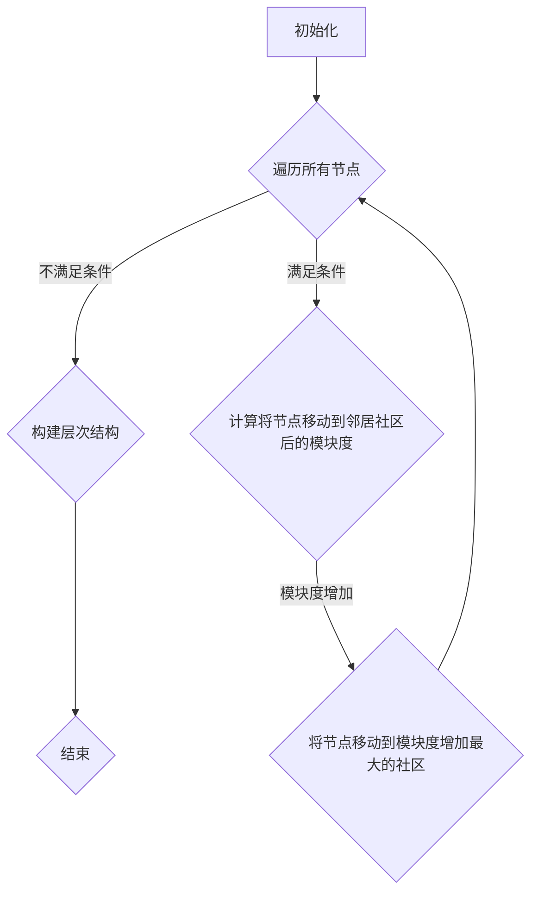
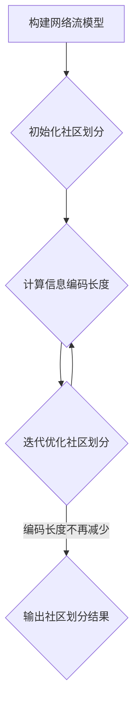

# 社区发现 原理与代码实例讲解

作者：禅与计算机程序设计艺术

## 1. 背景介绍

### 1.1 社区发现的意义

在当今信息爆炸的时代，人们每天都会接触到海量的数据，例如社交网络、电子商务平台、生物信息数据库等。这些数据通常以图的形式组织起来，节点代表实体，边代表实体之间的关系。如何从这些复杂的关系网络中挖掘出有价值的信息，成为了数据挖掘领域的一个重要课题。社区发现（Community Detection）就是其中一个重要的研究方向，它旨在将网络中的节点划分到不同的社区中，使得同一个社区内的节点连接紧密，而不同社区之间的节点连接稀疏。

社区发现的意义在于：

* **发现隐藏的群体结构:** 社区结构是许多复杂网络的基本特征，社区发现可以帮助我们理解网络的组织结构和功能。
* **进行群体行为分析:**  通过分析社区内部成员的行为模式，可以预测群体的未来发展趋势，例如预测用户购买行为、识别潜在的犯罪团伙等。
* **提高信息推荐的准确性:**  将用户划分到不同的兴趣社区，可以更精准地推荐用户感兴趣的内容。
* **辅助其他数据挖掘任务:**  社区发现可以作为其他数据挖掘任务的预处理步骤，例如节点分类、链接预测等。

### 1.2 社区发现的发展历史

社区发现的研究最早可以追溯到 20 世纪 50 年代，社会学家们开始使用图论的方法来研究社会网络中的群体结构。随着计算机技术的快速发展，社区发现算法得到了长足的进步，涌现出了许多经典的算法，例如：

* **图分割算法 (Graph Partitioning Algorithms):**  例如 Kernighan-Lin 算法、谱聚类算法等。
* **层次聚类算法 (Hierarchical Clustering Algorithms):**  例如 Louvain 算法、Infomap 算法等。
* **基于模块度的算法 (Modularity-based Algorithms):**  例如 FastGreedy 算法、Newman's spectral optimization 算法等。

近年来，随着深度学习技术的兴起，研究者们开始尝试将深度学习应用于社区发现，并取得了一些突破性的进展。

## 2. 核心概念与联系

### 2.1 图论基础

在介绍社区发现算法之前，我们先来回顾一下图论中的一些基本概念：

* **图 (Graph):**  图是由节点和边组成的集合，记为 $G = (V, E)$，其中 $V$ 表示节点集合，$E$ 表示边集合。
* **邻接矩阵 (Adjacency Matrix):**  邻接矩阵是一个 $n \times n$ 的矩阵，其中 $n$ 是图中节点的个数。如果节点 $i$ 和节点 $j$ 之间存在边，则邻接矩阵中第 $i$ 行第 $j$ 列的元素为 1，否则为 0。
* **度 (Degree):**  节点的度是指与该节点相连的边的数量。
* **路径 (Path):**  路径是指连接图中两个节点的一条边序列。
* **连通图 (Connected Graph):**  如果图中任意两个节点之间都存在路径，则称该图为连通图。

### 2.2 社区结构

社区结构是指网络中节点聚集成若干个子群的现象，这些子群内部节点连接紧密，而子群之间节点连接稀疏。社区结构可以用以下指标来衡量：

* **模块度 (Modularity):** 模块度是衡量社区结构强度的指标，其取值范围为 $[-1, 1]$，模块度值越大，表示社区结构越明显。
* **聚类系数 (Clustering Coefficient):** 聚类系数用于衡量网络中节点的聚集程度，其取值范围为 $[0, 1]$，聚类系数越高，表示节点的聚集程度越高。
* **Conductance:** Conductance 用于衡量社区内部连接的紧密程度，其取值范围为 $[0, 1]$，Conductance 越低，表示社区内部连接越紧密。

## 3. 核心算法原理具体操作步骤

### 3.1 Louvain 算法

Louvain 算法是一种基于贪婪策略的层次聚类算法，其基本思想是：

1. **初始化:** 将每个节点都看作是一个独立的社区。
2. **迭代优化:**  
    * 遍历所有节点，计算将该节点移动到其邻居节点所在的社区后，模块度是否会增加。
    * 如果模块度增加，则将该节点移动到模块度增加最大的社区中。
    * 重复上述步骤，直到模块度不再增加为止。
3. **构建层次结构:**  将所有节点合并到一个社区中，然后重复步骤 2，直到只剩下一个社区为止。

#### 3.1.1 模块度计算公式

Louvain 算法中使用的模块度计算公式如下：

$$
Q = \frac{1}{2m} \sum_{i,j} \left[ A_{ij} - \frac{k_i k_j}{2m} \right] \delta(c_i, c_j)
$$

其中：

* $m$ 是图中边的数量。
* $A_{ij}$ 是邻接矩阵中第 $i$ 行第 $j$ 列的元素。
* $k_i$ 是节点 $i$ 的度。
* $c_i$ 表示节点 $i$ 所属的社区。
* $\delta(c_i, c_j)$ 是一个指示函数，如果 $c_i = c_j$，则 $\delta(c_i, c_j) = 1$，否则 $\delta(c_i, c_j) = 0$。

#### 3.1.2 Louvain 算法流程图



### 3.2 Infomap 算法

Infomap 算法是一种基于信息论的社区发现算法，其基本思想是：

1. **构建网络流模型:**  将网络看作是一个信息流动网络，每个节点都是一个信息源，信息沿着网络中的边流动。
2. **最小化信息编码长度:**  寻找一种社区划分方式，使得描述信息流动路径所需的编码长度最短。

#### 3.2.1  信息编码长度计算公式

Infomap 算法中使用的信息编码长度计算公式如下：

$$
L = \sum_{i=1}^n q_i \log_2 q_i - 2 \sum_{i=1}^n \sum_{j=1}^n p_{ij} \log_2 p_{ij}
$$

其中：

* $n$ 是图中节点的个数。
* $q_i$ 是节点 $i$ 属于某个社区的概率。
* $p_{ij}$ 是信息从节点 $i$ 流动到节点 $j$ 的概率。

#### 3.2.2 Infomap 算法流程图



## 4. 数学模型和公式详细讲解举例说明

### 4.1 模块度

模块度是衡量社区结构强度的指标，其定义如下：

$$
Q = \frac{1}{2m} \sum_{i,j} \left[ A_{ij} - \frac{k_i k_j}{2m} \right] \delta(c_i, c_j)
$$

其中：

* $m$ 是图中边的数量。
* $A_{ij}$ 是邻接矩阵中第 $i$ 行第 $j$ 列的元素，表示节点 $i$ 和节点 $j$ 之间是否存在边。
* $k_i$ 是节点 $i$ 的度，表示与节点 $i$ 相连的边的数量。
* $c_i$ 表示节点 $i$ 所属的社区。
* $\delta(c_i, c_j)$ 是一个指示函数，如果 $c_i = c_j$，则 $\delta(c_i, c_j) = 1$，否则 $\delta(c_i, c_j) = 0$。

模块度的取值范围为 $[-1, 1]$，模块度值越大，表示社区结构越明显。

**举例说明：**

假设有一个社交网络，其邻接矩阵如下：

$$
A = \begin{bmatrix}
0 & 1 & 1 & 0 & 0 \\
1 & 0 & 1 & 0 & 0 \\
1 & 1 & 0 & 1 & 1 \\
0 & 0 & 1 & 0 & 1 \\
0 & 0 & 1 & 1 & 0
\end{bmatrix}
$$

现在将该网络划分成两个社区：$\{1, 2\}$ 和 $\{3, 4, 5\}$，则模块度为：

$$
\begin{aligned}
Q &= \frac{1}{2 \times 6} \left[ (1 - \frac{2 \times 3}{2 \times 6}) + (1 - \frac{2 \times 3}{2 \times 6}) + (1 - \frac{3 \times 3}{2 \times 6}) + (1 - \frac{3 \times 2}{2 \times 6}) + (1 - \frac{2 \times 2}{2 \times 6}) \right] \\
&= \frac{1}{12} (1 + 1 + \frac{3}{4} + \frac{1}{2} + \frac{1}{2}) \\
&= \frac{11}{48} \approx 0.23
\end{aligned}
$$

### 4.2 信息编码长度

Infomap 算法中使用的信息编码长度计算公式如下：

$$
L = \sum_{i=1}^n q_i \log_2 q_i - 2 \sum_{i=1}^n \sum_{j=1}^n p_{ij} \log_2 p_{ij}
$$

其中：

* $n$ 是图中节点的个数。
* $q_i$ 是节点 $i$ 属于某个社区的概率。
* $p_{ij}$ 是信息从节点 $i$ 流动到节点 $j$ 的概率。

**举例说明：**

假设有一个网络，其邻接矩阵和社区划分如下：

$$
A = \begin{bmatrix}
0 & 1 & 1 & 0 \\
1 & 0 & 1 & 0 \\
1 & 1 & 0 & 1 \\
0 & 0 & 1 & 0
\end{bmatrix}
$$

社区划分：$\{1, 2\}$, $\{3, 4\}$

则信息编码长度为：

$$
\begin{aligned}
L &= (\frac{1}{2} \log_2 \frac{1}{2} + \frac{1}{2} \log_2 \frac{1}{2}) + (\frac{1}{2} \log_2 \frac{1}{2} + \frac{1}{2} \log_2 \frac{1}{2}) - 2 [ (\frac{1}{3} \log_2 \frac{1}{3} + \frac{1}{3} \log_2 \frac{1}{3} + \frac{1}{3} \log_2 \frac{1}{3}) + (\frac{1}{2} \log_2 \frac{1}{2} + \frac{1}{2} \log_2 \frac{1}{2}) ] \\
&= -2 - 2 (\frac{1}{3} \log_2 \frac{1}{3} + \frac{1}{2} \log_2 \frac{1}{2}) \\
&\approx 2.58
\end{aligned}
$$

## 5. 项目实践：代码实例和详细解释说明

### 5.1 使用 NetworkX 和 python-louvain 实现 Louvain 算法

```python
import networkx as nx
import community as community_louvain

# 创建一个图
G = nx.karate_club_graph()

# 使用 Louvain 算法进行社区发现
partition = community_louvain.best_partition(G)

# 打印社区划分结果
print(partition)

# 绘制社区结构图
nx.draw(G, with_labels=True, node_color=[partition[node] for node in G])
plt.show()
```

**代码解释：**

1. 首先，我们使用 `networkx` 库创建了一个空手道俱乐部网络。
2. 然后，我们使用 `community_louvain.best_partition()` 函数对该网络进行社区发现，并将社区划分结果存储在 `partition` 变量中。
3. 最后，我们打印了社区划分结果，并使用 `networkx` 库绘制了社区结构图。

### 5.2 使用 igraph 实现 Infomap 算法

```python
import igraph as ig

# 创建一个图
g = ig.Graph.Famous("Zachary")

# 使用 Infomap 算法进行社区发现
dendrogram = g.community_infomap()

# 获取最佳社区划分
partition = dendrogram.as_clustering()

# 打印社区划分结果
print(partition)

# 绘制社区结构图
ig.plot(partition)
```

**代码解释：**

1. 首先，我们使用 `igraph` 库创建了 Zachary 空手道俱乐部网络。
2. 然后，我们使用 `g.community_infomap()` 函数对该网络进行社区发现，并将结果存储在 `dendrogram` 变量中。
3. 接下来，我们使用 `dendrogram.as_clustering()` 函数获取最佳社区划分，并将结果存储在 `partition` 变量中。
4. 最后，我们打印了社区划分结果，并使用 `igraph` 库绘制了社区结构图。

## 6. 实际应用场景

### 6.1 社交网络分析

* **好友推荐:**  将用户划分到不同的兴趣社区，可以更精准地推荐用户可能感兴趣的好友。
* **社群营销:**  根据用户所属的社区，可以制定更精准的营销策略。
* **舆情监测:**  通过分析不同社区的用户言论，可以及时发现潜在的社会热点问题。

### 6.2 生物信息学

* **蛋白质相互作用网络分析:**  将蛋白质划分到不同的功能模块，可以帮助我们理解蛋白质的功能和相互作用关系。
* **基因共表达网络分析:**  将基因划分到不同的表达模块，可以帮助我们发现基因的调控关系。

### 6.3 推荐系统

* **基于社区的协同过滤:**  将用户划分到不同的兴趣社区，可以提高协同过滤算法的推荐准确率。
* **基于社区的内容推荐:**  根据用户所属的社区，可以推荐用户可能感兴趣的内容。

### 6.4 金融风控

* **欺诈检测:**  通过分析交易网络中的社区结构，可以识别潜在的欺诈团伙。
* **反洗钱:**  通过分析资金流动网络中的社区结构，可以追踪资金的流动路径，识别洗钱行为。

## 7. 总结：未来发展趋势与挑战

### 7.1 未来发展趋势

* **动态社区发现:**  现实世界中的网络通常是动态变化的，如何对动态网络进行社区发现是一个重要的研究方向。
* **异构网络社区发现:**  现实世界中的网络通常是由不同类型的节点和边组成的，如何对异构网络进行社区发现是一个挑战性的问题。
* **深度学习与社区发现的结合:**  深度学习可以自动学习网络中的特征表示，可以用于提高社区发现算法的性能。

### 7.2 面临的挑战

* **可扩展性:**  现有的社区发现算法大多只能处理小规模网络，如何设计高效的算法来处理大规模网络是一个挑战。
* **评估指标:**  目前还没有一个统一的标准来评估社区发现算法的性能，如何设计更合理的评估指标是一个值得研究的问题。
* **实际应用:**  如何将社区发现算法应用到实际问题中，并取得良好的效果，还需要进行更多的探索。

## 8. 附录：常见问题与解答

### 8.1 什么是社区发现？

社区发现是指将网络中的节点划分到不同的社区中，使得同一个社区内的节点连接紧密，而不同社区之间的节点连接稀疏。

### 8.2 社区发现有哪些算法？

常见的社区发现算法有：Louvain 算法、Infomap 算法、标签传播算法 (Label Propagation Algorithm) 等。

### 8.3 如何评估社区发现算法的性能？

常用的评估指标有：模块度 (Modularity)、归一化割 (Normalized Cut)、Conductance 等。

### 8.4 社区发现有哪些应用场景？

社区发现可以应用于社交网络分析、生物信息学、推荐系统、金融风控等领域。
