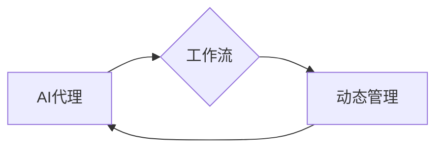

## 1. 背景介绍

### 1.1. AI代理和工作流的兴起

近年来，人工智能（AI）技术发展迅速，各种AI代理被广泛应用于各个领域，例如：

* **聊天机器人：** 用于客户服务、在线咨询等场景。
* **推荐系统：** 为用户推荐个性化的商品、服务或内容。
* **交易机器人：** 自动执行交易策略，例如高频交易、算法交易等。
* **游戏AI：** 在游戏中模拟人类玩家的行为，提供更具挑战性和趣味性的游戏体验。

随着AI代理应用的不断深入，人们发现单个AI代理的能力往往有限，难以满足复杂场景的需求。为了解决这个问题，AI代理工作流应运而生。

**AI代理工作流**是指将多个AI代理按照一定的逻辑关系组织起来，协同完成复杂任务的一种机制。通过合理地设计和管理工作流，可以充分发挥各个AI代理的优势，实现1+1>2的效果。

### 1.2. 动态管理的必要性

传统的AI代理工作流通常是静态的，即在设计阶段就确定了工作流程和各个代理的角色和任务。然而，现实世界中的问题往往是动态变化的，静态的工作流难以适应这种变化。例如：

* **环境变化：** 市场行情、用户需求、竞争对手策略等因素的变化，都会影响AI代理工作流的效率和效果。
* **代理性能变化：** 随着时间的推移，AI代理的性能可能会下降，例如模型老化、数据漂移等。
* **新代理的加入：** 新的AI技术和算法不断涌现，新的代理可能会带来更好的性能或解决新的问题。

为了应对这些挑战，我们需要对AI代理工作流进行动态管理，使其能够根据环境和自身状态的变化进行自适应调整，从而保持高效、灵活和鲁棒。

## 2. 核心概念与联系

### 2.1. AI代理

AI代理是指能够感知环境、做出决策并执行动作的智能体。一个典型的AI代理包含以下几个核心组件：

* **感知模块：** 负责收集和处理环境信息，例如传感器数据、用户输入等。
* **决策模块：** 根据感知到的信息和预先设定的目标，做出决策并制定行动计划。
* **执行模块：** 负责执行决策模块制定的行动计划，例如发送指令、控制设备等。

### 2.2. 工作流

工作流是指一系列按照特定顺序执行的任务或活动的集合。在AI代理工作流中，每个任务或活动通常由一个或多个AI代理负责执行。

### 2.3. 动态管理

动态管理是指根据环境和自身状态的变化，对AI代理工作流进行实时调整，以优化其性能和效率。动态管理的核心目标是：

* **自适应性：** 能够根据环境变化自动调整工作流程和代理配置。
* **智能化：** 能够利用机器学习等技术，从历史数据中学习和优化工作流。
* **鲁棒性：** 能够应对各种异常情况，例如代理故障、网络延迟等。

### 2.4. 核心概念之间的联系

如下图所示，AI代理、工作流和动态管理之间存在着密切的联系：



* AI代理是构成工作流的基本单元，工作流的效率和效果取决于各个代理的性能和协作能力。
* 工作流为AI代理提供了协同工作的框架，动态管理则是保证工作流能够适应动态环境的关键机制。
* 动态管理需要依赖于AI代理的感知、决策和执行能力，同时也需要对工作流的整体运行状态进行监控和分析。

## 3. 核心算法原理具体操作步骤

### 3.1. 基于强化学习的动态工作流调度

强化学习是一种机器学习方法，它可以让代理通过与环境交互来学习最佳行为策略。在AI代理工作流中，可以使用强化学习来动态地调度工作流中的任务，以优化整体性能。

**具体操作步骤：**

1. **定义状态空间：** 将工作流的当前状态表示为一个状态向量，例如各个代理的负载情况、任务的完成进度等。
2. **定义动作空间：** 定义代理可以采取的行动，例如将任务分配给哪个代理、调整代理的资源配额等。
3. **定义奖励函数：** 根据工作流的整体目标，定义一个奖励函数，用于评估代理采取的行动带来的收益。
4. **训练强化学习代理：** 使用强化学习算法（例如Q-learning、SARSA等）训练一个代理，该代理能够根据当前状态选择最佳的行动，以最大化长期累积奖励。

### 3.2. 基于多代理系统的工作流自适应

多代理系统是由多个相互交互的代理组成的系统。在AI代理工作流中，可以将各个代理视为一个多代理系统，并利用多代理系统的方法来实现工作流的自适应。

**具体操作步骤：**

1. **代理通信：** 代理之间可以通过消息传递等方式进行通信，共享信息和协商行动。
2. **协同决策：** 代理可以根据自身的目标和感知到的环境信息，协同做出决策，例如任务分配、资源共享等。
3. **自组织：** 代理可以根据环境变化和自身状态，动态地调整自身的行动策略和组织结构，以适应新的情况。

## 4. 数学模型和公式详细讲解举例说明

### 4.1. 基于排队论的工作流性能建模

排队论是一种研究排队现象的数学理论，可以用来分析和预测工作流的性能指标，例如任务平均等待时间、系统吞吐量等。

**数学模型：**

假设工作流中的任务到达服从泊松分布，服务时间服从指数分布，则可以使用M/M/1排队模型来描述工作流的性能。

**公式：**

* **平均等待时间：** $W = \frac{\rho}{\mu (1 - \rho)}$
* **系统吞吐量：** $X = \frac{1}{W + \frac{1}{\mu}}$

其中：

* $\lambda$：任务到达率
* $\mu$：服务率
* $\rho = \frac{\lambda}{\mu}$：系统负载

**举例说明：**

假设一个工作流的任务到达率为每秒10个，服务率为每秒15个，则系统的负载为$\rho = \frac{10}{15} = \frac{2}{3}$。根据上述公式，可以计算出平均等待时间为$W = \frac{2/3}{15(1 - 2/3)} = 0.044$秒，系统吞吐量为$X = \frac{1}{0.044 + \frac{1}{15}} = 14.29$个/秒。

### 4.2. 基于马尔可夫决策过程的强化学习建模

马尔可夫决策过程（MDP）是一种用于建模顺序决策问题的数学框架，可以用来描述强化学习问题。

**数学模型：**

一个MDP可以表示为一个五元组$(S, A, P, R, \gamma)$，其中：

* $S$：状态空间，表示所有可能的状态的集合
* $A$：动作空间，表示所有可能的行动的集合
* $P$：状态转移概率矩阵，表示在状态$s$下采取行动$a$后转移到状态$s'$的概率
* $R$：奖励函数，表示在状态$s$下采取行动$a$后获得的奖励
* $\gamma$：折扣因子，用于平衡当前奖励和未来奖励的重要性

**公式：**

* **状态值函数：** $V(s) = \max_{a \in A} \sum_{s' \in S} P(s'|s, a) [R(s, a, s') + \gamma V(s')]$
* **动作值函数：** $Q(s, a) = \sum_{s' \in S} P(s'|s, a) [R(s, a, s') + \gamma \max_{a' \in A} Q(s', a')]$

**举例说明：**

假设一个AI代理工作流中有两个状态：任务队列为空和任务队列非空。代理可以采取两个行动：继续处理任务和等待新任务。奖励函数定义为：如果任务队列为空时代理选择等待，则获得奖励1；否则获得奖励0。折扣因子设置为0.9。

可以使用值迭代算法求解该MDP的最优策略。

## 5. 项目实践：代码实例和详细解释说明

### 5.1. 使用Python实现一个简单的AI代理工作流

```python
import random
import time

class Agent:
    def __init__(self, name, processing_time):
        self.name = name
        self.processing_time = processing_time
        self.busy = False

    def process_task(self, task):
        print(f"Agent {self.name} is processing task {task}...")
        time.sleep(self.processing_time)
        print(f"Agent {self.name} finished processing task {task}.")
        self.busy = False

class Workflow:
    def __init__(self, agents):
        self.agents = agents
        self.task_queue = []

    def add_task(self, task):
        self.task_queue.append(task)

    def run(self):
        while True:
            for agent in self.agents:
                if not agent.busy and self.task_queue:
                    task = self.task_queue.pop(0)
                    agent.busy = True
                    agent.process_task(task)
            time.sleep(1)

# 创建三个代理
agent1 = Agent("Agent 1", 2)
agent2 = Agent("Agent 2", 3)
agent3 = Agent("Agent 3", 1)

# 创建工作流
workflow = Workflow([agent1, agent2, agent3])

# 添加任务
for i in range(10):
    workflow.add_task(i)

# 运行工作流
workflow.run()
```

**代码解释：**

* `Agent`类表示一个AI代理，包含名称、处理时间和是否忙碌等属性。
* `Workflow`类表示一个工作流，包含代理列表和任务队列等属性。
* `add_task()`方法用于向工作流中添加任务。
* `run()`方法用于运行工作流，循环遍历所有代理，如果代理空闲且任务队列不为空，则从任务队列中取出一个任务并分配给该代理处理。

### 5.2. 使用强化学习库训练一个动态工作流调度器

```python
import gym
import numpy as np
from stable_baselines3 import DQN

# 定义环境
class WorkflowEnv(gym.Env):
    def __init__(self, num_agents, task_arrival_rate, task_processing_times):
        super(WorkflowEnv, self).__init__()
        self.num_agents = num_agents
        self.task_arrival_rate = task_arrival_rate
        self.task_processing_times = task_processing_times
        self.action_space = gym.spaces.Discrete(self.num_agents)
        self.observation_space = gym.spaces.Box(low=0, high=np.inf, shape=(self.num_agents + 1,))

    def reset(self):
        self.task_queue = []
        self.agent_states = [0] * self.num_agents
        self.current_time = 0
        return self._get_observation()

    def step(self, action):
        # 处理到达的任务
        if random.random() < self.task_arrival_rate:
            self.task_queue.append(self.current_time)

        # 将任务分配给代理
        if self.task_queue and self.agent_states[action] == 0:
            arrival_time = self.task_queue.pop(0)
            self.agent_states[action] = self.task_processing_times[action]
            reward = -(self.current_time - arrival_time)
        else:
            reward = -1

        # 更新代理状态
        for i in range(self.num_agents):
            if self.agent_states[i] > 0:
                self.agent_states[i] -= 1

        # 更新时间
        self.current_time += 1

        # 判断是否结束
        done = False

        # 返回观察、奖励、结束标志和信息
        return self._get_observation(), reward, done, {}

    def _get_observation(self):
        return np.concatenate(([len(self.task_queue)], self.agent_states))

# 创建环境
env = WorkflowEnv(num_agents=3, task_arrival_rate=0.5, task_processing_times=[2, 3, 1])

# 创建DQN模型
model = DQN("MlpPolicy", env, verbose=1)

# 训练模型
model.learn(total_timesteps=10000)

# 保存模型
model.save("dqn_workflow_scheduler")

# 加载模型
model = DQN.load("dqn_workflow_scheduler")

# 测试模型
obs = env.reset()
while True:
    action, _states = model.predict(obs, deterministic=True)
    obs, reward, done, info = env.step(action)
    print(f"Observation: {obs}, Action: {action}, Reward: {reward}")
    if done:
        break
```

**代码解释：**

* `WorkflowEnv`类定义了一个强化学习环境，用于模拟AI代理工作流。
* `reset()`方法用于重置环境，初始化任务队列、代理状态和当前时间。
* `step()`方法用于执行一个时间步，处理到达的任务、将任务分配给代理、更新代理状态和时间。
* `_get_observation()`方法用于获取当前环境的观察，包括任务队列长度和代理状态。
* 使用`stable_baselines3`库创建了一个DQN模型，并使用训练好的模型进行测试。

## 6. 实际应用场景

### 6.1. 智能客服系统

在智能客服系统中，可以使用AI代理工作流来处理不同类型的客户咨询。例如：

* **一级代理：** 负责回答简单的问题，例如查询订单状态、修改个人信息等。
* **二级代理：** 负责处理更复杂的问题，例如投诉建议、产品咨询等。
* **人工客服：** 如果AI代理无法解决问题，则转接人工客服处理。

通过动态管理AI代理工作流，可以根据客户咨询量、代理服务质量等因素，动态地调整代理的配置和工作流程，以提高客户满意度和服务效率。

### 6.2. 金融交易系统

在金融交易系统中，可以使用AI代理工作流来执行不同的交易策略。例如：

* **趋势跟踪代理：** 根据市场趋势进行交易。
* **均值回归代理：** 当价格偏离均值时进行交易。
* **风险管理代理：** 控制交易风险，例如设置止损线等。

通过动态管理AI代理工作流，可以根据市场行情、交易成本等因素，动态地调整代理的配置和交易策略，以提高交易收益和风险控制能力。

## 7. 总结：未来发展趋势与挑战

### 7.1. 未来发展趋势

* **更加智能化的动态管理：** 利用深度强化学习、元学习等技术，开发更加智能化的动态管理算法，实现更精准、高效的工作流调整。
* **更加灵活的工作流架构：** 支持更灵活的工作流拓扑结构，例如动态添加/删除代理、分支/合并工作流程等。
* **更加完善的监控和评估体系：** 建立更加完善的工作流监控和评估体系，实时跟踪工作流的运行状态，及时发现和解决问题。

### 7.2. 面临的挑战

* **环境的复杂性和动态性：** 现实世界中的问题往往非常复杂，环境变化难以预测，这对动态管理算法的鲁棒性和自适应性提出了很高要求。
* **代理之间的协作和通信：** 如何设计高效的代理协作和通信机制，是实现复杂工作流动态管理的关键问题。
* **数据和计算资源的需求：** 动态管理算法通常需要大量的历史数据进行训练和优化，同时也需要强大的计算资源来支持实时决策，这对系统架构和资源管理提出了挑战。

## 8. 附录：常见问题与解答

### 8.1. 什么是AI代理工作流？

AI代理工作流是指将多个AI代理按照一定的逻辑关系组织起来，协同完成复杂任务的一种机制。

### 8.2. 为什么需要对AI代理工作流进行动态管理？

传统的静态工作流难以适应动态变化的环境和代理性能，动态管理可以使工作流更加自适应、智能化和鲁棒。

### 8.3. 有哪些常用的AI代理工作流动态管理方法？

常用的方法包括基于强化学习的动态工作流调度和基于多代理系统的工作流自适应。

### 8.4. AI代理工作流动态管理有哪些应用场景？

应用场景包括智能客服系统、金融交易系统、供应链管理系统等。