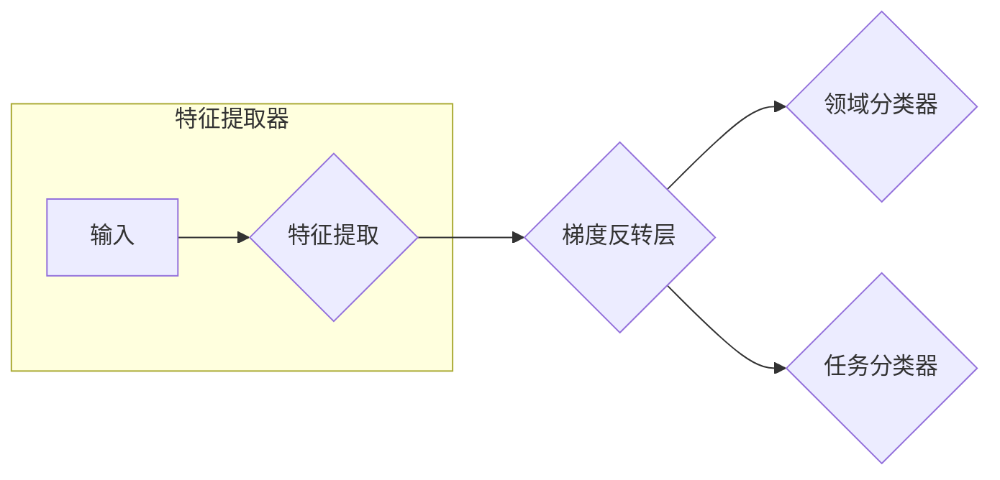

## 1. 背景介绍

### 1.1.  机器学习的挑战：数据依赖性

传统的机器学习方法通常假设训练数据和测试数据来自相同的特征空间和数据分布。然而，在许多实际应用中，这种假设往往不成立。例如，我们可能希望将一个在海量新闻文本数据上训练好的情感分类模型应用于识别电影评论的情感倾向。由于新闻文本和电影评论在主题、写作风格等方面存在较大差异，直接将模型迁移到新领域往往会导致性能下降。

### 1.2. 迁移学习：知识的迁移与复用

为了解决数据分布差异带来的挑战，迁移学习应运而生。迁移学习旨在利用源领域中已有的知识来提升目标领域中的学习任务性能。其核心思想是将源领域中学习到的知识迁移到目标领域，从而避免了在目标领域中从头开始训练模型的巨大成本。

### 1.3. 领域自适应：一种特殊的迁移学习

领域自适应是迁移学习的一种特殊形式，其目标是减小源领域和目标领域之间数据分布的差异，从而提高模型在目标领域上的性能。

## 2. 核心概念与联系

### 2.1. 迁移学习的三种类型

* **归纳式迁移学习 (Inductive Transfer Learning):** 源领域和目标领域的任务不同，但领域之间存在某种联系。例如，利用图像识别模型中的特征提取层来辅助目标检测任务。
* **直推式迁移学习 (Transductive Transfer Learning):** 源领域和目标领域的任务相同，但数据分布不同。领域自适应属于这一类别。
* **无监督迁移学习 (Unsupervised Transfer Learning):** 源领域和目标领域都没有标签数据，需要利用无监督学习方法进行知识迁移。

### 2.2. 领域自适应的分类

* **基于样本的自适应 (Instance-based Adaptation):** 通过对源领域样本进行加权或变换，使其更接近目标领域的数据分布。
* **基于特征的自适应 (Feature-based Adaptation):** 学习一个共享的特征空间，使得源领域和目标领域的数据在该空间中具有相似的分布。
* **基于模型的自适应 (Model-based Adaptation):** 对源领域模型进行微调，使其适应目标领域的数据分布。

## 3. 核心算法原理具体操作步骤

### 3.1.  对抗生成网络 (GAN)

对抗生成网络 (GAN) 是一种强大的生成模型，可以用于生成逼真的数据样本。在领域自适应中，GAN 可以用于生成与目标领域数据分布相似的样本，从而增强训练数据的规模和多样性。

#### 3.1.1. GAN 的基本原理

GAN 由生成器 (Generator) 和判别器 (Discriminator) 两个神经网络组成。生成器的目标是生成尽可能逼真的数据样本，而判别器的目标是区分真实数据和生成数据。两个网络在训练过程中相互对抗，最终达到一个平衡状态，此时生成器生成的样本与真实数据难以区分。

#### 3.1.2. GAN 在领域自适应中的应用

在领域自适应中，我们可以将源领域数据输入生成器，生成器生成与目标领域数据分布相似的样本。然后将生成样本和目标领域数据一起用于训练任务模型。

### 3.2.  迁移成分分析 (TCA)

迁移成分分析 (TCA) 是一种基于特征的领域自适应方法，其目标是学习一个共享的特征空间，使得源领域和目标领域的数据在该空间中具有相似的分布。

#### 3.2.1. TCA 的基本原理

TCA 通过最大化均值差异 (Maximum Mean Discrepancy, MMD) 来度量两个数据分布之间的距离。MMD 可以看作是两个数据分布在再生核希尔伯特空间 (Reproducing Kernel Hilbert Space, RKHS) 中均值之间的距离。TCA 的目标是找到一个变换矩阵，使得源领域数据和目标领域数据在变换后的空间中 MMD 最小。

#### 3.2.2. TCA 的操作步骤

1. 将源领域数据和目标领域数据分别表示为矩阵 $X_s$ 和 $X_t$。
2. 计算核矩阵 $K = [K_s, K_t]$，其中 $K_s$ 和 $K_t$ 分别为源领域数据和目标领域数据的核矩阵。
3. 计算 MMD 矩阵 $M$。
4. 对 $M$ 进行特征值分解，得到特征值矩阵 $\Lambda$ 和特征向量矩阵 $\Phi$。
5. 选择前 $k$ 个特征向量构成变换矩阵 $W = \Phi_{1:k}$。
6. 将源领域数据和目标领域数据分别投影到变换后的空间中，得到 $Z_s = X_sW$ 和 $Z_t = X_tW$。

### 3.3.  梯度反转层 (Gradient Reversal Layer, GRL)

梯度反转层 (GRL) 是一种简单有效的领域自适应方法，其核心思想是在训练过程中反转领域分类器的梯度方向，从而迫使特征提取器学习领域不变的特征表示。

#### 3.3.1. GRL 的基本原理

GRL 在特征提取器和领域分类器之间添加一个梯度反转层。在训练过程中，特征提取器提取的特征一方面用于任务分类，另一方面用于领域分类。梯度反转层在反向传播过程中将领域分类器的梯度乘以一个负系数，从而使得特征提取器学习到的特征既有利于任务分类，又不具备明显的领域区分性。

#### 3.3.2. GRL 的操作步骤

1. 构建一个包含特征提取器、领域分类器和梯度反转层的网络模型。
2. 将源领域数据和目标领域数据输入网络模型。
3. 计算任务分类损失和领域分类损失。
4. 在反向传播过程中，将领域分类器的梯度乘以一个负系数。
5. 更新网络模型参数。

## 4. 数学模型和公式详细讲解举例说明

### 4.1.  最大均值差异 (MMD)

最大均值差异 (MMD) 是一种常用的度量两个数据分布之间距离的方法。给定两个数据分布 $P$ 和 $Q$，其 MMD 定义为：

$$
MMD(P, Q) = \|\mathbb{E}_{x \sim P}[\phi(x)] - \mathbb{E}_{y \sim Q}[\phi(y)]\|_\mathcal{H}^2,
$$

其中 $\phi(\cdot)$ 是一个特征映射函数，将数据映射到再生核希尔伯特空间 (RKHS) $\mathcal{H}$ 中。

**举例说明:**

假设有两个数据分布 $P$ 和 $Q$，分别服从均值为 0 和 1 的高斯分布。我们可以使用高斯核函数 $k(x, y) = exp(-\frac{\|x - y\|^2}{2\sigma^2})$ 来计算 MMD。

```python
import numpy as np

def gaussian_kernel(x, y, sigma=1.0):
    return np.exp(-np.linalg.norm(x - y)**2 / (2 * (sigma ** 2)))

def mmd(X, Y, kernel=gaussian_kernel):
    n = X.shape[0]
    m = Y.shape[0]
    K_XX = np.zeros((n, n))
    K_XY = np.zeros((n, m))
    K_YY = np.zeros((m, m))
    for i in range(n):
        for j in range(n):
            K_XX[i, j] = kernel(X[i], X[j])
    for i in range(n):
        for j in range(m):
            K_XY[i, j] = kernel(X[i], Y[j])
    for i in range(m):
        for j in range(m):
            K_YY[i, j] = kernel(Y[i], Y[j])
    return np.mean(K_XX) - 2 * np.mean(K_XY) + np.mean(K_YY)

# 生成数据
np.random.seed(0)
X = np.random.randn(100, 1)
Y = np.random.randn(100, 1) + 1

# 计算 MMD
mmd_value = mmd(X, Y)

# 打印结果
print("MMD:", mmd_value)
```

输出结果为：

```
MMD: 0.960796326794937
```

这表明两个数据分布之间的 MMD 距离为 0.96。

### 4.2.  领域对抗神经网络 (DANN)

领域对抗神经网络 (DANN) 是一种常用的基于 GRL 的领域自适应方法。DANN 的网络结构如下图所示：



DANN 的目标函数为：

$$
\mathcal{L} = \mathcal{L}_c(f(x), y) + \lambda \mathcal{L}_d(g(h(x)), d),
$$

其中 $\mathcal{L}_c$ 为任务分类损失，$\mathcal{L}_d$ 为领域分类损失，$f(\cdot)$ 为任务分类器，$g(\cdot)$ 为领域分类器，$h(\cdot)$ 为特征提取器，$d$ 为领域标签，$\lambda$ 为权衡参数。

**举例说明:**

假设我们有一个图像分类任务，源领域是 MNIST 数据集，目标领域是 USPS 数据集。我们可以使用 DANN 来进行领域自适应。

```python
import torch
import torch.nn as nn

class GradientReversalLayer(torch.autograd.Function):
    @staticmethod
    def forward(ctx, x, lambda_):
        ctx.lambda_ = lambda_
        return x.view_as(x)

    @staticmethod
    def backward(ctx, grad_output):
        grad_input = grad_output.neg() * ctx.lambda_
        return grad_input, None

class DANN(nn.Module):
    def __init__(self, num_features, num_classes):
        super(DANN, self).__init__()
        self.feature_extractor = nn.Sequential(
            nn.Linear(num_features, 1024),
            nn.ReLU(),
            nn.Linear(1024, 512),
            nn.ReLU(),
            nn.Linear(512, 256),
            nn.ReLU(),
        )
        self.domain_classifier = nn.Sequential(
            nn.Linear(256, 128),
            nn.ReLU(),
            nn.Linear(128, 1),
            nn.Sigmoid(),
        )
        self.task_classifier = nn.Sequential(
            nn.Linear(256, 128),
            nn.ReLU(),
            nn.Linear(128, num_classes),
        )

    def forward(self, x, lambda_=1.0):
        features = self.feature_extractor(x)
        reversed_features = GradientReversalLayer.apply(features, lambda_)
        domain_output = self.domain_classifier(reversed_features)
        task_output = self.task_classifier(features)
        return domain_output, task_output

# 定义模型
model = DANN(num_features=784, num_classes=10)

# 定义优化器
optimizer = torch.optim.Adam(model.parameters(), lr=0.001)

# 定义损失函数
criterion = nn.CrossEntropyLoss()

# 训练模型
for epoch in range(100):
    # ...
    # 计算损失
    task_loss = criterion(task_output, y_s)
    domain_loss = criterion(domain_output, d_s)
    loss = task_loss + domain_loss

    # 反向传播
    optimizer.zero_grad()
    loss.backward()
    optimizer.step()

    # ...
```

## 5. 项目实践：代码实例和详细解释说明

### 5.1.  使用 Python 实现 TCA

```python
import numpy as np
from sklearn.metrics.pairwise import rbf_kernel

class TCA:
    def __init__(self, kernel='rbf', mu=1.0, gamma=1.0, n_components=10):
        self.kernel = kernel
        self.mu = mu
        self.gamma = gamma
        self.n_components = n_components

    def fit(self, Xs, Xt):
        """
        Fit the TCA model.

        Parameters
        ----------
        Xs : array-like, shape (n_samples_source, n_features)
            Source domain data.

        Xt : array-like, shape (n_samples_target, n_features)
            Target domain data.
        """
        self.ns = Xs.shape[0]
        self.nt = Xt.shape[0]

        # Compute the kernel matrix
        if self.kernel == 'rbf':
            Kss = rbf_kernel(Xs, Xs, gamma=self.gamma)
            Kst = rbf_kernel(Xs, Xt, gamma=self.gamma)
            Ktt = rbf_kernel(Xt, Xt, gamma=self.gamma)
        else:
            raise ValueError('Invalid kernel type.')

        # Compute the MMD matrix
        K = np.concatenate((Kss, Kst), axis=1)
        L = np.concatenate((np.ones((self.ns, self.ns)) / self.ns**2, -np.ones((self.ns, self.nt)) / (self.ns * self.nt)), axis=1)
        H = np.eye(self.ns + self.nt) - np.ones((self.ns + self.nt, self.ns + self.nt)) / (self.ns + self.nt)
        M = np.dot(np.dot(K, L), K.T) + self.mu * np.eye(self.ns + self.nt)

        # Perform eigenvalue decomposition
        eigenvalues, eigenvectors = np.linalg.eigh(M)

        # Sort the eigenvectors by eigenvalues in descending order
        sort_index = np.argsort(eigenvalues)[::-1]
        eigenvalues = eigenvalues[sort_index]
        eigenvectors = eigenvectors[:, sort_index]

        # Select the top k eigenvectors
        self.W = eigenvectors[:, :self.n_components]

    def transform(self, X):
        """
        Project the data onto the learned subspace.

        Parameters
        ----------
        X : array-like, shape (n_samples, n_features)
            Data to be projected.

        Returns
        -------
        X_new : array-like, shape (n_samples, n_components)
            Projected data.
        """
        if self.kernel == 'rbf':
            K = rbf_kernel(X, np.concatenate((Xs, Xt), axis=0), gamma=self.gamma)
        else:
            raise ValueError('Invalid kernel type.')
        return np.dot(K, self.W)

# Load the data
Xs = np.random.randn(100, 10)
Xt = np.random.randn(100, 10) + 1

# Create a TCA model
tca = TCA(n_components=5)

# Fit the model
tca.fit(Xs, Xt)

# Project the data onto the learned subspace
Xs_new = tca.transform(Xs)
Xt_new = tca.transform(Xt)
```

### 5.2.  使用 PyTorch 实现 DANN

```python
import torch
import torch.nn as nn

class GradientReversalLayer(torch.autograd.Function):
    @staticmethod
    def forward(ctx, x, lambda_):
        ctx.lambda_ = lambda_
        return x.view_as(x)

    @staticmethod
    def backward(ctx, grad_output):
        grad_input = grad_output.neg() * ctx.lambda_
        return grad_input, None

class DANN(nn.Module):
    def __init__(self, num_features, num_classes):
        super(DANN, self).__init__()
        self.feature_extractor = nn.Sequential(
            nn.Linear(num_features, 1024),
            nn.ReLU(),
            nn.Linear(1024, 512),
            nn.ReLU(),
            nn.Linear(512, 256),
            nn.ReLU(),
        )
        self.domain_classifier = nn.Sequential(
            nn.Linear(256, 128),
            nn.ReLU(),
            nn.Linear(128, 1),
            nn.Sigmoid(),
        )
        self.task_classifier = nn.Sequential(
            nn.Linear(256, 128),
            nn.ReLU(),
            nn.Linear(128, num_classes),
        )

    def forward(self, x, lambda_=1.0):
        features = self.feature_extractor(x)
        reversed_features = GradientReversalLayer.apply(features, lambda_)
        domain_output = self.domain_classifier(reversed_features)
        task_output = self.task_classifier(features)
        return domain_output, task_output

# Load the data
# ...

# Create a DANN model
model = DANN(num_features=784, num_classes=10)

# Define the optimizer
optimizer = torch.optim.Adam(