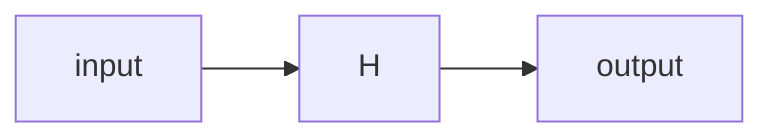

##  量子机器学习原理与代码实战案例讲解

作者：禅与计算机程序设计艺术

## 1. 背景介绍

### 1.1. 量子计算的崛起

近年来，量子计算领域经历了爆炸性的发展，为各个科学领域带来了革命性的潜力，其中包括机器学习。传统的机器学习算法在处理海量数据和解决复杂问题方面面临着瓶颈，而量子计算的独特优势为突破这些限制提供了新的可能性。

### 1.2. 量子机器学习的诞生

量子机器学习（Quantum Machine Learning，QML）应运而生，它融合了量子计算和机器学习的优势，旨在利用量子力学原理构建更高效、更强大的机器学习算法。QML 的研究涵盖了广泛的领域，包括量子算法设计、量子硬件实现、量子机器学习理论等。

### 1.3. 本文目标

本文旨在深入浅出地介绍量子机器学习的基本原理、核心算法以及代码实战案例，帮助读者了解这一新兴领域的概况、发展趋势以及应用前景。

## 2. 核心概念与联系

### 2.1. 量子比特与叠加态

与经典计算机使用比特（0 或 1）表示信息不同，量子计算机使用量子比特（qubit）作为信息的基本单元。量子比特可以处于 0、1 或两者的叠加态，这意味着一个量子比特可以同时表示多个状态，从而实现并行计算。

### 2.2. 量子门与量子线路

量子门是量子计算的基本操作，类似于经典计算机中的逻辑门。通过对量子比特施加一系列量子门操作，可以构建量子线路，实现对量子信息的处理和计算。

### 2.3. 量子算法与量子优势

量子算法是专门设计用于在量子计算机上运行的算法，它们利用量子力学原理，例如叠加和纠缠，来解决经典算法难以解决的问题。当量子算法在特定问题上能够显著超越经典算法时，就称为量子优势。

### 2.4. 机器学习的基本概念

机器学习的核心目标是从数据中学习模式并进行预测。常见的机器学习任务包括分类、回归、聚类等。机器学习算法通常需要大量的数据进行训练，并通过优化算法不断调整模型参数，以提高预测精度。

### 2.5. 量子机器学习的联系

量子机器学习将量子计算的优势引入机器学习领域，主要体现在以下几个方面：

* **加速计算:** 量子算法可以指数级地加速某些计算任务，例如矩阵运算和搜索，这为解决大规模机器学习问题提供了新的途径。
* **增强表达能力:** 量子比特的叠加态可以表示更复杂的特征空间，从而提高模型的表达能力和泛化能力。
* **探索新的学习范式:** 量子力学原理为设计新的机器学习算法提供了灵感，例如基于量子退火和量子游走的算法。

## 3. 核心算法原理具体操作步骤

### 3.1. 量子支持向量机（QSVM）

#### 3.1.1. 原理介绍

支持向量机（SVM）是一种经典的机器学习算法，用于分类和回归任务。QSVM 是 SVM 的量子版本，它利用量子计算来加速核函数的计算，从而提高分类效率。

#### 3.1.2. 具体操作步骤

1. 将经典数据编码成量子态。
2. 使用量子计算机计算核函数矩阵。
3. 在量子计算机上训练 QSVM 模型，找到最优的分类超平面。
4. 使用训练好的模型对新的数据进行分类。

### 3.2. 量子主成分分析（QPCA）

#### 3.2.1. 原理介绍

主成分分析（PCA）是一种常用的降维技术，用于提取数据的主要特征。QPCA 是 PCA 的量子版本，它利用量子计算来加速特征值和特征向量的计算，从而提高降维效率。

#### 3.2.2. 具体操作步骤

1. 将经典数据编码成量子态。
2. 使用量子计算机计算数据的协方差矩阵。
3. 在量子计算机上求解协方差矩阵的特征值和特征向量。
4. 选择对应于最大特征值的特征向量作为主成分。

### 3.3. 变分量子本征求解器（VQE）

#### 3.3.1. 原理介绍

VQE 是一种用于寻找量子系统的基态能量的算法，它可以应用于量子化学、材料科学等领域。

#### 3.3.2. 具体操作步骤

1. 准备一个初始的量子态。
2. 使用参数化的量子线路对初始态进行变换。
3. 测量变换后的量子态的能量。
4. 使用经典优化算法更新量子线路的参数，以最小化能量。

## 4. 数学模型和公式详细讲解举例说明

### 4.1. 量子态的表示

量子态可以用向量来表示，例如：

$$
|\psi\rangle = \alpha |0\rangle + \beta |1\rangle,
$$

其中 $|\psi\rangle$ 表示一个量子态，$|0\rangle$ 和 $|1\rangle$ 分别表示量子比特的 0 和 1 态，$\alpha$ 和 $\beta$ 是复数，满足 $|\alpha|^2 + |\beta|^2 = 1$。

### 4.2. 量子门的表示

量子门可以用矩阵来表示，例如：

$$
H = \frac{1}{\sqrt{2}}
\begin{pmatrix}
1 & 1 \\
1 & -1
\end{pmatrix},
$$

其中 $H$ 表示 Hadamard 门，它可以将一个量子比特从 0 态变换到 0 和 1 的叠加态，反之亦然。

### 4.3. 量子线路的表示

量子线路可以用图形来表示，例如：



该线路表示对一个量子比特施加 Hadamard 门操作。

### 4.4. QSVM 的数学模型

QSVM 的目标是找到一个最优的分类超平面，将不同类别的数据点分开。在量子计算中，分类超平面可以用一个量子态 $|\psi\rangle$ 来表示，它的表达式为：

$$
|\psi\rangle = \sum_{i=1}^n y_i \alpha_i |\phi(x_i)\rangle,
$$

其中 $x_i$ 是输入数据点，$y_i$ 是对应的标签，$\phi(x_i)$ 是将经典数据点映射到量子态的特征映射函数，$\alpha_i$ 是权重系数。

## 5. 项目实践：代码实例和详细解释说明

### 5.1. 使用 Qiskit 实现简单的量子机器学习算法

```python
from qiskit import QuantumCircuit, Aer, execute
from qiskit.circuit.library import ZZFeatureMap
from qiskit.aqua.algorithms import VQC

# 定义量子线路
feature_map = ZZFeatureMap(feature_dimension=2, reps=2)
var_form = QuantumCircuit(2)
var_form.ry(0, 0)
var_form.cx(0, 1)
var_form.ry(1, 1)

# 定义 VQC 模型
vqc = VQC(optimizer='COBYLA', feature_map=feature_map, var_form=var_form)

# 加载数据
data = [[0, 0], [0, 1], [1, 0], [1, 1]]
labels = [0, 1, 1, 0]

# 训练模型
vqc.fit(data, labels)

# 预测新数据
new_data = [[0.5, 0.5]]
predictions = vqc.predict(new_data)

# 打印预测结果
print(predictions)
```

### 5.2. 代码解释

* 首先，我们导入 Qiskit 库，并定义量子线路，包括特征映射和变分形式。
* 然后，我们定义 VQC 模型，并加载数据和标签。
* 接下来，我们训练 VQC 模型，并使用训练好的模型对新数据进行预测。
* 最后，我们打印预测结果。

## 6. 实际应用场景

### 6.1. 量子药物发现

量子机器学习可以用于加速药物发现过程，例如预测药物分子的性质、筛选潜在的药物靶点等。

### 6.2. 量子金融建模

量子机器学习可以用于构建更精确的金融模型，例如预测股票价格、评估风险等。

### 6.3. 量子材料设计

量子机器学习可以用于设计具有特定性质的新材料，例如更高效的太阳能电池、更强大的电池等。

## 7. 总结：未来发展趋势与挑战

### 7.1. 发展趋势

* 量子计算硬件的不断发展将为量子机器学习提供更强大的计算能力。
* 更多量子机器学习算法将被开发出来，用于解决更广泛的机器学习问题。
* 量子机器学习将与其他领域深度融合，例如云计算、人工智能等。

### 7.2. 挑战

* 量子计算机的稳定性和可扩展性仍然是制约量子机器学习发展的主要瓶颈。
* 量子机器学习算法的设计和优化仍然是一个巨大的挑战。
* 量子机器学习的应用场景还需要进一步探索和挖掘。

## 8. 附录：常见问题与解答

### 8.1. 什么是量子优势？

量子优势是指量子算法在特定问题上能够显著超越经典算法。

### 8.2. 量子机器学习需要多少数据？

量子机器学习算法通常需要比经典机器学习算法更少的数据，因为量子比特的叠加态可以表示更复杂的特征空间。

### 8.3. 量子机器学习的应用前景如何？

量子机器学习具有巨大的应用前景，它有望在药物发现、金融建模、材料设计等领域带来革命性的突破. 
