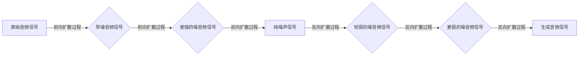

##  音频扩散Audio Diffusion原理与代码实例讲解

作者：禅与计算机程序设计艺术

### 1. 背景介绍

#### 1.1.  音频生成技术的革命

近年来，深度学习技术的飞速发展彻底改变了许多领域，其中之一便是音频生成。从语音合成到音乐创作，深度学习模型展现出了惊人的能力。在这些技术中，音频扩散模型（Audio Diffusion Models）作为一种新兴的技术，正逐渐引起人们的广泛关注。

#### 1.2.  扩散模型的兴起

扩散模型最初应用于图像生成领域，其主要思想是通过逐步添加高斯噪声将数据分布转换为易于采样的分布，然后学习逆向过程以从噪声中生成新的数据样本。这种方法在图像生成领域取得了巨大成功，例如 OpenAI 的 DALL-E 2 和 Google 的 Imagen。

#### 1.3.  音频扩散模型的优势

受图像扩散模型的启发，研究人员开始探索将扩散模型应用于音频生成领域。音频扩散模型相较于传统的音频生成方法，例如自回归模型和变分自编码器，具有一系列优势：

* **高质量的生成结果:** 音频扩散模型能够生成更加自然、逼真的音频样本，更接近于真实世界的音频数据。
* **可控性:**  音频扩散模型允许用户通过调整模型参数或输入条件来控制生成音频的风格、情感等特征。
* **并行生成:**  与自回归模型不同，音频扩散模型可以并行生成音频样本，大大提高了生成效率。

### 2. 核心概念与联系

#### 2.1.  扩散过程

音频扩散模型的核心思想是将音频信号视为一个随机过程，该过程从原始音频信号开始，通过一系列步骤逐渐添加高斯噪声，直到最终得到一个纯噪声信号。这个过程被称为**前向扩散过程**。

#### 2.2.  反向扩散过程

音频扩散模型的目标是学习一个**反向扩散过程**，该过程能够将纯噪声信号逐步转换为原始音频信号。换句话说，模型需要学习如何从噪声中“提取”出有意义的音频信息。

#### 2.3.  马尔可夫链

音频扩散模型中的前向和反向扩散过程都可以被建模为一个**马尔可夫链**。马尔可夫链是一种数学模型，用于描述一个系统在不同状态之间随机转换的过程。在音频扩散模型中，每个时间步的音频信号都可以看作是马尔可夫链中的一个状态，而前向和反向扩散过程则对应着状态之间的转换过程。

#### 2.4.  核心概念之间的联系

下图展示了音频扩散模型中各个核心概念之间的联系：



### 3. 核心算法原理具体操作步骤

#### 3.1.  前向扩散过程

前向扩散过程的目标是将原始音频信号 $x_0$ 转换为一个纯噪声信号 $x_T$。这个过程可以通过迭代地向音频信号添加高斯噪声来实现：

$$
x_t = \sqrt{1 - \beta_t} x_{t-1} + \beta_t \epsilon_t,
$$

其中：

* $x_t$ 表示时间步 $t$ 的音频信号；
* $\beta_t$ 是一个控制噪声强度的超参数，通常是一个单调递增的序列；
* $\epsilon_t \sim \mathcal{N}(0, I)$ 是一个服从标准正态分布的随机噪声。

#### 3.2.  反向扩散过程

反向扩散过程的目标是从纯噪声信号 $x_T$ 中恢复出原始音频信号 $x_0$。由于前向扩散过程是一个马尔可夫链，我们可以通过逆转马尔可夫链来实现反向扩散过程：

$$
x_{t-1} = \frac{1}{\sqrt{1 - \beta_t}} \left( x_t - \beta_t \epsilon_\theta(x_t, t) \right) + \sigma_t z,
$$

其中：

* $\epsilon_\theta(x_t, t)$ 是一个神经网络，用于预测时间步 $t$ 的噪声 $\epsilon_t$；
* $\sigma_t$ 是一个控制采样过程随机性的超参数；
* $z \sim \mathcal{N}(0, I)$ 是一个服从标准正态分布的随机噪声。

#### 3.3.  训练过程

音频扩散模型的训练过程可以概括为以下步骤：

1. 从数据集中随机采样一个音频信号 $x_0$。
2. 根据前向扩散过程，生成一系列带噪音频信号 $x_1, x_2, ..., x_T$。
3. 将带噪音频信号 $x_t$ 和时间步 $t$ 输入到神经网络 $\epsilon_\theta(x_t, t)$ 中，预测噪声 $\epsilon_t$。
4. 计算预测噪声 $\epsilon_t$ 和真实噪声 $\epsilon_t = \frac{x_t - \sqrt{1 - \beta_t} x_{t-1}}{\beta_t}$ 之间的均方误差。
5. 使用梯度下降算法更新神经网络 $\epsilon_\theta(x_t, t)$ 的参数。

#### 3.4.  生成过程

训练完成后，我们可以使用音频扩散模型生成新的音频样本。生成过程可以概括为以下步骤：

1. 从标准正态分布中采样一个纯噪声信号 $x_T$。
2. 根据反向扩散过程，迭代地将噪声信号 $x_T$ 转换为原始音频信号 $x_0$。
3. 最后得到的音频信号 $x_0$ 就是生成的音频样本。

### 4. 数学模型和公式详细讲解举例说明

#### 4.1.  变分下界（VLB）

音频扩散模型的训练目标是最小化真实数据分布 $q(x_0)$ 和模型分布 $p_\theta(x_0)$ 之间的 KL 散度。然而，直接优化 KL 散度是 intractable 的。为了解决这个问题，音频扩散模型使用了变分推断的方法，通过优化一个更容易计算的变分下界（VLB）来间接地最小化 KL 散度：

$$
\text{KL}[q(x_0) || p_\theta(x_0)] \le \mathbb{E}_{q(x_{1:T}|x_0)} \left[ -\log \frac{p_\theta(x_{0:T})}{q(x_{1:T}|x_0)} \right] =: \text{VLB}.
$$

#### 4.2.  VLB 的推导

VLB 的推导过程如下：

$$
\begin{aligned}
\text{KL}[q(x_0) || p_\theta(x_0)] 
&= \mathbb{E}_{q(x_0)} \left[ \log \frac{q(x_0)}{p_\theta(x_0)} \right] \\
&= \mathbb{E}_{q(x_0)} \left[ \log q(x_0) - \log p_\theta(x_0) \right] \\
&= \mathbb{E}_{q(x_0)} \left[ \log q(x_0) - \log p_\theta(x_{0:T}) + \log p_\theta(x_{0:T}) - \log p_\theta(x_0) \right] \\
&= \mathbb{E}_{q(x_0)} \left[ \log \frac{q(x_0)}{p_\theta(x_{0:T})} + \log \frac{p_\theta(x_{0:T})}{p_\theta(x_0)} \right] \\
&= \mathbb{E}_{q(x_0)} \left[ -\log \frac{p_\theta(x_{0:T})}{q(x_0)} + \log p_\theta(x_{1:T}|x_0) \right] \\
&= \mathbb{E}_{q(x_{1:T}|x_0)} \left[ -\log \frac{p_\theta(x_{0:T})}{q(x_{1:T}|x_0)} \right] + \mathbb{E}_{q(x_0)} \left[ \log p_\theta(x_{1:T}|x_0) \right] \\
&\le \mathbb{E}_{q(x_{1:T}|x_0)} \left[ -\log \frac{p_\theta(x_{0:T})}{q(x_{1:T}|x_0)} \right] \\
&=: \text{VLB}.
\end{aligned}
$$

#### 4.3.  VLB 的优化

音频扩散模型通过优化 VLB 来训练模型。具体来说，模型需要最大化 VLB 中的 $\log \frac{p_\theta(x_{0:T})}{q(x_{1:T}|x_0)}$ 项。

#### 4.4.  举例说明

假设我们有一个包含 10000 个音频样本的数据集，每个音频样本的长度为 16000 个采样点。我们可以使用以下参数训练一个音频扩散模型：

* 扩散步骤 $T = 1000$
* 噪声强度 $\beta_t$ 从 $10^{-4}$ 线性增加到 $0.02$
* 神经网络 $\epsilon_\theta(x_t, t)$ 是一个包含 4 个残差块的 UNet 模型
* 训练 epochs $E = 100$
* 批量大小 $B = 16$
* 学习率 $lr = 10^{-4}$

训练完成后，我们可以使用该模型生成新的音频样本。

### 5. 项目实践：代码实例和详细解释说明

#### 5.1.  环境搭建

```python
!pip install torch torchaudio numpy
```

#### 5.2.  数据加载

```python
import torchaudio

# 加载音频数据集
dataset = torchaudio.datasets.LIBRISPEECH("./data", url="dev-clean", download=True)

# 定义数据加载器
dataloader = torch.utils.data.DataLoader(dataset, batch_size=16, shuffle=True)
```

#### 5.3.  模型定义

```python
import torch
import torch.nn as nn

class UNet(nn.Module):
    def __init__(self):
        super(UNet, self).__init__()
        # 定义 UNet 模型结构
        # ...

    def forward(self, x, t):
        # 定义模型的前向传播过程
        # ...

# 实例化模型
model = UNet()
```

#### 5.4.  训练函数

```python
def train(model, dataloader, optimizer, device):
    # 将模型设置为训练模式
    model.train()

    # 遍历数据加载器
    for batch_idx, (data, _) in enumerate(dataloader):
        # 将数据移动到设备
        data = data.to(device)

        # 前向传播
        # ...

        # 计算损失
        # ...

        # 反向传播和优化
        # ...

        # 打印训练进度
        # ...
```

#### 5.5.  训练模型

```python
# 定义优化器
optimizer = torch.optim.Adam(model.parameters(), lr=1e-4)

# 定义设备
device = torch.device("cuda" if torch.cuda.is_available() else "cpu")

# 训练模型
for epoch in range(100):
    train(model, dataloader, optimizer, device)
```

#### 5.6.  生成音频

```python
def generate_audio(model, length, device):
    # 将模型设置为评估模式
    model.eval()

    # 生成随机噪声
    # ...

    # 反向扩散过程
    # ...

    # 返回生成的音频
    # ...

# 生成音频
audio = generate_audio(model, 16000, device)
```

### 6. 实际应用场景

#### 6.1.  语音合成

音频扩散模型可以用于生成高质量的语音样本，例如：

* **文本转语音 (TTS):** 将文本转换为语音，用于虚拟助手、语音导航等应用。
* **语音克隆:**  模仿特定说话者的语音，用于娱乐、配音等应用。

#### 6.2.  音乐生成

音频扩散模型可以用于生成各种类型的音乐，例如：

* **旋律生成:**  生成新的旋律，用于歌曲创作、游戏配乐等应用。
* **伴奏生成:**  根据给定的旋律生成伴奏，用于音乐创作、卡拉 OK 等应用。

#### 6.3.  音频修复

音频扩散模型可以用于修复受损的音频信号，例如：

* **去噪:**  去除音频信号中的噪声，用于语音增强、音乐修复等应用。
* **缺失音频重建:**  重建音频信号中缺失的部分，用于音频修复、旧音频恢复等应用。

### 7. 工具和资源推荐

#### 7.1.  Python 库

* **torchaudio:**  PyTorch 的音频处理库，提供了音频 I/O、特征提取、数据增强等功能。
* **librosa:**  Python 的音频分析库，提供了音频特征提取、可视化等功能。

#### 7.2.  数据集

* **LibriSpeech:**  一个大型的英语语音识别数据集，包含超过 1000 小时的语音数据。
* **NSynth:**  一个包含 30 万个乐器音符的数据集，涵盖了 1000 多种乐器。

#### 7.3.  论文

* **[DDPM](https://arxiv.org/abs/2006.11239):**  Denoising Diffusion Probabilistic Models
* **[WaveGrad](https://arxiv.org/abs/2011.13961):**  A Diffusion Probabilistic Model for Text-to-Speech

### 8. 总结：未来发展趋势与挑战

#### 8.1.  未来发展趋势

* **更高质量的音频生成:**  随着模型规模和训练数据的增加，音频扩散模型有望生成更加逼真、自然、高质量的音频样本。
* **更强大的控制能力:**  未来的研究将集中于开发更强大的控制方法，允许用户更精确地控制生成音频的各个方面。
* **更广泛的应用场景:**  音频扩散模型有望应用于更多领域，例如语音识别、音乐信息检索、音频事件检测等。

#### 8.2.  挑战

* **计算成本高:**  音频扩散模型的训练和生成过程需要大量的计算资源。
* **模型解释性差:**  音频扩散模型是一个黑盒模型，其内部机制难以解释。
* **数据需求大:**  训练高质量的音频扩散模型需要大量的音频数据。

### 9. 附录：常见问题与解答

#### 9.1.  什么是音频扩散模型？

音频扩散模型是一种基于深度学习的音频生成模型，其核心思想是通过逐步添加高斯噪声将音频信号转换为易于采样的分布，然后学习逆向过程以从噪声中生成新的音频样本。

#### 9.2.  音频扩散模型的优势是什么？

音频扩散模型相较于传统的音频生成方法，例如自回归模型和变分自编码器，具有一系列优势：高质量的生成结果、可控性、并行生成。

#### 9.3.  音频扩散模型的应用场景有哪些？

音频扩散模型可以应用于语音合成、音乐生成、音频修复等领域。

#### 9.4.  音频扩散模型的未来发展趋势是什么？

音频扩散模型的未来发展趋势包括更高质量的音频生成、更强大的控制能力、更广泛的应用场景等。
