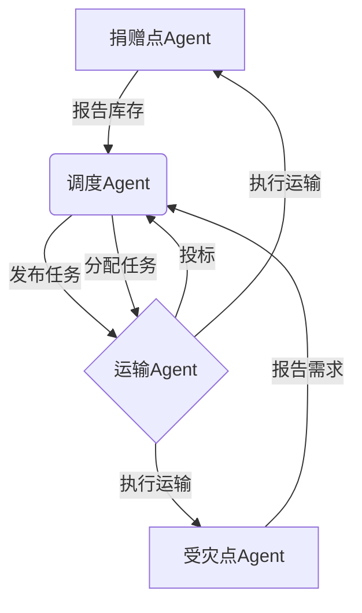

# AI人工智能 Agent：在公益事业中的应用

## 1. 背景介绍

### 1.1 公益事业的重要性

公益事业是指为了社会公众利益而开展的非营利性活动,旨在促进社会和谐发展、维护社会公平正义、保护弱势群体权益等。公益事业在缓解社会矛盾、促进社会进步方面发挥着重要作用。然而,传统的公益事业运作模式存在一些问题,例如资源分配效率低下、管理成本高昂、覆盖范围有限等。

### 1.2 人工智能在公益事业中的应用前景

随着人工智能(AI)技术的快速发展,AI被广泛应用于各个领域,公益事业也不例外。AI技术可以帮助公益组织优化资源分配、提高运营效率、扩大服务覆盖范围等,从而提升公益事业的社会影响力。特别是AI Agent技术的出现,为公益事业的智能化转型提供了新的契机。

## 2. 核心概念与联系

### 2.1 人工智能Agent

人工智能Agent是指具有一定智能和自主性的软件实体,能够感知环境、做出决策并采取行动以实现预定目标。AI Agent通常由以下几个核心模块组成:

- 感知模块:用于获取环境信息
- 决策模块:根据感知信息做出决策
- 执行模块:执行决策所确定的行动

AI Agent可以被赋予不同的目标和能力,在公益事业中可以承担多种角色,如信息收集员、决策辅助员、行动执行员等。

### 2.2 多Agent系统

多Agent系统(Multi-Agent System, MAS)是由多个AI Agent组成的分布式智能系统。在MAS中,各个Agent可以相互协作、竞争或谈判,以完成复杂的任务。MAS具有以下特点:

- 分布性:系统由多个分布式Agent组成
- 开放性:Agent可以动态加入或退出系统
- 协作性:Agent之间可以相互协作以实现共同目标
- 智能性:每个Agent都具有一定的智能和自主性

在公益事业中,可以构建基于MAS的智能协作系统,让不同角色的Agent相互协作,提高公益项目的运作效率和质量。

### 2.3 人机协作

人机协作(Human-Agent Collaboration, HAC)是指人类与AI Agent之间的协作关系。在HAC模式下,人类和Agent各自发挥优势,相互补充,共同完成任务。人类拥有创造力、经验和判断力,而Agent则具备强大的数据处理、模式识别和决策优化能力。

在公益事业中,人机协作可以让人类专注于战略规划、创新思维等高级工作,而将繁琐的数据处理、方案优化等工作交给AI Agent,从而提高工作效率和质量。

## 3. 核心算法原理具体操作步骤  

### 3.1 Agent决策算法

Agent的决策算法是其智能行为的核心,决定了Agent如何根据感知信息做出合理决策。常见的Agent决策算法包括:

#### 3.1.1 基于规则的决策算法

基于规则的决策算法是最简单的一种,它根据预先定义的一系列规则来做出决策。规则可以是确定性的(如"if...then..."语句),也可以是非确定性的(如模糊逻辑规则)。

这种算法的优点是简单易懂,缺点是规则的制定需要大量的人工经验,且难以处理复杂的决策情况。在公益事业中,可以将一些简单、常规的决策任务交给基于规则的Agent。

#### 3.1.2 基于实用函数的决策算法

基于实用函数的决策算法通过定义一个实用函数(Utility Function)来评估每个可能的决策方案,并选择实用值最大的方案作为最终决策。实用函数可以是单一目标函数,也可以是多目标函数。

这种算法的优点是能够对复杂的决策情况进行量化评估,缺点是实用函数的设计需要大量的领域知识和数据支持。在公益事业中,可以将一些需要权衡多个目标的决策任务交给基于实用函数的Agent。

#### 3.1.3 基于机器学习的决策算法

基于机器学习的决策算法利用大量的历史数据和样本,通过机器学习算法(如深度学习、强化学习等)自动学习出一个决策模型,并根据这个模型做出决策。

这种算法的优点是能够自动发现数据中隐藏的决策模式,缺点是需要大量的高质量数据和计算资源。在公益事业中,可以将一些需要从复杂环境中学习的决策任务交给基于机器学习的Agent。

### 3.2 Agent协作算法

在多Agent系统中,各个Agent需要相互协作以完成复杂任务。常见的Agent协作算法包括:

#### 3.2.1 基于契约网的协作算法

基于契约网(Contract Net Protocol)的协作算法是一种分布式任务分配机制。在这种机制下,管理器Agent会发布一个任务,其他Agent可以对该任务进行投标。管理器Agent会根据投标情况选择最合适的Agent来执行任务。

这种算法的优点是分布式、健壮性强,缺点是协作效率较低。在公益事业中,可以将一些需要动态分配的任务交给基于契约网的多Agent系统。

#### 3.2.2 基于拍卖机制的协作算法

基于拍卖机制的协作算法将任务分配问题看作是一个拍卖过程。管理器Agent会拍卖一个任务,其他Agent会根据自身能力和偏好对该任务出价。管理器Agent会将任务分配给出价最高的Agent。

这种算法的优点是能够实现Agent之间的自主协作,缺点是可能会产生不公平的资源分配。在公益事业中,可以将一些需要权衡Agent能力和偏好的任务交给基于拍卖机制的多Agent系统。

#### 3.2.3 基于协商的协作算法

基于协商的协作算法允许Agent之间进行双向沟通和协商,以达成一致的决策。协商过程可以采用博弈论、投票机制等方法。

这种算法的优点是决策过程更加民主化,缺点是协商成本较高。在公益事业中,可以将一些需要多方利益相关者参与的决策任务交给基于协商的多Agent系统。

## 4. 数学模型和公式详细讲解举例说明

在Agent决策和协作过程中,往往需要借助数学模型和公式来量化和优化决策。下面介绍一些常见的数学模型和公式。

### 4.1 马尔可夫决策过程(MDP)

马尔可夫决策过程(Markov Decision Process, MDP)是一种描述序贯决策过程的数学框架,广泛应用于强化学习等领域。MDP由以下几个要素组成:

- 状态集合 $\mathcal{S}$
- 行动集合 $\mathcal{A}$
- 转移概率 $P(s'|s,a)$,表示在状态 $s$ 下执行行动 $a$ 后转移到状态 $s'$ 的概率
- 奖励函数 $R(s,a,s')$,表示在状态 $s$ 下执行行动 $a$ 后转移到状态 $s'$ 所获得的奖励

MDP的目标是找到一个策略 $\pi: \mathcal{S} \rightarrow \mathcal{A}$,使得按照该策略执行行动所获得的累计奖励最大。

在公益事业中,可以将一些序贯决策问题建模为MDP,并利用强化学习算法求解最优策略,指导Agent的行为。

### 4.2 博弈论

博弈论(Game Theory)是研究理性决策者在相互竞争或合作情况下如何做出决策的数学理论。在博弈论中,常见的模型包括:

- 囚徒困境(Prisoner's Dilemma):描述两个理性决策者是合作还是背叛的困境
- 拍卖游戏(Auction Game):描述多个决策者如何在拍卖中出价
- 协作游戏(Cooperative Game):描述多个决策者如何合作分配收益

博弈论模型可以用来分析多Agent系统中各个Agent的行为策略,并设计出合理的激励机制,促进Agent之间的合作。

在公益事业中,可以将一些需要多方利益相关者参与的决策问题建模为博弈论模型,分析各方的利益权衡,设计出公平合理的决策机制。

### 4.3 队列论模型

队列论(Queueing Theory)是研究排队现象的数学理论,常用于分析和优化服务系统的性能。队列论模型通常包括以下要素:

- 到达过程:描述顾客到达的概率分布
- 服务过程:描述服务器处理顾客的概率分布
- 服务规则:描述顾客排队和被服务的规则
- 系统容量:描述系统可容纳的最大顾客数量

基于队列论模型,可以计算出系统的各种性能指标,如平均等待时间、平均队长、服务器利用率等,并对系统进行优化。

在公益事业中,可以将一些需要为大量受众提供服务的问题建模为队列论模型,优化服务资源的分配和调度,提高服务质量。

### 4.4 其他模型

除了上述模型外,Agent决策和协作过程中还可能涉及到其他数学模型,如:

- 贝叶斯网络(Bayesian Network):用于建模不确定性知识
- 进化算法(Evolutionary Algorithm):用于求解组合优化问题
- 社会选择理论(Social Choice Theory):用于研究集体决策问题

不同的问题需要选择合适的数学模型进行建模和求解。在公益事业中,应当根据具体情况选择恰当的模型,并结合领域知识对模型进行定制化设计。

## 5. 项目实践:代码实例和详细解释说明

为了更好地理解AI Agent在公益事业中的应用,我们通过一个具体的项目实例来进行说明。这个项目旨在优化一个城市的救灾物资分配过程。

### 5.1 项目背景

假设某城市发生了自然灾害,需要将救灾物资从多个捐赠点分配到多个受灾点。每个捐赠点和受灾点的位置、库存量和需求量都不同。我们需要设计一个智能调度系统,实现高效的物资分配。

### 5.2 系统架构

我们采用基于多Agent系统的架构,包括以下几种Agent:

- 捐赠点Agent:负责管理每个捐赠点的物资库存
- 受灾点Agent:负责管理每个受灾点的物资需求
- 调度Agent:负责制定物资分配方案
- 运输Agent:负责执行物资运输任务

这些Agent通过基于契约网的协作算法相互协作,完成物资分配任务。

### 5.3 关键算法

#### 5.3.1 调度算法

调度Agent的核心算法是制定物资分配方案。我们将这个问题建模为一个整数线性规划(Integer Linear Programming, ILP)问题:

- 决策变量 $x_{ij}$:表示从捐赠点 $i$ 到受灾点 $j$ 运输的物资量
- 目标函数:最小化总运输成本 $\sum_{i,j} c_{ij} x_{ij}$
- 约束条件:
  - 每个受灾点的需求得到满足: $\sum_i x_{ij} \geq d_j, \forall j$
  - 每个捐赠点的供给量不能超过库存: $\sum_j x_{ij} \leq s_i, \forall i$
  - 决策变量为非负整数: $x_{ij} \geq 0, x_{ij} \in \mathbb{Z}, \forall i,j$

其中 $c_{ij}$ 表示从捐赠点 $i$ 到受灾点 $j$ 的单位运输成本, $d_j$ 表示受灾点 $j$ 的需求量, $s_i$ 表示捐赠点 $i$ 的库存量。

我们可以使用整数线性规划求解器(如 CPLEX、