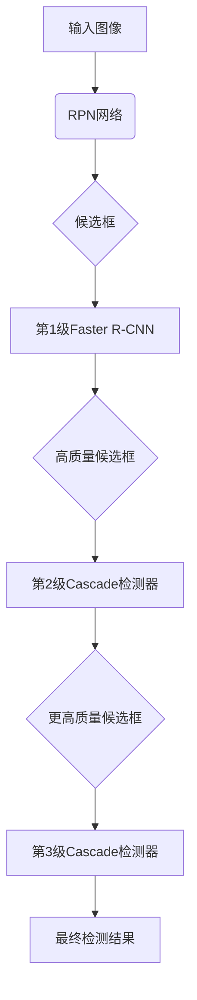

# Cascade R-CNN原理与代码实例讲解

## 1.背景介绍

### 1.1 目标检测任务介绍

目标检测是计算机视觉领域的一个核心任务,旨在自动定位图像或视频中感兴趣的目标实例,并给出每个目标的精确边界框位置和类别标签。它广泛应用于安防监控、无人驾驶、机器人视觉等领域。

传统的目标检测方法主要分为两大类:

1) **基于传统图像处理方法**,如HOG+SVM、Deformable Part Model等,需要手工设计特征,泛化能力较差。

2) **基于深度学习的目标检测算法**,利用卷积神经网络自动学习特征表示,取得了革命性的进展,如R-CNN、Fast R-CNN、Faster R-CNN等。

### 1.2 两阶段目标检测器发展

基于深度学习的两阶段目标检测器主要分为以下几代:

1) **R-CNN**: 先使用选择性搜索生成候选区域,再对每个区域使用CNN进行分类和bbox回归。速度慢,存在大量冗余计算。

2) **Fast R-CNN**: 将整个图像输入到CNN中提取特征,然后对候选区域进行RoI池化和分类回归,提高了速度。

3) **Faster R-CNN**: 使用Region Proposal Network(RPN)网络代替选择性搜索,整个网络可以一次性生成候选框和分类,进一步提高了速度。

4) **Mask R-CNN**: 在Faster R-CNN基础上增加了实例分割分支,同时预测实例的类别、边界框和掩码。

5) **Cascade R-CNN**: 为了进一步提高检测质量,提出级联检测思想,将检测任务分解为多个子任务,逐步加精。

## 2.核心概念与联系

### 2.1 级联思想

级联(Cascade)是Cascade R-CNN的核心思想,即将复杂的目标检测任务分解为多个子任务,通过级联的方式逐步加精,提高检测质量。具体来说:

1) 第一级检测器对整个图像进行初步扫描,生成大量高质量候选框。
2) 后续每一级检测器,以上一级输出为基础,对剩余候选框进行进一步的分类和回归,逐步过滤掉低质量候选框。
3) 最终级输出的候选框即为检测结果。

这种级联方式,让每一级检测器只需专注于处理相对"简单"的子任务,避免了直接处理复杂场景,有利于提高检测精度。

### 2.2 IoU阈值不断加严

在级联过程中,每一级检测器对输入候选框的质量要求(IoU阈值)逐级提高,这是Cascade R-CNN的另一个关键点。

具体来说,第一级检测器的正样本IoU阈值设置为0.5(与传统相同),后续每一级都比上一级高一些(如0.6、0.7),最终级的IoU阈值可以达到0.8甚至更高。这种逐级加严的策略,能够有效地去除低质量候选框。

### 2.3 与Faster R-CNN的关系

Cascade R-CNN可看作是Faster R-CNN的自然延伸和改进版本:

- 保留了Faster R-CNN的双分支结构(RPN+RCNN)
- 第一级检测器就是标准的Faster R-CNN 
- 后续级检测器的结构与第一级类似,只是IoU阈值逐级加严

因此,Cascade R-CNN可以直接利用现有的Faster R-CNN代码和模型,只需要进行少量修改和扩展即可。这种"重用+改进"的思路,是其设计的一个重要优势。

## 3.核心算法原理具体操作步骤  

### 3.1 Cascade R-CNN整体流程

Cascade R-CNN算法的整体流程如下:

1) 使用Region Proposal Network(RPN)生成大量候选框
2) 第一级检测器(Faster R-CNN)对候选框进行初步分类和回归
3) 后续每一级:
    - 根据上一级输出,选取分数较高的候选框
    - 对选中的候选框进行进一步分类和回归
    - 逐步提高正样本IoU阈值(如0.5->0.6->0.7)
4) 最终级输出作为检测结果

整个过程如下图所示:



### 3.2 级联检测器结构

每一级的级联检测器都由RPN网络和RCNN网络组成,结构类似于Faster R-CNN,只是IoU阈值不同。

1) **RPN网络**
    - 对输入图像进行卷积特征提取
    - 在特征图上滑动窗口,生成anchors
    - 对anchors进行二分类(前景/背景)和bbox回归
    - 输出为一系列候选框

2) **RCNN网络**  
    - 对RPN输出的候选框进行RoIPooling
    - 通过全连接层进行分类和bbox回归
    - 正样本的IoU阈值为预先设定的值(如0.5、0.6等)
    - 输出为分类结果和精修后的bbox

RPN和RCNN网络的具体结构可参考标准的Faster R-CNN,不再赘述。

### 3.3 训练策略

Cascade R-CNN在训练时,需要对每一级检测器分别进行训练,并注意正样本IoU阈值的设置。

1) 第一级检测器按标准Faster R-CNN方式训练,正样本IoU阈值为0.5。

2) 后续每一级检测器的训练数据,由上一级输出的高分候选框组成。
    - 正样本: 与ground-truth IoU超过当前级别阈值(如0.6)的候选框
    - 负样本: 与所有ground-truth IoU均小于0.5的候选框
    - 忽略样本: 其余候选框

3) 在训练过程中,每一级检测器的目标是最大化当前级别的检测质量。

4) 通过上述级联训练方式,最终可获得一系列检测质量不断提高的检测器。

## 4.数学模型和公式详细讲解举例说明

### 4.1 RPN网络模型

RPN网络的核心是生成候选框并进行前景/背景分类和bbox回归。具体模型如下:

**生成候选框**

对于每个滑动窗口位置,生成多个不同尺度和长宽比的anchors(参考Faster R-CNN)。假设有A个anchors,输入为特征图F:

$$p_i = f_{rpn}(F, a_i) \qquad i=1,...,A$$

其中$f_{rpn}$为RPN网络,输出为长度为2A的向量$p_i$,前A个元素为前景概率,后A个为bbox回归参数。

**分类损失**

对于第i个anchor $a_i$,其真实标签为$y_i \in \{0, 1\}$,预测为$\hat{p}_i$,则分类损失为:

$$L_{rpn-cls} = \frac{1}{N_{cls}} \sum_{i} L_{cls}(y_i, \hat{p}_i)$$

其中$N_{cls}$为归一化系数,$L_{cls}$为二分类交叉熵损失函数。

**回归损失**

对于第i个anchor $a_i$,其真实bbox为$b_i$,预测为$\hat{b}_i$,则回归损失为:

$$L_{rpn-reg} = \frac{1}{N_{reg}} \sum_{i} y_i L_{reg}(b_i, \hat{b}_i)$$

其中$N_{reg}$为归一化系数,$L_{reg}$为平滑L1损失函数。

**总损失**

RPN网络的总损失为分类损失和回归损失的加权和:

$$L_{rpn} = L_{rpn-cls} + \lambda L_{rpn-reg}$$

通过反向传播优化该损失函数,可以获得RPN网络的权重参数。

### 4.2 RCNN网络模型 

RCNN网络的任务是对RPN输出的候选框进行分类和bbox精修。模型结构如下:

**RoI Pooling**

首先对每个候选框提取固定尺寸的特征,通过RoI Pooling操作:

$$X_i = RP(F, r_i)$$

其中$F$为卷积特征图,$r_i$为第i个候选框,$RP$为RoI Pooling函数,输出为固定尺寸特征$X_i$。

**分类和回归**

将RoI Pooling输出的特征$X_i$输入到全连接层,进行分类和bbox回归:

$$\hat{y}_i = f_{cls}(X_i; \theta_{cls})$$
$$\hat{b}_i = f_{reg}(X_i; \theta_{reg})$$

其中$f_{cls}$和$f_{reg}$分别为分类和回归全连接网络,参数为$\theta_{cls}$和$\theta_{reg}$。

**损失函数**

对于第i个候选框,其真实类别标签为$y_i$,真实bbox为$b_i$,则损失函数为:

$$L_{rcnn} = L_{cls}(y_i, \hat{y}_i) + \lambda [y_i \ge t] L_{reg}(b_i, \hat{b}_i)$$

其中$L_{cls}$为交叉熵损失,$L_{reg}$为平滑L1损失,$\lambda$为平衡权重,$t$为正样本IoU阈值。

通过反向传播优化该损失函数,可以获得RCNN网络的权重参数。注意正样本IoU阈值$t$在每一级都会增大。

### 4.3 级联训练策略

Cascade R-CNN的训练过程是将RPN和RCNN网络级联起来,逐级训练。具体步骤如下:

1) 第一级检测器按标准Faster R-CNN方式训练,正样本IoU阈值为0.5。

2) 对于第k级检测器(k>1):
    - 从上一级输出中选取分数较高的N个候选框
    - 根据当前级别IoU阈值$t_k$标记正负样本
    - 使用标记样本训练当前级RPN和RCNN网络
    - 重复上述过程,直至收敛

通过上述级联训练策略,每一级检测器的目标都是最大化当前级别的检测质量。最终可获得一系列检测质量不断提高的检测器。

## 4.项目实践:代码实例和详细解释说明

这里我们给出一个使用PyTorch实现的Cascade R-CNN代码示例,并对关键部分进行解释说明。完整代码可在GitHub上获取。

### 4.1 模型定义

```python
import torch
import torch.nn as nn

class RPN(nn.Module):
    # RPN网络定义
    ...

class RCNN(nn.Module):
    # RCNN网络定义 
    ...

class CascadeRCNN(nn.Module):
    def __init__(self, num_classes, rpn, rcnn_list):
        super().__init__()
        self.rpn = rpn
        self.rcnn_list = nn.ModuleList(rcnn_list)
        self.num_classes = num_classes

    def forward(self, images, targets=None):
        detections, detector_losses = [], []
        xs = self.rpn(images)  # RPN网络输出
        for rcnn in self.rcnn_list:  # 级联检测器
            loss = rcnn(xs, targets)
            detector_losses.append(loss)
            detections.append(rcnn.module.boxes)
        return detections, detector_losses
```

- `RPN`和`RCNN`分别定义了RPN网络和RCNN网络的结构
- `CascadeRCNN`是整个级联模型,包含一个RPN网络和多个RCNN网络
- 在`forward`函数中,先使用RPN生成初始候选框,再逐级使用RCNN进行检测,收集每一级的输出和损失

### 4.2 数据准备

```python
from torch.utils.data import Dataset

class DetectionDataset(Dataset):
    def __init__(self, images, targets, transform):
        self.images = images
        self.targets = targets
        self.transform = transform
        
    def __getitem__(self, idx):
        image = self.images[idx]
        target = self.targets[idx]
        if self.transform:
            image, target = self.transform(image, target)
        return image, target
    
    def __len__(self):
        return len(self.images)
        
# 构建Dataset和DataLoader
dataset = DetectionDataset(images, targets, transform)
dataloader = torch.utils.data.DataLoader(dataset, batch_size=2, shuffle=True)
```

- `DetectionDataset`定义了目标检测任务的数据集,包含图像和对应的标注信息
- 通过`transform`可以对图像和标注进行