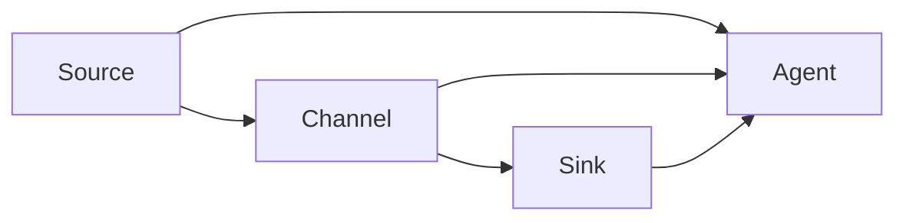

# Flume原理与代码实例讲解

## 1.背景介绍

### 1.1 什么是Flume

Apache Flume是一个分布式、可靠、高可用的海量日志收集系统,由Cloudera公司开源并贡献给Apache软件基金会。Flume可以高效地从不同的数据源收集数据,并将其汇总到集中存储系统中,如HDFS、HBase或Solr等。它是Hadoop生态系统中的一个重要组件,用于实时日志数据流的收集、聚合和传输。

### 1.2 Flume的作用

在大数据时代,日志数据是企业最宝贵的资产之一。有效收集和处理日志数据对于挖掘隐藏的商业价值至关重要。Flume的主要作用包括:

1. **日志数据采集**: Flume可以从各种数据源(如Web服务器、应用服务器、数据库等)高效采集日志数据。

2. **数据传输**: Flume提供了可靠的数据传输机制,保证数据在传输过程中不会丢失或重复。

3. **数据汇总**: Flume可以将采集到的数据汇总到集中存储系统,如HDFS、HBase或Solr等,为后续的数据分析和处理做好准备。

4. **容错和故障转移**: Flume具有良好的容错能力,可以在发生故障时自动进行故障转移,保证数据的可靠性。

### 1.3 Flume的优势

相比传统的日志收集工具,Flume具有以下优势:

1. **分布式架构**: Flume采用分布式架构,可以在多个节点上运行,提高了系统的可扩展性和容错能力。

2. **高可靠性**: Flume提供了多种可靠性机制,如事务机制、故障转移机制等,确保数据在传输过程中不会丢失或重复。

3. **高性能**: Flume使用了高效的数据传输机制,能够高效地收集和传输海量日志数据。

4. **灵活配置**: Flume支持多种数据源和目的地,并且可以灵活配置数据流向。

5. **容易集成**: Flume可以与Hadoop生态系统中的其他组件(如HDFS、HBase、Kafka等)无缝集成。

## 2.核心概念与联系

### 2.1 Flume的核心概念

理解Flume的核心概念对于掌握Flume的原理和使用非常重要。Flume的核心概念包括:

1. **Event**: Event是Flume传输的基本数据单元,它由一个字节payload和一些元数据(headers)组成。

2. **Source**: Source是数据进入Flume的入口,它从外部数据源采集数据,并将数据封装成Event。Flume支持多种类型的Source,如NetcatSource、SpoolDirectorySource等。

3. **Channel**: Channel是位于Source和Sink之间的传输通道,用于缓存和传输Event。Flume支持多种Channel类型,如MemoryChannel、FileChannel等。

4. **Sink**: Sink是Event的出口,它将Event写入外部存储系统,如HDFS、HBase或Solr等。Flume支持多种Sink类型,如HDFSEventSink、HBaseSink等。

5. **Agent**: Agent是Flume的基本单元,由一个Source、一个Channel和一个或多个Sink组成。Agent负责从Source接收Event,并通过Channel将Event传输到Sink。

6. **Transaction**: Transaction是Flume中的事务机制,用于保证数据在传输过程中的可靠性。每个事务都包含一个或多个批次的Event。

这些核心概念之间的关系如下图所示:



### 2.2 Flume的工作流程

Flume的工作流程如下:

1. Source从外部数据源采集数据,并将数据封装成Event。

2. Source将Event传输到Channel进行缓存。

3. Sink从Channel中获取Event,并将Event写入外部存储系统。

4. 在整个过程中,Flume使用事务机制来保证数据的可靠性。

### 2.3 Flume的可靠性机制

Flume提供了多种可靠性机制,确保数据在传输过程中不会丢失或重复:

1. **事务机制**: Flume使用事务机制来保证数据的一致性。每个事务都包含一个或多个批次的Event,只有当整个事务成功提交后,Event才会被真正写入目的地。

2. **Channel选择**: Flume支持多种Channel类型,如MemoryChannel和FileChannel。FileChannel可以将Event持久化到磁盘,防止数据在进程重启时丢失。

3. **故障转移机制**: Flume支持故障转移机制,当某个Agent发生故障时,可以将数据流动态切换到其他Agent,保证数据的可靠传输。

4. **重试机制**: Flume支持重试机制,当数据传输失败时,可以自动重试多次,提高数据传输的成功率。

5. **批处理**: Flume支持批处理机制,将多个Event打包成一个批次进行传输,提高了传输效率。

## 3.核心算法原理具体操作步骤

### 3.1 Flume的事务机制

Flume的事务机制是保证数据可靠性的关键。事务机制的工作原理如下:

1. 当Source接收到一批Event时,它会将这些Event放入一个事务(Transaction)中。

2. Source将事务提交到Channel,Channel会对事务进行二阶段提交:

   - 第一阶段(prepare): Channel会先将事务中的Event临时存储在内存或磁盘中。

   - 第二阶段(commit): 如果第一阶段成功,Channel会将事务中的Event真正写入Channel。否则,Channel会回滚事务。

3. Sink从Channel获取事务中的Event,并将Event写入外部存储系统。

4. 如果Sink成功写入Event,它会向Channel发送commit命令,表示事务成功提交。否则,它会发送rollback命令,表示事务回滚。

5. Channel根据Sink的反馈,决定是提交还是回滚事务。

这种二阶段提交机制确保了数据在传输过程中的一致性和可靠性。如果任何一个环节出现故障,Flume都可以回滚事务,防止数据丢失或重复。

### 3.2 Flume的故障转移机制

Flume的故障转移机制可以在Agent发生故障时,将数据流动态切换到其他Agent,保证数据的可靠传输。故障转移机制的工作原理如下:

1. 在Flume集群中,每个Agent都会定期向ZooKeeper发送心跳信号,表明自己处于活动状态。

2. 如果ZooKeeper在一定时间内没有收到某个Agent的心跳信号,就认为该Agent发生了故障。

3. ZooKeeper会将该Agent的配置信息(Source、Channel和Sink)复制到其他活动Agent上。

4. 其他活动Agent会根据复制的配置信息,创建新的Source、Channel和Sink,并接管故障Agent的数据流。

5. 当故障Agent恢复后,它会重新加入Flume集群,但不会接管之前的数据流,以免造成数据重复或丢失。

这种故障转移机制可以提高Flume的高可用性,确保数据在Agent发生故障时也能够可靠传输。

### 3.3 Flume的重试机制

Flume的重试机制可以在数据传输失败时,自动重试多次,提高数据传输的成功率。重试机制的工作原理如下:

1. 当Sink向Channel发送commit命令失败时,Sink会尝试重新发送commit命令。

2. 如果重试次数超过配置的最大重试次数,Sink会向Channel发送rollback命令,表示事务回滚。

3. Channel会将回滚的事务重新放入队列,等待下一次被Sink消费。

4. Sink在消费事务时,会检查事务是否已经被成功提交。如果事务已经被提交,Sink会直接跳过该事务。

这种重试机制可以提高Flume的容错能力,确保在网络波动或暂时故障的情况下,数据也能够最终被成功传输。

## 4.数学模型和公式详细讲解举例说明

在Flume中,并没有直接使用复杂的数学模型或公式。但是,我们可以使用一些简单的数学概念来分析和优化Flume的性能。

### 4.1 吞吐量分析

吞吐量是衡量Flume性能的一个重要指标。吞吐量指的是Flume在单位时间内能够处理的Event数量。我们可以使用以下公式来计算吞吐量:

$$
吞吐量 = \frac{处理的Event数量}{处理时间}
$$

例如,如果Flume在10秒内处理了1000个Event,那么吞吐量就是:

$$
吞吐量 = \frac{1000}{10} = 100 \text{Event/秒}
$$

提高吞吐量的方法包括:

- 增加Flume Agent的数量,实现并行处理。
- 优化Source、Channel和Sink的配置,减少处理延迟。
- 升级硬件资源,如CPU、内存和网络带宽。

### 4.2 延迟分析

延迟是另一个重要的性能指标,它指的是Event从Source进入Flume到被Sink写入目的地所需的时间。我们可以使用以下公式来计算延迟:

$$
延迟 = 写入时间 - 进入时间
$$

例如,如果一个Event在时间$t_1$进入Flume,在时间$t_2$被写入目的地,那么延迟就是:

$$
延迟 = t_2 - t_1
$$

减小延迟的方法包括:

- 优化Source、Channel和Sink的配置,减少处理时间。
- 增加Channel的容量,减少Event在Channel中的等待时间。
- 升级网络带宽,加快数据传输速度。

### 4.3 可靠性分析

可靠性是Flume的一个核心目标。我们可以使用以下公式来计算Flume的可靠性:

$$
可靠性 = 1 - \frac{丢失的Event数量}{总Event数量}
$$

例如,如果Flume处理了1000个Event,其中丢失了10个Event,那么可靠性就是:

$$
可靠性 = 1 - \frac{10}{1000} = 0.99 = 99\%
$$

提高可靠性的方法包括:

- 使用事务机制和故障转移机制,减少数据丢失的风险。
- 使用持久化Channel,如FileChannel,防止数据在进程重启时丢失。
- 配置合理的重试策略,增加数据传输的成功率。

通过上述数学模型和公式,我们可以更好地分析和优化Flume的性能和可靠性。

## 4.项目实践:代码实例和详细解释说明

在这一部分,我们将通过一个实际的代码示例来演示如何使用Flume收集日志数据。我们将创建一个简单的Flume Agent,包括一个NetcatSource、一个MemoryChannel和一个LoggerSink。

### 4.1 配置文件

首先,我们需要创建一个Flume配置文件,定义Agent的组件和属性。以下是配置文件的内容:

```properties
# 定义Agent的名称
agent.sources = netcat
agent.channels = memory
agent.sinks = logger

# 配置Source
agent.sources.netcat.type = netcat
agent.sources.netcat.bind = localhost
agent.sources.netcat.port = 44444

# 配置Channel
agent.channels.memory.type = memory
agent.channels.memory.capacity = 1000
agent.channels.memory.transactionCapacity = 100

# 配置Sink
agent.sinks.logger.type = logger

# 将Source与Channel和Sink连接起来
agent.sources.netcat.channels = memory
agent.sinks.logger.channel = memory
```

在这个配置文件中,我们定义了一个名为`agent`的Flume Agent,包括以下组件:

- `netcat`源(Source):一个NetcatSource,监听本地主机的44444端口,接收数据。
- `memory`通道(Channel):一个MemoryChannel,用于缓存Event,容量为1000个Event,每个事务最多包含100个Event。
- `logger`sink(Sink):一个LoggerSink,将Event输出到日志中。

我们将NetcatSource与MemoryChannel连接,将MemoryChannel与LoggerSink连接,形成一个完整的数据流。

### 4.2 启动Flume Agent

接下来,我们需要启动Flume Agent。在Flume的安装目录下,执行以下命令:

```bash
bin/flume-ng agent --conf conf --conf-file example.conf --name agent --Dflume.root.logger=INFO,console
```

这个命令将使用我们创建的`example.conf`配置文件启动名为`agent`的Flume Agent。`--Dflume.