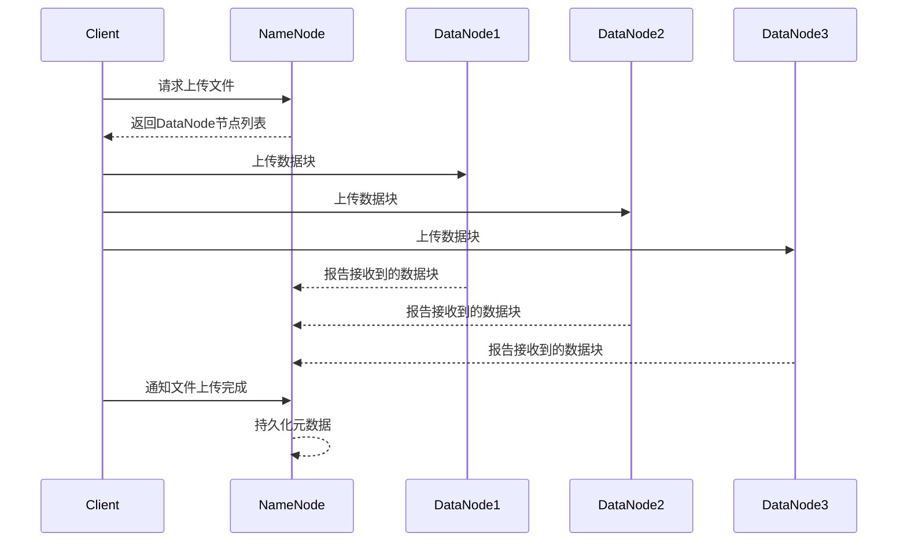
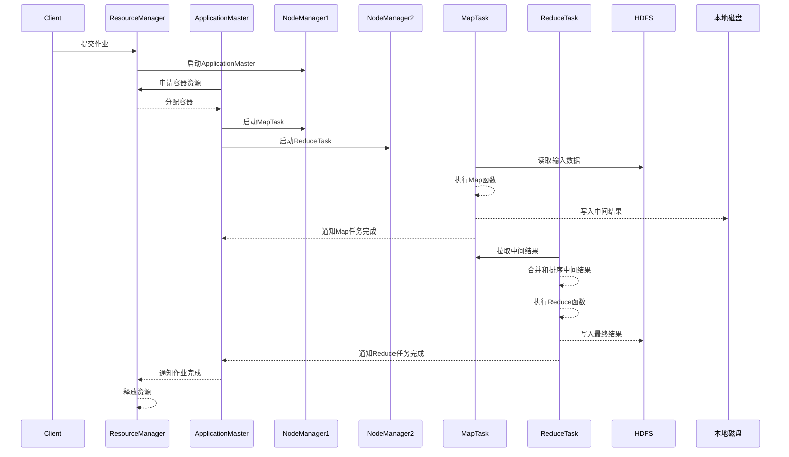

# Hadoop原理与代码实例讲解

## 1.背景介绍

### 1.1 大数据时代的到来

随着互联网、移动互联网、物联网等技术的快速发展,数据呈现出爆炸式增长。根据IDC(国际数据公司)的预测,到2025年,全球数据总量将达到175ZB(1ZB=1万亿GB)。这些海量的数据来自于各个领域,如社交媒体、电子商务、物联网设备、科学实验等。传统的数据处理系统已经无法满足如此庞大数据量的存储和计算需求。

### 1.2 大数据技术的兴起

为了解决大数据带来的挑战,一系列新兴的大数据技术应运而生。其中,Hadoop作为一种分布式系统基础架构,可以在廉价的商用硬件集群上存储和处理大规模数据集,成为大数据处理的核心技术之一。

### 1.3 Hadoop的重要性

Hadoop不仅可以存储和处理海量数据,还提供了一种可扩展、高可用、高容错的分布式计算模型。它的出现极大地降低了大数据处理的成本,使得企业和组织能够从海量数据中挖掘出有价值的信息,从而推动了数据驱动型决策和创新。因此,掌握Hadoop原理和实践技能对于从事大数据相关工作的人员至关重要。

## 2.核心概念与联系

### 2.1 Hadoop生态系统

Hadoop是一个庞大的生态系统,包括多个紧密相连的组件。以下是一些核心组件:

1. **HDFS(Hadoop分布式文件系统)**: 一种高可靠、高吞吐量的分布式文件系统,用于存储大规模数据集。
2. **YARN(Yet Another Resource Negotiator)**: 一种资源管理和作业调度技术,负责集群资源管理和作业监控。
3. **MapReduce**: 一种分布式数据处理模型,用于并行处理大规模数据集。
4. **Hive**: 一种基于SQL的数据仓库工具,用于对存储在Hadoop中的大规模数据集进行分析和查询。
5. **HBase**: 一种分布式、面向列的数据库,用于存储和查询非结构化和半结构化的大规模数据集。
6. **Spark**: 一种快速、通用的大规模数据处理引擎,支持批处理、流处理、机器学习和图计算等多种场景。
7. **Kafka**: 一种分布式流处理平台,用于实时数据管道和流式数据处理。

这些组件相互协作,构建了一个强大的大数据处理平台。

### 2.2 HDFS和MapReduce

HDFS和MapReduce是Hadoop的两大核心组件,它们共同构建了Hadoop的分布式存储和计算框架。

#### 2.2.1 HDFS

HDFS是一种高容错、高吞吐量的分布式文件系统,设计用于在商用硬件集群上存储大规模数据集。它具有以下特点:

1. **高容错性**: 通过数据块复制和机架感知策略,HDFS可以自动处理节点故障,确保数据的可靠性。
2. **高吞吐量**: HDFS针对大文件的批量数据传输进行了优化,可以实现高吞吐量的数据访问。
3. **大规模存储**: HDFS可以在成千上万个节点上线性扩展存储容量,支持存储PB级别的数据集。
4. **简单一致性模型**: HDFS采用了一次写入多次读取的一致性模型,适合大规模数据的批量处理场景。

#### 2.2.2 MapReduce

MapReduce是一种分布式数据处理模型,用于并行处理大规模数据集。它将计算任务分解为两个阶段:Map阶段和Reduce阶段。

1. **Map阶段**: 将输入数据划分为多个数据块,并对每个数据块并行执行Map任务,生成中间结果。
2. **Reduce阶段**: 将Map阶段的中间结果按键值对分组,并对每个组并行执行Reduce任务,生成最终结果。

MapReduce具有以下优点:

- **自动并行化**: MapReduce自动将计算任务划分为多个子任务,并在集群中并行执行,充分利用集群资源。
- **容错性**: MapReduce可以自动处理节点故障,确保计算任务的可靠性。
- **可扩展性**: MapReduce可以通过增加集群节点来线性扩展计算能力,满足大规模数据处理的需求。

### 2.3 YARN

YARN(Yet Another Resource Negotiator)是Hadoop的资源管理和作业调度框架,负责集群资源管理和作业监控。它将资源管理和作业调度/监控分离,提高了系统的可扩展性和可用性。

YARN由以下两个主要组件组成:

1. **ResourceManager(RM)**: 负责整个集群的资源管理和作业调度。
2. **NodeManager(NM)**: 运行在每个节点上,负责管理节点上的资源和容器(Container)。

YARN的工作流程如下:

1. 客户端向RM提交作业。
2. RM根据集群资源情况,为作业分配容器(Container)。
3. NM在容器中启动应用程序任务。
4. RM持续监控作业的进度,并根据需要重新分配资源。

YARN支持多种计算框架,如MapReduce、Spark、Hive等,使Hadoop成为一个通用的大数据处理平台。

## 3.核心算法原理具体操作步骤

### 3.1 HDFS写数据流程

HDFS写数据流程如下:

1. **客户端**向**NameNode**请求上传文件,NameNode进行文件系统命名空间的检查。
2. **NameNode**确定文件块的存储位置,并返回**DataNode**节点列表给客户端。
3. **客户端**按顺序向**DataNode**节点上传数据块,每个数据块会被复制到多个DataNode上。
4. **DataNode**在本地临时存储数据块,并向**NameNode**报告已接收到的数据块。
5. **NameNode**在内存中记录文件到数据块的映射关系。
6. 当所有数据块传输完成后,客户端通知NameNode完成文件上传。
7. **NameNode**将元数据持久化到磁盘,文件写入完成。

流程图如下:

### 3.2 MapReduce执行流程

MapReduce执行流程包括以下几个阶段:

#### 3.2.1 作业提交

1. 客户端向**ResourceManager**提交MapReduce作业。
2. **ResourceManager**将作业分配给一个**NodeManager**,启动**ApplicationMaster**进程。

#### 3.2.2 任务分配

1. **ApplicationMaster**从**ResourceManager**申请容器(Container)资源。
2. **ResourceManager**根据集群资源情况,分配容器给**ApplicationMaster**。
3. **ApplicationMaster**为Map任务和Reduce任务分配容器,并启动相应的任务进程。

#### 3.2.3 Map阶段

1. **Map任务**从HDFS读取输入数据。
2. **Map任务**对输入数据执行用户定义的Map函数,生成键值对。
3. **Map任务**将中间结果写入本地磁盘。
4. **Map任务**完成后,通知**ApplicationMaster**。

#### 3.2.4 Shuffle阶段

1. **Reduce任务**从Map任务所在节点远程拉取中间结果。
2. **Reduce任务**对中间结果进行合并和排序。

#### 3.2.5 Reduce阶段

1. **Reduce任务**对排序后的中间结果执行用户定义的Reduce函数。
2. **Reduce任务**将最终结果写入HDFS。
3. **Reduce任务**完成后,通知**ApplicationMaster**。

#### 3.2.6 作业完成

1. 所有Map任务和Reduce任务完成后,**ApplicationMaster**通知**ResourceManager**作业完成。
2. **ResourceManager**释放作业占用的资源。

流程图如下:

## 4.数学模型和公式详细讲解举例说明

在Hadoop中,有一些重要的数学模型和公式,用于优化系统性能和资源利用率。

### 4.1 HDFS数据块放置策略

HDFS采用数据块复制和机架感知策略来提高数据可靠性和读取性能。数据块放置策略如下:

1. 将第一个副本放置在上传文件的DataNode所在节点。
2. 将第二个副本放置在不同机架的另一个DataNode上。
3. 将第三个副本放置在与第二个副本不同机架的DataNode上。

数学模型:

设文件大小为$F$,数据块大小为$B$,副本数量为$R$,集群中节点数量为$N$,机架数量为$M$。

则文件总共需要存储空间为:

$$
S = F \times R
$$

数据块总数为:

$$
n = \lceil \frac{F}{B} \rceil
$$

为了最大化数据可靠性和读取性能,我们需要最小化同一机架上的数据块副本数量。令$x_i$表示第$i$个机架上的数据块副本数量,则优化目标为:

$$
\min \max\limits_{1 \leq i \leq M} x_i
$$

subject to:

$$
\sum\limits_{i=1}^M x_i = n \times R
$$

$$
0 \leq x_i \leq \lfloor \frac{n \times R}{M} \rfloor + 1, \quad \forall i
$$

这是一个经典的装箱问题,可以使用贪心算法或动态规划算法求解。

### 4.2 MapReduce任务调度

MapReduce任务调度旨在最大化集群资源利用率,同时确保作业的公平性和局部性。常见的调度策略包括:

1. **FIFO(先进先出)调度**: 按照作业提交顺序执行。
2. **公平调度**: 根据作业权重和已分配资源,确保每个作业获得公平的资源份额。
3. **容量调度**: 将集群资源划分为多个队列,每个队列拥有一定的资源容量和调度策略。
4. **延迟调度**: 根据数据局部性,尽可能将任务调度到存储输入数据的节点上,以减少数据传输开销。

公平调度算法的数学模型如下:

设有$n$个作业,每个作业$i$的权重为$w_i$,已分配资源量为$r_i$,集群总资源量为$R$。我们希望最大化作业的公平性,即最小化作业之间的资源差异。

定义目标函数:

$$
\min \max\limits_{1 \leq i, j \leq n} \left| \frac{r_i}{w_i} - \frac{r_j}{w_j} \right|
$$

subject to:

$$
\sum\limits_{i=1}^n r_i \leq R
$$

$$
r_i \geq 0, \quad \forall i
$$

该优化问题可以使用线性规划或其他