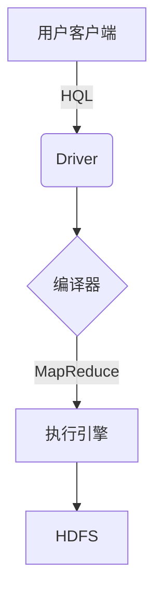
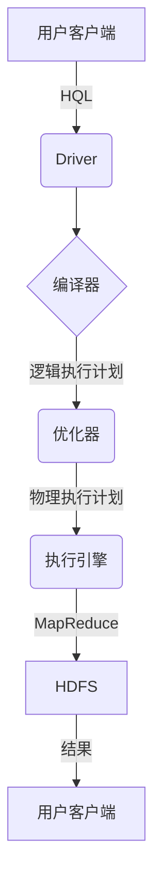

# Hive数据仓库原理与HQL代码实例讲解

## 1.背景介绍

### 1.1 什么是数据仓库

数据仓库(Data Warehouse)是一种面向主题的(Subject Oriented)、集成的(Integrated)、相对稳定的(Non-Volatile)、反映历史数据(Time-Variant)的数据集合,用于支持管理决策。它是一个集中式的、面向主题的数据库,旨在支持企业或组织内的决策分析。

数据仓库的主要特点包括:

- 面向主题(Subject Oriented):数据仓库中的数据按照特定的数据主题进行组织,而不是某个应用程序的数据需求。
- 集成(Integrated):数据仓库中的数据来自于异构的数据源,经过清洗、转换和集成处理。
- 非易失(Non-Volatile):数据仓库中的数据是只读的,一旦加载就不能被修改。
- 时间变化(Time-Variant):数据仓库中的数据反映了不同时间点的快照,用于支持历史数据分析。

### 1.2 Hive的定位

Apache Hive是一个建立在Hadoop之上的数据仓库基础工具,它可以让用户通过类SQL语句轻松地进行大数据的汇总、查询和分析。Hive的本质是将HQL(Hive Query Language)语句转换为MapReduce任务在Hadoop集群上执行,使用户无需直接编写MapReduce,从而降低了开发和维护的复杂性。

Hive的主要特点包括:

- 类SQL查询语言:Hive提供了一种类似SQL的查询语言HQL(Hive Query Language),通过类SQL语句查询、汇总和分析存储在Hadoop分布式文件系统中的数据。
- 可扩展性:Hive可以利用Hadoop的可扩展性,轻松地处理大规模数据集。
- 容错性:Hive基于Hadoop构建,因此具有Hadoop的容错性和高可用性。
- 低延迟:Hive适合用于离线数据分析,而不是在线事务处理。

## 2.核心概念与联系

### 2.1 Hive架构

Hive的架构主要由以下几个部分组成:



1. **用户客户端(User Client)**: 用户可以通过命令行或其他客户端工具向Hive发送HQL查询。
2. **Driver**: 负责接收HQL查询,并与编译器、优化器和执行引擎进行交互。
3. **编译器(Compiler)**: 将HQL查询转换为一系列的MapReduce作业。
4. **优化器(Optimizer)**: 对MapReduce作业进行优化,提高查询效率。
5. **执行引擎(Execution Engine)**: 在Hadoop集群上执行MapReduce作业,并返回结果。
6. **Metastore**: 存储Hive元数据,如表、分区、Schema等信息。
7. **HDFS(Hadoop Distributed File System)**: Hadoop分布式文件系统,用于存储Hive中的数据。

### 2.2 Hive数据模型

Hive中的数据模型主要包括以下几个概念:

- **数据库(Database)**: 在Hive中,数据库用于逻辑上组织表。
- **表(Table)**: 表是存储数据的核心单元,每个表都有一个关联的数据文件。
- **分区(Partition)**: 分区是对表进行虚拟子目录划分,每个分区对应表的一个目录。
- **桶(Bucket)**: 桶是对数据进行哈希取值,并将数据存储在不同的文件路径中。

Hive支持以下几种表类型:

- **内部表(Internal Table)**: 数据由Hive自身管理,存储在Hive的数据仓库目录中。
- **外部表(External Table)**: 数据由其他进程管理,Hive只是读取和管理元数据。
- **分区表(Partitioned Table)**: 根据一个或多个列的值对数据进行分区。
- **桶表(Bucketed Table)**: 根据哈希函数对数据进行分桶。

### 2.3 HQL与SQL的区别

HQL(Hive Query Language)是Hive的查询语言,它类似于SQL,但也有一些区别:

- **语法差异**: HQL的语法与SQL有一些差异,如不支持完整的子查询、不支持UPDATE和DELETE等。
- **数据模型差异**: Hive采用了基于Schema的数据模型,而SQL通常采用基于行的数据模型。
- **执行方式差异**: HQL查询最终会被转换为一系列MapReduce作业在Hadoop集群上执行,而SQL通常在单机上执行。
- **延迟性**: Hive适合离线批量数据分析,而不适合在线事务处理。

## 3.核心算法原理具体操作步骤

### 3.1 Hive查询执行流程

Hive查询的执行流程如下:



1. **用户客户端(User Client)**: 用户通过命令行或客户端工具提交HQL查询。
2. **Driver**: 接收HQL查询,并与编译器、优化器和执行引擎进行交互。
3. **编译器(Compiler)**: 将HQL查询转换为一个逻辑执行计划(Logical Plan)。
4. **优化器(Optimizer)**: 对逻辑执行计划进行优化,生成物理执行计划(Physical Plan)。
5. **执行引擎(Execution Engine)**: 根据物理执行计划,将查询转换为一系列MapReduce作业在Hadoop集群上执行。
6. **HDFS(Hadoop Distributed File System)**: 存储Hive中的数据和中间结果。
7. **用户客户端(User Client)**: 接收查询结果。

### 3.2 MapReduce执行原理

Hive查询最终会被转换为一系列MapReduce作业在Hadoop集群上执行,MapReduce的执行原理如下:

1. **Map阶段**:
   - 输入数据被切分为多个数据块(Split),每个Split由一个Map Task处理。
   - Map Task读取输入数据,并根据用户定义的Map函数进行处理,生成中间结果(Key-Value对)。
   - 中间结果会进行分区(Partition)和排序(Sort)操作。

2. **Shuffle阶段**:
   - 将Map阶段的输出结果按照分区和排序进行传输和合并,形成Reduce Task的输入数据。

3. **Reduce阶段**:
   - Reduce Task读取Shuffle阶段的输出结果。
   - 对相同Key的Value进行聚合操作,执行用户定义的Reduce函数。
   - 生成最终结果,并写入HDFS。

MapReduce的执行过程可以通过以下公式表示:

$$
Result = Reduce(Shuffle(Map(Input)))
$$

其中:
- $Map$函数将输入数据转换为中间结果(Key-Value对)。
- $Shuffle$函数对Map的输出进行分区、排序和合并。
- $Reduce$函数对Shuffle的输出进行聚合操作,生成最终结果。

## 4.数学模型和公式详细讲解举例说明

在Hive中,常用的数学模型和公式包括:

### 4.1 聚合函数

聚合函数用于对一组值进行计算,常见的聚合函数包括:

- $SUM(col)$: 计算指定列的总和。
- $AVG(col)$: 计算指定列的平均值。
- $COUNT(col)$: 计算指定列的非空值个数。
- $MAX(col)$: 返回指定列的最大值。
- $MIN(col)$: 返回指定列的最小值。

例如,计算某表中所有员工的总工资:

```sql
SELECT SUM(salary) AS total_salary FROM employee;
```

### 4.2 窗口函数

窗口函数用于对某些范围内的行进行计算,常见的窗口函数包括:

- $ROW_NUMBER()$: 为每一行分配一个唯一的连续整数。
- $RANK()$: 为每一行分配一个等级,相同值的等级相同。
- $DENSE_RANK()$: 为每一行分配一个等级,相同值的等级相同,并且不会出现等级间断。
- $LEAD(col, n, default)$: 返回当前行的第n行的指定列的值,如果不存在则返回默认值。
- $LAG(col, n, default)$: 返回当前行的前n行的指定列的值,如果不存在则返回默认值。

例如,计算每个部门中员工的排名:

```sql
SELECT 
    department, 
    name, 
    salary,
    RANK() OVER (PARTITION BY department ORDER BY salary DESC) AS rank
FROM employee;
```

### 4.3 数据采样

在处理大数据时,常常需要对数据进行采样,以提高计算效率。Hive中可以使用以下方法进行数据采样:

1. **基于行的采样**

$$
P(row) = \frac{sample\_rows}{total\_rows}
$$

其中:
- $sample\_rows$是要采样的行数。
- $total\_rows$是总行数。

例如,从表中随机采样10%的数据:

```sql
SELECT * FROM table TABLESAMPLE(10 PERCENT);
```

2. **基于块的采样**

$$
P(block) = \frac{sample\_bytes}{total\_bytes}
$$

其中:
- $sample\_bytes$是要采样的字节数。
- $total\_bytes$是总字节数。

例如,从表中随机采样10%的数据块:

```sql
SELECT * FROM table TABLESAMPLE(10 PERCENT) BYBLOCKSAMPLING;
```

### 4.4 数据分桶

数据分桶是一种优化技术,可以提高查询效率。分桶的原理是根据某些列的哈希值将数据划分到不同的桶(Bucket)中,从而减少需要扫描的数据量。

分桶的公式如下:

$$
bucket\_id = hash\_func(x) \bmod num\_buckets
$$

其中:
- $x$是分桶列的值。
- $hash\_func$是哈希函数,如MD5等。
- $num\_buckets$是桶的总数。

例如,将表按照部门列进行分桶,每个部门一个桶:

```sql
CREATE BUCKETED TABLE bucketed_table(
    department STRING,
    name STRING,
    salary DOUBLE
)
CLUSTERED BY (department)
INTO 10 BUCKETS;
```

## 4.项目实践:代码实例和详细解释说明

### 4.1 创建数据库和表

首先,我们需要创建一个数据库和表来存储数据。以下是创建员工表的HQL语句:

```sql
-- 创建数据库
CREATE DATABASE IF NOT EXISTS company;

-- 使用数据库
USE company;

-- 创建员工表
CREATE TABLE IF NOT EXISTS employee (
    id INT,
    name STRING,
    department STRING,
    salary DOUBLE
)
ROW FORMAT DELIMITED
FIELDS TERMINATED BY ','
STORED AS TEXTFILE;
```

上述语句创建了一个名为`company`的数据库,以及一个名为`employee`的表。表中包含四个列:`id`(整数)、`name`(字符串)、`department`(字符串)和`salary`(双精度浮点数)。数据以逗号分隔的文本文件格式存储。

### 4.2 加载数据

接下来,我们需要将数据加载到表中。假设我们有一个名为`employees.txt`的文本文件,内容如下:

```
1,John,Sales,5000.0
2,Mary,Marketing,6000.0
3,Bob,IT,7000.0
4,Alice,HR,5500.0
5,Tom,Sales,6500.0
```

可以使用以下HQL语句将数据加载到表中:

```sql
LOAD DATA LOCAL INPATH '/path/to/employees.txt' 
INTO TABLE employee;
```

注意,需要将`/path/to/employees.txt`替换为实际的文件路径。

### 4.3 基本查询

加载数据后,我们可以执行一些基本的查询操作。

1. 查询所有员工信息:

```sql
SELECT * FROM employee;
```

2. 查询特定部门的员工:

```sql
SELECT name, salary 
FROM employee
WHERE department = 'Sales';
```

3. 计算每个部门的平均工资:

```sql
SELECT department, AVG(salary) AS avg_salary
FROM employee
GROUP BY department;
```

4. 查询工资排名前三的员工:

```sql
SELECT name, salary, 
       DENSE_RANK() OVER (ORDER BY salary DESC) AS rank
FROM employee
LIMIT 3;
```

### 4.4 高级查询

除了基本查询外,Hive还支持一些高级查询操作,如连接、子查询和视图等。

1