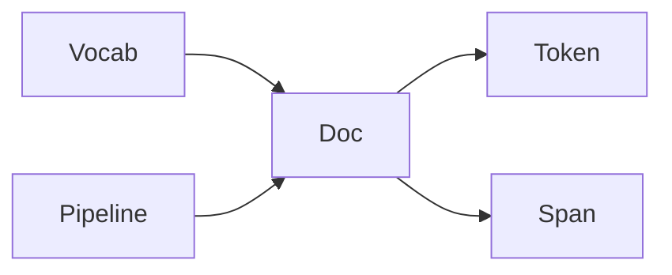

# Spacy 原理与代码实战案例讲解

作者：禅与计算机程序设计艺术

## 1. 背景介绍

### 1.1 自然语言处理的重要性
自然语言处理（NLP）是人工智能领域中一个非常重要的分支。随着大数据时代的到来，非结构化的文本数据呈现爆炸式增长。如何从海量的文本数据中挖掘出有价值的信息，已经成为了各行各业亟待解决的问题。NLP技术为我们提供了一种高效、智能的文本处理方式，让计算机能够像人一样理解和分析自然语言。

### 1.2 Spacy的优势
Spacy是一个先进的自然语言处理库，以其速度快、准确率高、易用性强等特点而备受青睐。相比于其他NLP库，Spacy的主要优势有：

- 速度极快，能够实现工业级别的文本处理
- 准确率高，内置了先进的深度学习模型
- 使用简单，API设计非常人性化
- 支持多种语言，可处理英语、德语、西班牙语等
- 功能丰富，涵盖了从分词到语义理解等各个NLP任务

### 1.3 Spacy的应用场景
凭借其强大的性能，Spacy在工业界和学术界都有广泛的应用，主要场景包括：

- 智能客服：利用Spacy对用户咨询进行自动分类、意图识别、关键信息抽取等，极大提升客服效率
- 舆情分析：通过Spacy对新闻、评论等文本进行情感分析，实现口碑监控
- 知识图谱：用Spacy从文本中抽取实体和关系，构建领域知识图谱
- 机器翻译：Spacy可以对文本进行依存分析、词性标注，从而提升翻译质量
- 问答系统：基于Spacy对问题进行解析，从文档中匹配最佳答案片段

## 2. 核心概念与联系

### 2.1 Spacy的核心概念

#### 2.1.1 Doc 
Doc是Spacy中表示文本的核心数据结构，包含了原始文本、分词结果、词性标注、命名实体识别等各种注释。Doc支持迭代、切片等操作，非常灵活。

#### 2.1.2 Token
Token表示Doc中的一个词（符号），包含了词的文本、词性、依存关系等属性。通过Token可以方便地访问词的各种语言学特征。

#### 2.1.3 Span
Span是Doc的一个切片，表示一个短语或者句子。我们可以从Doc中提取出感兴趣的Span进行分析。Span提供了计算短语向量、判断Span相似度等实用方法。

#### 2.1.4 Vocab
Vocab是一个单例对象，存储了语言的词汇表。通过vocab可以把词文本映射为唯一的数字ID，提高存储和计算效率。Vocab还负责管理词向量等资源。

#### 2.1.5 Pipeline
Pipeline定义了一系列文本处理步骤，例如分词、词性标注、命名实体识别等。当我们把一篇文档输入Spacy时，文档会依次经过Pipeline中的每个组件的处理。我们也可以往Pipeline中添加自定义组件。

### 2.2 核心概念之间的关系
下图展示了Spacy中几个核心概念之间的关系：



可以看到，Doc由Pipeline处理得到，包含了多个Token和Span。而Vocab则为Doc提供了词汇资源。理解这些概念之间的联系，对于深入使用Spacy至关重要。

## 3. 核心算法原理具体操作步骤

### 3.1 分词

#### 3.1.1 基于规则的分词
Spacy首先使用一系列手工定义的规则来实现基础的分词功能，例如根据空格和标点对文本进行拆分。同时Spacy还考虑了缩写、日期等特殊情况，以提高分词的准确率。

#### 3.1.2 基于统计模型的分词
在此基础上，Spacy采用条件随机场（Conditional Random Fields, CRF）模型来进一步优化分词结果。CRF是一种序列标注模型，通过学习词与词之间的转移概率，以及词的特征与标签的发射概率，实现对整个句子的全局最优标注。

Spacy的CRF分词具体步骤如下：
1. 将Doc转化为特征向量序列
2. 使用CRF模型对特征序列进行标注，得到每个词的BMES标签
3. 根据BMES标签重新组合词，得到最终的分词结果

其中BMES指的是：
- B（Begin）表示词的开头
- M（Middle）表示词的中间部分
- E（End）表示词的结尾 
- S（Single）表示单个字符作为一个词

### 3.2 词性标注

#### 3.2.1 基于规则的词性标注
Spacy内置了大量的词性标注规则，可以根据词的词尾、词形等特征直接判断词性。例如以-ly结尾的词通常是副词，以-ion结尾的词通常是名词等。

#### 3.2.2 基于统计模型的词性标注  
同样，Spacy使用了条件随机场模型来进行词性标注。相比于分词，词性标注需要考虑更多的特征，例如词本身的文本、词的小写形式、词的前缀后缀、词的shape等。Spacy通过在大规模语料上训练CRF模型，学习不同特征与词性标签之间的对应关系。

词性标注的具体步骤如下：
1. 将词转化为多维特征向量
2. 使用CRF模型对特征向量序列进行标注，得到每个词的词性标签
3. 将词性标签附加到对应的Token上

### 3.3 命名实体识别

#### 3.3.1 基于规则的命名实体识别
Spacy预定义了常见的命名实体类型和识别规则，例如地名通常以大写字母开头，人名通常包含姓和名等。这些规则可以快速过滤出潜在的命名实体。

#### 3.3.2 基于深度学习的命名实体识别
Spacy采用了基于转移的命名实体识别（Transition-based Named Entity Recognition）模型，该模型本质上是一个多层感知机，通过多个嵌入层和隐藏层学习词与命名实体标签之间的对应关系。

命名实体识别的具体步骤如下：
1. 将词转化为词嵌入向量
2. 将词嵌入向量输入多层感知机，经过多个隐藏层的变换
3. 使用Softmax输出层预测每个词对应的命名实体标签
4. 根据预测的标签识别出命名实体的边界和类型

## 4. 数学模型和公式详细讲解举例说明

### 4.1 条件随机场模型

条件随机场（CRF）是一种常用的序列标注模型，在Spacy中主要用于分词和词性标注任务。CRF模型可以学习标签之间的转移概率以及特征与标签之间的发射概率，从而对整个序列进行全局最优的标注。

假设我们有一个输入序列 $X=(x_1,x_2,...,x_n)$，以及一个标签序列 $Y=(y_1,y_2,...,y_n)$，CRF模型定义了条件概率 $P(Y|X)$ 如下：

$$P(Y|X) = \frac{1}{Z(X)} \exp \left( \sum_{i=1}^n \sum_{j} \lambda_j f_j (y_{i-1}, y_i, X, i) \right)$$

其中：
- $Z(X)$ 是归一化因子，用于确保 $P(Y|X)$ 的和为1
- $f_j$ 是第 $j$ 个特征函数，用于提取输入序列 $X$ 在位置 $i$ 处的特征
- $\lambda_j$ 是第 $j$ 个特征函数对应的权重，需要通过训练学习得到

在训练阶段，CRF模型通过极大似然估计来学习特征权重 $\lambda_j$，目标是最大化训练数据的对数似然函数：

$$L(\lambda) = \sum_{i=1}^N \log P(Y^{(i)} | X^{(i)}) - \frac{\lambda^2}{2\sigma^2}$$

其中 $N$ 是训练样本的数量，$\frac{\lambda^2}{2\sigma^2}$ 是L2正则化项，用于防止过拟合。

在预测阶段，CRF模型通过动态规划算法（如Viterbi算法）来寻找最可能的标签序列 $Y^*$：

$$Y^* = \arg\max_{Y} P(Y|X)$$

### 4.2 多层感知机

多层感知机（Multilayer Perceptron, MLP）是一种前馈神经网络，在Spacy中主要用于命名实体识别任务。MLP由输入层、若干隐藏层和输出层组成，可以学习特征与标签之间的复杂非线性关系。

假设我们有一个输入向量 $x \in \mathbb{R}^d$，MLP定义了从输入到输出的函数映射：

$$f(x) = \sigma(W_n \cdot \sigma(W_{n-1} \cdot \sigma(...\sigma(W_1 \cdot x + b_1)...) + b_{n-1}) + b_n)$$

其中：
- $W_i$ 是第 $i$ 层的权重矩阵
- $b_i$ 是第 $i$ 层的偏置向量
- $\sigma$ 是激活函数，常用的有ReLU、Tanh等

在训练阶段，MLP通过反向传播算法和梯度下降法来学习每一层的权重矩阵和偏置向量，目标是最小化预测标签与真实标签之间的交叉熵损失：

$$J(\theta) = -\frac{1}{N} \sum_{i=1}^N \sum_{j=1}^C y_j^{(i)} \log(\hat{y}_j^{(i)}) + \frac{\lambda}{2} \sum_{k} \theta_k^2$$

其中：
- $\theta$ 表示模型的所有参数，包括权重矩阵和偏置向量
- $N$ 是训练样本的数量
- $C$ 是标签类别的数量
- $y_j^{(i)}$ 表示第 $i$ 个样本的第 $j$ 个标签的真实值（0或1）
- $\hat{y}_j^{(i)}$ 表示第 $i$ 个样本的第 $j$ 个标签的预测概率
- $\frac{\lambda}{2} \sum_{k} \theta_k^2$ 是L2正则化项，用于防止过拟合

在预测阶段，MLP将输入向量 $x$ 传入网络，经过前向传播得到输出向量 $\hat{y}$，其中 $\hat{y}_j$ 表示预测为第 $j$ 个标签的概率。我们可以选择概率最大的标签作为最终的预测结果。

## 5. 项目实践：代码实例和详细解释说明

下面我们通过一个实际的代码示例，演示如何使用Spacy进行分词、词性标注和命名实体识别。

```python
import spacy

# 加载英文模型
nlp = spacy.load("en_core_web_sm")

# 待分析的文本
text = "Apple is looking at buying U.K. startup for $1 billion"

# 创建Doc对象
doc = nlp(text)

# 分词
for token in doc:
    print(token.text)

# 词性标注
for token in doc:
    print(token.text, token.pos_, token.tag_)

# 命名实体识别
for ent in doc.ents:
    print(ent.text, ent.label_)
```

输出结果：

```
Apple
is
looking
at
buying
U.K.
startup
for
$
1
billion
Apple PROPN NNP
is AUX VBZ
looking VERB VBG
at ADP IN
buying VERB VBG
U.K. PROPN NNP
startup NOUN NN
for ADP IN
$ SYM $
1 NUM CD
billion NUM CD
Apple ORG
U.K. GPE
$1 billion MONEY
```

可以看到，Spacy成功地完成了分词、词性标注和命名实体识别任务：
- 分词：将文本拆分为单词级别的Token对象
- 词性标注：为每个Token标注了词性（如PROPN表示专有名词，VERB表示动词等）和详细的词性标签（如NNP表示单数专有名词，VBG表示动名词等）  
- 命名实体识别：识别出了文本中的三个命名实体（Apple、U.K.和$1 billion），并正确标注了它们的类型（ORG表示