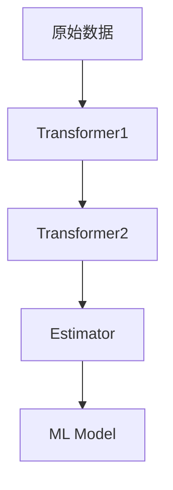

# Spark MLlib原理与代码实例讲解

## 1.背景介绍

### 1.1 什么是Spark MLlib

Apache Spark MLlib是Spark的机器学习库，提供了多种机器学习算法的实现。它建立在Spark的分布式内存计算框架之上,可以轻松地在大规模数据集上运行机器学习工作负载。MLlib由以下几个部分组成:

- ML Algorithms: 包含多种常用的机器学习算法,如分类、回归、聚类和协同过滤等。
- Featurization: 特征提取和转换工具,如哈希特征、标准化和向量化等。  
- Pipelines: 用于构建、评估和调整机器学习管道的工具。
- Persistence: 保存和加载算法、模型和管道。
- Utilities: 线性代数、统计、数据处理等工具。

### 1.2 为什么使用Spark MLlib

使用Spark MLlib有以下几个主要优势:

1. **可扩展性**:基于Spark的分布式内存计算框架,MLlib可以轻松扩展到大规模数据集。

2. **易于使用**:MLlib提供了统一的高级API,简化了机器学习管道的构建。

3. **多语言支持**:支持Scala、Java、Python和R语言。

4. **内存计算**:利用Spark的内存计算优势,避免了磁盘I/O的开销。

5. **生态系统集成**:与Spark生态系统无缝集成,如Spark SQL、Spark Streaming等。

## 2.核心概念与联系  

### 2.1 机器学习Pipeline

Spark MLlib中的机器学习Pipeline是一系列相互链接的数据处理和机器学习阶段的集合。它包括以下几个核心概念:

1. **Transformer**:转换器,用于转换一个数据集到另一个数据集。如特征提取、标准化等。

2. **Estimator**:估计器,用于基于数据集训练出一个Transformer。如逻辑回归、决策树等算法。

3. **Parameter**:参数,用于配置Transformer和Estimator的行为。

4. **Pipeline**:管道,将多个Transformer和Estimator链接在一起。

5. **ML Model**:机器学习模型,由Estimator训练得到。

Pipeline的工作流程如下:



### 2.2 特征工程

特征工程是将原始数据转换为机器学习算法可用的特征向量的过程。MLlib提供了多种Transformer用于特征工程:

- **Tokenizer**: 将文本行分割为单词
- **HashingTF**: 将文本映射为特征向量
- **OneHotEncoder**: 将分类特征编码为二进制向量
- **VectorAssembler**: 将多个列合并为单个向量列
- **StandardScaler**: 标准化数值特征
- ...

这些Transformer可以灵活组合,构建出复杂的特征工程Pipeline。

## 3.核心算法原理具体操作步骤

MLlib提供了多种机器学习算法的实现,包括监督学习和无监督学习算法。下面我们详细介绍几种核心算法的原理和使用步骤。

### 3.1 逻辑回归

逻辑回归是一种广泛使用的分类算法,用于预测二元或多元分类问题。它的核心思想是通过对数几率函数(logistic function)将输入映射到(0,1)区间,从而得到事件发生的概率。

1. **二元逻辑回归**

对于二元逻辑回归,我们令 $y \in \{0, 1\}$ 为标签, $X = [x_1, x_2, ..., x_n]$ 为特征向量,则模型为:

$$P(y=1|X) = \frac{1}{1 + e^{-(\beta_0 + \beta_1x_1 + ... + \beta_nx_n)}}$$

其中 $\beta_i$ 为模型参数。我们的目标是最小化以下损失函数:

$$\text{Loss} = -\sum_{i=1}^N [y_i\log P(y_i=1|X_i) + (1-y_i)\log(1-P(y_i=1|X_i))]$$

这可以通过梯度下降法或者BFGS等优化算法来求解。

2. **多元逻辑回归**

对于K元逻辑回归问题,我们有 $y \in \{1,2,...,K\}$,模型为:

$$P(y=k|X) = \frac{e^{\beta_k^TX}}{\sum_{j=1}^K e^{\beta_j^TX}}$$

其中 $\beta_k$ 为第k类的参数向量。我们的目标是最小化交叉熵损失:

$$\text{Loss} = -\sum_{i=1}^N \log P(y_i|X_i)$$

可以使用MLNR或LBFGS等优化算法求解。

3. **Spark MLlib用法**

```scala
// 加载数据
val data = spark.read.format("libsvm")
  .load("data/mllib/sample_libsvm_data.txt")

// 将数据集切分为训练集和测试集  
val Array(train, test) = data.randomSplit(Array(0.8, 0.2))

// 创建逻辑回归估计器
val lr = new LogisticRegression()
  .setMaxIter(10)
  .setRegParam(0.3)
  .setElasticNetParam(0.8)

// 训练逻辑回归模型  
val lrModel = lr.fit(train)

// 在测试集上评估模型
val predictions = lrModel.transform(test)
val evaluator = new BinaryClassificationEvaluator()
  .setLabelCol("label")
  .setRawPredictionCol("prediction")
val accuracy = evaluator.evaluate(predictions)
```

### 3.2 决策树

决策树是一种监督学习算法,可用于分类和回归问题。它通过递归地将特征空间划分为较小的子空间,构建出一棵决策树。MLlib支持两种决策树算法:

1. **CART 决策树**

CART(Classification And Regression Trees)是一种基于基尼不纯度或信息增益进行特征选择和树生长的算法。它的核心思想是:

- 对于分类问题,选择使数据集在该特征上的基尼不纯度最小的特征进行分裂。
- 对于回归问题,选择使数据集在该特征上的方差最小的特征进行分裂。

2. **随机森林**

随机森林是一种集成学习算法,由多棵决策树组成。它的工作原理是:

- 对于每棵树,从训练集中有放回地抽取一个子集进行树的构建。
- 在每个节点分裂时,从所有特征中随机选择一个子集,再从这个子集中选择最优分裂特征。

这种随机性使得随机森林避免了单棵决策树的过拟合问题,通常具有更好的泛化能力。

3. **Spark MLlib用法**

```scala
// 加载数据 
val data = spark.read.format("libsvm")
  .load("data/mllib/sample_libsvm_data.txt")
  
// 切分数据集
val splits = data.randomSplit(Array(0.7, 0.3))
val (trainingData, testData) = (splits(0), splits(1))

// 训练CART决策树模型
val dt = new DecisionTreeClassifier()
  .setMaxDepth(5)
  .setImpurity("gini")
val dtModel = dt.fit(trainingData)

// 评估模型
val predictions = dtModel.transform(testData)
val evaluator = new MulticlassClassificationEvaluator()
  .setLabelCol("label")
  .setPredictionCol("prediction")
val accuracy = evaluator.evaluate(predictions)

// 训练随机森林模型  
val rf = new RandomForestClassifier()
  .setNumTrees(20)
val rfModel = rf.fit(trainingData)
val rfPredictions = rfModel.transform(testData)
val rfAccuracy = evaluator.evaluate(rfPredictions)
```

### 3.3 聚类

聚类是一种常用的无监督学习算法,旨在将数据集划分为多个簇,使得簇内数据相似而簇间数据不相似。MLlib支持多种聚类算法:

1. **K-Means**

K-Means是最常用的聚类算法之一。它的基本思想是:

- 随机选择K个初始质心
- 对每个数据点,将其分配给最近的质心
- 重新计算每个簇的质心
- 重复上述过程,直到质心不再发生变化

2. **高斯混合模型(GMM)**

GMM假设数据由多个高斯分布组成的混合模型生成。它的工作原理是使用期望最大化(EM)算法迭代优化模型参数,直到收敛。

3. **Spark MLlib用法**

```scala
// 加载数据
val dataset = spark.read.format("libsvm")
  .load("data/mllib/sample_kmeans_data.txt")

// 训练K-Means模型
val kmeans = new KMeans()
  .setK(3)
  .setSeed(1L)
val model = kmeans.fit(dataset)

// 评估模型质量
val WSSSE = model.computeCost(dataset)
println(s"Within Set Sum of Squared Errors = $WSSSE")

// 预测新数据的簇
val predictions = model.transform(dataset)

// 训练GMM模型
val gmm = new GaussianMixture()
  .setK(3)
  .setMaxIter(100)
val gmmModel = gmm.fit(dataset)

// 输出模型参数
println(s"GaussianMixture Model Parameters: ${gmmModel.weights}")
```

## 4.数学模型和公式详细讲解举例说明

机器学习算法通常基于一些数学模型和公式,下面我们详细讲解几种常用模型的数学原理。

### 4.1 线性回归

线性回归是一种常用的回归算法,试图学习一个由属性向量作为输入,输出为连续值的函数。我们令数据集为 $\{(x_1,y_1), (x_2,y_2), ..., (x_n, y_n)\}$,其中 $x_i$ 为特征向量, $y_i$ 为标量响应值。线性回归模型为:

$$y = \theta_0 + \theta_1x_1 + ... + \theta_nx_n$$

我们的目标是找到最优参数 $\theta$ ,使得预测值 $\hat{y}$ 与实际值 $y$ 的残差平方和最小:

$$\min_\theta \sum_{i=1}^n (\hat{y}_i - y_i)^2 = \min_\theta \sum_{i=1}^n (x_i^T\theta - y_i)^2$$

这个优化问题可以通过最小二乘法或梯度下降法求解。

### 4.2 支持向量机

支持向量机(SVM)是一种常用的分类算法,可用于线性和非线性分类问题。对于线性可分的二元分类问题,我们希望找到一个超平面将两类数据分开,且与每一类最近的数据点的距离最大。设数据集为 $\{(x_1, y_1), (x_2, y_2), ..., (x_n, y_n)\}$,其中 $x_i$ 为特征向量, $y_i \in \{-1, 1\}$ 为类别标签。我们的目标是找到一个超平面 $w^Tx + b = 0$,使得:

$$\begin{align*}
&\min_{w,b} \frac{1}{2}\|w\|^2\\
&\text{subject to } y_i(w^Tx_i + b) \geq 1, i=1,...,n
\end{align*}$$

这个优化问题可以通过拉格朗日对偶性质转化为对偶问题求解。对于非线性问题,我们可以使用核技巧将数据映射到高维特征空间,使其在新空间中线性可分。

### 4.3 主成分分析

主成分分析(PCA)是一种常用的无监督线性降维技术。给定一个 $n \times m$ 的数据矩阵 $X$,PCA试图找到一个 $m \times k$ 的投影矩阵 $U$,使得投影后的数据 $Z = XU$ 具有最大的方差。具体来说,我们希望最大化:

$$\max_{U^TU=I} \text{tr}(U^TXX^TU)$$

这个优化问题的解是数据协方差矩阵 $XX^T$ 的前 $k$ 个最大特征值对应的特征向量。PCA可以通过奇异值分解(SVD)的方法求解:

$$X = U\Sigma V^T$$

其中 $U$ 即为所求的投影矩阵。

### 4.4 PageRank

PageRank是一种用于计算网页重要性的算法,被广泛应用于网页排名和社交网络分析等领域。它的核心思想是,一个网页的重要性取决于指向它的其他网页的重要性。设 $G=(V,E)$ 为一个有向图,其中 $V$ 为网页集合, $