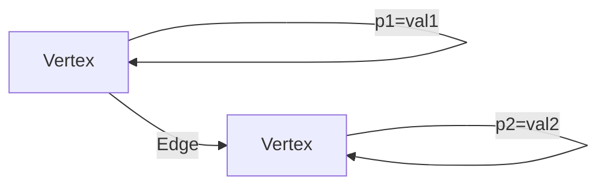
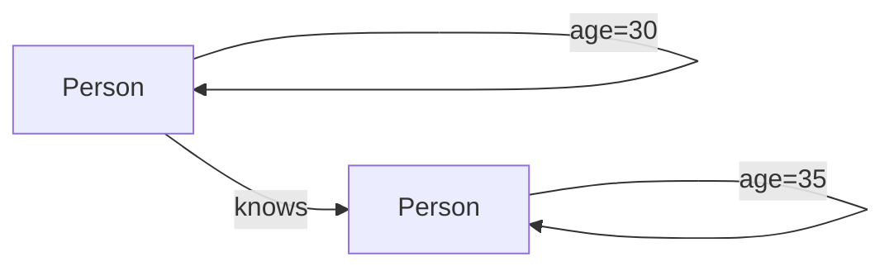
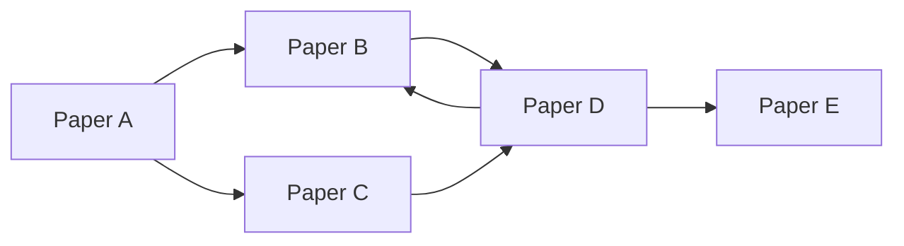

# TinkerPop原理与代码实例讲解

## 1.背景介绍

### 1.1 图数据库的兴起

随着大数据时代的到来,传统的关系型数据库在处理高度互联的复杂数据时遇到了挑战。图数据库应运而生,它能够高效地存储和查询关系数据。与关系型数据库相比,图数据库更加自然地描述现实世界中的实体及其关系,擅长处理高度互连的数据。

### 1.2 TinkerPop介绍

TinkerPop是一个开源的图计算框架,提供了一组标准接口和数据结构,使得开发人员能够用相同的API操作不同的图数据库和图计算引擎。它由Apache软件基金会维护,是当前图数据库领域的事实标准。TinkerPop包含以下四个主要模块:

- **Gremlin** - 一种功能强大的图遍历查询语言
- **Blueprints** - 一组标准化的接口,用于操作不同的图数据库
- **Gremlin-Server** - 一个可扩展的服务器,允许远程执行Gremlin查询
- **Gremlin-Driver** - 一个客户端驱动程序,用于连接Gremlin-Server

### 1.3 TinkerPop的优势

TinkerPop的主要优势在于:

1. **统一的API** - 开发人员无需学习不同数据库的查询语言,只需掌握Gremlin即可
2. **强大的查询能力** - Gremlin提供了丰富的遍历和分析功能
3. **可扩展性** - 支持多种图数据库和图计算引擎
4. **活跃的社区** - 有大量的开发者和供应商参与贡献

## 2.核心概念与联系  

### 2.1 图的基本概念

在图数据库中,数据被建模为由顶点(Vertex)和边(Edge)组成的图。顶点表示实体,边表示实体之间的关系。每个顶点和边都可以有任意数量的属性(Property)。



### 2.2 属性图模型

TinkerPop采用属性图(Property Graph)模型,它是一种半结构化的数据模型,能够很好地描述现实世界中的实体及其关系。属性图由以下几个核心概念组成:

- **顶点(Vertex)** - 表示实体,如人、地点、事物等
- **边(Edge)** - 表示实体之间的关系,如朋友、居住、购买等
- **属性(Property)** - 描述顶点和边的元数据,如姓名、年龄、权重等
- **标签(Label)** - 对顶点和边进行分类和组织



### 2.3 Gremlin查询语言

Gremlin是TinkerPop中的核心组件,它是一种功能强大的图遍历查询语言。Gremlin查询由一系列步骤(Step)组成,每个步骤都会对图进行特定的操作,如遍历、过滤、转换等。步骤可以链式组合,形成复杂的查询逻辑。

```groovy
// 查找30岁以上的人,并返回他们的姓名
g.V().hasLabel('person').has('age', gt(30)).values('name')
```

Gremlin支持多种编程语言,如Java、Groovy、Python、.NET等,使得开发人员可以使用熟悉的语言编写图查询。

## 3.核心算法原理具体操作步骤

### 3.1 图遍历算法

图遍历是图计算中最基本也是最常用的操作。TinkerPop中的Gremlin语言提供了多种图遍历算法,用于有效地查询和处理图数据。

#### 3.1.1 广度优先遍历(BFS)

广度优先遍历(Breadth-First Search, BFS)是一种常用的图遍历算法。它从一个起始顶点出发,首先访问所有邻居顶点,然后再访问邻居的邻居,以此类推,直到遍历完整个图。BFS常用于求解最短路径问题。

```groovy
// 从顶点1开始,进行广度优先遍历,返回遍历路径
g.V(1).repeat(__.outE().inV().simplePath()).times(5).path().by(label)
```

#### 3.1.2 深度优先遍历(DFS)

深度优先遍历(Depth-First Search, DFS)是另一种常用的图遍历算法。它从一个起始顶点出发,沿着一条路径一直遍历下去,直到无法继续前进,然后回溯到上一个分叉点,尝试另一条路径。DFS常用于检测环路和连通性。

```groovy
// 从顶点1开始,进行深度优先遍历,返回遍历路径
g.V(1).repeat(__.outE().inV()).times(5).path().by(label)
```

#### 3.1.3 随机游走(Random Walk)

随机游走是一种特殊的图遍历算法,它从一个起始顶点出发,每次随机选择一条边进行遍历。随机游走常用于采样和近似计算,如PageRank算法。

```groovy
// 从顶点1开始,进行10步随机游走,返回遍历路径
g.V(1).repeat(__.outE().inV().sample(loc.peek())).times(10).path().by(label)
```

### 3.2 图分析算法

除了基本的遍历操作,TinkerPop还提供了多种图分析算法,用于发现图中的有趣模式和洞见。

#### 3.2.1 PageRank

PageRank是一种著名的链接分析算法,它通过模拟随机游走过程,计算每个顶点的重要性得分。PageRank被广泛应用于网页排名、社交网络分析等领域。

```groovy
// 计算图中所有顶点的PageRank得分
g.withPageRank(0.6).withPageRankUnpersist().pageRank().valueMap().next()
```

#### 3.2.2 社区发现

社区发现算法旨在识别图中的密集子图(社区),这些社区通常代表着具有相似特征或紧密联系的一组顶点。社区发现在社交网络分析、生物信息学等领域有广泛应用。

```groovy
// 使用Louvain算法发现图中的社区
g.withLouvainCommunityUnpersist().louvainCommunity().valueMap().next()
```

#### 3.2.3 最短路径

最短路径算法用于计算两个顶点之间的最短距离,是图计算中一个经典问题。TinkerPop提供了多种最短路径算法,如Dijkstra算法、A*算法等。

```groovy
// 计算顶点1到顶点5的最短路径
g.withShortestPath().shortestPath().with(ShortestPath.target, __.hasId(5)).iterate()
```

## 4.数学模型和公式详细讲解举例说明

### 4.1 PageRank算法

PageRank算法是一种基于链接分析的算法,它通过模拟随机游走过程,计算每个网页(或图中的顶点)的重要性得分。PageRank算法的核心思想是,一个网页被多个高质量网页链接,则该网页的重要性也会较高。

PageRank算法的数学模型如下:

$$PR(u) = \frac{1-d}{N} + d \sum_{v \in B_u} \frac{PR(v)}{L(v)}$$

其中:

- $PR(u)$ 表示顶点 $u$ 的PageRank得分
- $N$ 是图中顶点的总数
- $B_u$ 是指向顶点 $u$ 的所有顶点集合
- $L(v)$ 是顶点 $v$ 的出度(指向其他顶点的边数)
- $d$ 是一个阻尼系数,通常取值为0.85

该公式可以解释为:一个顶点的PageRank得分由两部分组成。第一部分 $(1-d)/N$ 是每个顶点初始时平均分配的基础得分。第二部分是从所有指向该顶点的顶点传递过来的得分之和,其中每个指向顶点的贡献是该顶点的PageRank得分除以其出度。

PageRank算法通过迭代计算直至收敛,得到每个顶点的稳定PageRank得分。

### 4.2 示例:计算论文引用网络中的PageRank

考虑一个论文引用网络,其中每个顶点表示一篇论文,边表示引用关系。我们可以使用PageRank算法计算每篇论文的重要性得分。

假设有5篇论文,引用关系如下:



令阻尼系数 $d=0.85$,初始时每篇论文的PageRank得分都设为 $1/5=0.2$。经过几轮迭代后,各论文的PageRank得分收敛为:

- $PR(A) = 0.1$
- $PR(B) = 0.28$
- $PR(C) = 0.1$
- $PR(D) = 0.42$
- $PR(E) = 0.1$

我们可以看到,论文D由于被多篇论文引用,因此获得了最高的PageRank得分,说明它在该引用网络中最为重要。

## 4.项目实践:代码实例和详细解释说明

在这一部分,我们将通过一个实际项目案例,展示如何使用TinkerPop和Gremlin语言进行图数据建模、查询和分析。

### 4.1 项目概述

我们将构建一个简单的社交网络应用,其中包含以下实体和关系:

- 用户(User)
- 关注(follows)关系
- 发布(posts)状态
- 评论(comments)状态

我们将使用TinkerPop和Gremlin语言对这个社交网络进行建模,并实现一些常见的查询和分析操作。

### 4.2 数据建模

首先,我们需要定义图模型中的顶点和边的标签(Label)。

```groovy
// 顶点标签
:remote mgmt.graph.schema().propertyKey('userId', 'name', 'postId', 'commentId', 'createdAt').create()
:remote mgmt.graph.schema().vertexLabel('user', 'post', 'comment').create()

// 边标签
:remote mgmt.graph.schema().edgeLabel('follows', 'posts', 'comments').create()
```

接下来,我们可以插入一些示例数据。

```groovy
// 插入用户
user1 = g.addV('user').property('userId', 1).property('name', 'Alice').next()
user2 = g.addV('user').property('userId', 2).property('name', 'Bob').next()
user3 = g.addV('user').property('userId', 3).property('name', 'Charlie').next()

// 添加关注关系
user1.addE('follows').to(user2)
user2.addE('follows').to(user3)

// 添加状态和评论
post1 = user1.addV('post').property('postId', 1).property('createdAt', '2023-05-01').next()
comment1 = post1.addV('comment').property('commentId', 1).property('createdAt', '2023-05-02').next()
comment2 = post1.addV('comment').property('commentId', 2).property('createdAt', '2023-05-03').next()
```

### 4.3 查询和遍历

使用Gremlin语言,我们可以执行各种查询和遍历操作。

#### 4.3.1 查找用户的关注者

```groovy
// 查找用户1的关注者
g.V().has('user', 'userId', 1).inE('follows').outV().valueMap('name')
```

#### 4.3.2 查找用户发布的状态

```groovy
// 查找用户1发布的所有状态
g.V().has('user', 'userId', 1).outE('posts').inV().valueMap('postId', 'createdAt')
```

#### 4.3.3 查找状态的评论

```groovy
// 查找状态1的所有评论
g.V().has('post', 'postId', 1).outE('comments').inV().valueMap('commentId', 'createdAt')
```

#### 4.3.4 广度优先遍历

```groovy
// 从用户1开始,进行广度优先遍历,返回遍历路径
g.V().has('user', 'userId', 1).repeat(__.outE().inV().simplePath()).times(3).path().by(label).by(valueMap())
```

### 4.4 图分析

除了基本的查询和遍历操作,我们还