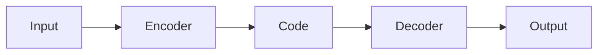
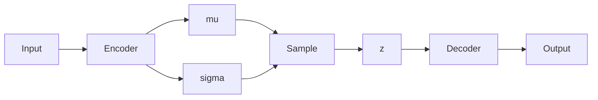

# 变分自编码器(VAE)原理与代码实战案例讲解

## 1.背景介绍

### 1.1 生成模型的发展历程

在机器学习和深度学习领域,生成模型一直是研究的重点和难点。生成模型旨在从训练数据中学习数据分布,并能够生成新的类似于训练数据的样本。传统的生成模型包括高斯混合模型(GMM)、隐马尔可夫模型(HMM)等,但它们在处理高维数据(如图像、语音等)时存在局限性。

### 1.2 深度生成模型的兴起

随着深度学习的兴起,一些新的生成模型也应运而生,如受限玻尔兹曼机(RBM)、深度信念网络(DBN)等。但这些模型在训练过程中存在一些缺陷,如缓慢收敛、难以推广到更高维数据等。直到2014年,自编码变分贝叶斯(Variational Auto-Encoder,VAE)和生成对抗网络(Generative Adversarial Network,GAN)的提出,深度生成模型才获得了长足的发展。

### 1.3 VAE的重要意义

VAE是一种基于深度学习的生成模型,能够学习复杂数据的潜在分布,并可以生成新的相似样本。与GAN不同,VAE是一种基于概率、端到端可训练的生成模型,具有如下优势:

- 训练稳定,不存在模式崩溃问题
- 可以对隐变量进行有效的正则化,获得更加连续和平滑的潜在空间
- 潜在空间具有很好的解释性,可用于数据的插值、探索和理解

VAE已被广泛应用于图像、视频、语音、文本等多个领域,是深度生成模型的重要代表。

## 2.核心概念与联系

### 2.1 自编码器(AE)

自编码器是一种无监督学习的神经网络模型,旨在将输入数据通过编码器压缩为低维潜在表示,再通过解码器从潜在表示重构出原始输入。自编码器的结构如下:



自编码器的目标是最小化输入数据与重构数据之间的差异,从而学习到输入数据的有效压缩表示。但传统自编码器只能对输入数据进行复制,无法生成新的数据样本。

### 2.2 变分自编码器(VAE)

为了使自编码器具备生成能力,VAE在自编码器的基础上引入了变分推理(Variational Inference)和生成过程。VAE的核心思想是将潜在表示Code视为隐变量z的后验分布的参数,并对z施加先验分布(通常为高斯分布)的约束,从而使得潜在空间具有较好的结构性和解释性。

VAE的结构如下:



其中,编码器输出隐变量z的均值μ和标准差σ,然后从N(μ,σ)中采样得到z,将z输入解码器生成输出。在训练过程中,VAE最小化重构误差和KL散度(用于约束隐变量分布),从而学习到数据的潜在分布。

### 2.3 重参数技巧(Reparameterization Trick)

由于隐变量z是从随机分布中采样得到的,这使得VAE的梯度难以直接反向传播。为了解决这一问题,VAE引入了重参数技巧:

$$z = \mu + \sigma \odot \epsilon, \quad \epsilon \sim \mathcal{N}(0, 1)$$

其中,ϵ是从标准正态分布中采样的噪声项,μ和σ分别是编码器输出的隐变量均值和标准差。通过这种重参数化,z成为μ和σ的确定性函数,从而使得梯度可以顺利反向传播。

### 2.4 VAE目标函数

VAE的目标是最大化边际对数似然:

$$\log p(x) = \mathbb{E}_{q(z|x)}[\log p(x|z)] - D_{KL}(q(z|x)||p(z))$$

其中,第一项是重构项,衡量生成数据与原始数据的差异;第二项是KL散度项,用于约束隐变量分布q(z|x)与先验分布p(z)之间的差异。由于直接优化这一目标函数很困难,VAE采用了变分下界(Evidence Lower Bound,ELBO)作为优化目标:

$$\mathcal{L}(\theta, \phi; x) = \mathbb{E}_{q_\phi(z|x)}[\log p_\theta(x|z)] - D_{KL}(q_\phi(z|x)||p(z))$$

通过最大化ELBO,VAE可以同时优化重构质量和隐变量分布的正则化。

## 3.核心算法原理具体操作步骤

VAE的训练过程可分为以下几个步骤:

1. **前向传播**:输入数据x通过编码器网络,得到隐变量z的均值μ和标准差σ。
2. **采样隐变量**:利用重参数技巧,从N(μ,σ)中采样隐变量z。
3. **解码重构**:将采样得到的z输入解码器网络,生成重构数据x'。
4. **计算损失函数**:计算重构损失和KL散度损失,将两者相加得到ELBO损失。
5. **反向传播**:计算ELBO损失相对于编码器和解码器参数的梯度。
6. **更新参数**:使用优化器(如Adam)根据梯度更新编码器和解码器的参数。

重复上述过程直至收敛。训练完成后,可以固定编码器,利用解码器对隐变量z进行采样,从而生成新的样本数据。

以下是VAE训练过程的伪代码:

```python
for x in data:
    # 编码器前向传播
    mu, sigma = encoder(x)
    
    # 采样隐变量
    epsilon = torch.randn_like(sigma)
    z = mu + sigma * epsilon
    
    # 解码器前向传播
    x_recon = decoder(z)
    
    # 计算损失函数
    recon_loss = reconstruction_loss(x, x_recon)
    kl_loss = kl_divergence(mu, sigma)
    loss = recon_loss + kl_loss
    
    # 反向传播和优化
    loss.backward()
    optimizer.step()
```

## 4.数学模型和公式详细讲解举例说明

### 4.1 重构损失

VAE的重构损失衡量生成数据与原始数据之间的差异。常用的重构损失函数包括:

- **均方误差(Mean Squared Error,MSE)**:对于连续值数据(如图像像素值),MSE是最常用的重构损失函数:

$$\mathcal{L}_{MSE}(x, x') = \frac{1}{n}\sum_{i=1}^{n}(x_i - x'_i)^2$$

- **交叉熵损失(Cross Entropy Loss)**:对于离散值数据(如词汇分布),交叉熵损失更为合适:

$$\mathcal{L}_{CE}(x, x') = -\sum_{i=1}^{n}x_i\log x'_i$$

- **贝叶斯损失(Bayesian Loss)**:对于存在噪声的数据(如图像去噪),贝叶斯损失可以更好地建模噪声:

$$\mathcal{L}_{Bayes}(x, x') = \frac{1}{2\sigma^2}\|x - x'\|^2 + \frac{1}{2}\log\sigma^2$$

其中,σ是噪声的标准差,需要被网络同时学习。

根据数据的特性选择合适的重构损失函数,对VAE的性能至关重要。

### 4.2 KL散度损失

KL散度损失用于约束隐变量分布q(z|x)与先验分布p(z)之间的差异,通常取标准正态分布N(0,I)作为先验分布。KL散度的计算公式为:

$$D_{KL}(q(z|x)||p(z)) = \int q(z|x)\log\frac{q(z|x)}{p(z)}dz$$

对于均值μ和标准差σ参数化的高斯分布q(z|x)=N(μ,σ),其与标准正态分布p(z)=N(0,I)的KL散度有解析解:

$$D_{KL}(N(\mu, \sigma^2)||N(0, 1)) = \frac{1}{2}\sum_{j=1}^{J}(\mu_j^2 + \sigma_j^2 - \log\sigma_j^2 - 1)$$

其中,J是隐变量z的维度。

KL散度损失可以看作是对隐变量分布的正则化项,它促使隐变量分布尽可能接近标准正态分布,从而使得潜在空间具有较好的结构性和解释性。在实际应用中,通常会给KL损失加一个权重系数β,以平衡重构质量和隐变量分布的正则化:

$$\mathcal{L} = \mathcal{L}_{recon} + \beta D_{KL}(q(z|x)||p(z))$$

### 4.3 重参数技巧(Reparameterization Trick)

如前所述,重参数技巧是VAE中一个关键技术,它使得隐变量z成为编码器参数的确定性函数,从而使得梯度可以顺利反向传播。具体来说,重参数技巧将隐变量z重写为:

$$z = \mu + \sigma \odot \epsilon, \quad \epsilon \sim \mathcal{N}(0, 1)$$

其中,ϵ是从标准正态分布中采样的噪声项,μ和σ分别是编码器输出的隐变量均值和标准差,⊙表示元素wise乘积。

通过这种重参数化,z成为μ和σ的确定性函数,因此z相对于μ和σ的梯度可以直接计算:

$$\frac{\partial z}{\partial \mu} = 1, \quad \frac{\partial z}{\partial \sigma} = \epsilon$$

这样,梯度就可以顺利反向传播到编码器网络,使得VAE可以端到端地进行训练。

重参数技巧不仅在VAE中发挥了关键作用,在其他基于随机变量的模型(如GAN、normalizing flow等)中也有广泛应用。

### 4.4 VAE与传统自编码器的区别

传统自编码器的目标是最小化输入数据x与重构数据x'之间的差异,即:

$$\min_{\theta, \phi}\mathcal{L}_{recon}(x, x') = \min_{\theta, \phi}\|x - g_\theta(f_\phi(x))\|^2$$

其中,f是编码器,g是解码器,θ和φ分别是解码器和编码器的参数。

而VAE则在此基础上引入了隐变量z和KL散度正则项,其目标函数为:

$$\min_{\theta, \phi}\mathcal{L}(x, x') = \mathbb{E}_{q_\phi(z|x)}[\|x - g_\theta(z)\|^2] - \beta D_{KL}(q_\phi(z|x)||p(z))$$

传统自编码器学习到的是数据的压缩表示,而VAE则进一步学习到了数据的潜在分布,因此具有生成新样本的能力。同时,KL散度项也使得VAE的潜在空间具有更好的结构性和解释性。

## 4.项目实践:代码实例和详细解释说明

接下来,我们将通过一个实例项目,展示如何使用PyTorch实现VAE并将其应用于手写数字生成。完整代码可在[这里](https://github.com/pytorch/examples/tree/master/vae)找到。

### 4.1 导入依赖库

```python
import torch
import torch.nn as nn
import torch.optim as optim
from torch.utils.data import DataLoader
from torchvision import datasets, transforms
```

### 4.2 定义VAE模型

```python
class VAE(nn.Module):
    def __init__(self, x_dim, h_dim1, h_dim2, z_dim):
        super(VAE, self).__init__()
        
        # 编码器层
        self.fc1 = nn.Linear(x_dim, h_dim1)
        self.fc2 = nn.Linear(h_dim1, h_dim2)
        self.fc3 = nn.Linear(h_dim2, z_dim)
        self.fc4 = nn.Linear(h_dim2, z_dim)
        
        # 解码器层
        self.fc5 = nn.Linear(z_dim, h_dim2)
        self.fc6 = nn.Linear(h_dim2, h_dim1)
        self.fc7 = nn.Linear(h_dim1, x_dim)
        
    def encode(self, x):
        h = torch.relu(self.fc1(x