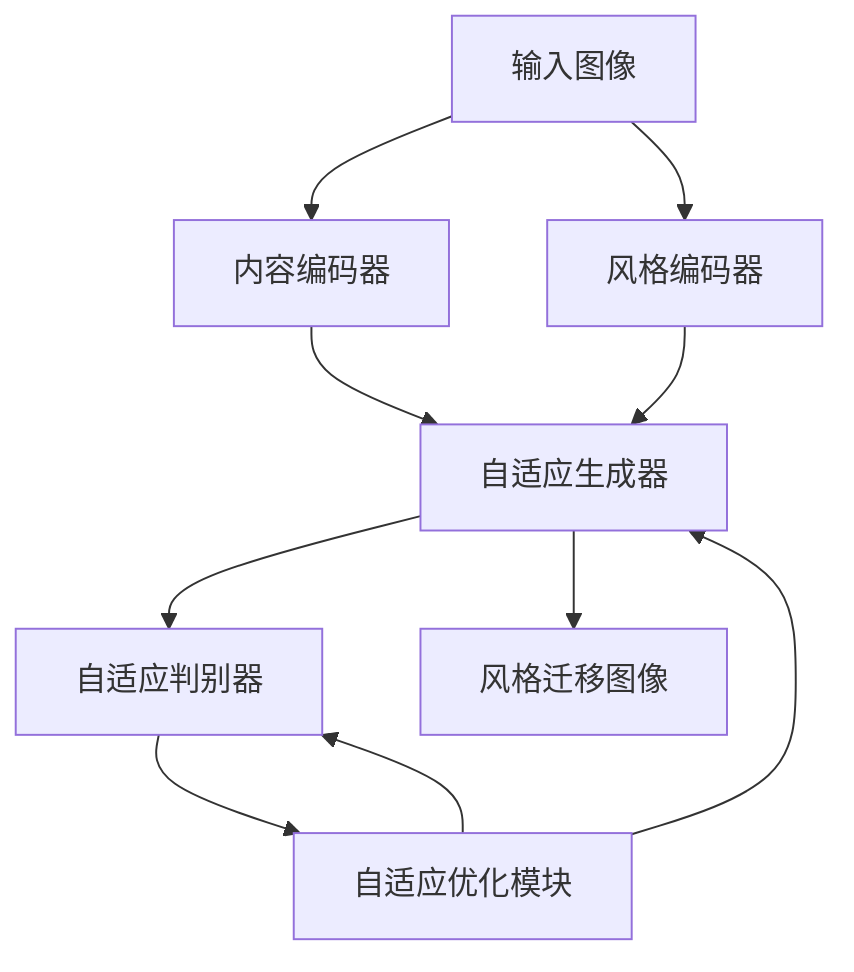

# 基于生成对抗网络的图像风格自适应迁移优化策略研究

## 1. 背景介绍

### 1.1 图像风格迁移的重要性

在计算机视觉和图像处理领域,图像风格迁移是一项极具吸引力和潜力的技术。它可以将一种风格(如著名画家的绘画风格)应用到另一种图像上,从而创造出具有独特视觉效果的图像。这种技术在多个领域都有广泛应用,例如:

- **艺术创作**: 艺术家可以借助图像风格迁移来创作富有创意的艺术作品。
- **图像增强**: 通过风格迁移,可以增强图像的视觉吸引力和表现力。
- **计算机图形学**: 风格迁移可用于生成具有特定风格的3D模型纹理和材质。
- **多媒体娱乐**: 在电影、视频游戏等领域,风格迁移可用于创造独特的视觉体验。

随着深度学习技术的不断发展,基于生成对抗网络(Generative Adversarial Networks, GANs)的图像风格迁移方法逐渐成为研究热点。与传统优化方法相比,GAN可以生成更加自然、逼真的风格迁移结果。然而,现有的GAN风格迁移方法仍存在一些局限性,例如缺乏对目标图像内容的适应性、生成图像质量参差不齐等。因此,研究基于GAN的图像风格自适应迁移优化策略就显得尤为重要。

### 1.2 研究意义

本文探讨了如何利用生成对抗网络,设计一种自适应的图像风格迁移优化策略。该策略可以根据输入图像的内容和风格特征,动态调整GAN的结构和参数,从而生成更加自然、高质量的风格迁移结果。具体来说,本文的研究意义包括:

1. **提高风格迁移质量**: 通过自适应优化策略,可以有效克服现有GAN方法中存在的模糊、失真等问题,生成更加清晰、细节丰富的风格迁移图像。

2. **增强内容保真度**: 自适应策略可以在风格迁移过程中,最大程度地保留原始图像的内容和结构信息,避免出现内容失真或畸变的情况。

3. **提升模型泛化能力**: 自适应优化使模型能够更好地适应不同类型的输入图像,提高模型在多样化场景下的泛化性能。

4. **探索GAN新应用**: 本文的研究有助于拓展GAN在图像处理、计算机视觉等领域的新应用,为相关领域的技术进步做出贡献。

## 2. 核心概念与联系

### 2.1 生成对抗网络(GAN)

生成对抗网络(GAN)是一种由两个神经网络模型组成的框架,包括生成器(Generator)和判别器(Discriminator)。生成器的目标是生成逼真的数据样本(如图像),而判别器则需要区分生成器生成的样本和真实数据样本。两个模型相互对抗,最终达到一种动态平衡,使生成器能够生成逼真的数据样本。

在图像风格迁移任务中,生成器通常被设计为一种编码器-解码器结构,用于将输入图像的内容和风格特征融合,生成具有目标风格的图像。判别器则负责评估生成图像的质量和真实性。生成器和判别器通过对抗训练不断优化,最终使生成器能够生成高质量的风格迁移图像。

### 2.2 自适应优化策略

自适应优化策略是指根据输入数据的特征,动态调整模型结构和参数的优化方法。在图像风格迁移任务中,自适应优化策略可以根据输入图像的内容和风格特征,动态调整GAN模型的结构和超参数,从而提高风格迁移的质量和效果。

自适应优化策略可以从以下几个方面进行调整:

1. **网络结构调整**: 根据输入图像的复杂程度,动态调整生成器和判别器的网络深度、层数等结构参数。

2. **损失函数调整**: 根据输入图像的特征,动态调整内容损失、风格损失等损失函数的权重,平衡内容保真度和风格迁移效果。

3. **超参数调整**: 根据输入图像的特征,动态调整学习率、正则化系数等超参数,优化训练过程。

4. **注意力机制**: 引入自适应注意力机制,使模型能够自动关注输入图像中的重要区域,提高风格迁移的质量和效率。

通过自适应优化策略,GAN模型可以更好地适应不同类型的输入图像,生成更加自然、高质量的风格迁移结果。

## 3. 核心算法原理具体操作步骤

本节将详细介绍基于生成对抗网络的图像风格自适应迁移优化策略的核心算法原理和具体操作步骤。

### 3.1 算法框架

该算法的整体框架如下所示:

1. **输入图像**: 算法的输入是需要进行风格迁移的原始图像。

2. **内容编码器和风格编码器**: 将输入图像分别编码为内容特征和风格特征。

3. **自适应生成器**: 根据内容特征和风格特征,生成具有目标风格的图像。生成器的结构和参数由自适应优化模块动态调整。

4. **自适应判别器**: 评估生成图像的质量和真实性,并将评估结果反馈给自适应优化模块。判别器的结构和参数也由自适应优化模块动态调整。

5. **自适应优化模块**: 根据输入图像的特征和判别器的反馈,动态调整生成器和判别器的结构、损失函数、超参数等,以优化风格迁移的效果。

6. **风格迁移图像**: 算法的最终输出是具有目标风格的风格迁移图像。

### 3.2 具体操作步骤

1. **预处理输入图像**
   - 将输入图像进行标准化处理,确保像素值在合适的范围内。
   - 可选地对输入图像进行增强处理,如调整对比度、锐化等,以提高图像质量。

2. **提取内容和风格特征**
   - 使用预训练的卷积神经网络(如VGG)作为内容编码器和风格编码器。
   - 从不同层提取内容特征和风格特征,内容特征通常来自较深层,风格特征来自较浅层。

3. **初始化生成器和判别器**
   - 生成器采用编码器-解码器结构,将内容特征和风格特征融合,生成风格迁移图像。
   - 判别器通常采用卷积神经网络分类器结构,用于评估生成图像的真实性。
   - 初始化生成器和判别器的权重参数。

4. **自适应优化策略**
   - 根据输入图像的内容和风格特征,动态调整以下参数:
     - 生成器和判别器的网络结构(层数、卷积核大小等)。
     - 内容损失和风格损失的权重系数。
     - 学习率、正则化系数等超参数。
     - 引入自适应注意力机制,关注输入图像的重要区域。

5. **对抗训练**
   - 生成器和判别器进行对抗训练,生成器试图生成逼真的风格迁移图像,判别器则试图区分真实图像和生成图像。
   - 在每个训练迭代中,根据判别器的反馈,自适应优化模块动态调整生成器和判别器的参数。

6. **生成风格迁移图像**
   - 训练收敛后,使用优化后的生成器对输入图像进行风格迁移,生成具有目标风格的图像。
   - 可选地对生成图像进行后处理,如去噪、锐化等,以提高图像质量。

通过上述步骤,该算法可以根据输入图像的特征,自适应地优化生成对抗网络的结构和参数,从而生成更加自然、高质量的风格迁移图像。

## 4. 数学模型和公式详细讲解举例说明

在基于生成对抗网络的图像风格自适应迁移优化策略中,涉及到多个数学模型和公式,本节将对其进行详细讲解和举例说明。

### 4.1 内容损失

内容损失用于保留风格迁移图像中的内容信息,确保其与原始图像的内容相似。常用的内容损失函数是基于预训练卷积神经网络(如VGG)的特征表示计算的均方误差损失。

设 $\phi$ 为预训练网络的特征提取函数, $x$ 为原始图像, $y$ 为生成的风格迁移图像, $C_{ij}^l$ 表示第 $l$ 层特征图的 $(i,j)$ 位置处的激活值,则内容损失可以表示为:

$$
\mathcal{L}_{\text{content}}(x,y) = \frac{1}{2} \sum_{i,j} \left( C_{ij}^l(\phi(x)) - C_{ij}^l(\phi(y)) \right)^2
$$

通常选择较深层的特征图来计算内容损失,因为深层特征更能捕捉图像的高级语义信息。

### 4.2 风格损失

风格损失用于将目标风格迁移到生成图像中,它基于格拉姆矩阵(Gram Matrix)来捕获风格的统计特性。

设 $F^l$ 为第 $l$ 层特征图的激活张量,其形状为 $(C_l, H_l, W_l)$,表示有 $C_l$ 个通道,每个通道的特征图大小为 $H_l \times W_l$。格拉姆矩阵 $G^l$ 定义为:

$$
G_{c,c'}^l = \sum_{h=1}^{H_l} \sum_{w=1}^{W_l} F_{h,w,c}^l F_{h,w,c'}^l
$$

其中 $c,c'$ 分别表示通道索引。格拉姆矩阵捕捉了不同特征通道之间的线性统计关系,可以很好地描述风格特征。

风格损失可以定义为生成图像和目标风格图像的格拉姆矩阵之间的均方误差:

$$
\mathcal{L}_{\text{style}}(y,y_s) = \sum_l w_l \left\lVert G^l(\phi(y)) - G^l(\phi(y_s)) \right\rVert_F^2
$$

其中 $y_s$ 表示目标风格图像, $w_l$ 是每一层特征图的权重系数,用于平衡不同层次的风格表示, $\lVert \cdot \rVert_F$ 表示矩阵的弗罗贝尼乌斯范数。

通常选择较浅层的特征图来计算风格损失,因为浅层特征更能捕捉图像的纹理、颜色等低级风格信息。

### 4.3 总变分损失

生成对抗网络的目标是最小化生成器和判别器之间的总变分损失(Total Variation Loss),它是内容损失、风格损失和对抗损失的加权和:

$$
\mathcal{L}_{\text{total}}(x,y,y_s) = \alpha \mathcal{L}_{\text{content}}(x,y) + \beta \mathcal{L}_{\text{style}}(y,y_s) + \gamma \mathcal{L}_{\text{adv}}(y)
$$

其中 $\alpha$、$\beta$、$\gamma$ 分别是内容损失、风格损失和对抗损失的权重系数,用于平衡不同损失项的重要性。

对抗损失 $\mathcal{L}_{\text{adv}}(y)$ 是生成器和判别器之间的对抗损失,它可以采用各种形式,如最小二乘损失、wasserstein损失等,具体取决于GAN的变体。

在自适应优化策略中,上述损失函数的权重系数可以根据输入图像的特征动态调整,以获得最佳的风格迁移效果。

### 4.4 实例分析

以下是一个具体实例,说明如何使用上述公式计算内容损失和风格损