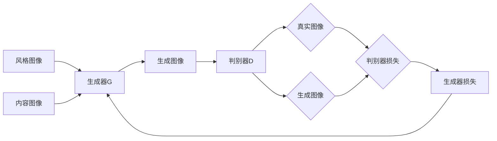

# 基于生成对抗网络的图像风格迁移在商品包装设计中的应用

作者：禅与计算机程序设计艺术

## 1. 背景介绍
### 1.1 商品包装设计的重要性
#### 1.1.1 视觉吸引力
#### 1.1.2 品牌识别度
#### 1.1.3 消费者购买决策
### 1.2 图像风格迁移技术概述
#### 1.2.1 定义与原理
#### 1.2.2 发展历程
#### 1.2.3 应用领域
### 1.3 生成对抗网络(GAN)简介  
#### 1.3.1 GAN的基本概念
#### 1.3.2 GAN的优势
#### 1.3.3 GAN在图像风格迁移中的应用

## 2. 核心概念与联系
### 2.1 图像风格迁移
#### 2.1.1 风格图像与内容图像
#### 2.1.2 特征提取与重构
#### 2.1.3 损失函数设计
### 2.2 生成对抗网络
#### 2.2.1 生成器与判别器
#### 2.2.2 对抗训练过程
#### 2.2.3 Nash均衡
### 2.3 GAN与图像风格迁移的结合
#### 2.3.1 基于GAN的风格迁移模型
#### 2.3.2 损失函数的改进
#### 2.3.3 网络结构的优化

## 3. 核心算法原理与具体操作步骤
### 3.1 基于GAN的图像风格迁移算法
#### 3.1.1 算法流程概述
#### 3.1.2 生成器网络结构
#### 3.1.3 判别器网络结构
### 3.2 训练过程
#### 3.2.1 数据准备
#### 3.2.2 超参数设置
#### 3.2.3 训练步骤
### 3.3 推理过程
#### 3.3.1 风格图像与内容图像的输入
#### 3.3.2 生成风格迁移图像
#### 3.3.3 结果评估与优化

## 4. 数学模型与公式详解
### 4.1 GAN的数学模型
#### 4.1.1 生成器与判别器的目标函数
#### 4.1.2 minimax博弈
#### 4.1.3 Nash均衡点的求解
### 4.2 风格迁移的损失函数
#### 4.2.1 内容损失
#### 4.2.2 风格损失
#### 4.2.3 总变差正则化
### 4.3 公式推导与例子说明
#### 4.3.1 生成器损失函数推导
#### 4.3.2 判别器损失函数推导
#### 4.3.3 实际计算例子

## 5. 项目实践：代码实例与详细解释
### 5.1 开发环境搭建
#### 5.1.1 深度学习框架选择
#### 5.1.2 依赖库安装
#### 5.1.3 GPU配置
### 5.2 数据集准备
#### 5.2.1 风格图像数据集
#### 5.2.2 内容图像数据集
#### 5.2.3 数据预处理
### 5.3 模型实现
#### 5.3.1 生成器网络构建
#### 5.3.2 判别器网络构建  
#### 5.3.3 损失函数定义
### 5.4 训练与测试
#### 5.4.1 训练参数设置
#### 5.4.2 训练过程可视化
#### 5.4.3 测试结果评估

## 6. 实际应用场景
### 6.1 食品包装设计
#### 6.1.1 应用案例分析
#### 6.1.2 效果展示
#### 6.1.3 优势与挑战
### 6.2 化妆品包装设计
#### 6.2.1 应用案例分析
#### 6.2.2 效果展示 
#### 6.2.3 优势与挑战
### 6.3 电子产品包装设计
#### 6.3.1 应用案例分析
#### 6.3.2 效果展示
#### 6.3.3 优势与挑战

## 7. 工具与资源推荐
### 7.1 深度学习框架
#### 7.1.1 TensorFlow
#### 7.1.2 PyTorch
#### 7.1.3 Keras
### 7.2 预训练模型
#### 7.2.1 VGG网络
#### 7.2.2 ResNet网络
#### 7.2.3 Inception网络
### 7.3 数据集资源
#### 7.3.1 WikiArt数据集
#### 7.3.2 COCO数据集
#### 7.3.3 ImageNet数据集

## 8. 总结：未来发展趋势与挑战
### 8.1 算法改进方向
#### 8.1.1 网络结构优化
#### 8.1.2 损失函数设计
#### 8.1.3 训练策略探索
### 8.2 应用领域拓展  
#### 8.2.1 服装设计
#### 8.2.2 家居装饰
#### 8.2.3 广告创意
### 8.3 面临的挑战
#### 8.3.1 风格多样性
#### 8.3.2 生成质量控制
#### 8.3.3 版权与伦理问题

## 9. 附录：常见问题与解答
### 9.1 如何选择合适的风格图像？
### 9.2 生成图像质量不佳怎么办？
### 9.3 训练过程中出现模式崩溃现象如何解决？
### 9.4 风格迁移图像能否用于商业用途？
### 9.5 是否需要大量数据进行训练？

生成对抗网络(GAN)与图像风格迁移技术的结合为商品包装设计领域带来了革命性的变化。通过GAN的强大生成能力，设计师能够快速创作出具有艺术风格的包装方案，大大提高了设计效率和创意水平。本文从背景介绍、核心概念、算法原理、数学模型、代码实践、应用场景等多个角度对基于GAN的图像风格迁移技术进行了深入探讨，旨在为读者提供全面系统的理论知识和实践指导。

图像风格迁移的核心思想是将风格图像的视觉特征提取出来，再将其融合到内容图像中，生成具有风格图像艺术效果的新图像。传统的风格迁移方法主要基于特征统计信息的匹配，难以生成细节丰富、视觉质量高的结果。而GAN通过生成器和判别器的对抗学习，可以生成更加逼真自然的风格迁移图像。

GAN风格迁移的数学模型可以表示为一个minimax博弈问题，生成器和判别器分别拥有自己的目标函数，两者在训练过程中不断博弈，最终达到Nash均衡点，生成高质量的风格迁移图像。在具体实现中，我们需要合理设计生成器和判别器的网络结构，并构建内容损失、风格损失和总变差正则化项，以保证生成图像在内容和风格上的一致性。

本文给出了基于TensorFlow的风格迁移项目实践，详细讲解了开发环境搭建、数据准备、模型构建和训练测试等关键步骤，同时提供了完整的代码示例和注释说明，帮助读者快速上手实现。在实际应用中，我们探讨了食品、化妆品、电子产品等领域的包装设计案例，展示了GAN风格迁移的优势和挑战。

未来，基于GAN的图像风格迁移技术还有很大的改进空间，可以从算法、应用、数据等方面进行优化和拓展。同时，我们也要注意该技术在商业应用中可能面临的版权和伦理问题。总的来说，GAN风格迁移是一个极具潜力的研究方向，相信通过学界和业界的共同努力，能够不断推动该技术的发展，为商品包装设计乃至更广泛的领域带来更多创新和惊喜。

以上是基于GAN的图像风格迁移算法的核心流程图。风格图像和内容图像首先输入到生成器G中，生成器通过学习两种图像的特征表示，生成一张融合了风格和内容的新图像。然后，生成图像和真实图像一起输入到判别器D中，判别器通过对比两种图像的差异，计算出判别器损失。接着，判别器损失反向传播到生成器，形成生成器损失，指导生成器更新参数，以生成更加逼真的风格迁移图像。整个过程不断迭代，直到生成器和判别器达到平衡。

希望这篇文章能够帮助读者全面了解基于GAN的图像风格迁移技术，掌握其核心原理和实现方法，并启发大家在商品包装设计中的创意应用。同时也欢迎读者提出宝贵意见和建议，共同探讨这一领域的发展前景。