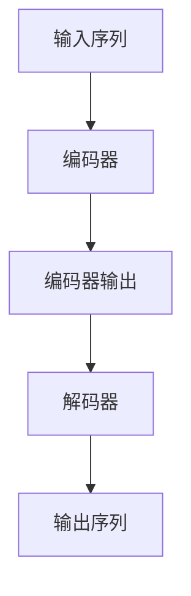

# 大语言模型原理与工程实践：预训练还有什么没有解决

## 1.背景介绍

### 1.1 大语言模型的兴起

近年来,大型语言模型(Large Language Models, LLMs)在自然语言处理(NLP)领域取得了令人瞩目的成就。这些模型通过在大规模语料库上进行预训练,学习了丰富的语言知识和上下文信息,从而在广泛的NLP任务中表现出色,包括机器翻译、问答系统、文本生成等。

代表性的大语言模型有:

- GPT系列(Generative Pre-trained Transformer):GPT-3拥有1750亿个参数,是目前最大的语言模型。
- BERT系列(Bidirectional Encoder Representations from Transformers):BERT采用双向编码器,在多项NLP基准测试中表现优异。
- T5(Text-to-Text Transfer Transformer):T5将所有NLP任务统一为"文本到文本"的形式,实现了任务的无缝迁移。

### 1.2 预训练的重要性

预训练是大语言模型取得成功的关键。通过在海量无标注语料上进行自监督学习,模型可以捕获丰富的语义和语法知识。这种通用的语言表示为下游任务提供了强大的起点,降低了从头开始训练的难度。

与传统的从头训练相比,预训练+微调的范式具有以下优势:

- 数据高效:可以利用大规模的无标注数据,而无需昂贵的人工标注。
- 泛化能力强:预训练模型学习到的通用知识有利于迁移到不同领域。
- 计算高效:微调只需调整部分参数,避免了从头训练的计算开销。

然而,尽管预训练大模型取得了巨大成功,但仍存在一些亟待解决的挑战和问题。

## 2.核心概念与联系

### 2.1 自注意力机制

自注意力机制是Transformer模型的核心,也是大语言模型取得成功的关键因素之一。它能够捕捉输入序列中任意两个位置之间的依赖关系,从而更好地建模长期依赖。

在自注意力机制中,每个位置的表示是所有位置的加权和,权重由位置之间的相似性决定。这种灵活的注意力机制使模型能够自适应地关注输入序列中的不同部分,从而提高了模型的表现力。

$$
\begin{aligned}
\text{Attention}(Q, K, V) &= \text{softmax}\left(\frac{QK^T}{\sqrt{d_k}}\right)V \\
\text{MultiHead}(Q, K, V) &= \text{Concat}(\text{head}_1, \ldots, \text{head}_h)W^O\\
\text{where}\ \text{head}_i &= \text{Attention}(QW_i^Q, KW_i^K, VW_i^V)
\end{aligned}
$$

其中,$Q$、$K$、$V$分别代表查询(Query)、键(Key)和值(Value)。通过多头注意力机制,模型可以从不同的子空间捕获不同的依赖关系,进一步提高了模型的表现力。

### 2.2 transformer 编码器-解码器架构

Transformer的编码器-解码器架构是大语言模型的基础架构之一。编码器用于捕获输入序列的上下文信息,解码器则根据编码器的输出和前一时间步的输出生成目标序列。

该架构通过自注意力机制和位置编码,有效地解决了传统序列模型(如RNN)在长期依赖建模和并行计算方面的缺陷,从而实现了高效的序列到序列的转换。



在预训练过程中,通常采用自编码(自回归)或者自监督的方式,使编码器和解码器共同学习输入序列的表示。这种预训练方式使模型获得了强大的语言理解和生成能力,为下游任务奠定了基础。

### 2.3 预训练目标

预训练目标是指在无监督的预训练阶段,模型需要优化的目标函数。合理的预训练目标能够有效地捕获语言的统计规律,从而提高模型的泛化能力。

常见的预训练目标包括:

- **掩码语言模型**(Masked Language Modeling, MLM):随机掩码部分输入token,模型需要预测被掩码的token。
- **下一句预测**(Next Sentence Prediction, NSP):判断两个句子是否为连续句子。
- **因果语言模型**(Causal Language Modeling, CLM):基于前文预测下一个token。
- **序列到序列**(Sequence-to-Sequence):将输入序列映射为输出序列(如机器翻译)。

不同的预训练目标捕获了语言的不同方面,组合使用能够进一步提升模型性能。此外,设计合理的预训练目标对于指导模型学习所需的知识至关重要。

## 3.核心算法原理具体操作步骤 

### 3.1 预训练阶段

大语言模型的预训练过程通常包括以下步骤:

1. **数据预处理**:从原始语料中过滤和清理数据,构建训练集、验证集和测试集。
2. **词元化**:将文本序列转换为模型可以处理的词元(token)序列。
3. **数据批处理**:将数据划分为小批量,以提高训练效率。
4. **掩码/噪声注入**:根据预训练目标(如MLM),对输入序列进行掩码或注入噪声。
5. **前向传播**:将输入序列输入到模型中,计算预测结果。
6. **损失计算**:根据预训练目标计算损失函数(如交叉熵损失)。
7. **反向传播**:计算梯度并更新模型参数。
8. **模型评估**:在验证集上评估模型性能,决定是否继续训练或进行早停。

预训练过程通常在大规模计算集群上进行,需要消耗大量的计算资源。为了提高训练效率,通常采用数据并行、模型并行、张量并行等策略。

### 3.2 微调阶段

在完成预训练后,大语言模型需要针对特定的下游任务进行微调(fine-tuning),以进一步提升性能。微调的步骤如下:

1. **数据准备**:准备针对目标任务的标注数据集。
2. **数据预处理**:对输入数据进行必要的预处理,如词元化、填充等。
3. **添加任务特定头**:根据任务需求,为预训练模型添加适当的输出头(如分类头、生成头等)。
4. **微调训练**:在标注数据集上对模型进行微调训练,更新部分或全部参数。
5. **模型评估**:在验证集或测试集上评估微调后模型的性能。
6. **模型部署**:将微调后的模型部署到生产环境中,用于实际应用。

在微调过程中,通常只需要更新部分参数,而保持大部分预训练参数不变。这种"冻结"策略可以显著减少计算开销,同时利用预训练模型学习到的通用知识。

## 4.数学模型和公式详细讲解举例说明

### 4.1 自注意力计算

自注意力机制是Transformer模型的核心组件,它能够捕捉输入序列中任意两个位置之间的依赖关系。我们来详细解释一下自注意力的计算过程。

给定一个长度为$n$的输入序列$X = (x_1, x_2, \ldots, x_n)$,我们首先将其映射到查询(Query)、键(Key)和值(Value)的表示空间:

$$
\begin{aligned}
Q &= XW^Q \\
K &= XW^K \\
V &= XW^V
\end{aligned}
$$

其中,$W^Q$、$W^K$、$W^V$分别为可学习的投影矩阵。

接下来,我们计算查询$Q$和所有键$K$之间的点积,并除以缩放因子$\sqrt{d_k}$(其中$d_k$为键的维度),以防止值过大导致的梯度不稳定问题:

$$
\text{scores}(Q, K) = \frac{QK^T}{\sqrt{d_k}}
$$

然后,我们对scores应用softmax函数,得到注意力权重:

$$
\text{Attention}(Q, K, V) = \text{softmax}(\text{scores}(Q, K))V
$$

最终,自注意力的输出是值$V$的加权和,权重由注意力权重决定。通过这种方式,模型可以自适应地关注输入序列中的不同部分,从而更好地捕捉长期依赖关系。

在实践中,我们通常使用多头注意力机制,它允许模型从不同的子空间捕获不同的依赖关系,进一步提高了模型的表现力。

### 4.2 transformer 解码器的掩码自注意力

在Transformer的解码器中,我们需要防止每个位置的表示被leak到未来的位置,从而破坏了自回归属性。为此,我们在计算自注意力时引入了掩码机制。

具体来说,在计算scores时,我们将未来位置的值设置为负无穷,以确保它们不会对当前位置的表示产生影响:

$$
\text{scores}_{i,j} = \begin{cases}
\frac{q_i k_j^T}{\sqrt{d_k}}, & \text{if}\ i \geq j \\
-\infty, & \text{if}\ i < j
\end{cases}
$$

其中,$i$和$j$分别表示查询和键的位置索引。通过这种掩码机制,每个位置的表示只依赖于该位置之前的输入,从而保持了自回归属性。

在实现时,我们可以构造一个掩码张量,其中下三角部分为0,上三角部分为负无穷。然后,我们将该掩码张量添加到scores上,以实现掩码操作:

$$
\text{scores} = \text{scores} + \text{mask}
$$

掩码自注意力机制确保了解码器在生成序列时,每个时间步只依赖于之前的输出,从而实现了高效的自回归建模。

## 4.项目实践:代码实例和详细解释说明

在这一节,我们将通过一个实际的代码示例,演示如何使用PyTorch实现Transformer模型的预训练和微调。我们将使用一个简化版本的Transformer,并在一个小型语料库上进行训练,以便更好地理解核心原理。

### 4.1 数据预处理

首先,我们需要对原始语料进行预处理,包括词元化、构建词表、填充和批处理等步骤。以下是一个简单的示例:

```python
from torchtext.data import Field, TabularDataset, BucketIterator

# 定义文本字段
text_field = Field(tokenize='spacy', lower=True, batch_first=True)

# 加载数据集
train_data, valid_data, test_data = TabularDataset.splits(
    path='data/', train='train.tsv', validation='valid.tsv', test='test.tsv',
    format='tsv', fields=[('text', text_field)])

# 构建词表
text_field.build_vocab(train_data, max_size=50000)

# 创建迭代器
train_iter, valid_iter, test_iter = BucketIterator.splits(
    (train_data, valid_data, test_data), batch_size=32, device='cuda')
```

在上述代码中,我们使用torchtext库加载TSV格式的数据集,并构建词表。BucketIterator会自动对数据进行填充和批处理,以提高训练效率。

### 4.2 Transformer 模型实现

接下来,我们实现一个简化版本的Transformer模型,包括编码器、解码器和多头注意力机制:

```python
import torch
import torch.nn as nn

class MultiHeadAttention(nn.Module):
    def __init__(self, heads, d_model, dropout=0.1):
        super().__init__()
        self.d_model = d_model
        self.d_k = d_model // heads
        self.h = heads
        self.q_linear = nn.Linear(d_model, d_model)
        self.v_linear = nn.Linear(d_model, d_model)
        self.k_linear = nn.Linear(d_model, d_model)
        self.dropout = nn.Dropout(dropout)
        self.out = nn.Linear(d_model, d_model)

    def forward(self, q, k, v, mask=None):
        bs = q.size(0)
        k = self.k_linear(k).view(bs, -1, self.h, self.d_k)
        q = self.q_linear(q).view(bs, -1, self.h, self.d_k)
        v = self.v_linear(v