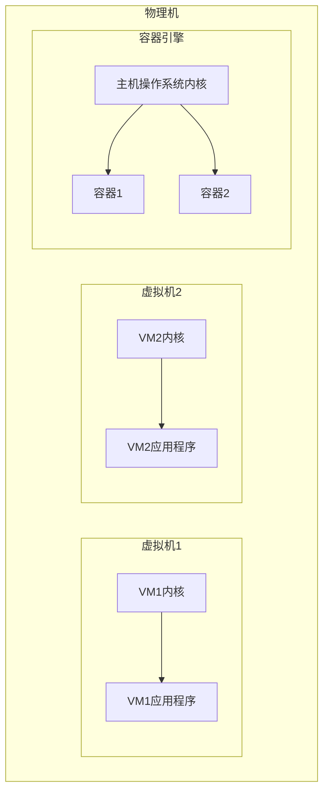
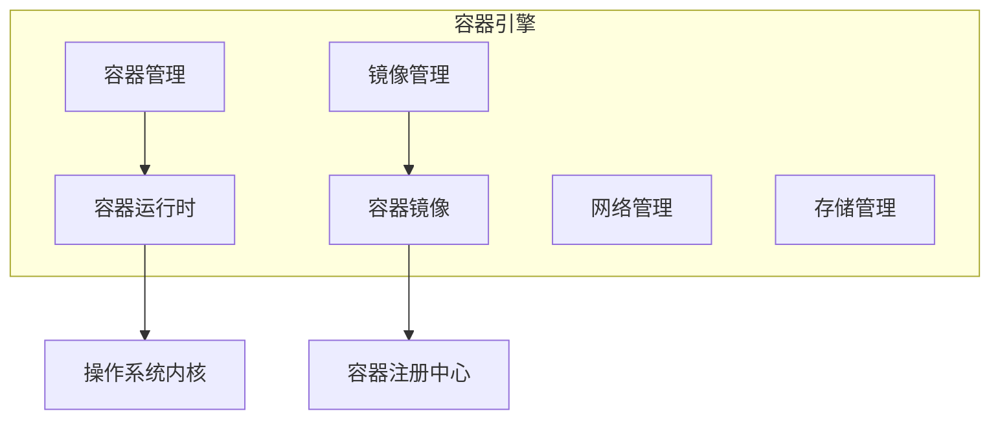
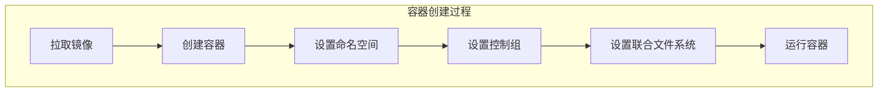
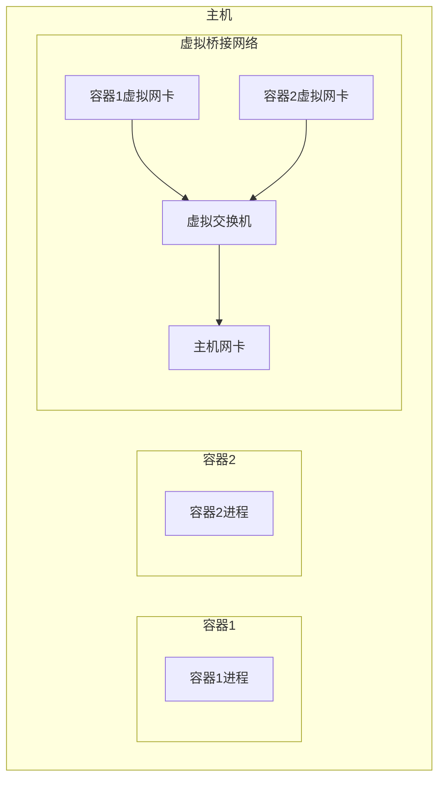
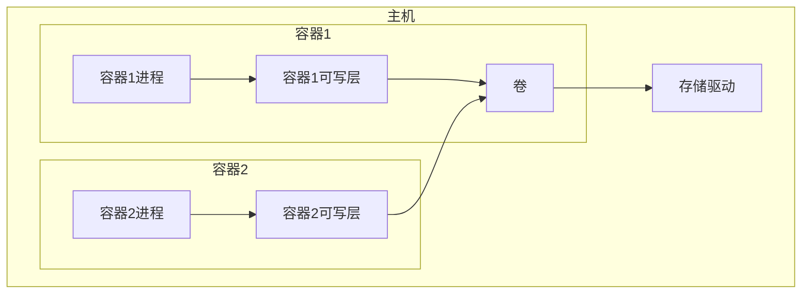

# 容器 原理与代码实例讲解

## 1.背景介绍

### 1.1 什么是容器

容器是一种操作系统级虚拟化技术,它可以将应用程序及其依赖项打包到一个可移植的环境中,以确保应用程序在不同环境下的一致运行。与传统的虚拟机相比,容器具有更高的资源利用率、更快的启动速度和更小的占用空间。

容器技术的兴起源于对开发和部署环境标准化的需求。在过去,应用程序通常需要在不同的操作系统和硬件环境中进行测试和部署,这常常会导致"在我的机器上运行良好"的问题。容器通过提供一个一致的运行环境,解决了这个问题。

### 1.2 容器的优势

容器技术具有以下优势:

- **一致性环境**:容器可确保应用程序在不同环境中的一致运行,消除了"在我的机器上运行良好"的问题。
- **轻量级**:与传统虚拟机相比,容器更加轻量级,占用更少的系统资源。
- **快速部署**:容器可以在几秒钟内启动和停止,大大加快了应用程序的部署速度。
- **可移植性**:容器可以在不同的操作系统和硬件环境中运行,提高了应用程序的可移植性。
- **资源隔离**:容器可以提供进程、网络和文件系统等资源的隔离,增强了应用程序的安全性和稳定性。
- **微服务架构**:容器非常适合构建微服务架构,每个微服务可以打包到一个独立的容器中,实现松耦合和独立部署。

### 1.3 容器技术的发展历史

容器技术的概念可以追溯到 20 世纪 70 年代的 UNIX chroot,但直到 2008 年 Linux 内核引入了命名空间和控制组(cgroups)等关键技术后,容器技术才真正开始兴起。2013 年,Docker 项目的出现使容器技术变得更加易于使用和部署,从而推动了容器技术的普及。

随后,Kubernetes、Docker Swarm、Apache Mesos 等容器编排工具相继问世,使得容器在生产环境中的部署和管理变得更加便捷。同时,云计算服务提供商如 AWS、Google Cloud 和 Azure 也纷纷推出了容器相关的服务,进一步推动了容器技术的发展。

## 2.核心概念与联系

### 2.1 容器和虚拟机的区别

虽然容器和虚拟机都是一种虚拟化技术,但它们在实现方式和资源利用率上存在显著差异。

- **虚拟机**:虚拟机是在硬件层面上实现的虚拟化,每个虚拟机都有自己的操作系统内核,因此它们相对较重,占用更多的系统资源。
- **容器**:容器是在操作系统层面上实现的虚拟化,多个容器共享同一个操作系统内核,因此它们相对较轻,占用更少的系统资源。

下图展示了容器和虚拟机的区别:



### 2.2 容器的核心技术

容器技术的核心是利用操作系统提供的一些功能来实现资源隔离和限制,主要包括以下几个方面:

- **命名空间 (Namespaces)**: 用于实现进程、网络、文件系统等资源的隔离。
- **控制组 (Cgroups)**: 用于限制和监控容器对 CPU、内存、磁盘 I/O 等资源的使用。
- **联合文件系统 (Union File System)**: 通过层叠多个只读文件系统,构建出一个可写的文件系统,用于容器的文件系统管理。
- **容器镜像**: 容器镜像是一个只读的模板,包含了容器运行所需的文件系统、配置和依赖项。

### 2.3 容器编排

随着容器的广泛应用,单个容器的管理已经无法满足生产环境的需求。因此,容器编排工具应运而生,用于自动化容器的部署、扩展、网络管理和负载均衡等任务。

目前最流行的容器编排工具是 Kubernetes,它由 Google 开源,具有以下特点:

- 自动部署和复制容器
- 自动重启失败的容器
- 自动扩展或缩减容器数量
- 负载均衡和服务发现
- 滚动升级和回滚
- 存储编排
- 秘钥和配置管理

除了 Kubernetes,Docker Swarm、Apache Mesos 等也是常见的容器编排工具。

## 3.核心算法原理具体操作步骤

### 3.1 容器的基本架构

容器的基本架构包括以下几个核心组件:

1. **容器引擎**: 负责创建、运行和管理容器,常见的容器引擎包括 Docker、containerd、CRI-O 等。
2. **容器运行时**: 负责创建和管理容器的底层接口,常见的容器运行时包括 runc、crun、kata 等。
3. **容器镜像**: 容器镜像是一个只读的模板,包含了容器运行所需的文件系统、配置和依赖项。
4. **容器注册中心**: 用于存储和分发容器镜像,常见的注册中心包括 Docker Hub、Google Container Registry、Amazon Elastic Container Registry 等。

下图展示了容器的基本架构:



### 3.2 容器的创建过程

容器的创建过程可以分为以下几个步骤:

1. **拉取容器镜像**: 从容器注册中心拉取所需的容器镜像。
2. **创建容器**: 根据容器镜像创建一个新的容器实例。
3. **设置命名空间**: 为容器设置进程、网络、文件系统等命名空间,实现资源隔离。
4. **设置控制组**: 为容器设置控制组,限制和监控容器对资源的使用。
5. **设置联合文件系统**: 为容器设置联合文件系统,构建可写的文件系统层。
6. **运行容器**: 启动容器中的进程,开始运行容器应用程序。

下图展示了容器创建的具体步骤:



### 3.3 容器网络

容器网络是容器技术中一个重要的组成部分,它解决了容器之间以及容器与外部网络之间的通信问题。常见的容器网络模型包括:

1. **桥接网络 (Bridge Network)**: 每个容器都连接到一个虚拟的桥接网络上,可以相互通信,也可以与外部网络通信。
2. **主机网络 (Host Network)**: 容器直接使用主机的网络,不进行任何网络隔离。
3. **overlay 网络**: 通过建立一个覆盖网络,实现跨主机的容器通信。

下图展示了桥接网络的基本原理:



### 3.4 容器存储

容器存储是指为容器提供持久化存储的方式,常见的容器存储方式包括:

1. **绑定挂载 (Bind Mounts)**: 将主机上的目录或文件直接挂载到容器中。
2. **卷 (Volumes)**: 由容器引擎管理的持久化存储,可以在容器之间共享和重用。
3. **临时存储**: 容器的可写层,在容器停止后会被删除。

下图展示了卷的基本原理:



## 4.数学模型和公式详细讲解举例说明

在容器技术中,并没有直接使用到复杂的数学模型或公式。但是,在容器资源管理和调度方面,我们可以借助一些简单的数学模型和公式来优化资源利用率和性能。

### 4.1 资源请求和限制

在 Kubernetes 中,我们可以为每个容器设置 CPU 和内存的资源请求和限制。资源请求用于调度,确保容器被调度到有足够资源的节点上;资源限制用于约束,防止容器消耗过多的资源。

假设一个节点有 4 个 CPU 和 16GB 内存,我们可以使用以下公式来计算节点的剩余资源:

$$
\begin{aligned}
剩余CPU &= 节点总CPU - \sum_{i=1}^{n}容器_i的CPU请求 \\
剩余内存 &= 节点总内存 - \sum_{i=1}^{n}容器_i的内存请求
\end{aligned}
$$

其中 $n$ 是节点上运行的容器数量。

### 4.2 资源过度使用

如果容器的资源使用超过了设置的限制,Kubernetes 会根据配置采取不同的行为,例如终止容器或允许短暂的过度使用。对于允许短暂过度使用的情况,我们可以使用以下公式来计算节点的实际 CPU 和内存使用率:

$$
\begin{aligned}
实际CPU使用率 &= \frac{\sum_{i=1}^{n}容器_i的CPU使用量}{节点总CPU} \\
实际内存使用率 &= \frac{\sum_{i=1}^{n}容器_i的内存使用量}{节点总内存}
\end{aligned}
$$

如果实际使用率超过了一定阈值,我们可以采取相应的措施,例如扩容节点或重新调度容器。

### 4.3 资源bin packing问题

在容器调度过程中,我们需要将容器合理地分配到不同的节点上,以最大化资源利用率。这可以被视为一个经典的bin packing问题,即如何将一组物品(容器)放入尽可能少的箱子(节点)中,同时满足每个箱子的容量限制。

对于bin packing问题,我们可以使用贪心算法或近似算法来求解,例如First Fit、Best Fit和Worst Fit等算法。这些算法的时间复杂度通常为 $O(n \log n)$,其中 $n$ 是物品(容器)的数量。

## 4.项目实践:代码实例和详细解释说明

在本节中,我们将通过一个简单的 Python 示例来演示如何使用 Docker 创建和运行容器。

### 4.1 安装Docker

首先,我们需要在本地机器上安装 Docker。您可以根据您的操作系统从 Docker 官网下载并安装 Docker。

### 4.2 创建Dockerfile

接下来,我们需要创建一个 Dockerfile,它定义了容器的构建过程。在本例中,我们将创建一个简单的 Python Web 应用程序。

创建一个名为 `Dockerfile` 的文件,并添加以下内容:

```dockerfile
# 使用 Python 3.9 作为基础镜像
FROM python:3.9

# 设置工作目录
WORKDIR /app

# 复制当前目录下的文件到容器的工作目录
COPY . /app

# 安装依赖项
RUN pip install --no-cache-dir -r requirements.txt

# 设置容器启动时运行的命