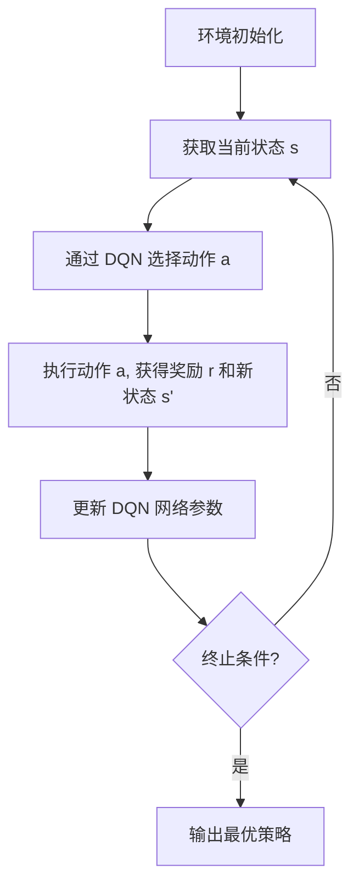

# 深度 Q-learning：在快递派送中的应用

## 1. 背景介绍

### 1.1 快递行业的挑战

随着电子商务的蓬勃发展,快递行业在过去几年经历了指数级增长。然而,这种增长也带来了一些挑战,例如:

- **最后一公里问题**:将包裹及时准确地送达最终目的地是一个复杂的组合优化问题。
- **动态路径规划**:由于交通状况、天气等因素的不确定性,需要实时调整派送路线。
- **成本控制**:快递公司需要在服务质量和运营成本之间寻求平衡。

### 1.2 强化学习在快递派送中的应用

强化学习(Reinforcement Learning, RL)是一种人工智能范式,通过与环境的交互来学习获取最优策略。近年来,RL在组合优化、路径规划等领域展现出巨大潜力,为快递行业的智能化提供了新的解决方案。

其中,**深度 Q-learning** 作为一种结合深度神经网络和 Q-learning 的强化学习算法,在处理大规模、高维度问题时表现出色。本文将重点探讨如何将深度 Q-learning 应用于快递派送场景,并分析其优缺点和发展前景。

## 2. 核心概念与联系

### 2.1 Q-learning 算法

Q-learning 是一种基于时间差分(Temporal Difference, TD)的强化学习算法,它试图学习一个行为价值函数(Action-Value Function),也称为 Q 函数。Q 函数 Q(s,a) 定义为在状态 s 下采取行动 a 后,可获得的期望累计奖励。

Q-learning 的核心思想是通过不断与环境交互,根据获得的奖励更新 Q 函数,从而逐步优化策略。它的更新规则如下:

$$Q(s_t, a_t) \leftarrow Q(s_t, a_t) + \alpha \left[ r_t + \gamma \max_{a} Q(s_{t+1}, a) - Q(s_t, a_t) \right]$$

其中:

- $\alpha$ 是学习率,控制新信息对旧信息的影响程度。
- $\gamma$ 是折扣因子,决定了未来奖励对当前行为的影响程度。
- $r_t$ 是在时刻 t 获得的即时奖励。
- $\max_{a} Q(s_{t+1}, a)$ 是在下一状态 $s_{t+1}$ 下可获得的最大期望累计奖励。

通过不断更新 Q 函数,最终可以收敛到最优策略。

### 2.2 深度 Q-learning (DQN)

传统的 Q-learning 算法在处理高维状态空间和连续动作空间时存在瓶颈。深度 Q-learning 通过使用深度神经网络来逼近 Q 函数,从而解决了这一问题。

在 DQN 中,我们使用一个深度神经网络 $Q(s, a; \theta)$ 来近似 Q 函数,其中 $\theta$ 是网络的参数。网络的输入是当前状态 s,输出是所有可能动作的 Q 值。我们通过最小化损失函数来训练网络参数 $\theta$:

$$L(\theta) = \mathbb{E}_{(s, a, r, s')} \left[ \left( r + \gamma \max_{a'} Q(s', a'; \theta^-) - Q(s, a; \theta) \right)^2 \right]$$

其中 $\theta^-$ 是目标网络的参数,用于估计 $\max_{a'} Q(s', a')$,以提高训练稳定性。

通过在大量环境交互数据上训练网络,DQN 可以学习到一个有效的 Q 函数逼近器,从而指导智能体做出最优决策。

### 2.3 Mermaid 流程图

下面的 Mermaid 流程图展示了深度 Q-learning 在快递派送场景中的工作流程:



1. 初始化环境,包括车辆位置、待派送订单等信息。
2. 获取当前状态 s,如车辆位置、剩余订单等。
3. 通过训练好的 DQN 网络,选择在当前状态下的最优动作 a,如派送哪个订单、沿哪条路线行驶等。
4. 执行选择的动作 a,获得相应的即时奖励 r(如完成订单的奖励)和新的环境状态 s'。
5. 利用 $(s, a, r, s')$ 这个转移样本,更新 DQN 网络参数。
6. 重复 2-5,直到满足终止条件(如所有订单已派送完毕)。
7. 输出经过训练的 DQN 网络对应的最优策略。

## 3. 核心算法原理具体操作步骤 

### 3.1 深度 Q-网络架构

深度 Q-网络(DQN)的核心是一个深度神经网络,用于近似 Q 函数。网络的输入是当前状态 s,输出是所有可能动作的 Q 值。我们可以选择不同的网络架构,如全连接网络、卷积网络等,具体取决于状态的表示形式。

以快递派送为例,状态 s 可以包括车辆位置、剩余订单信息等,动作 a 可以是派送哪个订单、沿哪条路线行驶等。我们可以使用一个包含几层全连接层的网络来逼近 Q 函数:

$$Q(s, a; \theta) = f_\theta(s, a)$$

其中 $\theta$ 是网络的可训练参数。

### 3.2 经验回放 (Experience Replay)

在强化学习中,连续的状态转移样本之间存在很强的相关性,这会导致训练数据的冗余,影响算法的收敛性能。为了解决这一问题,DQN 引入了经验回放(Experience Replay)机制。

具体来说,我们维护一个经验回放池(Replay Buffer),用于存储智能体与环境交互过程中获得的转移样本 $(s, a, r, s')$。在训练时,我们从回放池中随机采样一个小批量(mini-batch)的样本,用于更新 DQN 网络参数。这种方式打破了数据的相关性,提高了样本的利用效率。

### 3.3 目标网络 (Target Network)

另一个提高 DQN 训练稳定性的技巧是引入目标网络(Target Network)。我们维护两个神经网络:

1. **在线网络(Online Network)** $Q(s, a; \theta)$: 用于选择动作,并根据损失函数进行参数更新。
2. **目标网络(Target Network)** $Q(s, a; \theta^-)$: 用于估计 $\max_{a'} Q(s', a')$,但参数 $\theta^-$ 是固定的。

每隔一定步数,我们将目标网络的参数 $\theta^-$ 更新为在线网络的参数 $\theta$。这种分离目标估计和行为估计的做法,可以增加训练的稳定性。

### 3.4 算法伪代码

深度 Q-learning 算法的伪代码如下:

```python
初始化在线网络 Q(s, a; θ) 和目标网络 Q(s, a; θ^-)
初始化经验回放池 D
for episode in num_episodes:
    初始化环境状态 s
    while not 终止:
        根据 ε-贪婪策略从 Q(s, a; θ) 选择动作 a
        执行动作 a, 获得奖励 r 和新状态 s'
        将转移样本 (s, a, r, s') 存入 D
        从 D 中采样一个小批量样本
        计算损失函数:
            L(θ) = E[(r + γ * max_a' Q(s', a'; θ^-) - Q(s, a; θ))^2]
        使用梯度下降优化 θ
        s = s'
    每隔一定步数同步 θ^- = θ
```

上述伪代码展示了 DQN 算法的主要步骤:

1. 初始化在线网络、目标网络和经验回放池。
2. 对于每一个训练回合(episode):
    - 初始化环境状态 s。
    - 在当前状态 s 下,根据 $\epsilon$-贪婪策略从在线网络 Q(s, a; $\theta$) 选择动作 a。
    - 执行动作 a,获得奖励 r 和新状态 s'。将转移样本 (s, a, r, s') 存入经验回放池 D。
    - 从 D 中采样一个小批量样本。
    - 计算损失函数 L($\theta$),其中目标值由目标网络 Q(s, a; $\theta^-$) 估计。
    - 使用梯度下降优化在线网络参数 $\theta$。
    - 更新当前状态 s = s'。
3. 每隔一定步数,将目标网络参数 $\theta^-$ 更新为在线网络参数 $\theta$。

通过上述算法,DQN 可以逐步学习到一个有效的 Q 函数逼近器,从而指导智能体做出最优决策。

## 4. 数学模型和公式详细讲解举例说明

在深度 Q-learning 算法中,有几个关键的数学模型和公式需要详细解释。

### 4.1 Q 函数和 Bellman 方程

Q 函数 $Q(s, a)$ 定义为在状态 s 下采取行动 a 后,可获得的期望累计奖励。它满足 Bellman 方程:

$$Q(s, a) = \mathbb{E}_{s'} \left[ r + \gamma \max_{a'} Q(s', a') \right]$$

其中:

- $r$ 是执行动作 a 后获得的即时奖励。
- $\gamma$ 是折扣因子,用于权衡即时奖励和未来奖励的重要性。
- $\mathbb{E}_{s'}$ 是对下一状态 $s'$ 的期望,因为下一状态是随机的。
- $\max_{a'} Q(s', a')$ 是在下一状态 $s'$ 下可获得的最大期望累计奖励。

Bellman 方程揭示了 Q 函数的递归性质:当前状态的 Q 值由即时奖励和下一状态的最大期望 Q 值组成。这为我们设计 Q-learning 算法提供了理论基础。

### 4.2 Q-learning 更新规则

Q-learning 算法的核心是通过不断与环境交互,根据获得的奖励更新 Q 函数,从而逐步优化策略。更新规则如下:

$$Q(s_t, a_t) \leftarrow Q(s_t, a_t) + \alpha \left[ r_t + \gamma \max_{a} Q(s_{t+1}, a) - Q(s_t, a_t) \right]$$

其中:

- $\alpha$ 是学习率,控制新信息对旧信息的影响程度。
- $r_t$ 是在时刻 t 获得的即时奖励。
- $\gamma \max_{a} Q(s_{t+1}, a)$ 是在下一状态 $s_{t+1}$ 下可获得的最大期望累计奖励的折现值。
- $Q(s_t, a_t)$ 是当前状态-动作对的 Q 值估计。

这个更新规则实际上是在最小化 Bellman 误差:

$$r_t + \gamma \max_{a} Q(s_{t+1}, a) - Q(s_t, a_t)$$

通过不断更新 Q 函数,最终可以收敛到最优策略。

### 4.3 深度 Q-网络损失函数

在深度 Q-learning 中,我们使用一个深度神经网络 $Q(s, a; \theta)$ 来逼近 Q 函数,其中 $\theta$ 是网络的参数。我们通过最小化损失函数来训练网络参数 $\theta$:

$$L(\theta) = \mathbb{E}_{(s, a, r, s')} \left[ \left( r + \gamma \max_{a'} Q(s', a'; \theta^-) - Q(s, a; \theta) \right)^2 \right]$$

其中:

- $(s, a, r, s')$ 是从经验回放池中采样的转移样本。
- $\theta^-$ 是目标网络的参数,用于估计 $\max_{a'} Q(s', a')$,以提高训练稳定性。

这个损失函数实际