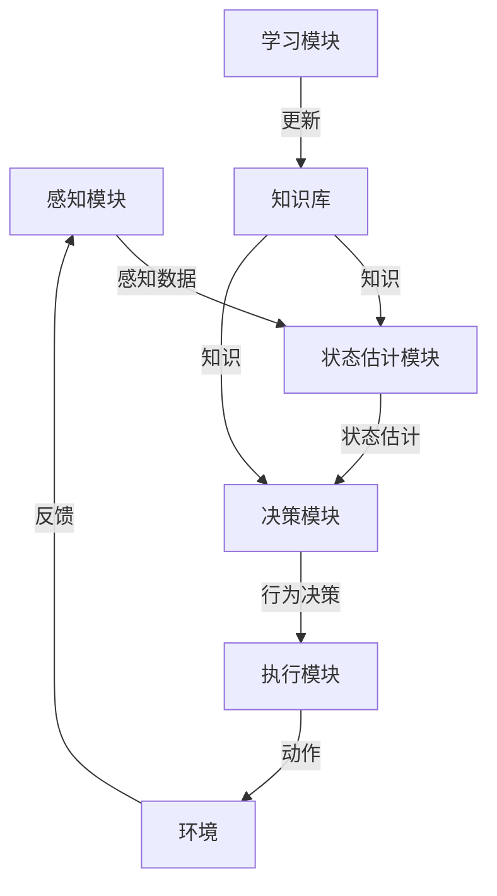

# AI Agent: AI的下一个风口 感知和解析环境的技术

## 1. 背景介绍

### 1.1 人工智能发展历程

人工智能(Artificial Intelligence, AI)是当代科技发展的重要领域,自20世纪50年代问世以来,已经经历了几个重要的发展阶段。早期的人工智能主要集中在基于规则的系统、专家系统和机器学习算法上。随着计算能力和数据量的不断增长,深度学习技术在21世纪初开始崛起,推动了人工智能在计算机视觉、自然语言处理等领域取得了突破性进展。

### 1.2 AI Agent的重要性

尽管深度学习在特定任务上表现出色,但它们缺乏对环境的整体感知和理解能力。AI Agent(智能体)作为感知和理解环境的关键技术,正在成为人工智能发展的新风口。AI Agent需要具备感知环境、建模推理和决策执行的综合能力,以便在复杂动态环境中自主运行。

### 1.3 AI Agent面临的挑战

然而,构建高度智能的AI Agent面临诸多挑战:

- 感知融合:如何将视觉、听觉、触觉等多模态感知数据进行融合和理解?
- 情景建模:如何对复杂动态环境进行准确高效的建模和表示?  
- 决策推理:如何在不确定性和实时性约束下做出合理决策?
- 交互理解:如何与人类或其他智能体进行自然高效的交互?
- 持续学习:如何在线持续学习,不断适应环境变化?

本文将围绕AI Agent感知和解析环境的核心技术,深入探讨相关概念、算法模型和实践应用,为读者提供全面的技术视角。

## 2. 核心概念与联系

### 2.1 AI Agent定义

AI Agent是指能够感知环境、持续学习、自主决策并在环境中采取行动的智能系统。一个理想的AI Agent应当具备以下几个核心能力:

1. **感知(Perception)**: 获取环境信息的能力,包括视觉、听觉、触觉等多模态感知。
2. **学习(Learning)**: 从环境中持续学习、获取新知识的能力。
3. **推理(Reasoning)**: 建模、分析、推断环境的能力。 
4. **规划(Planning)**: 根据目标和约束,生成行为决策序列的能力。
5. **交互(Interaction)**: 与人类或其他智能体自然高效交互的能力。

### 2.2 AI Agent与其他AI系统的关系

AI Agent是一种综合性的智能系统,它与其他AI系统有着密切联系:

- **机器学习(Machine Learning)**: 提供了AI Agent学习环境知识的工具。
- **计算机视觉(Computer Vision)**: 赋予了AI Agent视觉感知的能力。
- **自然语言处理(NLP)**: 使AI Agent能够理解和生成自然语言。
- **规划与决策(Planning & Decision Making)**: 为AI Agent制定行为决策提供支持。
- **多智能体系统(Multi-Agent System)**: 研究多个AI Agent之间的协作与竞争。
- **机器人学(Robotics)**: AI Agent常常需要与物理机器人系统相结合。

AI Agent将这些技术有机融合,构建出能够感知、学习、推理和行动的智能系统。

### 2.3 AI Agent架构

一个典型的AI Agent架构包括以下几个关键模块:

1. **感知模块(Perception Module)**: 负责获取环境数据,如视觉、听觉、触觉等感知信号。
2. **状态估计模块(State Estimation)**: 融合感知数据,建立对环境的表示和理解。
3. **学习模块(Learning Module)**: 从环境中持续学习,更新知识库和技能模型。
4. **决策模块(Decision Module)**: 根据目标、约束和状态估计,生成行为决策序列。
5. **执行模块(Execution Module)**: 将决策转化为具体动作,并反馈给环境。
6. **知识库(Knowledge Base)**: 存储AI Agent所学习到的结构化知识。

这些模块通过有效的信息流动和协作,实现AI Agent对环境的感知解析和决策执行。

## 3. 核心算法原理具体操作步骤  

### 3.1 感知融合

感知融合是将来自多个异构传感器的数据进行融合,以获得更加准确、完整和鲁棒的环境表示。主要包括以下几个步骤:

1. **传感器数据预处理**: 对原始传感器数据进行去噪、标定、同步等预处理,以提高数据质量。

2. **特征提取**: 使用机器学习或手工设计的方法,从传感器数据中提取有意义的特征。

3. **时空对准**: 将异构传感器数据在时间和空间上进行对准,建立数据之间的对应关系。

4. **融合估计**: 使用概率模型或机器学习方法,将多源传感器数据进行融合,得到对环境状态的统一估计。

常用的融合方法包括卡尔曼滤波、粒子滤波、贝叶斯网络等。

### 3.2 情景建模与表示

情景建模旨在构建对环境的结构化表示,支持高层次的推理和决策。主要步骤包括:

1. **对象检测与跟踪**: 从感知数据中检测出感兴趣的对象,并在时间上进行跟踪。

2. **语义理解**: 对检测到的对象进行语义分类和属性标注,赋予对象语义含义。

3. **关系推理**: 推断对象之间的空间、时序、因果等关系,构建情景的结构化表示。

4. **持续更新**: 根据新的感知数据,持续更新和优化情景模型。

常用的情景表示方法包括语义网络、概率图模型、时序逻辑模型等。

### 3.3 决策规划

决策规划模块需要根据情景模型、目标和约束,生成行为决策序列。主要步骤包括:

1. **目标分解**: 将高层次目标分解为可操作的子目标。

2. **状态空间建模**: 将情景模型映射到决策问题的状态空间表示。

3. **规划求解**: 使用经典规划算法(如A*算法)或基于学习的方法(如强化学习),在状态空间中搜索最优决策序列。

4. **执行与监控**: 将决策序列转化为具体动作,并监控执行过程,处理异常情况。

### 3.4 交互理解

AI Agent需要与人类或其他智能体进行高效自然的交互,主要包括以下几个方面:

1. **多模态交互**: 融合语音、视觉、手势等多种模态,实现自然交互方式。

2. **语义理解**: 对交互内容进行自然语言理解,建立语义表示。

3. **语用推理**: 根据语境和对方意图,进行语用层面的推理。

4. **响应生成**: 根据对话状态,生成自然、合理的响应内容。

5. **持续学习**: 在交互过程中持续学习新的知识和技能。

交互理解常常需要结合自然语言处理、计算机视觉、对话系统等多种技术。

### 3.5 持续学习

AI Agent需要具备持续学习的能力,以适应动态变化的环境。主要包括以下几个方面:

1. **增量学习**: 在已有模型的基础上,增量式地学习新的数据和知识。

2. **主动学习**: 主动提出询问,获取有价值的训练样本。

3. **迁移学习**: 将已学习的知识迁移到新的领域和任务上。

4. **元学习**: 学习如何更好地学习,提高学习效率。

5. **在线学习**: 在系统运行过程中持续学习,无需人工数据标注。

持续学习需要解决灾难性遗忘、样本选择偏差、模型可解释性等挑战。

## 4. 数学模型和公式详细讲解举例说明

### 4.1 卡尔曼滤波

卡尔曼滤波是一种常用的状态估计算法,广泛应用于目标跟踪、导航定位等领域。它通过预测和更新两个阶段,递归地估计动态系统的状态。

假设系统的状态方程和观测方程如下:

$$
\begin{aligned}
\mathbf{x}_k &= \mathbf{F}_k\mathbf{x}_{k-1} + \mathbf{B}_k\mathbf{u}_k + \mathbf{w}_k\\
\mathbf{z}_k &= \mathbf{H}_k\mathbf{x}_k + \mathbf{v}_k
\end{aligned}
$$

其中 $\mathbf{x}_k$ 为时刻 $k$ 的系统状态, $\mathbf{z}_k$ 为观测值, $\mathbf{F}_k$ 和 $\mathbf{H}_k$ 分别为状态转移矩阵和观测矩阵, $\mathbf{B}_k$ 为控制输入矩阵, $\mathbf{u}_k$ 为控制输入, $\mathbf{w}_k$ 和 $\mathbf{v}_k$ 分别为过程噪声和观测噪声。

卡尔曼滤波算法包括以下步骤:

**预测步骤**:

$$
\begin{aligned}
\hat{\mathbf{x}}_{k|k-1} &= \mathbf{F}_k\hat{\mathbf{x}}_{k-1|k-1} + \mathbf{B}_k\mathbf{u}_k\\
\mathbf{P}_{k|k-1} &= \mathbf{F}_k\mathbf{P}_{k-1|k-1}\mathbf{F}_k^T + \mathbf{Q}_k
\end{aligned}
$$

**更新步骤**:

$$
\begin{aligned}
\mathbf{K}_k &= \mathbf{P}_{k|k-1}\mathbf{H}_k^T(\mathbf{H}_k\mathbf{P}_{k|k-1}\mathbf{H}_k^T + \mathbf{R}_k)^{-1}\\
\hat{\mathbf{x}}_{k|k} &= \hat{\mathbf{x}}_{k|k-1} + \mathbf{K}_k(\mathbf{z}_k - \mathbf{H}_k\hat{\mathbf{x}}_{k|k-1})\\
\mathbf{P}_{k|k} &= (\mathbf{I} - \mathbf{K}_k\mathbf{H}_k)\mathbf{P}_{k|k-1}
\end{aligned}
$$

其中 $\hat{\mathbf{x}}_{k|k-1}$ 和 $\hat{\mathbf{x}}_{k|k}$ 分别为时刻 $k$ 的预测状态和更新状态, $\mathbf{P}_{k|k-1}$ 和 $\mathbf{P}_{k|k}$ 为相应的协方差矩阵, $\mathbf{K}_k$ 为卡尔曼增益, $\mathbf{Q}_k$ 和 $\mathbf{R}_k$ 分别为过程噪声和观测噪声的协方差矩阵。

通过上述迭代计算,卡尔曼滤波可以有效融合系统模型和观测数据,获得最优的状态估计。

### 4.2 粒子滤波

粒子滤波是一种基于蒙特卡罗采样的贝叶斯估计方法,适用于非线性非高斯系统。它使用一组加权样本(粒子)来近似表示后验概率密度函数。

假设系统的状态转移模型为 $p(\mathbf{x}_k|\mathbf{x}_{k-1})$,观测模型为 $p(\mathbf{z}_k|\mathbf{x}_k)$,我们需要估计状态序列 $\mathbf{x}_{0:k}$ 的后验分布 $p(\mathbf{x}_{0:k}|\mathbf{z}_{1:k})$。

粒子滤波算法包括以下步骤:

1. **初始化**: 从先验分布 $p(\mathbf{x}_0)$ 中采样生成 $N$ 个粒子 $\{\mathbf{x}_0^{(i)}\}_{i=1}^N$,并赋予相等权重 $w_0^{(i)}=1/N$。

2. **重要性采样**:
   - 对每个粒子 $\mathbf