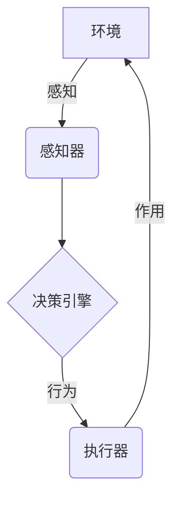

# AI人工智能深度学习算法：智能深度学习代理的异常处理与容错

## 1.背景介绍

### 1.1 人工智能和深度学习的发展

人工智能(AI)是当代最具革命性和颠覆性的技术之一,它的发展为各行各业带来了深远的影响。近年来,深度学习(Deep Learning)作为人工智能的一个核心分支,展现出了令人惊叹的能力,在计算机视觉、自然语言处理、决策系统等诸多领域取得了突破性的进展。

### 1.2 智能代理和异常处理的重要性

随着人工智能系统在越来越多的领域得到应用,确保其稳定性和可靠性变得至关重要。智能代理(Intelligent Agent)作为人工智能系统与环境交互的关键组件,需要具备出色的异常处理和容错能力,以确保在各种意外情况下系统能够正常运行,避免造成严重后果。

### 1.3 异常处理与容错的挑战

然而,在复杂的人工智能系统中实现高效的异常处理和容错是一项艰巨的挑战。这不仅需要对系统的各个组件有深入的理解,还需要掌握先进的算法和技术,以及对异常情况的全面考虑和预测。

## 2.核心概念与联系

### 2.1 智能代理

智能代理是指能够感知环境、处理信息、做出决策并采取行动的自治系统。它们通常由感知器(Sensor)、执行器(Actuator)和决策引擎(Decision Engine)组成。



### 2.2 异常处理

异常处理是指在系统运行过程中,识别、响应和处理意外情况或异常事件的过程。这些异常可能来自输入数据、系统组件故障、环境变化等各种因素。有效的异常处理机制可以提高系统的健壮性和可靠性。

### 2.3 容错

容错(Fault Tolerance)是指系统在发生故障或错误时,能够继续正常运行或以受控方式降级运行的能力。容错设计通常涉及到冗余、隔离、检测和恢复等技术。

### 2.4 异常处理与容错的关系

异常处理和容错密切相关,但又有所区别。异常处理侧重于识别和响应异常事件,而容错则更注重在异常发生后保持系统的可用性和正常运行。有效的异常处理是实现容错的基础,而良好的容错设计则能够增强系统对异常的容忍度。

## 3.核心算法原理具体操作步骤

### 3.1 异常检测算法

#### 3.1.1 基于模型的异常检测

这种方法建立了系统的正常行为模型,并将实际观测值与模型预测值进行比较,当偏差超过阈值时,就认为发生了异常。常用的模型包括:

- **高斯混合模型(GMM)**: 使用多个高斯分布对数据进行建模,异常被视为偏离这些分布的数据点。
- **一类支持向量机(One-Class SVM)**: 将大部分数据包围在一个紧凑的边界内,边界外的数据点被视为异常。

#### 3.1.2 基于邻近度的异常检测

这种方法基于这样的假设:正常数据点相互靠近,而异常数据点与其他数据点相距较远。常用算法包括:

- **k-近邻(k-NN)**: 计算每个数据点到其k个最近邻居的平均距离,距离较大的点被视为异常。
- **局部异常系数(LOF)**: 计算每个数据点相对于其邻居的局部密度偏差,密度较低的点被标记为异常。

#### 3.1.3 基于统计的异常检测

利用数据的统计特性(如均值、方差等)来检测异常,常用方法有:

- **基于高斯分布的评分**: 假设数据服从高斯分布,计算每个数据点的概率密度,低概率密度点被视为异常。
- **基于核函数的评分**: 使用核函数(如高斯核)估计数据的概率密度函数,低密度区域的点被标记为异常。

### 3.2 异常响应策略

#### 3.2.1 异常隔离

当检测到异常时,首先需要将异常与正常系统隔离,防止异常蔓延并影响整个系统。常用的隔离技术包括:

- **进程/线程隔离**: 将系统功能划分为多个独立的进程或线程,异常只会影响当前进程/线程。
- **沙箱隔离**: 在受控的隔离环境(沙箱)中运行不可信代码,防止对主系统造成影响。
- **微服务隔离**: 将系统拆分为loosely-coupled的微服务,异常只会影响当前微服务。

#### 3.2.2 异常恢复

在隔离异常后,需要采取适当的措施来恢复系统的正常运行。常见的恢复策略包括:

- **重启组件**: 重启受影响的组件,使其恢复到初始状态。
- **回滚事务**: 撤销异常事务所做的更改,将系统恢复到事务开始前的状态。
- **切换冗余**: 切换到备用的冗余组件,保证系统可用性。
- **降级服务**: 暂时关闭部分非关键功能,以保证核心服务的正常运行。

#### 3.2.3 根因分析

在恢复系统后,需要对异常的根本原因进行分析,以防止将来再次发生类似问题。常用的根因分析方法包括:

- **事件相关分析**: 分析异常发生前后的事件日志,找出可疑的事件序列。
- **系统镜像分析**: 对异常发生时的系统镜像(内存dummp、进程dummp等)进行分析,定位问题根源。
- **回归测试**: 通过自动化回归测试,重现异常场景,辅助问题定位。

### 3.3 容错设计原则

为了提高系统的容错能力,需要遵循以下一些设计原则:

#### 3.3.1 冗余设计

在系统的关键组件上引入冗余,提供备份,当一个组件发生故障时,可以切换到备份组件,保证系统可用性。常用的冗余设计包括:

- **主备冗余**: 维护一个主组件和一个或多个备份组件,主组件故障时自动切换到备份组件。
- **N+1冗余**: 在N个运行实例上再增加一个备份实例,任何一个实例故障时,备份实例可以顶上。

#### 3.3.2 故障隔离

通过模块化、微服务等架构模式,将系统划分为相对独立的部分,当某一部分发生故障时,可以将故障隔离在当前模块,避免影响整个系统。

#### 3.3.3 幂等性设计

对于关键操作,需要保证幂等性,即无论该操作执行一次或多次,对系统产生的影响是一致的。这样可以在操作失败时安全地重试,而不会导致不一致的系统状态。

#### 3.3.4 回滚机制

为系统设计回滚机制,当发生异常时,可以将系统恢复到已知的正常状态,避免异常状态的蔓延。常用的回滚机制包括事务回滚、版本控制等。

#### 3.3.5 监控与告警

建立完善的监控系统,实时监测系统的运行状态,并在发生异常时及时告警,以便尽快发现和处理问题。

#### 3.3.6 自动化测试

通过自动化的单元测试、集成测试、压力测试等,持续验证系统的正确性和健壮性,尽早发现潜在的异常情况。

## 4.数学模型和公式详细讲解举例说明

### 4.1 异常检测算法的数学模型

#### 4.1.1 高斯混合模型(GMM)

高斯混合模型假设数据由多个高斯分布的混合构成,其概率密度函数为:

$$
p(x) = \sum_{k=1}^{K} \pi_k \mathcal{N}(x|\mu_k,\Sigma_k)
$$

其中:
- $K$是混合成分的数量
- $\pi_k$是第$k$个成分的混合系数,满足$\sum_{k=1}^{K}\pi_k=1$
- $\mathcal{N}(x|\mu_k,\Sigma_k)$是第$k$个成分的高斯分布密度函数,参数为$\mu_k$(均值向量)和$\Sigma_k$(协方差矩阵)

通过期望最大化(EM)算法可以估计出模型参数$\{\pi_k,\mu_k,\Sigma_k\}$。对于新的观测数据$x$,可以计算其在模型中的概率密度$p(x)$,当$p(x)$较小时,就将$x$判定为异常。

#### 4.1.2 一类支持向量机(One-Class SVM)

一类支持向量机的目标是在样本数据周围学习一个紧凑的边界,将大部分数据点包围在内,而将异常点隔离在外。其优化目标为:

$$
\min_{w,\rho,\xi} \frac{1}{2}||w||^2 + \frac{1}{\nu l}\sum_{i=1}^{l}\xi_i - \rho
$$
$$
\text{s.t.} \quad w^T\phi(x_i) \geq \rho - \xi_i, \quad \xi_i \geq 0
$$

其中:
- $w$和$\rho$定义了边界平面$w^T\phi(x)+\rho=0$
- $\phi(x)$是将输入$x$映射到高维特征空间的函数
- $\nu \in (0,1)$控制了边界内数据点的比例和边界区域的平滑性
- $\xi_i$是松弛变量,允许一些数据点位于边界之外

对于新的数据点$x$,如果$w^T\phi(x) < \rho - \nu$,则将其判定为异常。

### 4.2 异常响应策略的数学模型

#### 4.2.1 多臂赌博机(Multi-Armed Bandit)

在异常恢复阶段,当有多种可选的恢复策略时,可以将其建模为多臂赌博机问题,目标是最大化期望回报。设有$K$种恢复策略,每次选择策略$a_t$后,会获得奖赏$r_t$,其期望值为$\mu_{a_t}$。我们希望找到一个策略序列$\{a_1,a_2,...,a_T\}$,使得累积奖赏$\sum_{t=1}^{T}r_t$最大化。

常用的求解算法包括$\epsilon$-Greedy策略、Upper Confidence Bound(UCB)算法等。

#### 4.2.2 马尔可夫决策过程(Markov Decision Process)

在复杂场景下,异常响应可以建模为马尔可夫决策过程。设系统状态为$s \in \mathcal{S}$,代理可选动作为$a \in \mathcal{A}(s)$,转移概率为$\mathcal{P}(s'|s,a)$,即在状态$s$执行动作$a$后,转移到状态$s'$的概率。目标是找到一个策略$\pi: \mathcal{S} \rightarrow \mathcal{A}$,使得期望累积奖赏$\mathbb{E}[\sum_{t=0}^{\infty}\gamma^tr(s_t,a_t)]$最大化,其中$\gamma \in [0,1)$是折现因子。

求解方法包括值迭代(Value Iteration)、策略迭代(Policy Iteration)、Q-Learning等。

## 5.项目实践:代码实例和详细解释说明

为了更好地理解异常检测和容错机制,我们将通过一个实际的机器学习项目进行讲解。该项目是一个用于检测网络入侵的智能代理系统,它需要从网络流量数据中识别出异常行为,并在发生入侵时采取相应的防御措施。

### 5.1 数据预处理

```python
import pandas as pd
from sklearn.preprocessing import StandardScaler

# 加载网络流量数据
data = pd.read_csv('network_traffic.csv')

# 将标签"正常"和"异常"编码为0和1
data['Label'] = data['Label'].map({'正常': 0, '异常': 1})

# 分离特征和标签
X = data.drop('Label', axis=1)
y = data['Label']