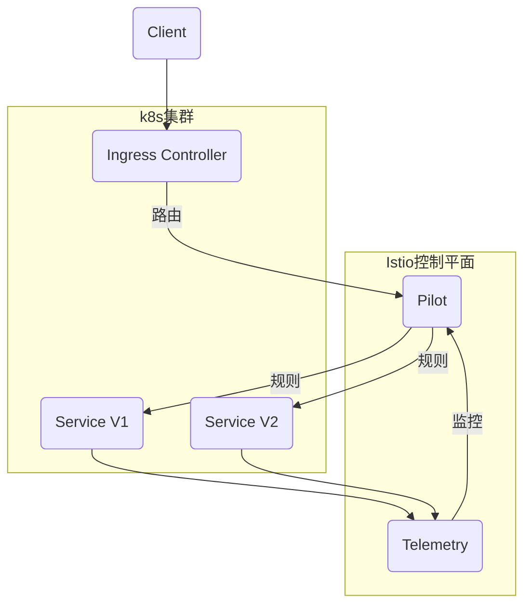

# AI系统灰度发布原理与代码实战案例讲解

## 1.背景介绍

### 1.1 什么是灰度发布

在软件系统的发布过程中,灰度发布(Grayscale Release)是一种控制风险的策略。它允许在发布新版本时,将流量逐步转移到新版本,而不是一次性地将所有流量切换到新版本上。这种方式可以更好地控制风险,并且可以在发现问题时快速回滚。

灰度发布广泛应用于大型互联网公司,如谷歌、亚马逊、Facebook 等,用于新功能、重大系统升级等场景。

### 1.2 为什么需要灰度发布

软件系统的发布过程存在着很多风险,例如:

- 新版本可能存在 Bug 或其他问题
- 新版本可能与旧版本不兼容,导致系统异常
- 新版本的性能可能无法满足高并发场景的要求
- 新版本可能会影响现有的业务逻辑

一旦新版本发布后出现严重问题,将导致整个系统瘫痪,影响全部用户,给企业带来巨大损失。因此,需要一种可控的发布方式来规避风险。

灰度发布正是解决这一问题的有效方案。它将流量分批导入新版本,可以很好地控制风险范围,并且可以根据新版本表现随时决定是否继续发布或者回滚。

### 1.3 灰度发布的优势

相比传统的一次性全量发布,灰度发布具有以下优势:

- **风险可控**:可以将风险控制在可接受的范围内
- **灵活性强**:可以根据新版本表现随时决定继续发布或回滚
- **平滑过渡**:可以避免新旧版本切换时的突变情况
- **分批验证**:可以分批验证新版本的可用性和性能
- **快速修复**:一旦发现问题可以快速切换回旧版本

## 2.核心概念与联系

### 2.1 灰度发布的核心概念

要理解灰度发布的原理,需要掌握以下几个核心概念:

1. **路由层(Route Layer)**: 负责将流量导入不同的服务实例
2. **元数据(Metadata)**: 用于标识流量的一些属性,如用户ID、IP地址等
3. **流量分批(Traffic Sharding)**: 根据元数据将流量划分为不同的批次
4. **权重控制(Weight Control)**: 控制不同批次流量导入新旧版本的比例
5. **服务实例(Service Instance)**: 运行不同版本的服务实例
6. **金丝雀实例(Canary Instance)**: 首先接收一小部分流量的新版本实例
7. **监控系统(Monitoring System)**: 实时监控新版本的运行状态

这些概念相互关联,构成了灰度发布的完整流程。

### 2.2 灰度发布的关键流程

灰度发布的关键流程包括:

1. **流量分批**:根据元数据将流量划分为不同批次
2. **权重控制**:控制每个批次流量导入新旧版本的比例
3. **金丝雀发布**:首先将少量流量导入新版本的金丝雀实例
4. **监控分析**:实时监控新版本的运行状态和性能指标
5. **动态调整**:根据监控数据动态调整每个批次流量的权重
6. **全量发布或回滚**:根据新版本表现决定是否继续发布或者回滚

这个过程是一个闭环,需要路由层、元数据、分批、权重控制、监控等多个组件的协同配合。

## 3.核心算法原理具体操作步骤  

### 3.1 流量分批算法

流量分批的目的是将整体流量划分为不同的批次,以便逐步导入新版本。常用的分批算法有:

1. **哈希分批**:根据元数据(如用户ID)的哈希值将流量划分为不同的批次。
2. **范围分批**:根据元数据的数值范围(如IP地址段)将流量划分为不同批次。
3. **随机分批**:根据随机数将流量随机划分为不同批次。

无论采用哪种分批算法,都需要保证:

- 批次之间是完全独立和互不重叠的
- 每个批次中的流量分布应该尽可能均匀
- 分批算法对元数据的计算应该高效且一致

这样可以确保在导入新版本时,每个批次中的流量都可以得到均匀的处理。

### 3.2 权重控制算法

权重控制的目的是动态调整每个批次流量导入新旧版本的比例。常用的权重控制算法有:

1. **线性增加**:逐步线性增加新版本的权重,如10%->20%->30%...
2. **指数平滑**:新版本权重按指数曲线平滑增加,如10%->18%->28%...
3. **步进控制**:人工设置新版本权重的阶段性目标值,如10%->30%->80%->100%

无论采用哪种权重控制算法,都需要满足:

- 新旧版本权重之和为100%
- 可以随时冻结或回退权重
- 权重调整要平滑,避免突变

适当的权重控制可以更好地控制风险,并且可以根据新版本的表现动态调整发布节奏。

### 3.3 金丝雀实例控制

金丝雀实例是指首先接收一小部分流量的新版本实例。它的作用是:

1. **先行检测**:最先发现新版本中可能存在的问题
2. **压力测试**:测试新版本在生产环境下的性能表现
3. **可观察性**:提供详细的监控数据,帮助分析新版本的运行状态

控制金丝雀实例的关键是:

1. **独立部署**:金丝雀实例应该与其他实例完全独立,以免相互影响
2. **流量控制**:精确控制导入金丝雀实例的流量比例,如1%或5%
3. **监控加强**:对金丝雀实例的监控更加全面,包括日志、指标、链路追踪等

通过金丝雀实例,可以最大程度降低新版本带来的风险,并为进一步发布做好准备。

### 3.4 监控分析与反馈控制

实时监控新版本的运行状态是灰度发布的关键环节。常用的监控指标包括:

- **错误率**:新版本的错误率是否在可控范围内
- **延迟**:新版本的响应延迟是否满足要求
- **吞吐量**:新版本的吞吐量是否足够高效
- **资源使用**:新版本对CPU、内存等资源的使用情况
- **业务指标**:对应用程序的核心业务指标,如订单处理率等

监控数据需要实时分析,并根据分析结果控制权重调整的步伐:

- 如果新版本表现良好,可以加快权重增加的步伐
- 如果发现异常,可以冻结权重,甚至决定回滚
- 如果长期无异常,则可以100%切换到新版本

这种闭环控制可以最大限度地降低风险,确保新版本的平滑过渡。

## 4.数学模型和公式详细讲解举例说明

在灰度发布过程中,需要使用一些数学模型和公式来量化和优化流程。下面是一些常用的模型和公式:

### 4.1 流量分批模型

假设我们有N个独立的流量批次,每个批次占总流量的比例为$p_i(i=1,2,...,N)$,且$\sum_{i=1}^N p_i=1$。

我们的目标是使每个批次的流量分布尽可能均匀,即:

$$\min \sum_{i=1}^N (p_i - \frac{1}{N})^2$$

这是一个最小二乘问题,可以用拉格朗日乘数法求解:

$$L(p_1,p_2,...,p_N,\lambda) = \sum_{i=1}^N (p_i - \frac{1}{N})^2 + \lambda(\sum_{i=1}^N p_i - 1)$$

对每个$p_i$和$\lambda$求偏导数并令其等于0,可以得到最优解:

$$p_i^* = \frac{1}{N},\quad i=1,2,...,N$$

也就是说,最优的流量分批方案是将总流量均匀地划分为N个批次。

### 4.2 权重控制模型

假设我们有两个版本A(旧版本)和B(新版本),当前A的权重为$w_A$,B的权重为$w_B=1-w_A$。我们的目标是在给定的时间T内,将B的权重平滑地增加到目标值$w_B^*$。

我们可以构建如下目标函数:

$$\min \int_0^T (w_B'(t))^2 dt$$
$$s.t.\quad w_B(0)=w_B^0,\quad w_B(T)=w_B^*$$

其中$w_B'(t)$表示权重随时间的变化率。这是一个最小化加权平方变化率的最优控制问题,可以用变分法求解。

最优解为:

$$w_B(t) = w_B^0 + \frac{3}{T^2}(w_B^* - w_B^0)t^2 - \frac{2}{T^3}(w_B^* - w_B^0)t^3$$

这是一个三次曲线方程,可以平滑地将权重从$w_B^0$过渡到$w_B^*$,并且变化率在中间时刻最大,两端时刻为0。

通过这种数学建模,我们可以更好地设计和优化灰度发布的流程,使其更加高效和可控。

## 4.项目实践:代码实例和详细解释说明

为了更好地理解灰度发布的原理和实现,我们来看一个基于Kubernetes和Istio的实战项目案例。

### 4.1 系统架构

我们的系统架构如下图所示:



- Kubernetes集群中运行着服务的两个版本:V1(旧版本)和V2(新版本)
- Ingress Controller作为流量入口,将请求转发给服务
- Istio的Pilot组件负责根据规则来控制流量的路由
- Istio的Telemetry组件负责收集服务的监控数据,并反馈给Pilot
- Pilot根据监控数据动态调整路由规则,从而实现灰度发布

### 4.2 流量分批

我们使用Istio的headers路由规则来实现流量分批。下面是一个示例:

```yaml
apiVersion: networking.istio.io/v1alpha3
kind: VirtualService
metadata:
  name: nginx
spec:
  hosts:
  - nginx.example.com
  http:
  - route:
    - destination:
        host: nginx.example.com
        subset: v1
      weight: 90
    - destination:
        host: nginx.example.com
        subset: v2
      weight: 10
```

这个规则将90%的流量路由到V1版本,10%的流量路由到V2版本。我们使用请求头中的一个特殊字段(如`x-user-id`)作为元数据,通过对其进行哈希计算来决定该请求属于哪个批次。

### 4.3 金丝雀实例

在发布V2版本之前,我们首先创建一个单独的金丝雀实例,并配置一条特殊的路由规则:

```yaml
apiVersion: networking.istio.io/v1alpha3
kind: VirtualService
metadata:
  name: nginx-canary
spec:
  hosts:
  - nginx.example.com
  http:
  - match:
    - headers:
        x-canary-request: "true"
    route:
    - destination:
        host: nginx.example.com
        subset: v2-canary
```

这条规则将所有带有`x-canary-request=true`头的请求路由到金丝雀实例。我们可以通过一些特殊的方式(如内部测试工具)发送这些请求,从而对金丝雀实例进行测试和监控。

### 4.4 监控与反馈控制

我们使用Istio的遥测功能来收集服务的监控数据,包括错误率、延迟、吞吐量等。下面