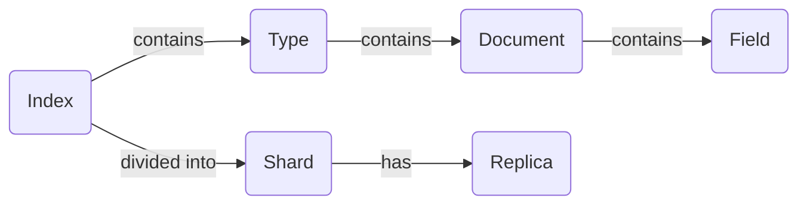

## 1.背景介绍

ElasticSearch是一个开源的分布式搜索和分析引擎。它的设计初衷是使得大数据搜索变得简单。ElasticSearch是基于Lucene构建的，能够提供全文搜索功能，同时又具有分布式搜索的性能。

ElasticSearch广泛应用于各种场景，包括实时数据分析、日志和事件数据管理、全文搜索等。它的核心特性包括分布式搜索、实时分析、可扩展性强、易于管理等。

## 2.核心概念与联系

ElasticSearch的核心概念包括索引、文档、类型、字段、分片和副本等。

- 索引（Index）：索引是ElasticSearch中存储数据的位置，类似于数据库中的“数据库”。
- 文档（Document）：文档是ElasticSearch中存储的基本单位，类似于数据库中的“行”。
- 类型（Type）：类型是ElasticSearch中的逻辑分组，用于将一类相似的文档聚集在一起，类似于数据库中的“表”。
- 字段（Field）：字段是文档中的一个键值对，类似于数据库中的“列”。
- 分片（Shard）：为了支持大规模数据，ElasticSearch将索引分割为多个片段，称为分片。
- 副本（Replica）：为了提高系统的可用性和容错性，ElasticSearch会为分片创建一份或多份副本。

这些核心概念之间的关系如下图所示：



## 3.核心算法原理具体操作步骤

ElasticSearch的核心算法包括索引创建、数据存储、数据搜索和数据分析等。

- 索引创建：当用户创建一个新的索引时，ElasticSearch会根据用户指定的分片数量和副本数量，创建相应的分片和副本。每个分片都是一个独立的Lucene索引，可以独立进行搜索和分析操作。
- 数据存储：当用户添加一个新的文档时，ElasticSearch会根据文档的_id字段，计算出该文档应该存储在哪个分片中，然后将文档存储在相应的分片中。
- 数据搜索：当用户发起一个搜索请求时，ElasticSearch会将搜索请求广播到所有的分片中，每个分片独立进行搜索，然后将搜索结果返回给用户。
- 数据分析：ElasticSearch支持实时的数据分析，用户可以使用ElasticSearch的聚合功能，对数据进行各种复杂的统计分析。

## 4.数学模型和公式详细讲解举例说明

ElasticSearch的数据存储和搜索算法，都是基于哈希函数和倒排索引的原理。

- 哈希函数：ElasticSearch使用哈希函数，将文档的_id字段映射到一个分片中。哈希函数的公式如下：

$$ h(id) = id \mod n $$

其中，$h(id)$表示哈希函数，$id$表示文档的_id字段，$n$表示分片的数量。

- 倒排索引：ElasticSearch使用倒排索引，实现高效的全文搜索。倒排索引是一种将单词映射到出现该单词的文档的数据结构。在ElasticSearch中，倒排索引的结构如下：


## 4.项目实践：代码实例和详细解释说明

下面我们通过一个简单的代码实例，来演示如何使用ElasticSearch。我们将使用Python的Elasticsearch库，创建一个新的索引，添加一些文档，然后进行搜索。

```python
from elasticsearch import Elasticsearch

# 创建一个Elasticsearch客户端
es = Elasticsearch()

# 创建一个新的索引
es.indices.create(index='my_index', ignore=400)

# 添加一些文档
es.index(index='my_index', doc_type='test', id=1, body={'name': 'John', 'age': 30, 'job': 'engineer'})
es.index(index='my_index', doc_type='test', id=2, body={'name': 'Jane', 'age': 25, 'job': 'doctor'})

# 搜索文档
res = es.search(index='my_index', body={'query': {'match': {'job': 'engineer'}}})
print(res)
```

在这个代码实例中，我们首先创建了一个Elasticsearch客户端，然后创建了一个新的索引。接着，我们添加了两个文档，每个文档都有一个_id字段，以及一些其他的字段。最后，我们使用了Elasticsearch的搜索功能，搜索了所有job字段为'engineer'的文档。

## 5.实际应用场景

ElasticSearch的应用场景非常广泛，包括但不限于以下几个方面：

- 实时数据分析：ElasticSearch支持实时的数据分析，用户可以使用ElasticSearch的聚合功能，对数据进行各种复杂的统计分析。
- 日志和事件数据管理：ElasticSearch可以用于存储和搜索大量的日志和事件数据，用户可以使用ElasticSearch快速地搜索和分析日志数据。
- 全文搜索：ElasticSearch提供了强大的全文搜索功能，用户可以使用ElasticSearch进行复杂的文本查询和分析。

## 6.工具和资源推荐

如果你想更深入地学习和使用ElasticSearch，我推荐你参考以下的工具和资源：

- Elasticsearch官方文档：Elasticsearch的官方文档是学习ElasticSearch的最好资源，它包含了ElasticSearch的所有功能和API的详细说明。
- Elasticsearch: The Definitive Guide：这是一本关于ElasticSearch的详细指南，它包含了大量的示例和解释，是学习ElasticSearch的好资源。
- Elasticsearch in Action：这是一本关于ElasticSearch的实战书籍，它通过实际的项目和示例，教你如何使用ElasticSearch。

## 7.总结：未来发展趋势与挑战

ElasticSearch作为一个开源的分布式搜索和分析引擎，其发展势头强劲。随着大数据和云计算的发展，ElasticSearch的应用场景将会越来越广泛。然而，ElasticSearch也面临着一些挑战，包括数据安全、系统稳定性、性能优化等。

## 8.附录：常见问题与解答

1. 问题：ElasticSearch的性能如何？
   答：ElasticSearch的性能非常强大，它支持大规模的数据存储和搜索，同时提供实时的数据分析功能。

2. 问题：我如何学习ElasticSearch？
   答：你可以参考ElasticSearch的官方文档，以及一些关于ElasticSearch的书籍和在线资源。

3. 问题：ElasticSearch有哪些实际应用？
   答：ElasticSearch的应用场景非常广泛，包括实时数据分析、日志和事件数据管理、全文搜索等。

4. 问题：我如何优化ElasticSearch的性能？
   答：你可以通过调整ElasticSearch的配置参数，以及使用合适的硬件和网络环境，来优化ElasticSearch的性能。