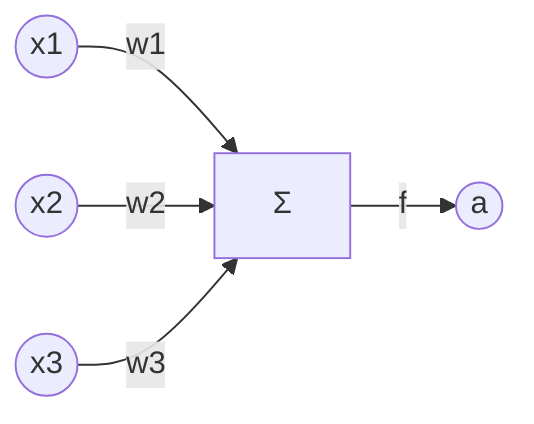
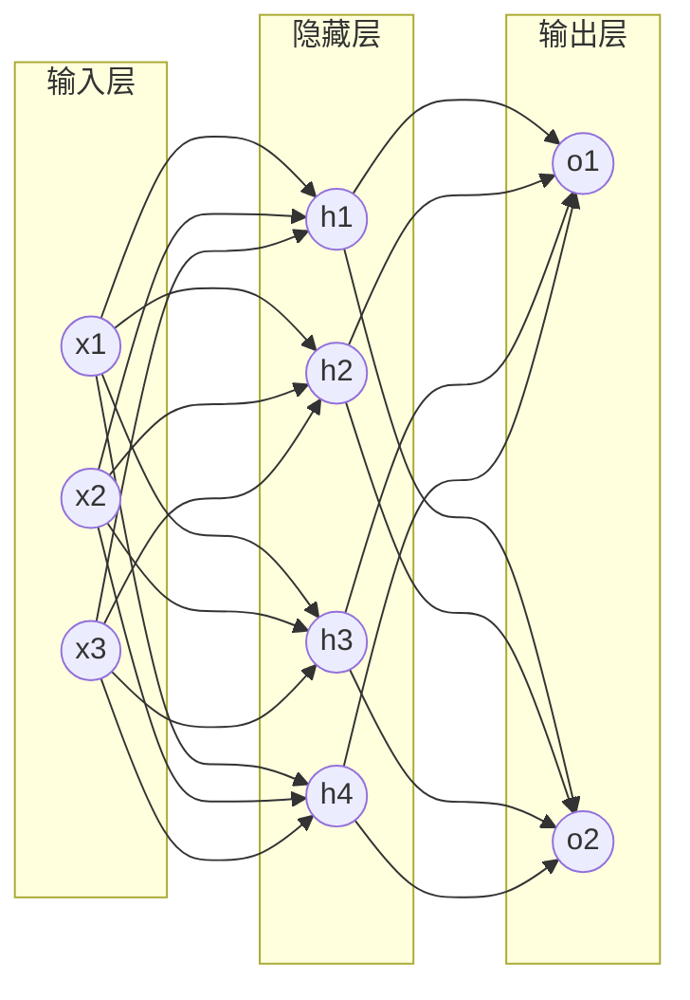
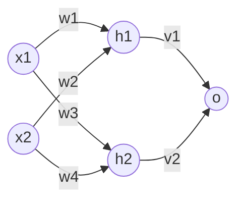
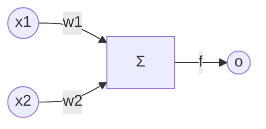

# Neural Networks 原理与代码实战案例讲解

作者：禅与计算机程序设计艺术

## 1. 背景介绍

### 1.1 人工智能与神经网络
人工智能(Artificial Intelligence, AI)是计算机科学的一个重要分支,其目标是让计算机具备类似人类的智能。而神经网络(Neural Networks, NN)则是实现人工智能的一种重要方法。神经网络从生物学的神经系统中得到启发,试图模拟大脑的信息处理过程,以实现机器学习和模式识别等智能任务。

### 1.2 神经网络发展历程
神经网络的研究可以追溯到20世纪40年代,随后经历了几次起伏:

- 1943年,McCulloch和Pitts提出了MP神经元模型,奠定了神经网络的基础。
- 1958年,Rosenblatt提出了感知机(Perceptron)模型,实现了最早的神经网络学习算法。
- 1969年,Minsky和Papert指出了感知机的局限性,导致神经网络研究一度陷入低谷。
- 1986年,Rumelhart等人提出了反向传播(Backpropagation)算法,使多层神经网络的训练成为可能,神经网络研究再次兴起。
- 2006年以来,深度学习(Deep Learning)的崛起将神经网络推向新的高度,在计算机视觉、语音识别、自然语言处理等领域取得了突破性进展。

### 1.3 神经网络应用现状
如今,神经网络已经成为人工智能的核心技术之一,在许多领域得到了广泛应用,例如:

- 计算机视觉:图像分类、目标检测、人脸识别等
- 语音识别:语音转文本、说话人识别等  
- 自然语言处理:机器翻译、情感分析、文本生成等
- 推荐系统:个性化推荐、协同过滤等
- 游戏人工智能:AlphaGo等

神经网络正在深刻改变我们的生活和工作方式,推动人工智能走向更加智能化和人性化。

## 2. 核心概念与联系

### 2.1 人工神经元
人工神经元(Artificial Neuron)是构成神经网络的基本单元,从生物神经元中得到启发。一个典型的人工神经元由输入、权重、激活函数和输出组成:

- 输入:接收其他神经元传来的信号或外界输入
- 权重:每个输入信号的重要性系数
- 激活函数:根据加权输入计算神经元的激活程度,常见的有Sigmoid、tanh、ReLU等
- 输出:神经元的激活值,传递给下一层神经元

下图展示了一个人工神经元的结构:

其中,$x_1,x_2,x_3$为输入信号,$w_1,w_2,w_3$为对应的权重,$f$为激活函数,$a$为神经元的输出。神经元的计算过程可以表示为:

$$a = f(\sum_{i=1}^{n} w_i x_i + b)$$

其中,$b$为偏置项,用于调节神经元的激活阈值。

### 2.2 神经网络结构  
神经网络由大量的人工神经元按一定的连接方式组织而成。最常见的是前馈神经网络(Feedforward Neural Network),它的神经元分层排列,每层的神经元接收前一层的输出,并将自己的输出传递给下一层,信息从输入层流向输出层。

一个简单的三层前馈神经网络结构如下图所示:

除了前馈结构,神经网络还可以引入反馈连接,形成循环神经网络(Recurrent Neural Network),适合处理序列数据。

### 2.3 学习与优化
神经网络通过调整连接权重来学习和存储知识,以完成特定任务。这个过程称为训练或学习,主要有以下几个关键概念:

- 损失函数(Loss Function):衡量网络预测输出与真实标签之间的差异,常用的有均方误差、交叉熵等。
- 优化算法:根据损失函数对网络权重进行调整,以最小化损失。常用的有梯度下降法及其变种,如随机梯度下降(SGD)、Adam等。
- 正则化:控制网络复杂度,防止过拟合,如L1/L2权重衰减、Dropout等。
- 超参数:网络结构(层数、每层神经元数)、学习率、正则化系数等需要人工设定的参数,对网络性能有重要影响。

神经网络的训练是一个不断迭代优化的过程,通过反复调整权重,使网络在训练数据上的损失最小化,从而掌握数据中蕴含的规律。训练完成后,网络可以用于推理,对新的输入数据给出预测输出。

## 3. 核心算法原理具体操作步骤

本节将详细介绍神经网络的核心算法——反向传播(Backpropagation),并给出具体的操作步骤。反向传播使多层神经网络的训练成为可能,是现代神经网络的基石。

### 3.1 反向传播算法原理
反向传播通过链式法则,将损失函数对网络输出的梯度,逐层传播到网络的权重和偏置,从而指导权重的更新。具体来说,反向传播分为两个阶段:

1. 前向传播:输入数据通过网络计算输出,并记录中间结果。
2. 反向传播:根据损失函数计算输出层的梯度,再逐层向前传播,计算每一层权重和偏置的梯度。

我们以一个简单的两层神经网络为例,说明反向传播的计算过程。假设网络结构如下:

其中,$x_1,x_2$为输入,$h_1,h_2$为隐藏层神经元,$o$为输出神经元,$w_1,w_2,w_3,w_4$为输入到隐藏层的权重,$v_1,v_2$为隐藏层到输出层的权重。激活函数为Sigmoid函数:

$$\sigma(x) = \frac{1}{1+e^{-x}}$$

损失函数为均方误差:

$$L = \frac{1}{2}(y-o)^2$$

其中,$y$为真实标签。

反向传播的具体步骤如下:

1. 前向传播,计算每个神经元的激活值:

$$
\begin{aligned}
h_1 &= \sigma(w_1 x_1 + w_2 x_2) \\
h_2 &= \sigma(w_3 x_1 + w_4 x_2) \\  
o &= \sigma(v_1 h_1 + v_2 h_2)
\end{aligned}
$$

2. 计算输出层的梯度:

$$\frac{\partial L}{\partial o} = (o-y)\cdot o(1-o)$$

3. 计算隐藏层到输出层权重的梯度:

$$
\begin{aligned}
\frac{\partial L}{\partial v_1} &= \frac{\partial L}{\partial o} \cdot h_1 \\
\frac{\partial L}{\partial v_2} &= \frac{\partial L}{\partial o} \cdot h_2
\end{aligned}
$$

4. 计算隐藏层神经元的梯度:

$$
\begin{aligned}
\frac{\partial L}{\partial h_1} &= \frac{\partial L}{\partial o} \cdot v_1 \cdot h_1(1-h_1) \\
\frac{\partial L}{\partial h_2} &= \frac{\partial L}{\partial o} \cdot v_2 \cdot h_2(1-h_2)
\end{aligned}
$$

5. 计算输入到隐藏层权重的梯度:

$$
\begin{aligned}
\frac{\partial L}{\partial w_1} &= \frac{\partial L}{\partial h_1} \cdot x_1 \\
\frac{\partial L}{\partial w_2} &= \frac{\partial L}{\partial h_1} \cdot x_2 \\
\frac{\partial L}{\partial w_3} &= \frac{\partial L}{\partial h_2} \cdot x_1 \\
\frac{\partial L}{\partial w_4} &= \frac{\partial L}{\partial h_2} \cdot x_2
\end{aligned}
$$

6. 根据梯度更新权重,以隐藏层到输出层的权重为例:

$$v_1 := v_1 - \alpha \frac{\partial L}{\partial v_1}$$

其中,$\alpha$为学习率,控制每次更新的步长。

以上就是反向传播的基本原理和计算过程。对于更深的网络,只需逐层应用链式法则,即可计算任意层的权重梯度。反向传播使神经网络能够端到端地学习,是深度学习的基础。

### 3.2 反向传播算法的变体与改进
经典的反向传播算法存在一些问题,如梯度消失/爆炸、收敛速度慢等。研究者提出了许多改进方法,主要有:

- 梯度裁剪(Gradient Clipping):限制梯度的最大范数,防止梯度爆炸。
- 残差连接(Residual Connection):在网络中引入跳跃连接,缓解梯度消失,使训练更深的网络成为可能。
- 批标准化(Batch Normalization):在每层的激活前对中间结果做归一化,加速收敛。
- 自适应学习率:根据梯度历史自动调节每个参数的学习率,加速收敛,如AdaGrad、RMSProp、Adam等优化器。

此外,针对循环神经网络还发展出了专门的反向传播算法,如BPTT(Backpropagation Through Time)。

反向传播是一个简单而强大的算法,在神经网络的发展中扮演了关键角色。理解反向传播的原理,是掌握神经网络和深度学习的基础。

## 4. 数学模型和公式详细讲解举例说明

本节将详细讲解神经网络涉及的主要数学模型和公式,并给出具体的例子加以说明。

### 4.1 感知机模型
感知机(Perceptron)是最早的神经网络模型,由Rosenblatt在1958年提出。它可以看作一个简单的二分类器,结构如下图所示:

感知机接收n维输入向量$\boldsymbol{x}=[x_1,x_2,\dots,x_n]^\top$,每个输入$x_i$与权重$w_i$相乘,再求和得到激活值$a$:

$$a = \sum_{i=1}^{n} w_i x_i + b$$

其中,$b$为偏置项。激活值经过符号函数$f$输出最终结果:

$$
o = f(a) = 
\begin{cases}
1, & a \geq 0 \\
-1, & a < 0
\end{cases}
$$

感知机的学习规则为:

$$
w_i := w_i + \Delta w_i \\
\Delta w_i = \eta (y-o) x_i
$$

其中,$y$为真实标签,$\eta$为学习率。这个规则的直观解释是:当感知机预测错误时,向正确方向调整权重。

例如,考虑下表所示的AND逻辑:

| $x_1$ | $x_2$ | $y$ |
|:-----:|:-----:|:---:|
|   0   |   0   |  0  |
|   0   |   1   |  0  |
|   1   |   0   |  0  |
|   1   |   1   |  1  |

假设初始权重为$w_1=w_2=0,b=0$,学习率$\eta=1$。对于第一个样