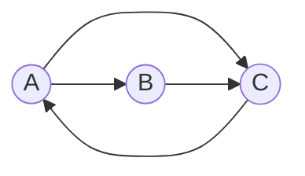

# PageRank 原理与代码实例讲解

作者：禅与计算机程序设计艺术

## 1. 背景介绍

### 1.1 PageRank的诞生
PageRank是由Google公司创始人Larry Page和Sergey Brin在斯坦福大学攻读博士学位时提出的一种算法,用于衡量特定网页相对于搜索引擎索引中的其他网页而言的重要程度。它是Google用于排名网页的一种算法,也是Google搜索引擎早期成功的关键因素之一。

### 1.2 PageRank的重要性
PageRank彻底改变了搜索引擎的工作方式,使其能够根据网页的"重要性"来排序搜索结果,而不仅仅是根据网页内容与查询的相关性。PageRank算法成为了现代搜索引擎的基石,对搜索引擎和互联网的发展产生了深远影响。

### 1.3 PageRank的应用领域
除了在搜索引擎领域,PageRank算法还被广泛应用于社交网络分析、推荐系统、生物信息学等诸多领域。理解PageRank算法的原理,对于从事这些领域的研究和应用都具有重要意义。

## 2. 核心概念与联系

### 2.1 有向图模型
- 将整个万维网看作一个巨大的有向图G(V,E)。
- 每个网页是图中的一个节点(顶点)。  
- 如果网页A存在指向网页B的链接,则在图中存在一条从节点A指向节点B的有向边。

### 2.2 随机游走
- 将一个随机游走者(random surfer)放置在图中的某个节点上。
- 游走者以一定的概率(阻尼因子)选择当前网页的一个出链进行随机游走。
- 经过足够长时间,游走者访问每个网页的频率趋于稳定,即收敛于平稳分布。

### 2.3 马尔可夫链
- 将网页间的跳转关系看作一个马尔可夫链。
- 每个网页是马尔可夫链的一个状态。
- 网页间的链接关系决定了状态转移概率矩阵。

### 2.4 平稳分布 
- 马尔可夫链经过足够长时间达到平稳分布。
- 平稳分布描述了随机游走者最终访问每个网页的概率。
- 平稳分布对应于转移矩阵的主特征向量。

## 3. 核心算法原理具体操作步骤

### 3.1 构建转移概率矩阵
- 根据网页间的链接关系,构建转移概率矩阵P。
- $P_{ij}$ 表示从页面i转移到页面j的概率。
- 对于每个网页i,计算其出链数量 $L(i)$,则$P_{ij} = \frac{1}{L(i)}$。

### 3.2 迭代计算
- 选取初始的PageRank值向量 $R_0$,通常取均匀分布。  
- 迭代更新 PageRank 值:$R_{t+1} = dPR_t + \frac{1-d}{N}\vec{1}$
- 其中,$d$为阻尼因子,$N$为网页总数。
- 重复迭代直到PageRank值收敛。

### 3.3 处理等级泄露 (rank leak)
- 等级泄露:一个节点没有任何出链,会导致部分PageRank值丢失。
- 解决方法:为没有出链的节点添加指向所有节点的边,并平均分配转移概率。

### 3.4 计算复杂度优化
- 采用幂法(power iteration)加速PageRank值的收敛。  
- 利用稀疏矩阵存储和计算,降低空间和时间复杂度。

## 4. 数学模型和公式详细讲解举例说明

### 4.1 PageRank值计算公式

PageRank值的计算可以表示为如下的递推公式:

$$R(p_i) = \frac{1-d}{N} + d \sum_{p_j \in M(p_i)} \frac{R(p_j)}{L(p_j)}$$

其中:
- $R(p_i)$ 表示网页 $p_i$ 的PageRank值。
- $d$ 为阻尼因子,取值在0到1之间,通常取0.85。
- $N$ 为网页总数。
- $M(p_i)$ 表示存在指向网页$p_i$的链接的网页集合。
- $L(p_j)$ 表示网页$p_j$的出链数量。

### 4.2 转移矩阵表示

PageRank值的计算可以用转移矩阵的形式表示为:

$$R = dPR + \frac{1-d}{N}\vec{1}$$

其中:  
- $R$ 为PageRank值列向量。
- $P$ 为根据链接关系构建的转移概率矩阵。
- $\vec{1}$ 为全1列向量。

### 4.3 幂法迭代

利用幂法对PageRank进行迭代计算,直到收敛:

$$R_{t+1} = dPR_t + \frac{1-d}{N}\vec{1}$$

其中:
- $R_t$ 表示第$t$轮迭代的PageRank值向量。
- 初始值 $R_0$ 可以取均匀分布向量 $\frac{1}{N}\vec{1}$。

### 4.4 数值例子

考虑如下的一个简单网页链接关系图:



构建转移概率矩阵:

$$P = \begin{bmatrix} 
0 & \frac{1}{2} & \frac{1}{2} \\
0 & 0 & 1 \\
1 & 0 & 0
\end{bmatrix}$$

取阻尼因子 $d=0.85$,设定初始PageRank值为均匀分布,迭代计算直至收敛:

$$R_0 = [\frac{1}{3}, \frac{1}{3}, \frac{1}{3}]^T$$

$$R_1 = 0.85 P R_0 + \frac{0.15}{3}\vec{1} = [0.3833, 0.2833, 0.3333]^T$$

$$\cdots$$

最终PageRank值收敛为:

$$R = [0.3599, 0.2795, 0.3605]^T$$

## 5. 项目实践：代码实例和详细解释说明

下面给出一个使用Python实现PageRank算法的简单示例代码:

```python
import numpy as np

def pagerank(M, num_iterations=100, d=0.85):
    N = M.shape[1]
    v = np.ones(N) / N
    for i in range(num_iterations):
        v = d * np.matmul(M, v) + (1 - d) / N * np.ones(N)
    return v

# 示例转移概率矩阵
M = np.array([[0, 0.5, 0.5], 
              [0, 0, 1],
              [1, 0, 0]])

print(pagerank(M, 100, 0.85))
```

代码解释:
- `pagerank`函数接受转移概率矩阵`M`,迭代次数`num_iterations`和阻尼因子`d`作为输入。
- 初始化PageRank值向量`v`为均匀分布。
- 循环`num_iterations`次,根据PageRank计算公式更新`v`。
- 返回计算得到的PageRank值向量。
- 在`main`函数中,构建示例转移概率矩阵,调用`pagerank`函数计算PageRank值。

运行该代码,可以得到与前面数值例子一致的结果:

```
[0.35994768 0.27953604 0.36051628]
```

## 6. 实际应用场景

### 6.1 搜索引擎排序
- PageRank是Google搜索引擎的核心算法之一,用于对网页重要性进行评估和排序。
- 将PageRank值与其他因素(如文本相关性)结合,得到综合的网页排名。

### 6.2 社交网络分析
- 将社交网络视为有向图,用户视为节点,用户间的关注关系视为有向边。
- 通过PageRank可以发现社交网络中的关键意见领袖和有影响力的用户。

### 6.3 推荐系统
- 在推荐系统中,将用户和物品视为二部图的节点,用户对物品的偏好视为有向边。
- 通过PageRank可以对用户和物品的重要性进行评估,提供个性化推荐。

### 6.4 文本挖掘
- 将文本语料库构建为引文网络,文档视为节点,引用关系视为有向边。
- 通过PageRank对文档重要性进行评估,发现具有重要学术影响力的文献。

## 7. 工具和资源推荐

### 7.1 Python库
- NetworkX: 用于构建和分析复杂网络的Python库,支持PageRank算法。
- NumPy: Python科学计算基础库,提供高效的数值计算和线性代数运算。
- SciPy: 基于NumPy的科学计算库,提供了稀疏矩阵的支持。

### 7.2 开源实现
- Networkx PageRank: NetworkX库提供的PageRank算法实现。
- iGraph PageRank: iGraph库提供的PageRank算法实现,支持多种编程语言。

### 7.3 相关论文
- "The PageRank Citation Ranking: Bringing Order to the Web", Page et al., 1999. 
- "The Anatomy of a Large-Scale Hypertextual Web Search Engine", Brin & Page, 1998.

## 8. 总结：未来发展趋势与挑战

### 8.1 算法改进
- 针对不同领域的特点,对PageRank算法进行改进和优化。
- 结合领域知识,引入额外的先验信息,提高算法的效果。

### 8.2 大规模计算
- 面对万维网规模的增长,如何实现PageRank算法的分布式计算是一大挑战。  
- 需要设计高效的分布式算法和并行计算框架,提高计算效率。

### 8.3 实时更新
- 网络结构的动态变化要求PageRank能够实时更新。
- 增量式计算和近似算法是应对这一挑战的重要手段。

### 8.4 领域拓展
- 将PageRank的思想拓展应用到更多领域,如推荐系统、社交网络、生物信息学等。
- 探索PageRank与深度学习等新兴技术的结合,开拓新的应用场景。

## 9. 附录：常见问题与解答

### Q1: PageRank是否收敛?收敛速度如何?
A1: 在满足一定条件(阻尼因子选取得当)的情况下,PageRank算法是收敛的。收敛速度受网络结构、阻尼因子等因素影响。通常采用幂法迭代,收敛速度较快。

### Q2: PageRank如何处理孤立节点和等级泄露问题?  
A2: 对于孤立节点和等级泄露问题,可以为这些节点添加指向所有节点的边,并平均分配转移概率。阻尼因子的引入在一定程度上缓解了等级泄露问题。

### Q3: PageRank能否用于社交网络的影响力分析?
A3: PageRank算法可以用于社交网络的影响力分析。将用户视为节点,用户间的关系视为有向边构建社交网络图,运用PageRank可以发现有影响力的用户,即"意见领袖"。

### Q4: PageRank的计算复杂度如何?有哪些优化方法?
A4: 朴素的PageRank算法时间复杂度为$O(n^2)$,其中$n$为网页数量。采用稀疏矩阵存储和计算可以大大降低时空复杂度。此外,还可以使用随机游走的Monte Carlo方法、近似算法等进行优化。