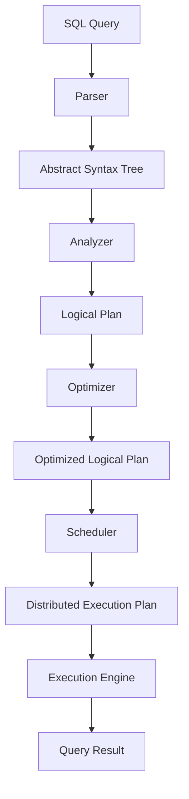

# Presto原理与代码实例讲解

## 1.背景介绍

在大数据时代,数据分析和查询是一个极其重要的环节。传统的数据库系统在处理大规模数据集时往往会面临性能瓶颈,无法满足实时查询的需求。为了解决这一问题,Presto作为一种新兴的大数据查询引擎应运而生。

Presto最初由Facebook的数据基础设施团队开发,旨在为大数据分析提供高效、可扩展和交互式的SQL查询能力。它被设计为在大规模分布式环境中运行,能够查询跨多个异构数据源的数据,包括HDFS、Hive、Cassandra、MySQL等。

Presto的核心理念是将计算过程尽可能推送到数据存储层,从而最大限度减少数据传输,提高查询效率。它采用了全新的查询执行引擎,能够充分利用现代硬件的并行计算能力,实现高吞吐量和低延迟的查询处理。

## 2.核心概念与联系

### 2.1 查询引擎

Presto的查询引擎是整个系统的核心组件,负责解析SQL查询、生成查询计划并执行查询操作。它由以下几个主要模块组成:

- **Parser**: 将SQL语句解析为抽象语法树(AST)
- **Analyzer**: 对AST进行语义分析,构建逻辑查询计划
- **Optimizer**: 基于查询成本模型优化逻辑查询计划
- **Scheduler**: 将优化后的逻辑计划转换为分布式执行计划
- **Execution Engine**: 执行分布式执行计划,生成查询结果

查询引擎的工作流程如下所示:



### 2.2 数据模型

Presto采用了自己的数据模型,将不同数据源中的数据统一抽象为以下几个概念:

- **Catalog**: 代表一个数据源,如Hive、MySQL等
- **Schema**: 类似于传统数据库中的"database"概念
- **Table**: 表示一个数据集,可以是Hive表、MySQL表等
- **Column**: 表中的列,包含列名、数据类型等元数据

通过这种抽象模型,Presto可以无缝访问不同数据源中的数据,为用户提供统一的查询体验。

### 2.3 并行执行

为了充分利用现代硬件的并行计算能力,Presto采用了基于Stage的查询执行模型。每个Stage代表查询计划中的一个片段,由多个并行运行的Task组成。Task之间使用有界内存缓冲区(Pipelined Buffer)进行数据传输,实现流水线式的执行。

这种执行模型可以有效利用CPU和内存资源,大大提高了查询性能。同时,Presto还支持动态缩放集群资源,根据查询负载自动调整Task的并行度。

## 3.核心算法原理具体操作步骤

### 3.1 查询解析

Presto的查询解析过程分为两个阶段:语法分析和语义分析。

**语法分析**阶段由Parser模块完成,它将SQL查询语句解析为抽象语法树(AST)。Presto使用ANTLR作为解析器生成器,根据SQL语法规则自动构建解析器。

**语义分析**阶段由Analyzer模块完成,它对AST进行语义检查和转换,生成逻辑查询计划。这个过程包括以下步骤:

1. **绑定对象**: 将查询中引用的表、视图等对象与实际的数据源对象绑定
2. **类型推导**: 推导每个表达式的数据类型
3. **语义检查**: 检查查询是否符合语义规则,如列是否存在、函数参数类型是否匹配等
4. **逻辑优化**: 对AST进行一些简单的等价变换,如常量折叠、谓词下推等
5. **逻辑计划生成**: 根据优化后的AST生成逻辑查询计划

逻辑查询计划由一系列的逻辑操作符(如Project、Filter、Join等)组成,描述了查询的基本执行流程。

### 3.2 查询优化

Optimizer模块负责对逻辑查询计划进行优化,目标是生成一个执行成本最小的等价计划。优化过程包括以下几个阶段:

1. **规则优化**: 应用一系列等价规则对逻辑计划进行重写,如谓词下推、列裁剪等
2. **代价估算**: 基于统计信息和代价模型,估算每个逻辑操作符的执行代价
3. **查询重写**: 对逻辑计划进行高层次的重写,如将Join转换为SemiJoin等
4. **物化视图选择**: 选择合适的物化视图来加速查询执行
5. **连接重排**: 根据代价模型对Join操作符的顺序进行优化

经过以上优化后,Optimizer输出一个执行代价最小的逻辑计划。

### 3.3 查询调度

Scheduler模块负责将优化后的逻辑计划转换为分布式执行计划。这个过程包括以下步骤:

1. **分区裁剪**: 根据查询条件,裁剪掉不需要访问的数据分区
2. **并行度决策**: 确定每个操作符的并行度(Task数量)
3. **执行位置选择**: 为每个Task选择合适的执行位置(Worker节点)
4. **执行计划生成**: 生成描述整个分布式执行流程的执行计划

执行计划由多个Stage组成,每个Stage包含一组并行的Task。Task之间使用有界内存缓冲区(Pipelined Buffer)进行数据传输,实现流水线式执行。

### 3.4 查询执行

Execution Engine模块负责执行分布式执行计划,生成最终的查询结果。它由以下几个核心组件组成:

- **TaskSource**: 负责创建和调度Task
- **TaskManager**: 管理Task的生命周期,监控它们的执行状态
- **TaskExecutor**: 在Worker节点上执行具体的Task
- **ExchangeManager**: 管理Task之间的数据传输和重分区操作
- **MemoryManager**: 管理内存资源,防止发生内存不足的情况

在执行过程中,TaskSource会根据执行计划创建Task,并将它们分发到合适的Worker节点上执行。TaskExecutor在本地执行Task,并通过ExchangeManager将数据传输给下游Task。如果发生内存不足等异常情况,MemoryManager会采取相应的缓解措施,如启用磁盘落地等。

Execution Engine支持基于反馈的动态缩放,可以根据查询负载自动调整Task的并行度,充分利用集群资源。

## 4.数学模型和公式详细讲解举例说明

在查询优化过程中,Presto使用了基于代价模型的查询优化策略。代价模型的目标是估算一个查询计划的执行代价,并选择代价最小的计划作为最终执行计划。

Presto的代价模型主要考虑以下几个因素:

1. **CPU代价**: 执行查询操作所需的CPU时间
2. **内存代价**: 执行查询操作所需的内存空间
3. **网络代价**: 执行查询操作所需的网络传输量
4. **I/O代价**: 执行查询操作所需的磁盘I/O量

对于每种查询操作符,Presto都定义了相应的代价计算公式。以下是一些常见操作符的代价计算公式:

**Scan操作符**

Scan操作符的代价主要取决于需要扫描的数据量。假设需要扫描的数据量为$N$行,每行的大小为$S$字节,磁盘带宽为$B_{disk}$,则Scan操作符的代价为:

$$
Cost_{scan} = \frac{N \times S}{B_{disk}}
$$

**Project操作符**

Project操作符的代价主要取决于需要处理的数据量和投影列的数量。假设输入数据量为$N$行,每行的大小为$S_{in}$字节,输出数据量为$M$行,每行的大小为$S_{out}$字节,CPU处理速率为$R_{cpu}$,则Project操作符的代价为:

$$
Cost_{project} = \frac{N \times S_{in}}{R_{cpu}} + \frac{M \times S_{out}}{R_{cpu}}
$$

**Filter操作符**

Filter操作符的代价主要取决于需要处理的数据量和过滤条件的选择率。假设输入数据量为$N$行,每行的大小为$S$字节,过滤条件的选择率为$f$,CPU处理速率为$R_{cpu}$,则Filter操作符的代价为:

$$
Cost_{filter} = \frac{N \times S}{R_{cpu}} + \frac{N \times f \times S}{R_{cpu}}
$$

**Join操作符**

Join操作符的代价主要取决于两个输入的数据量、Join类型和Join键的基数。假设左输入数据量为$N_l$行,每行的大小为$S_l$字节,右输入数据量为$N_r$行,每行的大小为$S_r$字节,Join键的基数为$V$,CPU处理速率为$R_{cpu}$,则Join操作符的代价为:

$$
Cost_{join} = \frac{N_l \times S_l}{R_{cpu}} + \frac{N_r \times S_r}{R_{cpu}} + \frac{N_l \times N_r}{V \times R_{cpu}}
$$

上述公式只是一个简化的示例,实际代价模型会考虑更多的因素,如数据分布、执行位置等。Presto还支持基于统计信息的代价估算,可以获得更准确的代价估计。

## 4.项目实践:代码实例和详细解释说明

在本节中,我们将通过一个实际的代码示例,展示如何使用Presto进行数据查询和分析。

假设我们有一个存储在Hive中的日志数据表`web_logs`,其中包含以下列:

- `event_time`: 事件发生的时间戳
- `user_id`: 用户ID
- `url`: 访问的URL
- `status_code`: HTTP状态码
- `referer`: 引荐来源URL

我们希望统计每个用户在过去24小时内访问过的不同URL的数量,并按照访问URL数量从高到低进行排序。

以下是使用Presto完成这个任务的SQL查询:

```sql
WITH user_visits AS (
  SELECT
    user_id,
    url,
    COUNT(*) AS visit_count
  FROM web_logs
  WHERE event_time >= DATE_SUB(CURRENT_DATE, INTERVAL 1 DAY)
  GROUP BY user_id, url
)
SELECT
  user_id,
  COUNT(DISTINCT url) AS unique_urls
FROM user_visits
GROUP BY user_id
ORDER BY unique_urls DESC
LIMIT 10;
```

让我们逐步解释这个查询:

1. 首先,我们使用`WITH`子句定义了一个临时表`user_visits`,它包含了每个用户访问过的URL及其访问次数。这里使用了`GROUP BY`对`user_id`和`url`进行分组,并使用`COUNT(*)`统计每组的访问次数。同时,我们使用`WHERE`子句过滤掉了24小时之前的日志记录。

2. 在主查询中,我们从`user_visits`表中选择`user_id`和`COUNT(DISTINCT url)`。`COUNT(DISTINCT url)`会统计每个用户访问过的不同URL的数量。

3. 然后,我们使用`GROUP BY user_id`对结果进行分组,并使用`ORDER BY unique_urls DESC`按照访问URL数量从高到低进行排序。

4. 最后,我们使用`LIMIT 10`只返回前10条记录。

这个查询展示了Presto在处理大规模数据时的强大能力。即使`web_logs`表包含数十亿条记录,Presto也能在几秒钟内完成这个查询。

下面是一个使用Java编写的示例代码,展示如何通过Presto的JDBC接口执行SQL查询:

```java
// 创建JDBC连接
String url = "jdbc:presto://presto-coordinator:8080/hive/default";
Properties props = new Properties();
props.setProperty("user", "presto");
Connection conn = DriverManager.getConnection(url, props);

// 执行SQL查询
String sql = "WITH user_visits AS (...) SELECT user_id, COUNT(DISTINCT url) AS unique_urls FROM user_visits GROUP BY user_id ORDER BY unique_urls DESC LIMIT 10;";
Statement stmt = conn.createStatement();
ResultSet rs = stmt.executeQuery(sql);

// 处理查询结果
while (rs.next()) {
    String userId = rs.getString("user_id");
    int uniqueUrls = rs.getInt("unique_urls");
    System