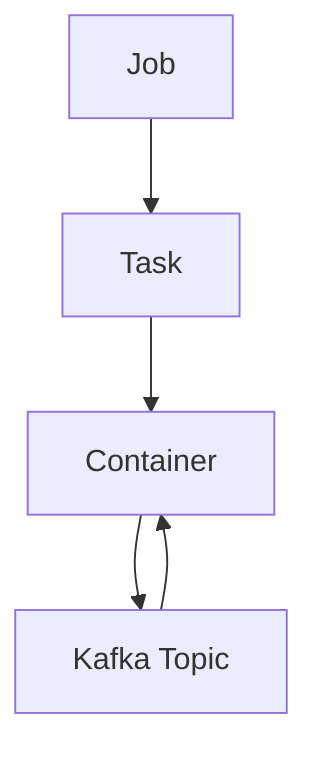
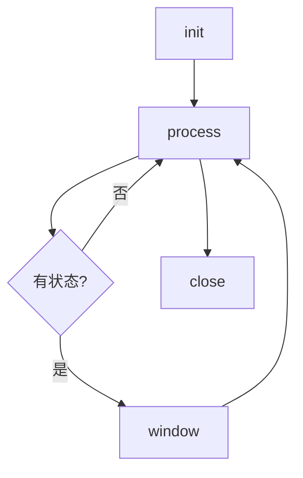
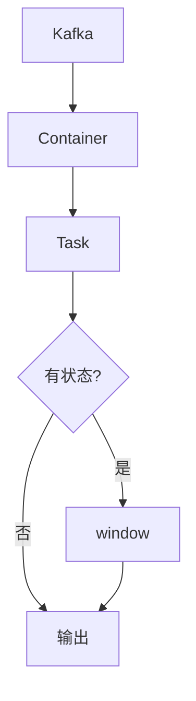
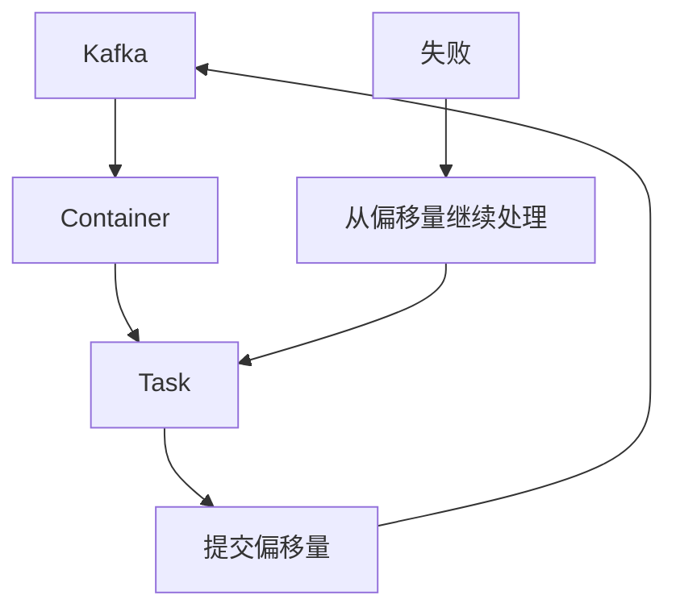

# Samza Task原理与代码实例讲解

## 1.背景介绍

### 1.1 什么是Samza

Apache Samza是一个分布式流处理系统,最初由LinkedIn公司开发,后来捐赠给Apache软件基金会。它基于Apache Kafka消息队列系统构建,用于处理实时数据流。Samza的主要目标是提供一个易于构建和运行无状态或有状态的流处理应用程序的框架。

### 1.2 Samza的特点

- **容错性**:Samza利用Kafka的重播能力来实现容错,可以从上次处理的位置继续处理流数据。
- **可扩展性**:Samza可以通过增加更多的节点来水平扩展,处理更大的数据流量。
- **状态管理**:Samza支持有状态的流处理,可以使用RocksDB等本地数据库来维护状态。
- **容易集成**:Samza可以很容易地与YARN、Kafka、HDFS等系统集成。

### 1.3 Samza的应用场景

Samza适用于需要处理大量实时数据流的场景,如:

- 实时数据分析:对实时日志数据、传感器数据等进行处理和分析。
- 实时监控系统:持续监控系统指标并触发告警。
- 实时推荐系统:根据用户行为实时推荐内容。
- 实时风控系统:检测异常交易行为。

## 2.核心概念与联系

### 2.1 Task

Task是Samza中最核心的概念,它定义了一个流处理单元。每个Task都会处理一个或多个Kafka分区中的消息。

Task有两种类型:

1. **StreamTask**:处理无状态的流数据。
2. **StreamTask.WindowableByKey**:处理有状态的流数据,可以基于Key维护状态。

### 2.2 Job

Job由一个或多个Task组成,用于定义整个流处理应用程序的逻辑。每个Job都有一个唯一的名称,并且可以配置多个Task实例。

### 2.3 Container

Container是Samza的执行单元,它负责运行一个或多个Task实例。每个Container都会消费Kafka中的一些分区,并将消息传递给相应的Task进行处理。

### 2.4 核心组件关系

Samza的核心组件之间的关系如下所示:



1. Job定义了整个流处理应用程序的逻辑,包含一个或多个Task。
2. Task是流处理的基本单元,每个Task处理一个或多个Kafka分区中的消息。
3. Container负责运行一个或多个Task实例,并从Kafka中消费消息。
4. Kafka Topic存储流数据,Container从Topic中消费消息并传递给Task进行处理。

## 3.核心算法原理具体操作步骤

### 3.1 Task生命周期

每个Task在Samza中都有一个生命周期,包括以下几个阶段:

1. **初始化(init)**:Task被创建时执行的初始化操作。
2. **处理(process)**:Task处理从Kafka中获取的消息。
3. **窗口(window)**:对于有状态的Task,定期执行窗口操作,如聚合或清理状态。
4. **关闭(close)**:Task被关闭时执行的清理操作。

下面是Task生命周期的流程图:



### 3.2 消息处理流程

Samza中消息的处理流程如下:

1. Container从Kafka中获取消息。
2. 将消息传递给相应的Task实例。
3. Task调用`process`方法处理消息。
4. 对于有状态的Task,定期执行`window`操作。
5. Task可以选择性地将处理结果输出到Kafka、HDFS等外部系统。



### 3.3 重新处理和容错

Samza利用Kafka的重播能力来实现容错,如果Task处理失败或容器崩溃,Samza可以从上次处理的位置继续处理流数据。

1. 每个Task都会定期将其当前处理位置(偏移量)写入Kafka。
2. 如果Task失败,Samza会从上次提交的偏移量继续处理。
3. 对于有状态的Task,Samza会从本地状态数据库中恢复状态。



## 4.数学模型和公式详细讲解举例说明

在Samza中,有状态的Task通常需要维护一些聚合或统计信息。这些操作通常可以使用一些数学模型和公式来描述。

### 4.1 滑动窗口模型

滑动窗口是一种常见的数据处理模型,用于对最近的一段时间内的数据进行聚合或统计。Samza中的`WindowableByKey`Task就是基于这个模型实现的。

假设我们需要统计最近1小时内每个用户的点击量,可以使用以下公式:

$$
clicks(user, t) = \sum_{i=t-3600}^{t} f(user, i)
$$

其中:
- $clicks(user, t)$表示用户user在时间t的点击量
- $f(user, i)$是一个函数,表示用户user在时间i的点击次数(0或1)

我们可以使用一个长度为3600秒的滑动窗口来维护每个用户的点击量。当有新的点击事件到来时,将其加入窗口;当旧的点击事件过期时,将其从窗口中移除。

### 4.2 指数加权移动平均模型

指数加权移动平均(EWMA)是一种常用的平滑模型,可以用于计算时间序列数据的移动平均值。它给予最近的观测值更高的权重,而较旧的观测值则获得较低的权重。

假设我们需要计算每个用户的会话长度的指数加权移动平均值,可以使用以下公式:

$$
\begin{aligned}
&\text{Let:} \\
&x_t = \text{当前会话长度} \\
&\alpha = \text{平滑系数} (0 < \alpha < 1) \\
&\text{Then:} \\
&\text{EWMA}_t = \alpha x_t + (1 - \alpha) \text{EWMA}_{t-1}
\end{aligned}
$$

其中$\text{EWMA}_t$表示时间t的指数加权移动平均值,$\alpha$是一个平滑系数,决定了新观测值的权重。

通过调整$\alpha$的值,我们可以控制模型对新旧数据的敏感程度。$\alpha$越大,模型对新数据越敏感;$\alpha$越小,模型对旧数据的反应越迟钝。

## 4.项目实践:代码实例和详细解释说明

在这一部分,我们将通过一个实际的代码示例来演示如何在Samza中实现一个有状态的Task。我们将构建一个简单的实时用户行为分析应用程序,统计每个用户最近一小时内的点击量。

### 4.1 定义Task

首先,我们需要定义一个`UserClickTask`,它继承自`WindowableByKey`类,表示这是一个有状态的Task:

```java
public class UserClickTask implements StreamTask.WindowableByKey<String, UserClick, String, UserClickStats> {
    
    // 定义输入和输出流
    private MessageCollector<String, UserClickStats> collector;
    private WindowPane<String, UserClickStats> windowPane;

    @Override
    public void init(Context context, MetricsRegistry metricsRegistry) {
        // 初始化输出流
        this.collector = context.getMessageCollector(new StringSerde(), new JsonSerde<>());
        
        // 初始化窗口
        WindowedStorageEngineFactory<String, UserClickStats> storageEngineFactory = 
            context.getWindowedStorageEngineFactory(new StringSerde(), new JsonSerde<>(), 
                                                    "user-click-stats", 
                                                    Duration.ofHours(1), 
                                                    new UserClickStatsFactory());
        this.windowPane = storageEngineFactory.getWindowPane(Duration.ofSeconds(10));
    }

    @Override
    public void process(IncomingMessageEnvelope<String, UserClick> envelope, 
                        MessageCollector<String, UserClickStats> collector, 
                        TaskCoordinator coordinator) {
        // 获取用户ID和点击事件
        String userId = envelope.getKey();
        UserClick click = envelope.getMessage();
        
        // 更新用户点击统计
        UserClickStats stats = windowPane.getOrCreate(userId);
        stats.addClick(click);
        
        // 输出统计结果
        collector.send(new OutgoingMessageEnvelope<>(userId, stats));
    }
}
```

在这个Task中,我们定义了一个长度为1小时的滑动窗口,用于维护每个用户的点击统计信息。`process`方法会在每次收到新的点击事件时被调用,我们需要更新相应用户的点击统计,并将结果输出到Kafka。

### 4.2 定义状态工厂

为了维护每个用户的点击统计信息,我们需要定义一个`UserClickStats`类,以及一个相应的状态工厂`UserClickStatsFactory`:

```java
public class UserClickStats {
    private String userId;
    private long totalClicks;
    private Map<Long, Integer> clicksByMinute;

    // 构造函数、getter/setter等方法...

    public void addClick(UserClick click) {
        totalClicks++;
        long minute = click.getTimestamp() / 60000;
        clicksByMinute.compute(minute, (k, v) -> v == null ? 1 : v + 1);
    }
}

public class UserClickStatsFactory implements StorageEngineFactory<UserClickStats> {
    @Override
    public UserClickStats getStorageEngine(String key) {
        return new UserClickStats(key);
    }
}
```

`UserClickStats`类维护了总点击量和每分钟点击量的统计信息。`addClick`方法用于更新点击统计。`UserClickStatsFactory`则负责创建新的`UserClickStats`实例。

### 4.3 运行Task

最后,我们需要创建一个Samza Job,并将`UserClickTask`添加到Job中:

```java
public class UserClickJob implements StreamJob {
    @Override
    public void init(StreamJobModel.StreamJobModelManager modelManager, 
                     TaskCoordinator coordinator) {
        
        // 定义输入和输出流
        KafkaSystemDescriptor kafkaSystemDescriptor = new KafkaSystemDescriptor("kafka");
        InputDescriptor<String, UserClick> inputDescriptor = 
            kafkaSystemDescriptor.getInputDescriptor("user-clicks", new StringSerde(), new JsonSerde<>());
        OutputDescriptor<String, UserClickStats> outputDescriptor = 
            kafkaSystemDescriptor.getOutputDescriptor("user-click-stats", new StringSerde(), new JsonSerde<>());
        
        // 创建Task
        UserClickTask userClickTask = new UserClickTask();
        
        // 将Task添加到Job中
        modelManager.addTask(
            new StreamTaskFactory<>()
                .withTaskClass(UserClickTask.class)
                .withInputDescriptor(inputDescriptor)
                .withOutputDescriptor(outputDescriptor)
                .withTaskKey(new StringSerde()));
    }
}
```

在这个Job中,我们定义了输入和输出流,分别对应用户点击事件和用户点击统计结果。然后我们创建了一个`UserClickTask`实例,并将其添加到Job中。

运行这个Job后,Samza将自动启动多个Task实例,每个实例处理一部分Kafka分区中的数据。Task会从Kafka中读取用户点击事件,计算每个用户最近一小时内的点击量,并将结果输出到另一个Kafka Topic中。

## 5.实际应用场景

Samza可以应用于各种需要实时处理大量数据流的场景,例如:

### 5.1 实时用户行为分析

类似于我们之前的示例,我们可以使用Samza来分析用户的实时行为数据,例如点击、浏览、购买等。这些分析结果可以用于个性化推荐、广告投放、反作弊等场景。

### 5.2 实时日志处理

许多系统会产生大量的日志数据,我们可以使用Samza来实时处理这些日志,进行数据清洗、解析和聚合。处理后的日志数据可以用于监控、安全审计、业务分析等目的。

### 5.3 物联网数据处理

物联网设备会不断产生大量的传感器数据,我们可以使用Samza来实时处理这些数据流,进行数据过滤、转换和聚合。处理后的数据可以用于设备监控、预测维护、环境监测等场景。