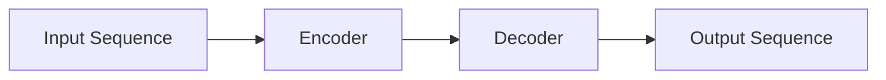
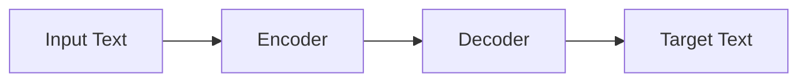

# T5原理与代码实例讲解

## 1.背景介绍

### 1.1 自然语言处理的重要性

自然语言处理(Natural Language Processing, NLP)是人工智能领域中一个非常重要和具有挑战性的研究方向。它旨在使计算机能够理解和生成人类语言,实现人机自然交互。随着大数据时代的到来,海量的自然语言数据激增,对NLP技术的需求也与日俱增。NLP技术已广泛应用于机器翻译、智能问答、信息检索、情感分析等诸多领域。

### 1.2 Transformer模型的重大突破

2017年,Transformer模型的提出为NLP领域带来了革命性的突破。相比之前基于循环神经网络(RNN)的序列模型,Transformer完全基于注意力机制,避免了RNN的梯度消失和爆炸问题,大幅提升了模型的并行计算能力。自问世以来,Transformer模型在机器翻译、文本生成、阅读理解等多个任务上取得了卓越的表现,成为NLP领域的主流模型。

### 1.3 T5模型的重要意义

2020年,谷歌的Raffel等人在Transformer的基础上,提出了Text-to-Text Transfer Transformer(T5)模型。T5将所有NLP任务统一转化为"文本到文本"的形式,实现了跨任务的迁移学习,大幅提高了模型的泛化能力。T5模型在多项公开基准测试中表现优异,成为NLP领域中最先进的模型之一。研究T5的原理和实践应用,对于推动NLP技术发展至关重要。

## 2.核心概念与联系  

### 2.1 Transformer模型

#### 2.1.1 Transformer的基本架构

Transformer是一种全新的基于注意力机制的序列模型,主要由编码器(Encoder)和解码器(Decoder)两部分组成,如下图所示:

编码器的作用是映射输入序列到一个连续的表示序列,解码器则基于这个连续表示序列生成输出序列。两者内部都只使用了注意力机制,没有使用循环或卷积结构。

#### 2.1.2 注意力机制(Attention Mechanism)

注意力机制是Transformer的核心,允许模型关注输入序列中的不同部分,并捕捉它们之间的长程依赖关系。具体来说,对于序列中的每个位置,注意力机制会计算该位置与其他所有位置的注意力分数,并据此生成注意力权重,最终得到该位置的表示。

对于长度为n的输入序列$X = (x_1, x_2, ..., x_n)$,注意力机制的计算过程如下:

$$
\begin{aligned}
Q &= X \cdot W_Q \\
K &= X \cdot W_K \\
V &= X \cdot W_V \\
\text{Attention}(Q, K, V) &= \text{softmax}(\frac{Q \cdot K^T}{\sqrt{d_k}}) \cdot V
\end{aligned}
$$

其中$Q$、$K$、$V$分别表示查询(Query)、键(Key)和值(Value)的线性映射。$d_k$是缩放因子,用于防止点积过大导致softmax函数的梯度较小。

多头注意力机制(Multi-Head Attention)则是将注意力机制运用于同一序列的不同线性映射,并将得到的结果拼接,从而允许模型关注不同的位置和子空间表示。

#### 2.1.3 位置编码(Positional Encoding)

由于Transformer不再使用RNN或CNN获取序列的顺序信息,因此需要一种位置编码的方式来赋予序列元素位置信息。位置编码是一种将元素在序列中的相对或绝对位置的信息编码为密集向量的方法。

对于长度为n的序列,位置编码可表示为:

$$
\begin{aligned}
\text{PE}_{(pos, 2i)} &= \sin(pos / 10000^{2i / d_{model}}) \\
\text{PE}_{(pos, 2i+1)} &= \cos(pos / 10000^{2i / d_{model}})
\end{aligned}
$$

其中$pos$是token的位置,$i$是维度的索引。这些编码向量会直接加到Transformer的输入嵌入上。

#### 2.1.4 残差连接(Residual Connection)和层归一化(Layer Normalization)

为了更好地建模序列,并加速训练过程,Transformer还采用了残差连接和层归一化。

残差连接是将输入直接加到子层的输出上,以缓解深层网络的退化问题。层归一化则是对残差连接的输出进行归一化,使得不同层的输入数据分布保持一致,从而加速收敛。

### 2.2 T5模型

#### 2.2.1 Text-to-Text Transfer Transformer

T5模型的全称是Text-to-Text Transfer Transformer,旨在将所有NLP任务统一到"文本到文本"的形式,实现跨任务的迁移学习。

对于任意NLP任务,T5都将其框架化为:给定一段源文本(source text),输出一段目标文本(target text)。以机器翻译为例,源文本是原文,目标文本就是译文。以问答为例,源文本是问题,目标文本是答案。

通过这种统一的文本到文本的形式,T5可以在大规模语料上进行预训练,并在多个任务上进行微调(fine-tuning),实现有效的迁移学习。

#### 2.2.2 T5模型架构

T5的整体架构与Transformer编码器-解码器模型类似,但做了一些关键修改:

1. 增加了一个新的逻辑串行解码器(Logical Sequence Decoder),用于解码多个文本片段。
2. 使用了相对位置编码(Relative Positional Encoding),以更好地建模长序列。
3. 在预训练阶段,采用了掩码语言模型(Masked Language Model)和全序列去噪(Denoising Objectives)等多种目标函数。

T5的编码器-解码器架构如下图所示:

#### 2.2.3 T5的预训练

与BERT等模型不同,T5是在大规模文本语料上进行了序列到序列的预训练。预训练的目标是最大化以下条件概率:

$$
P(y | x; \theta) = \prod_{t}^{|y|} P(y_t | y_{<t}, x; \theta)
$$

其中$x$是源序列,$y$是目标序列,$\theta$是模型参数。

在预训练过程中,T5使用了多种噪声函数和重构目标,包括:

- 遮罩语言模型(Masked Language Model):随机遮罩掉部分词,预测被遮罩的词。
- 删除词语(Deletion Noising):随机删除词语,预测被删除的词语。
- 词语顺序打乱(Permutation):打乱词语顺序,预测正确的顺序。

通过上述目标函数,T5在大规模语料上学习了丰富的语义和语法知识,为下游任务的微调奠定基础。

## 3.核心算法原理具体操作步骤

在了解了T5的核心概念后,我们来具体分析一下T5模型的算法原理和操作步骤。

### 3.1 输入处理

对于给定的输入文本序列$x = (x_1, x_2, ..., x_n)$,T5首先需要将其转换为模型可识别的token序列。这个过程包括以下步骤:

1. **分词(Tokenization)**: 将输入文本按词或子词切分为token序列。T5使用的是SentencePiece模型进行子词切分。

2. **添加特殊token**: 在token序列的开头添加特殊的`<s>`token,在结尾添加`</s>`token,用于指示序列的开始和结束。

3. **位置编码(Positional Encoding)**: 为每个token添加相对位置编码,赋予其位置信息。

4. **词嵌入(Word Embedding)**: 将每个token映射为一个密集向量表示。

经过上述步骤,输入序列就可以输入到T5的编码器中了。

### 3.2 编码器(Encoder)

编码器的作用是将输入序列$x$映射为一个连续的表示序列$z$,以捕获序列中的上下文信息。编码器由N个相同的层组成,每一层包含两个子层:

1. **多头注意力机制(Multi-Head Attention)**
2. **前馈神经网络(Feed-Forward Network)**

具体操作步骤如下:

1. 将输入序列$x$通过词嵌入层映射为$x_0$。

2. 对于第$i$个编码器层($1 \leq i \leq N$):
    
    a) 多头注意力子层:
    $$
    z_i' = \text{MultiHeadAttention}(z_{i-1}) + z_{i-1}
    $$
    
    b) 前馈子层:
    $$
    z_i = \text{FeedForward}(z_i') + z_i'
    $$
    
    其中残差连接和层归一化用于加速收敛。

3. 编码器的最终输出为$z = z_N$,即最后一层的输出。

通过上述层层计算,编码器可以为输入序列$x$生成一个连续的上下文表示$z$,为解码器提供信息。

### 3.3 解码器(Decoder)

解码器的作用是根据编码器的输出$z$生成目标序列$y$。解码器也由N个相同的层组成,每一层包含三个子层:

1. **遮掩多头注意力机制(Masked Multi-Head Attention)**
2. **编码器-解码器注意力(Encoder-Decoder Attention)**  
3. **前馈神经网络(Feed-Forward Network)**

具体操作步骤如下:

1. 将目标序列$y$通过词嵌入层映射为$y_0$。

2. 对于第$j$个解码器层($1 \leq j \leq N$):

    a) 遮掩多头注意力子层:
    $$
    s_j' = \text{MaskedMultiHeadAttention}(s_{j-1}) + s_{j-1}
    $$
    这一步允许每个位置只关注其之前的位置,以保证自回归属性。
    
    b) 编码器-解码器注意力子层:
    $$
    s_j'' = \text{EncoderDecoderAttention}(s_j', z) + s_j'
    $$
    此处将解码器的输出与编码器的输出$z$进行注意力计算,融合编码器的上下文信息。
    
    c) 前馈子层:
    $$
    s_j = \text{FeedForward}(s_j'') + s_j''
    $$

3. 解码器的最终输出为$s = s_N$。

4. 对于每个位置$t$,计算生成下一个token的概率分布:

$$
P(y_t | y_{<t}, x; \theta) = \text{softmax}(W_o s_t + b_o)
$$

其中$W_o$和$b_o$是可训练参数。

5. 通过贪婪搜索或beam search等方法,从概率分布中选择最可能的token序列作为输出。

通过上述步骤,解码器可以根据编码器的输出,自回归地生成目标序列。

## 4.数学模型和公式详细讲解举例说明

在T5模型中,注意力机制是核心组件之一。我们将详细介绍注意力机制的数学原理和计算过程。

### 4.1 Scaled Dot-Product Attention

Scaled Dot-Product Attention是Transformer中使用的基本注意力机制,计算公式如下:

$$
\text{Attention}(Q, K, V) = \text{softmax}(\frac{Q K^T}{\sqrt{d_k}}) V
$$

其中:

- $Q$是查询(Query)的线性映射,形状为$(n_q, d_q)$
- $K$是键(Key)的线性映射,形状为$(n_k, d_k)$
- $V$是值(Value)的线性映射,形状为$(n_v, d_v)$
- $n_q$、$n_k$、$n_v$分别是查询、键、值的序列长度
- $d_q$、$d_k$、$d_v$分别是查询、键、值的特征维度

计算步骤如下:

1. 计算查询$Q$与所有键$K$的点积,得到注意力分数矩阵:

$$
\text{scores} = Q K^T
$$

其中$\text{scores}$的形状为$(n_q, n_k)$。

2. 对注意力分数矩阵进