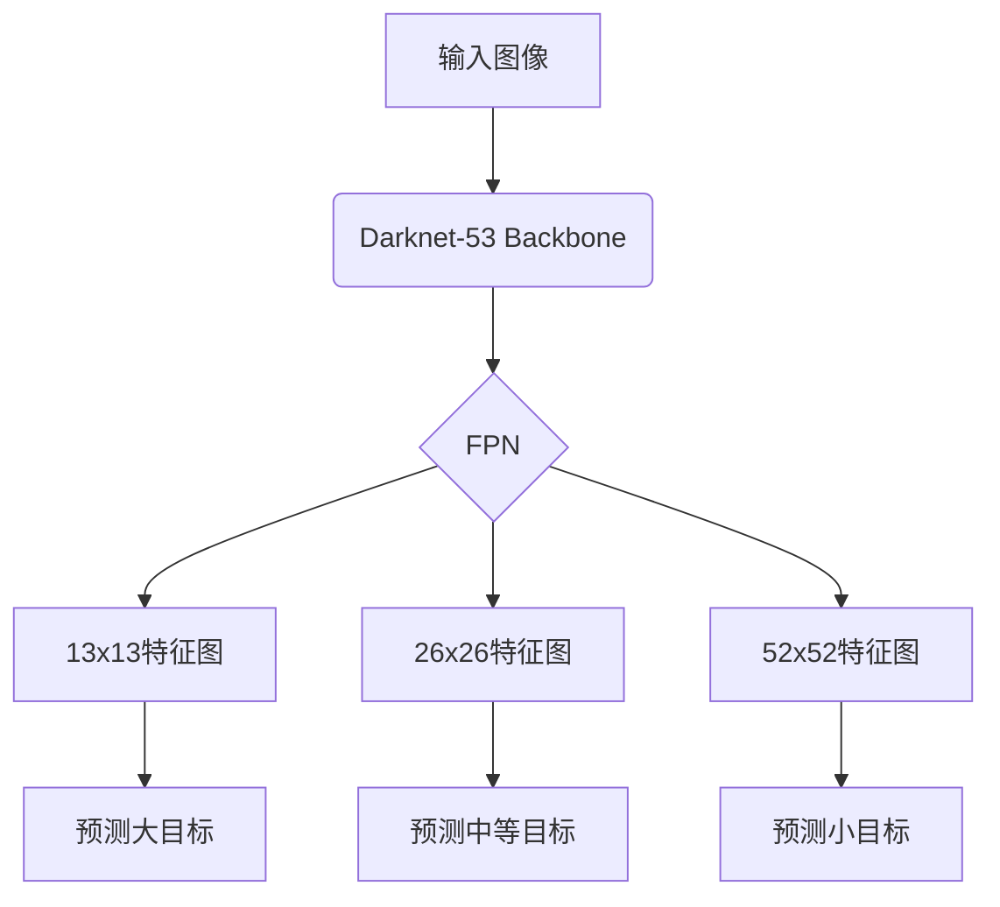

# YOLOv3原理与代码实例讲解

## 1.背景介绍

### 1.1 目标检测任务概述

目标检测(Object Detection)是计算机视觉领域的一个核心任务,旨在从给定的图像或视频中找出感兴趣的目标对象,并为每个检测到的目标绘制一个边界框(Bounding Box),同时给出该目标所属的类别。目标检测广泛应用于安防监控、自动驾驶、机器人视觉等诸多领域。

### 1.2 目标检测发展历程

早期的目标检测方法主要基于传统的计算机视觉技术,如滑动窗口(Sliding Window)、手工设计的特征提取等。这些方法存在计算复杂度高、检测精度低等缺陷。

2012年,Hinton团队提出的基于深度学习的AlexNet模型在ImageNet大赛上取得了巨大成功,开启了深度学习在计算机视觉领域的新纪元。随后,基于深度卷积神经网络(CNN)的目标检测算法如R-CNN、Fast R-CNN、Faster R-CNN等相继问世,极大地提高了目标检测的精度和速度。

### 1.3 YOLO系列算法的提出

尽管基于区域提议(Region Proposal)的目标检测算法取得了不错的性能,但它们存在如下缺陷:

1. 检测速度较慢,无法满足实时性要求
2. 训练过程复杂,需要多阶段的pipeline
3. 检测过程中可能存在遗漏小目标的情况

为了解决上述问题,2015年Joseph Redmon等人在论文《You Only Look Once: Unified, Real-Time Object Detection》中提出了YOLO(You Only Look Once)算法,将目标检测任务建模为一个端到端的回归问题,直接从整张图像中一次性预测出所有目标的边界框和类别,从而实现了极高的检测速度。

2016年和2018年,YOLOv2和YOLOv3相继问世,在保持高速检测的同时,进一步提升了检测精度。其中,YOLOv3是当前YOLO系列算法中表现最优秀的版本,本文将重点介绍YOLOv3的原理和实现细节。

## 2.核心概念与联系  

### 2.1 端到端目标检测

传统的基于区域提议的目标检测算法需要先生成候选区域,然后对每个候选区域进行分类,最后执行非极大值抑制(NMS)去除冗余的检测框。这种"先提议再识别"的过程存在以下缺陷:

1. 计算复杂度高,无法满足实时性要求
2. 由于候选区域生成和分类是分开的两个步骤,可能会导致遗漏一些小目标

YOLO算法则将目标检测任务建模为一个端到端(End-to-End)的回归问题。具体来说,YOLO将输入图像划分为S×S个网格,每个网格直接预测B个边界框以及每个边界框所属的类别。这种方式避免了生成候选区域的过程,从而大大提高了检测速度。

### 2.2 锚框机制

为了更好地匹配不同形状和大小的目标,YOLOv3采用了锚框(Anchor Box)机制。锚框是一组预先设定的边界框,网络会基于这些锚框来预测相应的目标边界框。

YOLOv3使用9个锚框,通过k-means聚类算法在COCO数据集上学习得到。这9个锚框能够很好地匹配各种不同形状和大小的目标。每个网格会基于这9个锚框预测3×(4+1+80)=255个值,其中4个值用于编码边界框的位置和尺寸,1个值编码目标置信度,80个值编码目标类别概率。

### 2.3 特征金字塔

为了检测不同尺度的目标,YOLOv3采用了特征金字塔网络(Feature Pyramid Network,FPN)结构。具体来说,YOLOv3使用Darknet-53作为backbone网络提取特征,然后通过上采样和下采样操作构建出不同尺度的特征金字塔。

在YOLOv3中,一共使用了3个不同尺度的特征图(13×13、26×26、52×52)来预测目标。其中,13×13的特征图用于检测大型目标,26×26和52×52的特征图则用于检测中等和小型目标。通过这种特征金字塔结构,YOLOv3能够有效地检测不同尺度的目标。

## 3.核心算法原理具体操作步骤

### 3.1 网络结构

YOLOv3的网络结构如下图所示:

具体来说,YOLOv3首先使用Darknet-53作为backbone网络提取特征,然后通过FPN构建出三个不同尺度的特征金字塔(13×13、26×26、52×52)。每个特征图都会预测一组边界框、目标置信度和类别概率,用于检测不同尺度的目标。

### 3.2 目标边界框编码

对于每个网格,YOLOv3会基于9个锚框预测3×(4+1+80)=255个值。其中,4个值用于编码边界框的位置和尺寸,1个值编码目标置信度,80个值编码目标类别概率。

边界框的编码方式如下:

$$
b_x = \sigma(t_x) + c_x \\
b_y = \sigma(t_y) + c_y \\
b_w = p_w e^{t_w} \\
b_h = p_h e^{t_h}
$$

其中,$(t_x, t_y, t_w, t_h)$是网络预测的值,$\sigma$是sigmoid函数,$(c_x, c_y)$是当前网格的左上角坐标,$(p_w, p_h)$是锚框的宽高。通过这种编码方式,网络可以学习到目标边界框相对于锚框和当前网格的偏移量。

目标置信度是指当前边界框包含目标的置信度,计算方式如下:

$$
\text{Conf} = \text{Pr}(\text{Object}) * \text{IOU}_{pred}^{truth}
$$

其中,$\text{Pr}(\text{Object})$是网络预测的目标存在概率,$\text{IOU}_{pred}^{truth}$是预测边界框与真实边界框的IoU。这种编码方式能够同时考虑目标存在概率和边界框精度。

### 3.3 损失函数

YOLOv3的损失函数包括三部分:边界框损失、置信度损失和分类损失。

边界框损失使用CIOU Loss,它是基于IoU的改进版本,能够更好地处理长宽比例差异和不同尺度的问题。CIOU Loss的计算公式如下:

$$
\text{CIOU} = 1 - \text{IOU} + \frac{\rho^2(b, b^{gt})}{c^2} + \alpha v
$$

其中,$\rho$表示两个边界框的欧几里得距离,$c$是对角线距离的最小值,$\alpha$是一个正权重,$v$是一个惩罚项,用于惩罚不同长宽比的边界框。

置信度损失使用Binary Cross Entropy Loss,计算公式如下:

$$
\text{Conf Loss} = \sum_{i=0}^{S^2}\sum_{j=0}^B\mathbb{1}_{ij}^{obj}\left[c_i\log\left(\hat{c}_i\right) + \left(1-c_i\right)\log\left(1-\hat{c}_i\right)\right] + \lambda_{noobj}\sum_{i=0}^{S^2}\sum_{j=0}^B\mathbb{1}_{ij}^{noobj}\left[c_i\log\left(\hat{c}_i\right) + \left(1-c_i\right)\log\left(1-\hat{c}_i\right)\right]
$$

其中,$\mathbb{1}_{ij}^{obj}$表示第$i$个网格的第$j$个边界框是否包含目标,$\mathbb{1}_{ij}^{noobj}$表示第$i$个网格的第$j$个边界框是否不包含目标,$c_i$和$\hat{c}_i$分别是真实置信度和预测置信度,$\lambda_{noobj}$是一个正权重。

分类损失使用Cross Entropy Loss,计算公式如下:

$$
\text{Class Loss} = \sum_{i=0}^{S^2}\sum_{j=0}^B\mathbb{1}_{ij}^{obj}\sum_{c\in\text{classes}}\left[p_i\left(c\right)\log\left(\hat{p}_i\left(c\right)\right) + \left(1-p_i\left(c\right)\right)\log\left(1-\hat{p}_i\left(c\right)\right)\right]
$$

其中,$p_i(c)$和$\hat{p}_i(c)$分别是第$c$类的真实概率和预测概率。

最终的总损失是上述三个损失的加权和:

$$
\text{Total Loss} = \lambda_{\text{coord}}\text{CIOU} + \text{Conf Loss} + \lambda_{\text{class}}\text{Class Loss}
$$

其中,$\lambda_{\text{coord}}$和$\lambda_{\text{class}}$是正权重,用于平衡不同损失项的贡献。

### 3.4 训练过程

YOLOv3的训练过程可以概括为以下几个步骤:

1. 准备训练数据,包括图像和对应的标注信息(边界框和类别)
2. 初始化网络权重,一般使用预训练模型进行迁移学习
3. 对每个batch的数据进行预处理,包括归一化、数据增强等
4. 前向传播,计算网络预测值
5. 计算损失函数,包括边界框损失、置信度损失和分类损失
6. 反向传播,更新网络权重
7. 重复3-6,直到网络收敛

在训练过程中,还需要注意以下几点:

- 使用多尺度训练,即每个batch随机调整输入图像的尺寸,以增强模型的泛化能力
- 使用数据增强技术,如翻转、裁剪、颜色变换等,进一步增强模型的泛化能力
- 根据损失函数的收敛情况,动态调整学习率
- 使用正则化技术,如权重衰减、Dropout等,防止过拟合

## 4.数学模型和公式详细讲解举例说明

在3.2和3.3节中,我们已经介绍了YOLOv3中边界框编码和损失函数的数学模型。这里我们将通过具体的例子,进一步解释这些公式的含义和使用方法。

### 4.1 边界框编码示例

假设我们有一个13×13的特征图,其中一个网格的左上角坐标为(0.2, 0.3),锚框的宽高为(0.5, 0.8)。网络预测的$(t_x, t_y, t_w, t_h)$值分别为(0.1, -0.2, 0.3, -0.1)。

根据边界框编码公式,我们可以计算出预测边界框的位置和尺寸:

$$
\begin{aligned}
b_x &= \sigma(0.1) + 0.2 = 0.575 \\
b_y &= \sigma(-0.2) + 0.3 = 0.295 \\
b_w &= 0.5 \times e^{0.3} = 0.671 \\
b_h &= 0.8 \times e^{-0.1} = 0.746
\end{aligned}
$$

因此,预测边界框的位置是(0.575, 0.295),宽高是(0.671, 0.746)。通过这种编码方式,网络可以学习到边界框相对于锚框和网格的偏移量,从而实现精确的目标定位。

### 4.2 CIOU Loss示例

假设我们有一个预测边界框$b=(x_1, y_1, x_2, y_2)$和一个真实边界框$b^{gt}=(x_1^{gt}, y_1^{gt}, x_2^{gt}, y_2^{gt})$。

首先,我们计算两个边界框的IoU:

$$
\text{IOU} = \frac{\text{Area of Intersection}}{\text{Area of Union}}
$$

其次,我们计算两个边界框的欧几里得距离$\rho$:

$$
\rho(b, b^{gt}) = \sqrt{(x_1 - x_1^{gt})^2 + (y_1 - y_1^{gt})^2 + (x_2 - x_2^{gt