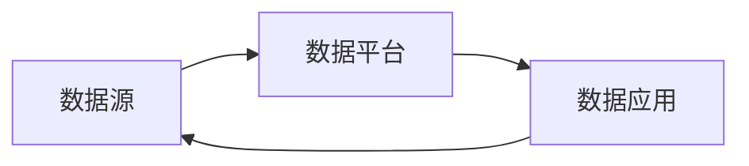
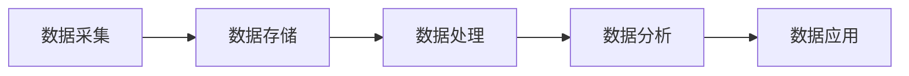
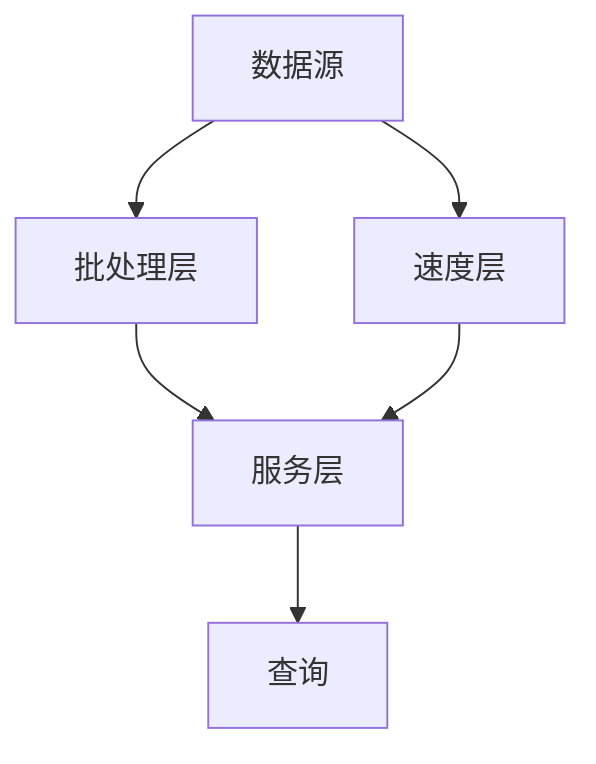
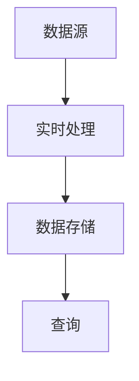
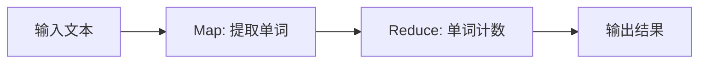

# 大数据平台建设整体架构设计方案

作者：禅与计算机程序设计艺术

## 1. 背景介绍

随着数据量的爆炸式增长和数据类型的多样化,传统的数据处理和存储方式已经无法满足企业对数据分析和决策的需求。大数据技术的出现为企业提供了一种全新的数据管理和分析模式,能够帮助企业从海量数据中挖掘出有价值的信息,提高企业的决策水平和竞争力。

然而,大数据平台的建设是一个复杂的系统工程,涉及到数据采集、存储、处理、分析、可视化等多个环节,需要综合考虑企业的业务需求、数据特点、技术架构等多方面因素。本文将从整体架构的角度,探讨大数据平台建设的关键要素和设计原则,为企业提供一套可行的大数据平台建设方案。

### 1.1 大数据的特点和挑战

大数据具有 4V 特征:Volume(大量)、Velocity(高速)、Variety(多样)、Value(低价值密度)。这些特点给传统的数据处理架构带来了巨大挑战:

- 数据量大:需要分布式存储和计算架构来处理海量数据
- 数据速度快:需要实时流式处理引擎来处理高速数据流
- 数据类型多样:需要灵活的数据存储格式和处理框架来应对结构化、半结构化和非结构化数据
- 数据价值密度低:需要先进的数据挖掘和机器学习算法从海量数据中提取有价值的信息

### 1.2 大数据平台的目标

大数据平台建设的目标是提供一套全面、灵活、高效的数据管理和分析解决方案,支撑企业数据驱动的业务创新和决策优化。具体来说,大数据平台需要实现以下目标:

- 打通数据孤岛,实现数据的集中管理和共享
- 提供灵活的数据接入和存储能力,满足多源异构数据的接入需求
- 构建高效的数据处理和分析引擎,支持批处理、流处理、交互式分析等多种数据分析范式
- 建立数据安全和权限管理体系,保障数据的安全性、私密性和合规性
- 为业务应用提供标准化的数据服务,促进数据的业务应用和价值变现

## 2. 核心概念与联系

在进行大数据平台架构设计之前,我们需要了解一些核心概念,以及它们之间的关系。

### 2.1 大数据生态系统

大数据生态系统是指围绕大数据技术和应用形成的一个多方参与的复杂系统,包括数据源、数据平台、数据应用等多个要素。一个典型的大数据生态系统如下图所示:



- 数据源:包括内部业务系统、外部数据源、物联网设备等产生数据的来源
- 数据平台:负责数据的采集、存储、处理、分析和服务,是连接数据源和数据应用的枢纽
- 数据应用:将数据转化为洞察力和决策力,驱动业务创新和优化

数据在这三个要素之间流转,形成一个闭环,不断产生价值。大数据平台作为其中的核心,在数据价值流通中起着至关重要的作用。

### 2.2 大数据处理流程

大数据平台内部有一个标准的数据处理流程,贯穿数据生命周期的各个阶段。一个典型的大数据处理流程如下图所示:



- 数据采集:从各种数据源采集原始数据,并进行必要的预处理,如过滤、转换、清洗等
- 数据存储:将采集到的原始数据持久化存储,以供后续处理和分析使用
- 数据处理:对原始数据进行结构化处理,提取特征,为分析做好准备
- 数据分析:利用统计学、机器学习等方法,从数据中发现模式、趋势和关系
- 数据应用:将分析结果应用到业务场景中,如报表展示、智能预测、个性化推荐等

这个流程并非严格的线性过程,各个阶段之间存在反馈和迭代。比如,分析结果可能反过来指导数据采集和处理。大数据平台需要提供一整套工具和框架,支撑这个流程高效运转。

### 2.3 Lambda架构与Kappa架构

大数据平台的架构演进经历了几个阶段。目前主流的是 Lambda 架构和 Kappa 架构。

Lambda 架构由 Nathan Marz 在 2011 年提出,其核心思想是将大数据系统分为批处理层(Batch Layer)、服务层(Serving Layer)和速度层(Speed Layer)三个部分。



批处理层负责处理全量数据,速度层负责实时处理增量数据,服务层对外提供统一的数据查询服务。Lambda 架构的优点是架构清晰,技术成熟,但也存在代码重复、维护成本高等问题。

Kappa 架构由 Jay Kreps 在 2014 年提出,其核心思想是只保留实时处理层,通过回放数据来模拟批处理。



Kappa 架构简化了 Lambda 的架构,统一了实时和离线处理,但对实时处理引擎的要求较高。

## 3. 核心算法原理具体操作步骤

大数据平台需要依赖一系列核心算法来实现高效的数据处理和分析。下面介绍几种常用的算法原理和操作步骤。

### 3.1 MapReduce

MapReduce 是一种分布式计算编程模型,由 Google 公司在 2004 年提出,用于处理大规模数据集。其核心思想是将大规模计算任务分解为若干个 Map 和 Reduce 子任务,并行执行。

MapReduce 的处理过程分为以下几个步骤:

1. 输入数据被分割为若干个 Split,每个 Split 由一个 Map 任务处理
2. Map 任务将输入数据转换为一系列键值对 <Key, Value>,并输出到本地磁盘
3. Reduce 任务从 Map 输出结果中,按照 Key 聚合数据,进行归约处理
4. 所有 Reduce 任务的输出结果合并,形成最终结果

以词频统计为例,MapReduce 的处理过程如下:



- Map 阶段:以每行文本为单位,提取其中的单词,形成 <Word, 1> 的键值对
- Reduce 阶段:将相同单词的计数值累加,得到每个单词的出现次数

MapReduce 模型简单易用,适合海量数据的批处理分析,但实时性较差,不适合流式计算场景。

### 3.2 Spark

Spark 是一个开源的分布式计算框架,由加州大学伯克利分校 AMP 实验室开发,适合数据规模较大、需要迭代的计算场景。

Spark 的核心概念是弹性分布式数据集 (RDD),RDD 具有以下特性:

- 分布式:RDD 中的数据分布在集群的多个节点上
- 弹性:RDD 可以容错,允许节点失效
- 数据集:RDD 表示一个不可变、可分区、里面元素可并行计算的集合

Spark 提供了一组高级 API,支持多种数据处理范式:

- Spark Core:提供基本的数据抽象和操作原语
- Spark SQL:提供结构化数据处理和 SQL 查询能力
- Spark Streaming:提供实时流式计算能力
- MLlib:提供常用的机器学习算法库
- GraphX:提供图计算引擎

下面以词频统计为例,演示 Spark 的基本操作:

```python
from pyspark import SparkContext

sc = SparkContext()
text = sc.textFile("input.txt")

words = text.flatMap(lambda line: line.split())
pairs = words.map(lambda word: (word, 1))
counts = pairs.reduceByKey(lambda a, b: a + b)

counts.saveAsTextFile("output")
```

这段代码的执行过程如下:

1. 从文本文件读取数据,创建 RDD
2. 对每行文本进行分词,生成单词序列
3. 将每个单词转换为 (word, 1) 键值对
4. 按照单词聚合,累加出现次数
5. 将结果写入文本文件

Spark 通过内存计算和 DAG 引擎,实现了比 MapReduce 更高的计算效率,同时保持了编程模型的简洁性。

### 3.3 Flink

Flink 是一个开源的分布式流处理和批处理框架,由柏林工业大学开发,具有低延迟、高吞吐、结果准确的特点。

Flink 的核心是分布式数据流,即一个可以并行处理的数据流集合。Flink 提供了两种 API 来操作数据流:

- DataStream API:处理无界的数据流,支持事件时间语义
- DataSet API:处理有界的数据集,支持批处理

下面以词频统计为例,演示 Flink DataStream API 的基本操作:

```java
StreamExecutionEnvironment env = StreamExecutionEnvironment.getExecutionEnvironment();

DataStream<String> text = env.readTextFile("input.txt");

DataStream<Tuple2<String, Integer>> counts = text
    .flatMap(new Tokenizer())
    .keyBy(0)
    .sum(1);

counts.writeAsText("output");

env.execute();

public static final class Tokenizer implements FlatMapFunction<String, Tuple2<String, Integer>> {
    @Override
    public void flatMap(String value, Collector<Tuple2<String, Integer>> out) {
        String[] tokens = value.toLowerCase().split("\\W+");
        for (String token : tokens) {
            if (token.length() > 0) {
                out.collect(new Tuple2<>(token, 1));
            }
        }
    }
}
```

这段代码的执行过程如下:

1. 创建执行环境,读取文本数据
2. 对每行文本进行分词,将每个单词转换为 (word, 1) 二元组
3. 按照单词分组,累加出现次数
4. 将结果写入文本文件
5. 触发执行

Flink 在流处理和批处理之间提供了统一的 API 和运行时,简化了状态管理和容错机制,是一个功能强大的数据处理引擎。

## 4. 数学模型和公式详细讲解举例说明

大数据分析离不开数学模型和算法的支持。下面以几个常见的数学模型为例,讲解其原理和应用。

### 4.1 协同过滤

协同过滤是一种常用的推荐算法,通过分析用户或物品之间的相似性,给用户做个性化推荐。协同过滤分为以下三类:

- 基于用户的协同过滤(User-based CF):根据用户之间的相似性,推荐相似用户喜欢的物品
- 基于物品的协同过滤(Item-based CF):根据物品之间的相似性,推荐用户喜欢的相似物品
- 基于模型的协同过滤(Model-based CF):通过机器学习算法建立推荐模型

以基于用户的协同过滤为例,其核心是计算用户之间的相似度。常用的相似度度量方法有:

- 欧几里得距离:
  
$$
d(u,v) = \sqrt{\sum_{i=1}^{n} (x_{u,i} - x_{v,i})^2}
$$

其中 $x_{u,i}$ 表示用户 $u$ 对物品 $i$ 的评分。

- 皮尔逊相关系数:

$$
sim(u,v) = \frac{\sum_{i=1}^{n} (x_{u,i} - \bar{x}_u) (x_{v,i} - \bar{x}_v)}{\sqrt{\sum_{i=1}^{n} (x_{u,i} - \bar{x}_u)^2} \sqrt{\sum_{i=1}^{n} (