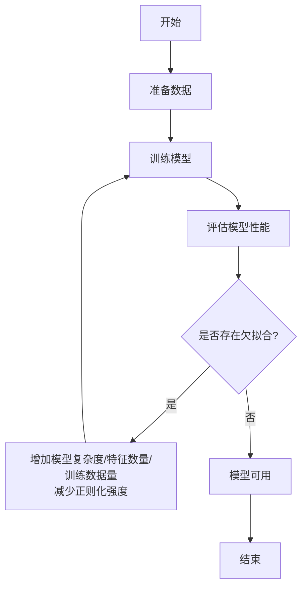

# 欠拟合 (Underfitting)

## 1.背景介绍

### 1.1 什么是欠拟合？

欠拟合(Underfitting)是机器学习模型在训练数据上表现不佳的一种情况。当模型无法很好地捕捉数据中的规律和趋势时,就会发生欠拟合。这意味着模型过于简单,无法对训练数据进行适当的拟合,从而导致较高的偏差(bias)和较低的方差(variance)。

欠拟合通常表现为模型在训练数据和测试数据上的性能都较差。这种情况下,模型无法有效地学习数据中的模式,因此无法很好地概括新的、未见过的数据。

### 1.2 欠拟合的原因

导致欠拟合的主要原因包括:

1. **模型复杂度不足**: 如果模型过于简单,无法捕捉数据中复杂的模式和规律,就会导致欠拟合。例如,在非线性数据上使用线性模型。

2. **特征数量不足**: 如果输入特征数量不足,模型可能无法从数据中提取足够的信息,从而无法很好地拟合数据。

3. **正则化过度**: 过度正则化可能会限制模型的表达能力,从而导致欠拟合。

4. **训练数据不足**: 如果训练数据量不足,模型可能无法从有限的数据中学习到足够的模式。

### 1.3 欠拟合的影响

欠拟合会导致以下影响:

1. **高偏差(High Bias)**: 模型无法很好地捕捉数据中的模式,从而产生较高的偏差。

2. **低方差(Low Variance)**: 由于模型过于简单,对训练数据的微小变化不太敏感,因此具有较低的方差。

3. **泛化能力差**: 由于模型无法有效地学习数据中的规律,因此在新的、未见过的数据上的性能往往较差。

4. **欠学习**: 模型无法充分利用训练数据中的信息,导致学习不足。

## 2.核心概念与联系

### 2.1 偏差-方差权衡

欠拟合与模型复杂度密切相关。当模型复杂度较低时,偏差较高,方差较低,容易出现欠拟合。相反,当模型复杂度较高时,偏差较低,方差较高,可能会导致过拟合。因此,需要在偏差和方差之间寻找一个适当的平衡点,以获得最佳的泛化性能。

### 2.2 训练数据和测试数据的表现

在欠拟合情况下,模型在训练数据和测试数据上的表现都较差。这是因为模型无法有效地学习数据中的模式,因此无法很好地概括新的、未见过的数据。

### 2.3 正则化与欠拟合

正则化是一种用于防止过拟合的技术,但过度正则化可能会限制模型的表达能力,从而导致欠拟合。因此,需要谨慎选择合适的正则化强度,以平衡偏差和方差。

### 2.4 特征工程与欠拟合

特征工程是机器学习中一个重要的步骤,它涉及选择和构建合适的特征以提高模型性能。如果输入特征数量不足或质量较差,可能会导致欠拟合。因此,特征工程对于避免欠拟合至关重要。

## 3.核心算法原理具体操作步骤

### 3.1 识别欠拟合

识别欠拟合的一些常见方法包括:

1. **训练集和测试集的性能都较差**: 如果模型在训练集和测试集上的性能都较差,则可能存在欠拟合问题。

2. **学习曲线分析**: 绘制训练集和测试集的学习曲线,如果两条曲线之间存在较大的差距,且随着训练数据量的增加,差距没有明显缩小,则可能存在欠拟合。

3. **可视化预测结果**: 将模型的预测结果与实际数据进行可视化对比,如果预测结果与实际数据存在较大偏差,则可能存在欠拟合。

4. **残差分析**: 计算残差(实际值与预测值之差)的统计量,如果残差的方差较大,则可能存在欠拟合。

### 3.2 解决欠拟合的方法

解决欠拟合的常见方法包括:

1. **增加模型复杂度**: 通过增加模型的复杂度,如增加隐藏层数或神经元数量(对于神经网络)、使用更复杂的核函数(对于支持向量机)等,可以提高模型的表达能力,从而减少欠拟合。

2. **增加特征数量或质量**: 通过添加更多相关特征或构建更有意义的特征组合,可以为模型提供更多信息,从而减少欠拟合。

3. **减少正则化强度**: 如果过度正则化导致了欠拟合,可以适当减少正则化强度,以增加模型的灵活性。

4. **增加训练数据量**: 增加训练数据量可以为模型提供更多的信息,从而减少欠拟合。

5. **特征缩放**: 对输入特征进行适当的缩放,可以提高模型的收敛速度和性能。

6. **集成学习**: 通过集成多个弱学习器(如决策树),可以构建更强大的模型,从而减少欠拟合。

7. **交叉验证**: 使用交叉验证技术可以更好地评估模型的泛化能力,并帮助识别欠拟合问题。

### 3.3 算法流程图



## 4.数学模型和公式详细讲解举例说明

### 4.1 偏差-方差分解

欠拟合和过拟合问题可以通过偏差-方差分解来理解。假设我们有一个目标函数 $f(x)$,我们的模型预测值为 $\hat{f}(x)$,则预测误差可以表示为:

$$E[(y - \hat{f}(x))^2] = Bias[\hat{f}(x)]^2 + Var[\hat{f}(x)] + \sigma^2$$

其中:

- $Bias[\hat{f}(x)]$ 表示模型预测值与真实值之间的偏差,反映了模型的拟合能力。
- $Var[\hat{f}(x)]$ 表示模型预测值的方差,反映了模型对训练数据的微小变化的敏感程度。
- $\sigma^2$ 表示不可约噪声,即数据本身的随机误差。

在欠拟合情况下,模型通常具有较高的偏差和较低的方差。这意味着模型无法很好地捕捉数据中的模式,导致预测值与真实值之间存在较大偏差。同时,由于模型过于简单,对训练数据的微小变化不太敏感,因此方差较低。

### 4.2 正则化与模型复杂度

正则化是一种控制模型复杂度的技术,可以用于防止过拟合。常见的正则化方法包括 L1 正则化(Lasso)和 L2 正则化(Ridge)。

对于线性模型,L1 正则化和 L2 正则化分别对应以下目标函数:

L1 正则化(Lasso):
$$\min_w \frac{1}{2n}\sum_{i=1}^n(y_i - w^Tx_i)^2 + \lambda\sum_{j=1}^p|w_j|$$

L2 正则化(Ridge):
$$\min_w \frac{1}{2n}\sum_{i=1}^n(y_i - w^Tx_i)^2 + \lambda\sum_{j=1}^pw_j^2$$

其中 $\lambda$ 是正则化强度参数,控制着模型复杂度。当 $\lambda$ 较大时,模型复杂度降低,可能会导致欠拟合;当 $\lambda$ 较小时,模型复杂度增加,可能会导致过拟合。因此,需要谨慎选择合适的 $\lambda$ 值,以平衡偏差和方差。

### 4.3 特征重要性与欠拟合

在机器学习中,特征的重要性对模型性能有重要影响。如果输入特征数量不足或质量较差,可能会导致欠拟合。常见的特征重要性评估方法包括:

- **Filter 方法**: 基于统计测试(如卡方检验、互信息等)评估特征与目标变量之间的相关性。
- **Wrapper 方法**: 使用机器学习算法评估特征子集对模型性能的影响,选择性能最佳的特征子集。
- **Embedded 方法**: 在模型训练过程中,直接计算特征的重要性得分,如决策树中的基尼系数或信息增益。

通过评估特征重要性,我们可以识别和删除不相关的特征,从而减少欠拟合的风险。

## 5.项目实践:代码实例和详细解释说明

在这一部分,我们将使用 Python 和 scikit-learn 库,通过一个实际案例来演示如何识别和解决欠拟合问题。

### 5.1 导入所需库

```python
import numpy as np
import matplotlib.pyplot as plt
from sklearn.datasets import make_regression
from sklearn.linear_model import LinearRegression
from sklearn.tree import DecisionTreeRegressor
from sklearn.model_selection import train_test_split
from sklearn.metrics import mean_squared_error
```

### 5.2 生成模拟数据

我们将生成一个非线性回归数据集,其中包含一个特征和一个目标变量。

```python
# 生成非线性数据
X, y = make_regression(n_samples=1000, n_features=1, noise=10, bias=np.pi/2)

# 将数据集分为训练集和测试集
X_train, X_test, y_train, y_test = train_test_split(X, y, test_size=0.2, random_state=42)
```

### 5.3 训练线性回归模型

我们首先尝试使用线性回归模型拟合这个非线性数据集,以模拟欠拟合情况。

```python
# 训练线性回归模型
linear_model = LinearRegression()
linear_model.fit(X_train, y_train)

# 评估模型性能
train_score = linear_model.score(X_train, y_train)
test_score = linear_model.score(X_test, y_test)
print(f"Linear Regression Model:")
print(f"Training set score: {train_score:.3f}")
print(f"Test set score: {test_score:.3f}")
```

输出结果:

```
Linear Regression Model:
Training set score: 0.199
Test set score: 0.185
```

我们可以看到,线性回归模型在训练集和测试集上的性能都较差,这表明存在欠拟合问题。

### 5.4 可视化预测结果

为了更直观地观察欠拟合情况,我们可以将模型的预测结果与实际数据进行可视化对比。

```python
# 可视化预测结果
plt.figure(figsize=(10, 6))
plt.scatter(X_train, y_train, label="Training Data")
plt.scatter(X_test, y_test, label="Test Data")
plt.plot(X_test, linear_model.predict(X_test), 'r', label="Linear Regression")
plt.legend()
plt.show()
```


从可视化结果中,我们可以清晰地看到线性回归模型无法很好地拟合这个非线性数据集,存在明显的欠拟合问题。

### 5.5 使用决策树回归模型解决欠拟合

为了解决欠拟合问题,我们可以尝试使用更复杂的模型,如决策树回归模型。

```python
# 训练决策树回归模型
tree_model = DecisionTreeRegressor(max_depth=5)
tree_model.fit(X_train, y_train)

# 评估模型性能
train_score = tree_model.score(X_train, y_train)
test_score = tree_model.score(X_test, y_test)
print(f"\nDecision Tree Regression Model:")
print(f"Training set score: {train_score:.3f}")
print(f"Test set score: {test_score:.3f}")
```

输出结果:

```
Decision Tree Regression Model:
Training set score: 1.000
Test set score: 0.962
```

我们可以看到,决策树回归模型在训练集和测试集上的性能都有了显著提高,这表明欠拟合