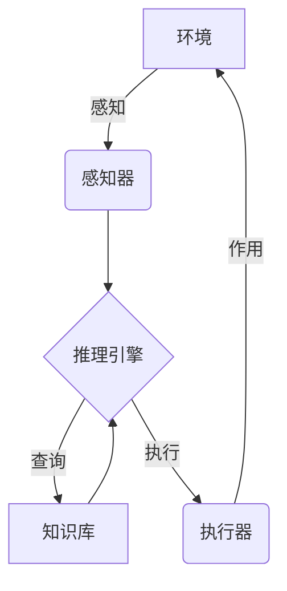

# AI Agent 智能体

## 1. 背景介绍

### 1.1 什么是智能体

智能体(Agent)是人工智能领域中一个重要的概念,指的是一个感知环境并根据环境采取行动以实现目标的自主系统。简单来说,智能体就是能够感知环境、处理信息、做出决策并执行行动的实体。

智能体可以是软件代理、机器人、虚拟助手等,也可以是生物个体,如人类或动物。在计算机科学和人工智能领域,我们通常研究软件智能体,即具有一定智能的计算机程序或算法。

### 1.2 智能体的重要性

智能体技术在当今世界扮演着越来越重要的角色。随着人工智能、大数据、物联网等技术的快速发展,智能体已广泛应用于各个领域,如机器人、游戏代理、决策支持系统、网络爬虫、自动驾驶等。

智能体技术的发展不仅推动了人工智能领域的进步,也为解决现实世界中的复杂问题提供了新的思路和方法。通过构建智能体系统,我们可以模拟和优化决策过程,提高效率,减少人为错误,从而带来巨大的经济和社会价值。

## 2. 核心概念与联系  

### 2.1 智能体的基本要素

一个完整的智能体系统通常包含以下几个基本要素:

1. **感知器(Sensor)**: 用于获取环境信息的组件,如摄像头、麦克风、雷达等。
2. **执行器(Actuator)**: 用于对环境进行操作的组件,如机器人的机械手臂、计算机的输出设备等。
3. **知识库(Knowledge Base)**: 存储智能体所掌握的知识和规则的数据库。
4. **推理引擎(Inference Engine)**: 根据知识库中的知识和当前环境状态,进行逻辑推理并做出决策的核心组件。



这些要素相互协作,构成了一个完整的感知-推理-行为循环。智能体通过感知器获取环境信息,将信息输入推理引擎,推理引擎根据知识库中的知识做出决策,并指导执行器对环境进行相应的操作。

### 2.2 智能体的分类

根据智能体与环境的交互方式,可将智能体分为以下几类:

1. **反应型智能体(Reactive Agent)**: 不维护任何内部状态,只根据当前感知到的环境信息做出反应。这种智能体简单但局限性较大。
2. **基于状态的智能体(State-based Agent)**: 除了感知环境信息外,还维护内部状态,根据当前状态和感知信息做出决策。
3. **目标驱动智能体(Goal-based Agent)**: 具有明确的目标,所有行为都是为了实现这个目标。
4. **实用型智能体(Utility-based Agent)**: 为每个可能的状态-行为对赋予一个效用值,选择效用值最大的行为。
5. **学习型智能体(Learning Agent)**: 能够通过与环境的交互来学习和优化自身的行为策略。

不同类型的智能体在复杂性和智能水平上有所差异,应根据具体需求选择合适的智能体类型。

## 3. 核心算法原理具体操作步骤

智能体系统的核心是推理引擎,它根据感知信息和知识库做出决策。常见的推理算法有:

### 3.1 搜索算法

搜索算法是最基本和常用的推理算法之一。它将问题建模为一棵搜索树,每个节点代表一个状态,边表示状态转移。算法从初始状态出发,不断扩展节点,寻找到达目标状态的路径。

常用的搜索算法包括:

1. **广度优先搜索(BFS)**: 按层级顺序扩展节点,找到的第一个目标状态即为最短路径解。
2. **深度优先搜索(DFS)**: 沿着一条路径尽可能深入,直到无路可走时回溯到上一层继续搜索。
3. **A*搜索**: 使用评估函数 $f(n) = g(n) + h(n)$ 对节点进行排序,其中 $g(n)$ 是从初始状态到当前状态的实际代价, $h(n)$ 是从当前状态到目标状态的估计代价。能找到最优解,但需要合理的启发式函数。
4. **迭代加深搜索(IDS)**: 将深度限制在一定范围内进行深度优先搜索,当达到深度限制时重新搜索,逐步增加深度限制。

```python
def bfs(start, goal):
    frontier = deque([(start, [])])  # 待访问队列,存储状态和路径
    explored = set()  # 已访问集合
    while frontier:
        state, path = frontier.popleft()
        if state == goal:
            return path + [state]  # 找到目标状态,返回路径
        explored.add(state)
        for next_state in get_successors(state):  # 扩展后继状态
            if next_state not in explored and next_state not in frontier:
                frontier.append((next_state, path + [state]))
    return []  # 没找到目标状态
```

搜索算法适用于有明确目标状态的情况,但存在空间和时间复杂度的问题。对于大规模搜索问题,需要采用更高级的算法。

### 3.2 约束满足问题求解

许多实际问题可以建模为约束满足问题(CSP),即在满足一系列约束条件的前提下,寻找一组解决方案。常用的CSP求解算法有:

1. **回溯搜索算法**: 通过暴力尝试所有可能的组合来寻找解,当发现某个组合违反约束条件时回溯到上一步继续搜索。
2. **局部搜索算法**: 从一个初始解出发,通过局部调整逐步改善当前解,直到找到满足所有约束的最优解。
3. **分治算法**: 将原问题分解为若干子问题,分别求解子问题,最后将子问题的解合并得到原问题的解。

```python
def backtracking(assignment, constraints):
    if all_variables_assigned(assignment):
        return assignment  # 所有变量都赋值成功,返回解
    var = select_unassigned_variable(assignment)  # 选择一个未赋值的变量
    for value in get_domain(var):  # 遍历该变量的所有可能取值
        if value_is_consistent(value, var, assignment, constraints):
            assignment[var] = value  # 给变量赋值
            result = backtracking(assignment, constraints)  # 递归处理剩余变量
            if result is not None:
                return result  # 找到一个解,返回
        del assignment[var]  # 回溯,撤销当前赋值
    return None  # 所有可能的赋值都失败,返回None
```

CSP求解算法适用于许多组合优化问题,如工程设计、资源分配、时间安排等。选择合适的算法和优化策略对于提高求解效率至关重要。

### 3.3 概率推理算法

在存在不确定性的情况下,我们需要使用概率推理算法。这些算法基于概率论和贝叶斯理论,能够处理不完全或有噪声的信息。常见的概率推理算法包括:

1. **朴素贝叶斯分类器**: 基于贝叶斯定理和特征条件独立假设,对数据进行分类。
2. **隐马尔可夫模型(HMM)**: 用于对含有隐藏未知参数的马尔可夫过程进行建模和预测。
3. **粒子滤波**: 一种基于蒙特卡罗方法的顺序重要性采样算法,用于非线性非高斯状态估计。
4. **变分推断**: 通过优化证据下界(ELBO)来近似求解复杂概率模型的后验分布。

```python
import numpy as np

def naive_bayes(features, labels):
    # 计算先验概率和条件概率
    prior = labels.mean(axis=0)
    likelihood = ((features[:, None, :] == labels[:, None]).sum(2) / features.shape[0])
    
    def predict(x):
        # 计算后验概率
        posteriors = prior * likelihood.prod(axis=2)
        posteriors /= posteriors.sum(axis=1)[:, None]
        return posteriors.argmax(axis=1)
```

概率推理算法广泛应用于自然语言处理、计算机视觉、机器人定位等领域,是处理不确定性问题的有力工具。

### 3.4 机器学习算法

机器学习算法是智能体系统中一类非常重要的算法,它们能够从数据中自动学习模式,并对新的输入数据做出预测或决策。常见的机器学习算法有:

1. **监督学习算法**: 基于标注的训练数据,学习一个从输入到输出的映射函数,如线性回归、逻辑回归、支持向量机、决策树、神经网络等。
2. **无监督学习算法**: 在没有标注数据的情况下,从原始数据中发现潜在的模式和结构,如聚类算法、关联规则挖掘、主成分分析等。
3. **强化学习算法**: 通过与环境的交互,不断试错并根据反馈调整策略,以最大化预期的累积奖励,如Q-Learning、策略梯度等。

```python
import torch
import torch.nn as nn

class NeuralNetwork(nn.Module):
    def __init__(self, input_size, hidden_size, output_size):
        super().__init__()
        self.fc1 = nn.Linear(input_size, hidden_size)
        self.relu = nn.ReLU()
        self.fc2 = nn.Linear(hidden_size, output_size)

    def forward(self, x):
        out = self.fc1(x)
        out = self.relu(out)
        out = self.fc2(out)
        return out
```

机器学习算法在图像识别、自然语言处理、推荐系统等领域取得了巨大成功,是构建智能系统的核心技术之一。

## 4. 数学模型和公式详细讲解举例说明

智能体系统中广泛使用了各种数学模型和公式,用于建模、推理和优化。以下是一些常见的数学模型:

### 4.1 马尔可夫决策过程(MDP)

马尔可夫决策过程是一种描述序贯决策问题的数学框架,广泛应用于强化学习和规划领域。一个MDP可以用一个五元组 $(S, A, P, R, \gamma)$ 来表示:

- $S$ 是状态集合
- $A$ 是行动集合
- $P(s' | s, a)$ 是状态转移概率,表示在状态 $s$ 下执行行动 $a$ 后转移到状态 $s'$ 的概率
- $R(s, a, s')$ 是即时奖励函数,表示在状态 $s$ 下执行行动 $a$ 并转移到状态 $s'$ 所获得的奖励
- $\gamma \in [0, 1)$ 是折现因子,用于平衡当前和未来奖励的权重

在MDP中,我们的目标是找到一个策略 $\pi: S \rightarrow A$,使得期望的累积折现奖励最大:

$$
\max_\pi \mathbb{E}\left[ \sum_{t=0}^\infty \gamma^t R(s_t, a_t, s_{t+1}) \right]
$$

其中 $s_0$ 是初始状态, $a_t = \pi(s_t)$, $s_{t+1} \sim P(\cdot | s_t, a_t)$。

### 4.2 Q-Learning算法

Q-Learning是一种常用的强化学习算法,用于在MDP中学习最优策略。它维护一个Q函数 $Q(s, a)$,表示在状态 $s$ 下执行行动 $a$ 后能获得的期望累积奖励。Q函数通过不断与环境交互并更新来逼近真实的期望奖励:

$$
Q(s_t, a_t) \leftarrow Q(s_t, a_t) + \alpha \left[ r_t + \gamma \max_{a'} Q(s_{t+1}, a') - Q(s_t, a_t) \right]
$$

其中 $\alpha$ 是学习率, $r_t$ 是立即奖励, $\gamma$ 是折现因子。通过不断更新Q函数,最终可以得到最优策略 $\pi^*(s) = \arg\max_a Q(s, a)$。

```python
import random

def q_learning(env, num_episodes, alpha, gamma, epsilon):
    Q = defaultdict(lambda