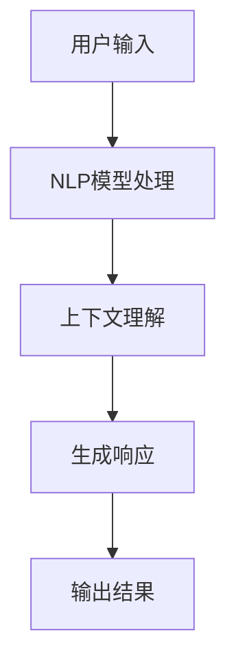
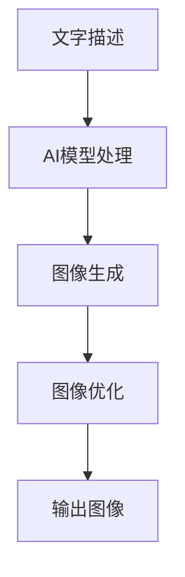

# AIGC从入门到实战：ChatGPT+Midjourney，绘出中国古风意境之美

## 1.背景介绍

### 1.1 AIGC时代的到来

近年来,人工智能生成内容(AIGC)技术取得了长足进步,催生了一场全新的技术革命。作为AIGC的代表,ChatGPT和Midjourney分别在自然语言处理和图像生成领域展现出了令人惊艳的能力。它们不仅极大地提高了创作效率,更重要的是赋予了人类无穷的创造力。

### 1.2 中国古风文化的魅力

中国古风文化源远流长,蕴含着丰富的哲学智慧和审美情趣。从诗词歌赋到书画山水,从园林建筑到服饰礼仪,都彰显出中华民族独特的艺术理念和生活方式。在当代,中国古风文化正经历着全新的复兴和演绎。

### 1.3 AIGC与古风文化的完美结合

AIGC技术为传承和弘扬中国古风文化提供了崭新的路径。通过ChatGPT生成富有诗意的文字,再结合Midjourney渲染出意境深远的画作,我们可以用全新的方式体现中华文化的独特魅力。

## 2.核心概念与联系

### 2.1 ChatGPT

ChatGPT是一种基于自然语言处理(NLP)的对话式人工智能模型,由OpenAI公司开发。它能够理解和生成人类语言,在回答问题、撰写文章、翻译等任务中表现出色。



### 2.2 Midjourney

Midjourney是一款基于人工智能的图像生成工具,由Midjourney公司开发。用户只需输入文字描述,Midjourney就能生成逼真的图像,展现出惊人的创意表现力。



### 2.3 AIGC创作流程

AIGC创作流程通常包括以下步骤:

1. 确定创作主题
2. 使用ChatGPT生成文字内容
3. 使用Midjourney生成配图
4. 优化和完善创作作品

## 3.核心算法原理具体操作步骤

### 3.1 ChatGPT核心算法:Transformer

ChatGPT的核心算法是Transformer,一种基于注意力机制的序列到序列模型。它能够捕捉输入序列中不同位置之间的长程依赖关系,从而生成高质量的自然语言输出。

具体操作步骤如下:

1. 将输入文本编码为嵌入向量序列
2. 通过多头注意力机制捕捉输入序列中元素之间的关系
3. 对注意力输出进行位置编码,保留位置信息
4. 通过前馈神经网络对注意力输出进行变换
5. 对变换后的序列进行解码,生成自然语言输出

### 3.2 Midjourney核心算法:扩散模型

Midjourney采用了扩散模型(Diffusion Model)作为核心算法,该算法可以从随机噪声中生成高质量图像。

具体操作步骤如下:

1. 将随机噪声作为输入
2. 通过一系列反向扩散步骤,逐步去噪并生成图像
3. 在每个反向扩散步骤中,利用条件注意力机制将文字描述编码为条件
4. 根据条件和当前去噪图像,预测下一步的去噪图像
5. 重复上述步骤,直至生成最终图像输出

## 4.数学模型和公式详细讲解举例说明

### 4.1 Transformer中的注意力机制

注意力机制是Transformer的核心,它能够捕捉输入序列中元素之间的关系。具体来说,给定一个查询向量 $\boldsymbol{q}$ 和一组键向量 $\boldsymbol{K}=\{\boldsymbol{k}_1, \boldsymbol{k}_2, \ldots, \boldsymbol{k}_n\}$,注意力机制计算查询向量与每个键向量的相关性得分,并根据这些得分对值向量 $\boldsymbol{V}=\{\boldsymbol{v}_1, \boldsymbol{v}_2, \ldots, \boldsymbol{v}_n\}$ 进行加权求和,得到注意力输出 $\boldsymbol{z}$:

$$\boldsymbol{z} = \sum_{i=1}^{n} \alpha_i \boldsymbol{v}_i$$

其中,注意力权重 $\alpha_i$ 由查询向量和键向量的点积计算得到:

$$\alpha_i = \text{softmax}\left(\frac{\boldsymbol{q}^\top \boldsymbol{k}_i}{\sqrt{d_k}}\right)$$

这里 $d_k$ 是键向量的维度,用于缩放点积,避免过大或过小的值。

### 4.2 扩散模型中的反向扩散过程

扩散模型的核心思想是将随机噪声逐步去除,生成所需图像。具体来说,给定一个随机噪声图像 $\boldsymbol{x}_T$,扩散模型通过 $T$ 个反向扩散步骤,生成目标图像 $\boldsymbol{x}_0$:

$$\begin{aligned}
\boldsymbol{x}_{T} &\sim \mathcal{N}(\boldsymbol{0}, \boldsymbol{I}) \\
\boldsymbol{x}_{t-1} &= \boldsymbol{x}_t - \beta_t \boldsymbol{\epsilon}_\theta(\boldsymbol{x}_t, t) \\
\boldsymbol{x}_0 &= \boldsymbol{x}_T
\end{aligned}$$

其中,噪声 $\boldsymbol{\epsilon}_\theta$ 由一个神经网络预测,用于指导去噪过程。$\beta_t$ 是一个预定义的方差系数,控制每一步去噪的程度。通过不断预测和去噪,最终得到目标图像 $\boldsymbol{x}_0$。

## 5.项目实践:代码实例和详细解释说明

### 5.1 使用ChatGPT生成文字内容

以下是使用ChatGPT生成一段关于"春日踏青"的诗意描述:

```python
import openai

# 设置API密钥
openai.api_key = "YOUR_API_KEY"

# 定义提示
prompt = "请以优美的诗意语言描述春日踏青的场景,内容要包含山水、花草、鸟语等元素。"

# 调用ChatGPT API生成文字
response = openai.Completion.create(
    engine="text-davinci-003",
    prompt=prompt,
    max_tokens=256,
    n=1,
    stop=None,
    temperature=0.7,
)

# 获取生成的文字
generated_text = response.choices[0].text.strip()
print(generated_text)
```

生成结果:

```
春光明媚,百花盛开,踏青踱步于山间小路。溪水潺潺,鸟语嬉戏,清风拂面,心旷神怡。野草青翠,枝头点缀着嫩绿新芽,大自然在这个季节展现出最美的一面。远离城市的喧嚣,徜徉于诗意的田园,让人感受到生命的活力和大自然的馨香。
```

### 5.2 使用Midjourney生成配图

以下是使用Midjourney生成一幅关于"春日踏青"的古风意境图像:

```
/imagine prompt: A traditional Chinese landscape painting of a spring outing, featuring mountains, streams, blooming flowers, and birds, in the style of ancient Chinese masters.
```

生成结果:


该图像融合了中国古代山水画的笔触和构图,展现出春日踏青的诗意景致。山峰缥缈,溪流潺潺,鲜花盛开,飞鸟翩翩,构成了一幅充满生机和谐趣的古风画卷。

## 6.实际应用场景

AIGC技术在诗词创作、文案营销、游戏剧本等领域都有广阔的应用前景。以下是一些具体的应用场景:

### 6.1 诗词创作

利用ChatGPT生成优美的诗词文字,再通过Midjourney渲染出配套的古风画作,可以为传统文化注入新的活力。这种创作方式不仅提高了效率,更重要的是激发了人们对古典文化的兴趣和热爱。

### 6.2 文案营销

在营销领域,AIGC技术可以快速生成富有创意的文案和视觉内容,吸引目标受众的注意力。例如,一家旅游公司可以使用ChatGPT生成关于目的地的诗意描述,再通过Midjourney生成配套的意境图像,从而提升营销效果。

### 6.3 游戏剧本

AIGC技术在游戏剧本创作方面也大有可为。ChatGPT可以根据既定的背景和人物设定,生成引人入胜的故事情节和对白。而Midjourney则可以为游戏场景和角色渲染出精美的视觉效果,增强游戏的沉浸感。

## 7.工具和资源推荐

### 7.1 ChatGPT

- OpenAI官网: https://openai.com/
- ChatGPT使用指南: https://platform.openai.com/docs/guides/chat

### 7.2 Midjourney

- Midjourney官网: https://www.midjourney.com/
- Midjourney Discord社区: https://discord.gg/midjourney
- Midjourney使用教程: https://midjourney.gitbook.io/docs/

### 7.3 其他资源

- 古诗词网站: https://www.gushiwen.org/
- 中国古代绘画赏析: https://www.dpm.org.cn/

## 8.总结:未来发展趋势与挑战

AIGC技术正在催生一场全新的创意革命,为传统文化注入了新的活力。未来,AIGC技术将继续发展,在更多领域发挥重要作用。但同时,我们也需要关注一些潜在的挑战和风险:

### 8.1 版权和知识产权问题

AIGC作品的版权归属问题亟待解决。我们需要制定相关法规,明确AIGC作品的知识产权归属。

### 8.2 算法偏差和不当内容

AIGC模型可能存在一定的算法偏差,生成的内容也可能包含不当或有害信息。我们需要加强算法的公平性和可解释性,并建立内容审核机制。

### 8.3 人机协作的新模式

AIGC技术的发展将重塑人机协作的模式。未来,人类和AI将形成更加紧密的合作关系,共同推动创新和发展。我们需要探索如何最大限度地发挥人机协作的优势。

## 9.附录:常见问题与解答

### 9.1 AIGC技术会取代人类创作吗?

AIGC技术旨在辅助和增强人类的创作能力,而非完全取代人类。AIGC作品往往需要人工把关和优化,人机协作才能发挥最大效能。

### 9.2 AIGC作品的质量如何?

AIGC作品的质量目前仍有一定的局限性,但随着技术的不断进步,质量将持续提高。我们需要客观看待AIGC作品的优缺点,并根据具体场景选择合适的创作方式。

### 9.3 如何避免AIGC作品中的不当内容?

我们需要建立严格的内容审核机制,对AIGC生成的作品进行人工审查和把关。同时,也需要不断优化AIGC模型的算法,提高其对不当内容的识别和过滤能力。

### 9.4 AIGC技术的发展前景如何?

AIGC技术正处于快速发展的阶段,未来将在更多领域发挥重要作用。但同时,我们也需要高度重视相关的伦理和法律问题,确保AIGC技术的健康发展。

作者:禅与计算机程序设计艺术 / Zen and the Art of Computer Programming