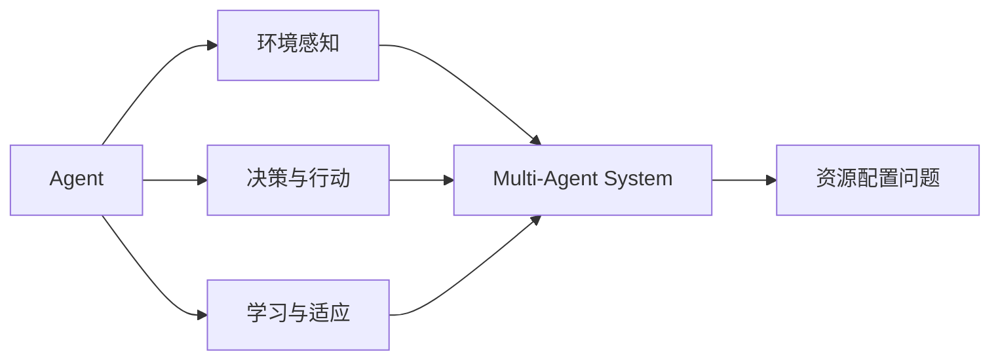

# AI人工智能 Agent：资源配置中智能体的应用

## 1. 背景介绍
### 1.1 人工智能的发展历程
#### 1.1.1 早期人工智能
#### 1.1.2 专家系统时代 
#### 1.1.3 机器学习与深度学习崛起

### 1.2 资源配置问题概述
#### 1.2.1 资源配置的定义与挑战
#### 1.2.2 传统资源配置方法的局限性
#### 1.2.3 人工智能在资源配置中的应用前景

## 2. 核心概念与联系
### 2.1 Agent的定义与特征
#### 2.1.1 Agent的定义
#### 2.1.2 Agent的关键特征
#### 2.1.3 Agent与传统软件的区别

### 2.2 Multi-Agent System（MAS）
#### 2.2.1 MAS的定义与组成
#### 2.2.2 MAS的优势与挑战
#### 2.2.3 MAS在资源配置中的应用

### 2.3 强化学习与Agent
#### 2.3.1 强化学习的基本原理
#### 2.3.2 强化学习与Agent的关系
#### 2.3.3 强化学习在资源配置中的应用

## 3. 核心算法原理具体操作步骤
### 3.1 Q-Learning算法
#### 3.1.1 Q-Learning的基本思想
#### 3.1.2 Q-Learning的更新规则
#### 3.1.3 Q-Learning在资源配置中的应用

### 3.2 Deep Q-Network（DQN）
#### 3.2.1 DQN的基本原理
#### 3.2.2 DQN的网络结构与训练过程
#### 3.2.3 DQN在资源配置中的应用

### 3.3 Multi-Agent强化学习算法
#### 3.3.1 Independent Q-Learning（IQL）
#### 3.3.2 Joint Action Learning（JAL）
#### 3.3.3 Multi-Agent Deep Deterministic Policy Gradient（MADDPG）

## 4. 数学模型和公式详细讲解举例说明
### 4.1 马尔可夫决策过程（MDP）
#### 4.1.1 MDP的定义与组成
#### 4.1.2 MDP的贝尔曼方程
#### 4.1.3 MDP在资源配置中的应用

### 4.2 Q-Learning的数学模型
#### 4.2.1 Q-Learning的更新公式
$Q(s,a) \leftarrow Q(s,a) + \alpha [r + \gamma \max_{a'} Q(s',a') - Q(s,a)]$
#### 4.2.2 Q-Learning收敛性证明
#### 4.2.3 Q-Learning在资源配置中的应用实例

### 4.3 DQN的数学模型
#### 4.3.1 DQN的损失函数
$$L(\theta) = \mathbb{E}_{(s,a,r,s')\sim D}[(r + \gamma \max_{a'} Q(s',a';\theta^-) - Q(s,a;\theta))^2]$$
#### 4.3.2 DQN的目标网络更新
#### 4.3.3 DQN在资源配置中的应用实例

## 5. 项目实践：代码实例和详细解释说明
### 5.1 Q-Learning解决资源配置问题
#### 5.1.1 问题描述与建模
#### 5.1.2 Q-Learning代码实现
#### 5.1.3 实验结果与分析

### 5.2 DQN解决资源配置问题
#### 5.2.1 问题描述与建模
#### 5.2.2 DQN代码实现
#### 5.2.3 实验结果与分析

### 5.3 Multi-Agent强化学习解决资源配置问题
#### 5.3.1 问题描述与建模
#### 5.3.2 MADDPG代码实现
#### 5.3.3 实验结果与分析

## 6. 实际应用场景
### 6.1 云计算资源配置
#### 6.1.1 云计算资源配置问题概述
#### 6.1.2 基于强化学习的云资源配置方法
#### 6.1.3 实际案例分析

### 6.2 智能交通中的资源配置
#### 6.2.1 智能交通资源配置问题概述
#### 6.2.2 基于MAS的交通资源配置方法
#### 6.2.3 实际案例分析

### 6.3 智能电网中的资源配置
#### 6.3.1 智能电网资源配置问题概述
#### 6.3.2 基于强化学习的电网资源配置方法
#### 6.3.3 实际案例分析

## 7. 工具和资源推荐
### 7.1 强化学习框架
#### 7.1.1 OpenAI Gym
#### 7.1.2 TensorFlow Agents
#### 7.1.3 RLlib

### 7.2 Multi-Agent强化学习平台
#### 7.2.1 MADDPG
#### 7.2.2 MARL-Algorithms
#### 7.2.3 PettingZoo

### 7.3 相关学习资源
#### 7.3.1 在线课程
#### 7.3.2 书籍推荐
#### 7.3.3 研究论文

## 8. 总结：未来发展趋势与挑战
### 8.1 Agent技术的发展趋势
#### 8.1.1 Agent智能化程度不断提高
#### 8.1.2 Agent应用领域不断拓展
#### 8.1.3 Agent与其他技术的融合

### 8.2 资源配置领域的未来挑战
#### 8.2.1 动态与不确定性问题
#### 8.2.2 大规模复杂系统的资源配置
#### 8.2.3 多目标与多约束资源配置

### 8.3 展望与总结
#### 8.3.1 Agent在资源配置中的应用前景
#### 8.3.2 未来研究方向与机遇
#### 8.3.3 总结全文

## 9. 附录：常见问题与解答
### 9.1 如何选择合适的强化学习算法？
### 9.2 如何设计Agent的状态空间与行动空间？
### 9.3 如何处理Multi-Agent系统中的通信与协作问题？
### 9.4 如何评估Agent在资源配置问题中的性能？
### 9.5 如何平衡探索与利用在资源配置问题中的权衡？

作者：禅与计算机程序设计艺术 / Zen and the Art of Computer Programming