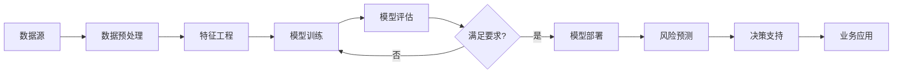

# AI人工智能代理工作流 AI Agent WorkFlow：在保险风险预测中的应用

## 1. 背景介绍
### 1.1 保险行业面临的挑战
#### 1.1.1 风险评估的复杂性
#### 1.1.2 数据量大且异构
#### 1.1.3 欺诈行为日益增多

### 1.2 人工智能在保险领域的应用现状
#### 1.2.1 机器学习算法的应用
#### 1.2.2 深度学习模型的应用
#### 1.2.3 知识图谱技术的应用

### 1.3 AI代理工作流的概念
#### 1.3.1 AI代理的定义
#### 1.3.2 工作流的概念
#### 1.3.3 AI代理工作流的优势

## 2. 核心概念与联系
### 2.1 AI代理
#### 2.1.1 智能体的概念
#### 2.1.2 感知-决策-行动循环
#### 2.1.3 目标导向行为

### 2.2 工作流
#### 2.2.1 工作流的定义
#### 2.2.2 工作流建模语言
#### 2.2.3 工作流管理系统

### 2.3 风险预测
#### 2.3.1 风险的概念
#### 2.3.2 风险评估方法
#### 2.3.3 风险预测模型

### 2.4 AI代理工作流与风险预测的关系
#### 2.4.1 AI代理用于风险评估
#### 2.4.2 工作流优化风险预测流程
#### 2.4.3 AI代理工作流实现自动化风险预测

## 3. 核心算法原理具体操作步骤
### 3.1 数据预处理
#### 3.1.1 数据清洗
#### 3.1.2 特征工程
#### 3.1.3 数据集划分

### 3.2 模型训练
#### 3.2.1 模型选择
#### 3.2.2 超参数调优
#### 3.2.3 模型训练与验证

### 3.3 模型评估
#### 3.3.1 评估指标选择
#### 3.3.2 交叉验证
#### 3.3.3 模型性能分析

### 3.4 模型部署
#### 3.4.1 模型封装
#### 3.4.2 模型服务化
#### 3.4.3 模型监控与更新

## 4. 数学模型和公式详细讲解举例说明
### 4.1 Logistic回归模型
#### 4.1.1 模型假设
#### 4.1.2 损失函数
#### 4.1.3 优化算法

### 4.2 决策树模型
#### 4.2.1 信息增益
#### 4.2.2 基尼指数
#### 4.2.3 CART算法

### 4.3 神经网络模型
#### 4.3.1 前向传播
#### 4.3.2 反向传播
#### 4.3.3 激活函数

### 4.4 数学公式推导与说明
#### 4.4.1 Logistic回归的推导
#### 4.4.2 决策树分裂准则的推导
#### 4.4.3 神经网络反向传播算法的推导

## 5. 项目实践：代码实例和详细解释说明
### 5.1 数据预处理代码实例
#### 5.1.1 数据加载与探索
#### 5.1.2 缺失值处理
#### 5.1.3 特征编码与归一化

### 5.2 模型训练代码实例 
#### 5.2.1 Logistic回归模型训练
#### 5.2.2 决策树模型训练
#### 5.2.3 神经网络模型训练

### 5.3 模型评估代码实例
#### 5.3.1 混淆矩阵计算
#### 5.3.2 ROC曲线绘制
#### 5.3.3 模型性能指标计算

### 5.4 模型部署代码实例
#### 5.4.1 模型保存与加载
#### 5.4.2 Flask搭建模型服务
#### 5.4.3 模型预测接口实现

## 6. 实际应用场景
### 6.1 车险风险预测
#### 6.1.1 车险业务背景
#### 6.1.2 AI代理工作流实现车险风险预测
#### 6.1.3 应用效果评估

### 6.2 信用风险评估
#### 6.2.1 信用风险评估业务背景 
#### 6.2.2 AI代理工作流实现信用风险评估
#### 6.2.3 应用效果评估

### 6.3 反欺诈风险识别
#### 6.3.1 保险欺诈风险背景
#### 6.3.2 AI代理工作流实现反欺诈风险识别
#### 6.3.3 应用效果评估

## 7. 工具和资源推荐
### 7.1 开源工具
#### 7.1.1 scikit-learn
#### 7.1.2 TensorFlow
#### 7.1.3 PyTorch

### 7.2 商业工具
#### 7.2.1 DataRobot
#### 7.2.2 H2O.ai
#### 7.2.3 RapidMiner

### 7.3 学习资源
#### 7.3.1 在线课程
#### 7.3.2 书籍推荐 
#### 7.3.3 博客与论坛

## 8. 总结：未来发展趋势与挑战
### 8.1 AI代理工作流的发展趋势
#### 8.1.1 与区块链技术结合
#### 8.1.2 与物联网技术结合
#### 8.1.3 与云计算技术结合

### 8.2 AI代理工作流面临的挑战
#### 8.2.1 数据隐私与安全
#### 8.2.2 模型可解释性
#### 8.2.3 模型公平性

### 8.3 未来研究方向
#### 8.3.1 联邦学习在AI代理工作流中的应用
#### 8.3.2 强化学习在AI代理工作流中的应用
#### 8.3.3 知识图谱与AI代理工作流的结合

## 9. 附录：常见问题与解答
### 9.1 如何选择合适的模型？
### 9.2 如何处理不平衡数据集？
### 9.3 如何解释模型预测结果？
### 9.4 如何保证模型的公平性？
### 9.5 如何实现模型的持续学习？

AI代理工作流是一种将人工智能技术与工作流管理相结合的新型范式，旨在利用AI代理的智能化能力来优化业务流程，提高效率和准确性。在保险领域，风险预测是一项关键业务，传统的风险评估方法往往依赖于人工经验和判断，存在主观性强、效率低下等问题。引入AI代理工作流，可以充分利用机器学习算法和大数据分析技术，自动化、智能化地完成风险预测任务，为保险公司的决策提供有力支持。

本文首先介绍了保险行业面临的挑战以及人工智能在保险领域的应用现状，阐述了AI代理工作流的概念和优势。接着，详细讲解了AI代理、工作流、风险预测等核心概念，以及它们之间的联系。在此基础上，重点介绍了AI代理工作流在风险预测中的核心算法原理和具体操作步骤，包括数据预处理、模型训练、模型评估和模型部署等环节。同时，通过数学模型和公式的详细推导与说明，加深读者对算法原理的理解。

为了让读者更直观地了解AI代理工作流的实现过程，本文提供了丰富的代码实例，涵盖数据预处理、模型训练、模型评估和模型部署等各个环节，并对关键代码进行了详细解释说明。此外，文章还列举了AI代理工作流在车险风险预测、信用风险评估、反欺诈风险识别等实际场景中的应用案例，展示了该技术在保险行业的广阔前景。

在工具和资源推荐部分，本文介绍了常用的开源工具和商业工具，以及相关的学习资源，方便读者进一步学习和实践。最后，文章总结了AI代理工作流的发展趋势和面临的挑战，展望了未来的研究方向，并在附录中解答了一些常见问题。

总的来说，AI代理工作流是一项前沿的技术，将人工智能与工作流管理完美结合，为保险行业的风险预测带来了新的解决方案。通过本文的系统介绍，相信读者能够对AI代理工作流有一个全面的认识，并能够将其应用到实际的保险风险预测项目中，提升风险管理的效率和准确性，为保险公司创造更大的价值。

作者：禅与计算机程序设计艺术 / Zen and the Art of Computer Programming